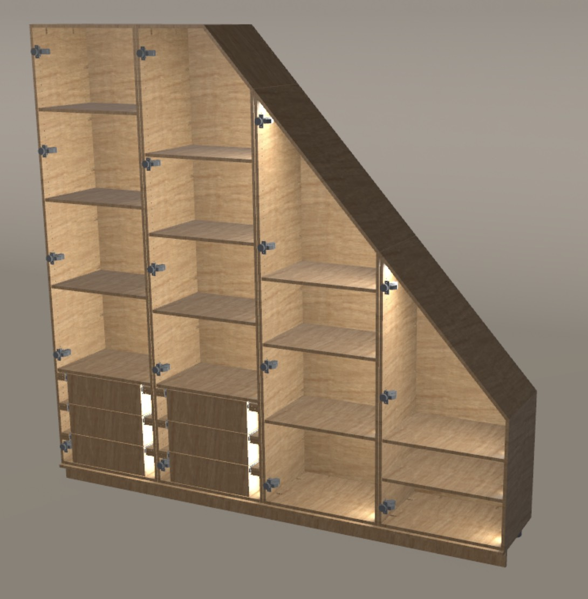
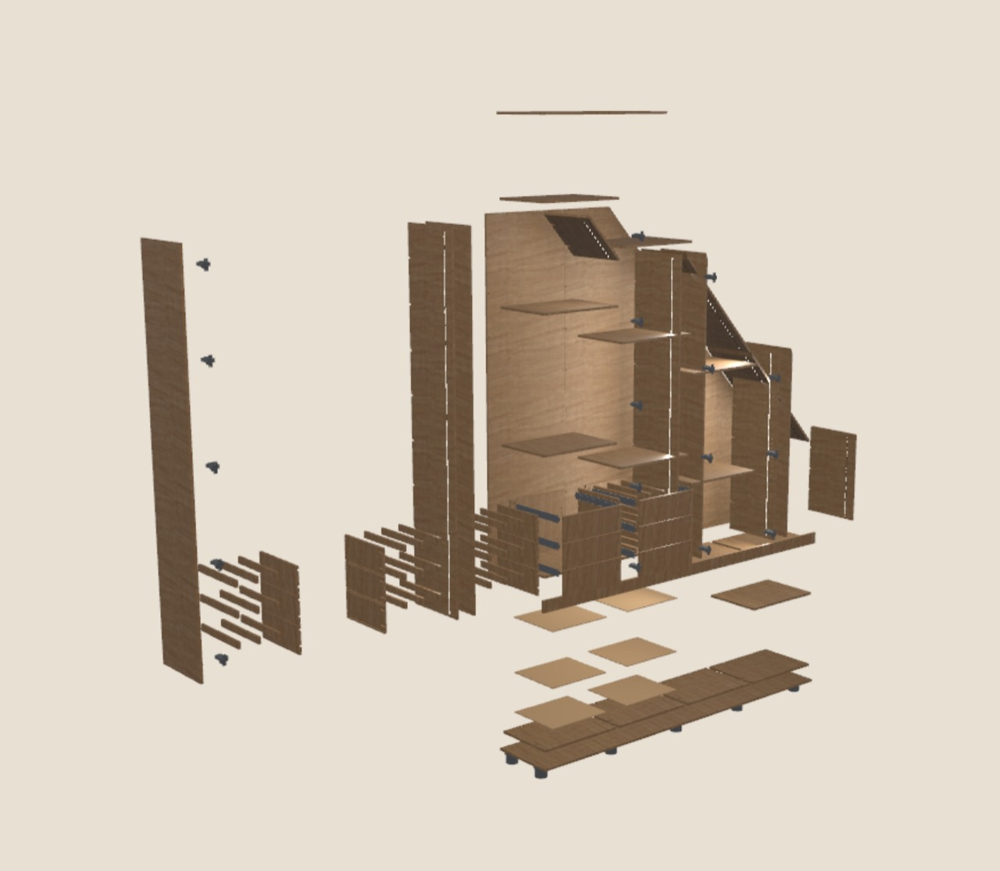

# AIkea Skill

**AIkea turns your AI into a furniture designer—creating precision CAD files for wardrobes ready to cut and assemble, tailored to your exact measurements, with material guidance, complete parts and hardware lists, and cost calculations.**

AIkea helps you turn your room's measurements into furniture you can actually
build. Your AI assistant guides material choices, compares supplier prices,
and uses parts, sheet and hardware quantities to work out estimated costs.
Review the design in 3D, inspect how it assembles, and refine it around your space
and budget—from sloping ceilings to shelves, drawers and integrated lighting.

The goal is a complete package ready for CNC cutting and assembly. The current
alpha still has [fabrication gaps](#what-the-alpha-can-do); a design is only ready
to cut once its manufacturing checks pass. Price calculations are estimates until
the material, hardware, machining and finishing costs are confirmed.



*An example from the AIkea viewer: a fitted wardrobe with shelves, drawers and
integrated lighting. The doors are hidden for inspection; these are digital
design previews.*

## From the whole cabinet to every part

Rotate and zoom to review the design, hide the doors to see inside, or explode
the assembly to inspect its panels and hardware. The furniture is generated from
saved specifications and reusable construction tools, so changes remain in the
design code.



*The same wardrobe, expanded into its component parts.*

## What the alpha can do

AIkea guides measured-space intake and material choices, generates cabinet and
base parts, adds supported doors, drawers, and recessed lighting, and shows the
composed result in an interactive 3D viewer. Construction comes from reusable
CadQuery builders and saved project specifications. Begin with one complete
cabinet and visually approve it before repeating the design.

This is an experimental design and review workflow. Exact material choices are
not yet propagated into generated part specifications, so those parts cannot
pass the fabrication-readiness gate. A complete manufacturing pack and a fresh
end-to-end fabrication proof remain unfinished. The checker rejects missing
evidence; a successful preview does not establish that a project is ready to cut.

Supported hardware profiles require exact manufacturer CAD downloaded into the
active project's local hardware library. Some suppliers require an account and
a manual download. AIkea guides that step; vendor CAD is not bundled with the
public skills. Current KA 4532 spacer support also leaves the longer fixing
screws and cabinet pilot specification unresolved.

## Try a first project

### Desktop Work / Cowork

Copy this prompt into a fresh chat:

```text
Set up AIkea Skill and help me design my furniture. Go to https://github.com/PatrickGrothOls/AIkea-skill and follow the getting-started instructions. Handle the setup and ask me for any necessary approvals.
```

Your assistant follows [Getting started](START_HERE.md), downloads the skill,
installs Python, CadQuery and headless Blender, verifies the setup, and starts
your furniture project. Normal permission or sign-in prompts may need approval.

[Download AIkea Skill](https://github.com/PatrickGrothOls/AIkea-skill/releases/download/v0.1.0-desktop.1/aikea-skill.zip)
· [Installation details](docs/desktop-installation.md)

The installer has passed isolated macOS runtime checks and run in Claude's hosted
Linux workspace. Full hosted interactive delivery and ChatGPT Work acceptance
remain unverified. Setup is complete only when the interactive viewer works and
the furniture intake has started.

### Repository workflow — available now

Install the Python environment below, open this repository as your Codex or
Claude Code working folder, and start a fresh conversation with:

```text
$aikea
Help me design a fitted wardrobe. Use a new sibling project folder at
../my-first-wardrobe. Ask me for the measurements and choices you need,
one topic at a time, and guide me to the first complete cabinet review.
```

The sibling folder keeps client files outside this source repository. Supply
measurements from your own room. The skill's example and test files are
not measurements for your project. Keep the generated project private; its
dimensions, local hardware downloads, and approval records belong to you.

The repository's `.agents/skills/` and `.claude/skills/` links expose the complete
skill set, beginning with `$aikea`. Source includes the builders, tests and editable
viewer; generated client projects and licensed manufacturer CAD stay local.

The current release has been exercised on macOS with Apple Silicon. Native
Windows is not supported by the viewer approval lock, which uses POSIX `fcntl`.
The complete automated suite also passes on Ubuntu 24.04. Interactive visual
review on Linux has not received the same local verification as macOS.

## License and permitted use

AIkea is licensed under the [PolyForm Noncommercial License 1.0.0](LICENSE.md).
Personal furniture, private experiments, study, and hobby projects are permitted.

Commercial use is not granted. This includes using AIkea for paid furniture
design, manufacture, installation, or sale. Contact the repository owner for a
separate commercial license. The license text controls if this summary differs
from it.

Because commercial use is restricted, AIkea is source-available rather than
Open Source Initiative open-source software.

AIkea is an independent project. It is not affiliated with or endorsed by IKEA,
Lamello, Hettich, or other referenced manufacturers. Product names and
trademarks belong to their respective owners. AIkea's authored Cabineo machining
volumes preserve its custom brass-insert receiver without importing STEP files.
Their dimensions and regression proof are documented in
[Cabineo machining](aikea-build-units/references/cabineo-machining.md).

## Python setup

Install Python and [direnv](https://direnv.net/) before running these commands.
Use Python 3.10.16 and create the repository-local environment once:

```sh
python3.10 -m venv .venv
direnv allow .
direnv exec . python -m pip install -r requirements.txt
```

Run the complete Python suite with:

```sh
direnv exec . python -m pytest -q
```

The review commands discover the same interpreter through
`AIKEA_CADQUERY_PYTHON`, which `.envrc` sets to `.venv/bin/python`.

For a generated project, the final readiness command is:

```sh
direnv exec . python aikea-review-unit/scripts/check_fabrication_readiness.py \
  /path/to/project/aikea.yaml
```

It reports every missing physical, manufacturing-pack, validation, or visual
approval requirement and returns success only for `fabrication-ready`.

## Viewer source

The installed skill contains prebuilt static viewer files and does not require
Node.js. Contributors use the repository-only `viewer/` project, pinned to Node
24.4.1 and npm 11.4.2:

```sh
direnv exec . npm --prefix viewer ci
direnv exec . npm --prefix viewer test
direnv exec . npm --prefix viewer run build
```

The production build writes the compiled viewer directly into
`aikea-review-unit/assets/viewer/` for skill packaging.
It also generates `THIRD_PARTY_LICENSES.md` from the bundled dependencies.
`SUPPLEMENTAL_LICENSES.md` retains notices omitted from dependency archives;
`THIRD_PARTY_NOTICES.txt` records source links and texture attributions.

## Reports and contributions

Use the repository's Issues page for reproducible bugs and supported-feature
requests. Include the commit or release version, operating system, failing
command, and a small synthetic example. Remove private room measurements,
download credentials, personal paths, and licensed CAD before attaching files.
