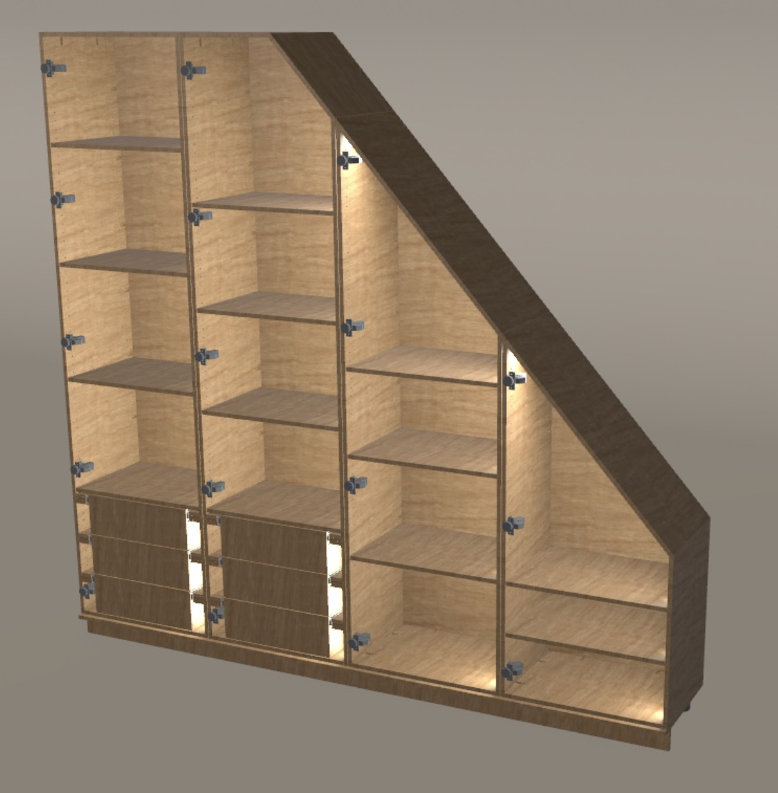
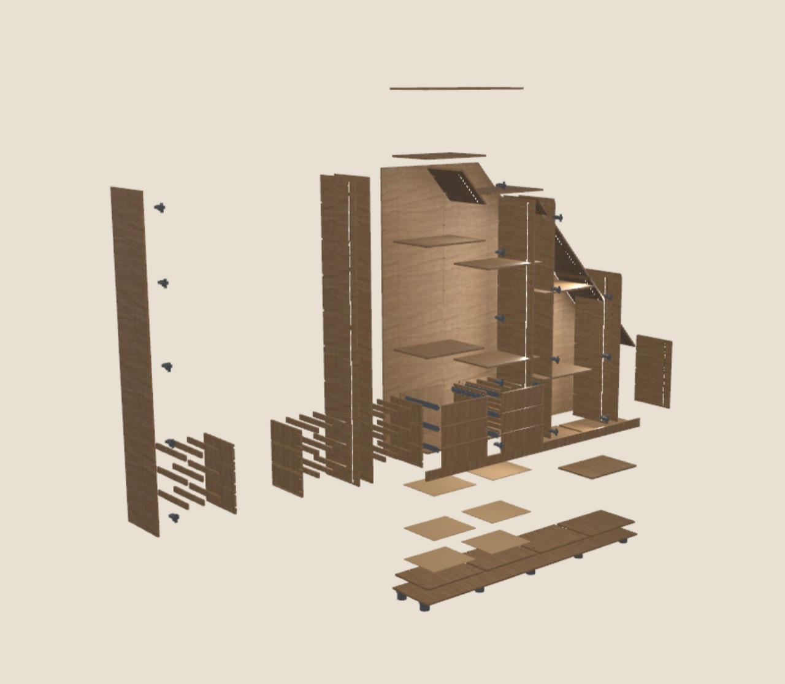

# AIkea Skill

**AIkea turns your AI into a furniture designer, creating precision CAD files for wardrobes ready to cut and assemble, tailored to your exact measurements, with material guidance, complete parts and hardware lists, and cost calculations.**

AIkea helps you turn your room's measurements into furniture you can actually
build. Your AI assistant guides material choices, compares supplier prices,
and uses parts, sheet and hardware quantities to work out estimated costs.
Review the design in 3D, inspect how it assembles, and refine it around your space
and budget, from sloping ceilings to shelves, drawers and integrated lighting.

The workflow carries your approved design through to CNC cutting and assembly:
individual part files, matching hardware and drilling, a material and cutting
list, and assembly information. Before releasing the cutting package, your
assistant checks that the parts and fittings work together. Cost calculations
show the assumptions for materials, hardware, machining, finishing and delivery.



*An example from the AIkea viewer: a fitted wardrobe with shelves, drawers and
integrated lighting. The doors are hidden for inspection; these are digital
design previews.*

### Explore the assembled wardrobe

Drag to rotate; scroll to zoom. Doors are hidden to reveal the interior.
These lightweight 3D previews show simplified panels without materials,
lighting, hardware or machining details. They are scaled illustrations, not cutting files.

```stl
solid exported
	facet normal 0 0 1
		outer loop
			vertex 0 3.8 0
			vertex 0 3.2 0
			vertex 49.46 3.2 0
		endloop
	endfacet
	facet normal -1 0 0
		outer loop
			vertex 0 3.8 0
			vertex 0 3.8 -17.28
			vertex 0 3.2 0
		endloop
	endfacet
	facet normal 0 -1 0
		outer loop
			vertex 49.46 3.2 -17.28
			vertex 49.46 3.2 0
			vertex 0 3.2 0
		endloop
	endfacet
	facet normal 0 1 0
		outer loop
			vertex 49.46 3.8 -17.28
			vertex 0 3.8 -17.28
			vertex 0 3.8 0
		endloop
	endfacet
	facet normal 1 0 0
		outer loop
			vertex 49.46 3.8 -17.28
			vertex 49.46 3.2 0
			vertex 49.46 3.2 -17.28
		endloop
	endfacet
	facet normal 0 0 -1
		outer loop
			vertex 49.46 3.8 -17.28
			vertex 49.46 3.2 -17.28
			vertex 0 3.8 -17.28
		endloop
	endfacet
	facet normal 0 0 -1
		outer loop
			vertex 0 3.2 -17.28
			vertex 0 3.8 -17.28
			vertex 49.46 3.2 -17.28
		endloop
	endfacet
	facet normal 0 -1 0
		outer loop
			vertex 0 3.2 -17.28
			vertex 49.46 3.2 -17.28
			vertex 0 3.2 0
		endloop
	endfacet
	facet normal -1 0 0
		outer loop
			vertex 0 3.2 -17.28
			vertex 0 3.2 0
			vertex 0 3.8 -17.28
		endloop
	endfacet
	facet normal 1 0 0
		outer loop
			vertex 49.46 3.8 0
			vertex 49.46 3.2 0
			vertex 49.46 3.8 -17.28
		endloop
	endfacet
	facet normal 0 1 0
		outer loop
			vertex 49.46 3.8 0
			vertex 49.46 3.8 -17.28
			vertex 0 3.8 0
		endloop
	endfacet
	facet normal 0 0 1
		outer loop
			vertex 49.46 3.8 0
			vertex 0 3.8 0
			vertex 49.46 3.2 0
		endloop
	endfacet
	facet normal 0 -1 0
		outer loop
			vertex 0 0.04 -1.4
			vertex 49.46 0.04 -0.8
			vertex 0 0.04 -0.8
		endloop
	endfacet
	facet normal -1 0 0
		outer loop
			vertex 0 0.04 -1.4
			vertex 0 0.04 -0.8
			vertex 0 3.16 -1.4
		endloop
	endfacet
	facet normal 0 0 1
		outer loop
			vertex 49.46 3.16 -0.8
			vertex 0 0.04 -0.8
			vertex 49.46 0.04 -0.8
		endloop
	endfacet
	facet normal 0 0 -1
		outer loop
			vertex 49.46 3.16 -1.4
			vertex 0 0.04 -1.4
			vertex 0 3.16 -1.4
		endloop
	endfacet
	facet normal 0 1 0
		outer loop
			vertex 49.46 3.16 -1.4
			vertex 0 3.16 -1.4
			vertex 49.46 3.16 -0.8
		endloop
	endfacet
	facet normal 1 0 0
		outer loop
			vertex 49.46 3.16 -1.4
			vertex 49.46 3.16 -0.8
			vertex 49.46 0.04 -0.8
		endloop
	endfacet
	facet normal 0 0 1
		outer loop
			vertex 0 3.16 -0.8
			vertex 0 0.04 -0.8
			vertex 49.46 3.16 -0.8
		endloop
	endfacet
	facet normal 0 1 0
		outer loop
			vertex 0 3.16 -0.8
			vertex 49.46 3.16 -0.8
			vertex 0 3.16 -1.4
		endloop
	endfacet
	facet normal -1 0 0
		outer loop
			vertex 0 3.16 -0.8
			vertex 0 3.16 -1.4
			vertex 0 0.04 -0.8
		endloop
	endfacet
	facet normal 0 0 -1
		outer loop
			vertex 49.46 0.04 -1.4
			vertex 0 0.04 -1.4
			vertex 49.46 3.16 -1.4
		endloop
	endfacet
	facet normal 1 0 0
		outer loop
			vertex 49.46 0.04 -1.4
			vertex 49.46 3.16 -1.4
			vertex 49.46 0.04 -0.8
		endloop
	endfacet
	facet normal 0 -1 0
		outer loop
			vertex 49.46 0.04 -1.4
			vertex 49.46 0.04 -0.8
			vertex 0 0.04 -1.4
		endloop
	endfacet
	facet normal 0 0 1
		outer loop
			vertex 49.54 3.8 0
			vertex 49.54 3.2 0
			vertex 99 3.2 0
		endloop
	endfacet
	facet normal -1 0 0
		outer loop
			vertex 49.54 3.8 0
			vertex 49.54 3.8 -17.28
			vertex 49.54 3.2 0
		endloop
	endfacet
	facet normal 0 -1 0
		outer loop
			vertex 99 3.2 -17.28
			vertex 99 3.2 0
			vertex 49.54 3.2 0
		endloop
	endfacet
	facet normal 0 1 0
		outer loop
			vertex 99 3.8 -17.28
			vertex 49.54 3.8 -17.28
			vertex 49.54 3.8 0
		endloop
	endfacet
	facet normal 1 0 0
		outer loop
			vertex 99 3.8 -17.28
			vertex 99 3.2 0
			vertex 99 3.2 -17.28
		endloop
	endfacet
	facet normal 0 0 -1
		outer loop
			vertex 99 3.8 -17.28
			vertex 99 3.2 -17.28
			vertex 49.54 3.8 -17.28
		endloop
	endfacet
	facet normal 0 0 -1
		outer loop
			vertex 49.54 3.2 -17.28
			vertex 49.54 3.8 -17.28
			vertex 99 3.2 -17.28
		endloop
	endfacet
	facet normal 0 -1 0
		outer loop
			vertex 49.54 3.2 -17.28
			vertex 99 3.2 -17.28
			vertex 49.54 3.2 0
		endloop
	endfacet
	facet normal -1 0 0
		outer loop
			vertex 49.54 3.2 -17.28
			vertex 49.54 3.2 0
			vertex 49.54 3.8 -17.28
		endloop
	endfacet
	facet normal 1 0 0
		outer loop
			vertex 99 3.8 0
			vertex 99 3.2 0
			vertex 99 3.8 -17.28
		endloop
	endfacet
	facet normal 0 1 0
		outer loop
			vertex 99 3.8 0
			vertex 99 3.8 -17.28
			vertex 49.54 3.8 0
		endloop
	endfacet
	facet normal 0 0 1
		outer loop
			vertex 99 3.8 0
			vertex 49.54 3.8 0
			vertex 99 3.2 0
		endloop
	endfacet
	facet normal 0 -1 0
		outer loop
			vertex 49.54 0.04 -1.4
			vertex 99 0.04 -0.8
			vertex 49.54 0.04 -0.8
		endloop
	endfacet
	facet normal -1 0 0
		outer loop
			vertex 49.54 0.04 -1.4
			vertex 49.54 0.04 -0.8
			vertex 49.54 3.16 -1.4
		endloop
	endfacet
	facet normal 0 0 1
		outer loop
			vertex 99 3.16 -0.8
			vertex 49.54 0.04 -0.8
			vertex 99 0.04 -0.8
		endloop
	endfacet
	facet normal 0 0 -1
		outer loop
			vertex 99 3.16 -1.4
			vertex 49.54 0.04 -1.4
			vertex 49.54 3.16 -1.4
		endloop
	endfacet
	facet normal 0 1 0
		outer loop
			vertex 99 3.16 -1.4
			vertex 49.54 3.16 -1.4
			vertex 99 3.16 -0.8
		endloop
	endfacet
	facet normal 1 0 0
		outer loop
			vertex 99 3.16 -1.4
			vertex 99 3.16 -0.8
			vertex 99 0.04 -0.8
		endloop
	endfacet
	facet normal 0 0 1
		outer loop
			vertex 49.54 3.16 -0.8
			vertex 49.54 0.04 -0.8
			vertex 99 3.16 -0.8
		endloop
	endfacet
	facet normal 0 1 0
		outer loop
			vertex 49.54 3.16 -0.8
			vertex 99 3.16 -0.8
			vertex 49.54 3.16 -1.4
		endloop
	endfacet
	facet normal -1 0 0
		outer loop
			vertex 49.54 3.16 -0.8
			vertex 49.54 3.16 -1.4
			vertex 49.54 0.04 -0.8
		endloop
	endfacet
	facet normal 0 0 -1
		outer loop
			vertex 99 0.04 -1.4
			vertex 49.54 0.04 -1.4
			vertex 99 3.16 -1.4
		endloop
	endfacet
	facet normal 1 0 0
		outer loop
			vertex 99 0.04 -1.4
			vertex 99 3.16 -1.4
			vertex 99 0.04 -0.8
		endloop
	endfacet
	facet normal 0 -1 0
		outer loop
			vertex 99 0.04 -1.4
			vertex 99 0.04 -0.8
			vertex 49.54 0.04 -1.4
		endloop
	endfacet
	facet normal 0 0 1
		outer loop
			vertex 0.64 3.8 -0.06
			vertex 0 94.12 -0.06
			vertex 0 3.8 -0.06
		endloop
	endfacet
	facet normal 0 -1 0
		outer loop
			vertex 0.64 3.8 -0.06
			vertex 0 3.8 -0.06
			vertex 0.64 3.8 -16.64
		endloop
	endfacet
	facet normal -1 0 0
		outer loop
			vertex 0 94.12 -16.64
			vertex 0 3.8 -0.06
			vertex 0 94.12 -0.06
		endloop
	endfacet
	facet normal 1 0 0
		outer loop
			vertex 0.64 94.12 -16.64
			vertex 0.64 3.8 -0.06
			vertex 0.64 3.8 -16.64
		endloop
	endfacet
	facet normal 0 0 -1
		outer loop
			vertex 0.64 94.12 -16.64
			vertex 0.64 3.8 -16.64
			vertex 0 94.12 -16.64
		endloop
	endfacet
	facet normal 0 1 0
		outer loop
			vertex 0.64 94.12 -16.64
			vertex 0 94.12 -16.64
			vertex 0 94.12 -0.06
		endloop
	endfacet
	facet normal -1 0 0
		outer loop
			vertex 0 3.8 -16.64
			vertex 0 3.8 -0.06
			vertex 0 94.12 -16.64
		endloop
	endfacet
	facet normal 0 0 -1
		outer loop
			vertex 0 3.8 -16.64
			vertex 0 94.12 -16.64
			vertex 0.64 3.8 -16.64
		endloop
	endfacet
	facet normal 0 -1 0
		outer loop
			vertex 0 3.8 -16.64
			vertex 0.64 3.8 -16.64
			vertex 0 3.8 -0.06
		endloop
	endfacet
	facet normal 1 0 0
		outer loop
			vertex 0.64 94.12 -0.06
			vertex 0.64 3.8 -0.06
			vertex 0.64 94.12 -16.64
		endloop
	endfacet
	facet normal 0 1 0
		outer loop
			vertex 0.64 94.12 -0.06
			vertex 0.64 94.12 -16.64
			vertex 0 94.12 -0.06
		endloop
	endfacet
	facet normal 0 0 1
		outer loop
			vertex 0.64 94.12 -0.06
			vertex 0 94.12 -0.06
			vertex 0.64 3.8 -0.06
		endloop
	endfacet
	facet normal -1 0 0
		outer loop
			vertex 24.11 3.8 -16.64
			vertex 24.11 3.8 -0.06
			vertex 24.11 94.12 -0.06
		endloop
	endfacet
	facet normal 0 -1 0
		outer loop
			vertex 24.11 3.8 -16.64
			vertex 24.75 3.8 -16.64
			vertex 24.11 3.8 -0.06
		endloop
	endfacet
	facet normal 0 0 -1
		outer loop
			vertex 24.75 94.12 -16.64
			vertex 24.75 3.8 -16.64
			vertex 24.11 3.8 -16.64
		endloop
	endfacet
	facet normal 0 0 1
		outer loop
			vertex 24.75 94.12 -0.06
			vertex 24.11 94.12 -0.06
			vertex 24.11 3.8 -0.06
		endloop
	endfacet
	facet normal 1 0 0
		outer loop
			vertex 24.75 94.12 -0.06
			vertex 24.75 3.8 -16.64
			vertex 24.75 94.12 -16.64
		endloop
	endfacet
	facet normal 0 1 0
		outer loop
			vertex 24.75 94.12 -0.06
			vertex 24.75 94.12 -16.64
			vertex 24.11 94.12 -0.06
		endloop
	endfacet
	facet normal 0 1 0
		outer loop
			vertex 24.11 94.12 -16.64
			vertex 24.11 94.12 -0.06
			vertex 24.75 94.12 -16.64
		endloop
	endfacet
	facet normal 0 0 -1
		outer loop
			vertex 24.11 94.12 -16.64
			vertex 24.75 94.12 -16.64
			vertex 24.11 3.8 -16.64
		endloop
	endfacet
	facet normal -1 0 0
		outer loop
			vertex 24.11 94.12 -16.64
			vertex 24.11 3.8 -16.64
			vertex 24.11 94.12 -0.06
		endloop
	endfacet
	facet normal 1 0 0
		outer loop
			vertex 24.75 3.8 -0.06
			vertex 24.75 3.8 -16.64
			vertex 24.75 94.12 -0.06
		endloop
	endfacet
	facet normal 0 0 1
		outer loop
			vertex 24.75 3.8 -0.06
			vertex 24.75 94.12 -0.06
			vertex 24.11 3.8 -0.06
		endloop
	endfacet
	facet normal 0 -1 0
		outer loop
			vertex 24.75 3.8 -0.06
			vertex 24.11 3.8 -0.06
			vertex 24.75 3.8 -16.64
		endloop
	endfacet
	facet normal 0 0 1
		outer loop
			vertex 24.75 3.8 -16.64
			vertex 0 94.76 -16.64
			vertex 0 3.8 -16.64
		endloop
	endfacet
	facet normal 0 -1 0
		outer loop
			vertex 24.75 3.8 -16.64
			vertex 0 3.8 -16.64
			vertex 24.75 3.8 -17.28
		endloop
	endfacet
	facet normal -1 0 0
		outer loop
			vertex 0 94.76 -17.28
			vertex 0 3.8 -16.64
			vertex 0 94.76 -16.64
		endloop
	endfacet
	facet normal 1 0 0
		outer loop
			vertex 24.75 94.76 -17.28
			vertex 24.75 3.8 -16.64
			vertex 24.75 3.8 -17.28
		endloop
	endfacet
	facet normal 0 0 -1
		outer loop
			vertex 24.75 94.76 -17.28
			vertex 24.75 3.8 -17.28
			vertex 0 94.76 -17.28
		endloop
	endfacet
	facet normal 0 1 0
		outer loop
			vertex 24.75 94.76 -17.28
			vertex 0 94.76 -17.28
			vertex 0 94.76 -16.64
		endloop
	endfacet
	facet normal -1 0 0
		outer loop
			vertex 0 3.8 -17.28
			vertex 0 3.8 -16.64
			vertex 0 94.76 -17.28
		endloop
	endfacet
	facet normal 0 0 -1
		outer loop
			vertex 0 3.8 -17.28
			vertex 0 94.76 -17.28
			vertex 24.75 3.8 -17.28
		endloop
	endfacet
	facet normal 0 -1 0
		outer loop
			vertex 0 3.8 -17.28
			vertex 24.75 3.8 -17.28
			vertex 0 3.8 -16.64
		endloop
	endfacet
	facet normal 1 0 0
		outer loop
			vertex 24.75 94.76 -16.64
			vertex 24.75 3.8 -16.64
			vertex 24.75 94.76 -17.28
		endloop
	endfacet
	facet normal 0 1 0
		outer loop
			vertex 24.75 94.76 -16.64
			vertex 24.75 94.76 -17.28
			vertex 0 94.76 -16.64
		endloop
	endfacet
	facet normal 0 0 1
		outer loop
			vertex 24.75 94.76 -16.64
			vertex 0 94.76 -16.64
			vertex 24.75 3.8 -16.64
		endloop
	endfacet
	facet normal 0 0 1
		outer loop
			vertex 0.64 4.44 -0.06
			vertex 0.64 3.8 -0.06
			vertex 24.11 3.8 -0.06
		endloop
	endfacet
	facet normal -1 0 0
		outer loop
			vertex 0.64 4.44 -0.06
			vertex 0.64 4.44 -16.64
			vertex 0.64 3.8 -0.06
		endloop
	endfacet
	facet normal 0 -1 0
		outer loop
			vertex 24.11 3.8 -16.64
			vertex 24.11 3.8 -0.06
			vertex 0.64 3.8 -0.06
		endloop
	endfacet
	facet normal 0 1 0
		outer loop
			vertex 24.11 4.44 -16.64
			vertex 0.64 4.44 -16.64
			vertex 0.64 4.44 -0.06
		endloop
	endfacet
	facet normal 1 0 0
		outer loop
			vertex 24.11 4.44 -16.64
			vertex 24.11 3.8 -0.06
			vertex 24.11 3.8 -16.64
		endloop
	endfacet
	facet normal 0 0 -1
		outer loop
			vertex 24.11 4.44 -16.64
			vertex 24.11 3.8 -16.64
			vertex 0.64 4.44 -16.64
		endloop
	endfacet
	facet normal 0 0 -1
		outer loop
			vertex 0.64 3.8 -16.64
			vertex 0.64 4.44 -16.64
			vertex 24.11 3.8 -16.64
		endloop
	endfacet
	facet normal 0 -1 0
		outer loop
			vertex 0.64 3.8 -16.64
			vertex 24.11 3.8 -16.64
			vertex 0.64 3.8 -0.06
		endloop
	endfacet
	facet normal -1 0 0
		outer loop
			vertex 0.64 3.8 -16.64
			vertex 0.64 3.8 -0.06
			vertex 0.64 4.44 -16.64
		endloop
	endfacet
	facet normal 1 0 0
		outer loop
			vertex 24.11 4.44 -0.06
			vertex 24.11 3.8 -0.06
			vertex 24.11 4.44 -16.64
		endloop
	endfacet
	facet normal 0 1 0
		outer loop
			vertex 24.11 4.44 -0.06
			vertex 24.11 4.44 -16.64
			vertex 0.64 4.44 -0.06
		endloop
	endfacet
	facet normal 0 0 1
		outer loop
			vertex 24.11 4.44 -0.06
			vertex 0.64 4.44 -0.06
			vertex 24.11 3.8 -0.06
		endloop
	endfacet
	facet normal 0 -1 0
		outer loop
			vertex 0 94.12 -16.64
			vertex 24.75 94.12 -0.06
			vertex 0 94.12 -0.06
		endloop
	endfacet
	facet normal -1 0 0
		outer loop
			vertex 0 94.12 -16.64
			vertex 0 94.12 -0.06
			vertex 0 94.76 -16.64
		endloop
	endfacet
	facet normal 0 0 1
		outer loop
			vertex 24.75 94.76 -0.06
			vertex 0 94.12 -0.06
			vertex 24.75 94.12 -0.06
		endloop
	endfacet
	facet normal 0 0 -1
		outer loop
			vertex 24.75 94.76 -16.64
			vertex 0 94.12 -16.64
			vertex 0 94.76 -16.64
		endloop
	endfacet
	facet normal 0 1 0
		outer loop
			vertex 24.75 94.76 -16.64
			vertex 0 94.76 -16.64
			vertex 24.75 94.76 -0.06
		endloop
	endfacet
	facet normal 1 0 0
		outer loop
			vertex 24.75 94.76 -16.64
			vertex 24.75 94.76 -0.06
			vertex 24.75 94.12 -0.06
		endloop
	endfacet
	facet normal 0 0 1
		outer loop
			vertex 0 94.76 -0.06
			vertex 0 94.12 -0.06
			vertex 24.75 94.76 -0.06
		endloop
	endfacet
	facet normal 0 1 0
		outer loop
			vertex 0 94.76 -0.06
			vertex 24.75 94.76 -0.06
			vertex 0 94.76 -16.64
		endloop
	endfacet
	facet normal -1 0 0
		outer loop
			vertex 0 94.76 -0.06
			vertex 0 94.76 -16.64
			vertex 0 94.12 -0.06
		endloop
	endfacet
	facet normal 0 0 -1
		outer loop
			vertex 24.75 94.12 -16.64
			vertex 0 94.12 -16.64
			vertex 24.75 94.76 -16.64
		endloop
	endfacet
	facet normal 1 0 0
		outer loop
			vertex 24.75 94.12 -16.64
			vertex 24.75 94.76 -16.64
			vertex 24.75 94.12 -0.06
		endloop
	endfacet
	facet normal 0 -1 0
		outer loop
			vertex 24.75 94.12 -16.64
			vertex 24.75 94.12 -0.06
			vertex 0 94.12 -16.64
		endloop
	endfacet
	facet normal -1 0 0
		outer loop
			vertex 0.64 7.76 -0.8
			vertex 0.64 4.56 -16.64
			vertex 0.64 4.56 -0.8
		endloop
	endfacet
	facet normal 0 0 1
		outer loop
			vertex 0.64 7.76 -0.8
			vertex 0.64 4.56 -0.8
			vertex 2.492 7.76 -0.8
		endloop
	endfacet
	facet normal 0 1 0
		outer loop
			vertex 2.492 7.76 -16.64
			vertex 0.64 7.76 -0.8
			vertex 2.492 7.76 -0.8
		endloop
	endfacet
	facet normal 0 -1 0
		outer loop
			vertex 2.492 4.56 -16.64
			vertex 0.64 4.56 -0.8
			vertex 0.64 4.56 -16.64
		endloop
	endfacet
	facet normal 0 0 -1
		outer loop
			vertex 2.492 4.56 -16.64
			vertex 0.64 4.56 -16.64
			vertex 2.492 7.76 -16.64
		endloop
	endfacet
	facet normal 1 0 0
		outer loop
			vertex 2.492 4.56 -16.64
			vertex 2.492 7.76 -16.64
			vertex 2.492 7.76 -0.8
		endloop
	endfacet
	facet normal 0 1 0
		outer loop
			vertex 0.64 7.76 -16.64
			vertex 0.64 7.76 -0.8
			vertex 2.492 7.76 -16.64
		endloop
	endfacet
	facet normal 0 0 -1
		outer loop
			vertex 0.64 7.76 -16.64
			vertex 2.492 7.76 -16.64
			vertex 0.64 4.56 -16.64
		endloop
	endfacet
	facet normal -1 0 0
		outer loop
			vertex 0.64 7.76 -16.64
			vertex 0.64 4.56 -16.64
			vertex 0.64 7.76 -0.8
		endloop
	endfacet
	facet normal 0 -1 0
		outer loop
			vertex 2.492 4.56 -0.8
			vertex 0.64 4.56 -0.8
			vertex 2.492 4.56 -16.64
		endloop
	endfacet
	facet normal 1 0 0
		outer loop
			vertex 2.492 4.56 -0.8
			vertex 2.492 4.56 -16.64
			vertex 2.492 7.76 -0.8
		endloop
	endfacet
	facet normal 0 0 1
		outer loop
			vertex 2.492 4.56 -0.8
			vertex 2.492 7.76 -0.8
			vertex 0.64 4.56 -0.8
		endloop
	endfacet
	facet normal -1 0 0
		outer loop
			vertex 22.258 7.76 -0.8
			vertex 22.258 4.56 -16.64
			vertex 22.258 4.56 -0.8
		endloop
	endfacet
	facet normal 0 0 1
		outer loop
			vertex 22.258 7.76 -0.8
			vertex 22.258 4.56 -0.8
			vertex 24.11 7.76 -0.8
		endloop
	endfacet
	facet normal 0 1 0
		outer loop
			vertex 24.11 7.76 -16.64
			vertex 22.258 7.76 -0.8
			vertex 24.11 7.76 -0.8
		endloop
	endfacet
	facet normal 0 -1 0
		outer loop
			vertex 24.11 4.56 -16.64
			vertex 22.258 4.56 -0.8
			vertex 22.258 4.56 -16.64
		endloop
	endfacet
	facet normal 0 0 -1
		outer loop
			vertex 24.11 4.56 -16.64
			vertex 22.258 4.56 -16.64
			vertex 24.11 7.76 -16.64
		endloop
	endfacet
	facet normal 1 0 0
		outer loop
			vertex 24.11 4.56 -16.64
			vertex 24.11 7.76 -16.64
			vertex 24.11 7.76 -0.8
		endloop
	endfacet
	facet normal 0 1 0
		outer loop
			vertex 22.258 7.76 -16.64
			vertex 22.258 7.76 -0.8
			vertex 24.11 7.76 -16.64
		endloop
	endfacet
	facet normal 0 0 -1
		outer loop
			vertex 22.258 7.76 -16.64
			vertex 24.11 7.76 -16.64
			vertex 22.258 4.56 -16.64
		endloop
	endfacet
	facet normal -1 0 0
		outer loop
			vertex 22.258 7.76 -16.64
			vertex 22.258 4.56 -16.64
			vertex 22.258 7.76 -0.8
		endloop
	endfacet
	facet normal 0 -1 0
		outer loop
			vertex 24.11 4.56 -0.8
			vertex 22.258 4.56 -0.8
			vertex 24.11 4.56 -16.64
		endloop
	endfacet
	facet normal 1 0 0
		outer loop
			vertex 24.11 4.56 -0.8
			vertex 24.11 4.56 -16.64
			vertex 24.11 7.76 -0.8
		endloop
	endfacet
	facet normal 0 0 1
		outer loop
			vertex 24.11 4.56 -0.8
			vertex 24.11 7.76 -0.8
			vertex 22.258 4.56 -0.8
		endloop
	endfacet
	facet normal -1 0 0
		outer loop
			vertex 0.64 13.91 -0.8
			vertex 0.64 10.71 -16.64
			vertex 0.64 10.71 -0.8
		endloop
	endfacet
	facet normal 0 0 1
		outer loop
			vertex 0.64 13.91 -0.8
			vertex 0.64 10.71 -0.8
			vertex 2.492 13.91 -0.8
		endloop
	endfacet
	facet normal 0 1 0
		outer loop
			vertex 2.492 13.91 -16.64
			vertex 0.64 13.91 -0.8
			vertex 2.492 13.91 -0.8
		endloop
	endfacet
	facet normal 0 -1 0
		outer loop
			vertex 2.492 10.71 -16.64
			vertex 0.64 10.71 -0.8
			vertex 0.64 10.71 -16.64
		endloop
	endfacet
	facet normal 0 0 -1
		outer loop
			vertex 2.492 10.71 -16.64
			vertex 0.64 10.71 -16.64
			vertex 2.492 13.91 -16.64
		endloop
	endfacet
	facet normal 1 0 0
		outer loop
			vertex 2.492 10.71 -16.64
			vertex 2.492 13.91 -16.64
			vertex 2.492 13.91 -0.8
		endloop
	endfacet
	facet normal 0 1 0
		outer loop
			vertex 0.64 13.91 -16.64
			vertex 0.64 13.91 -0.8
			vertex 2.492 13.91 -16.64
		endloop
	endfacet
	facet normal 0 0 -1
		outer loop
			vertex 0.64 13.91 -16.64
			vertex 2.492 13.91 -16.64
			vertex 0.64 10.71 -16.64
		endloop
	endfacet
	facet normal -1 0 0
		outer loop
			vertex 0.64 13.91 -16.64
			vertex 0.64 10.71 -16.64
			vertex 0.64 13.91 -0.8
		endloop
	endfacet
	facet normal 0 -1 0
		outer loop
			vertex 2.492 10.71 -0.8
			vertex 0.64 10.71 -0.8
			vertex 2.492 10.71 -16.64
		endloop
	endfacet
	facet normal 1 0 0
		outer loop
			vertex 2.492 10.71 -0.8
			vertex 2.492 10.71 -16.64
			vertex 2.492 13.91 -0.8
		endloop
	endfacet
	facet normal 0 0 1
		outer loop
			vertex 2.492 10.71 -0.8
			vertex 2.492 13.91 -0.8
			vertex 0.64 10.71 -0.8
		endloop
	endfacet
	facet normal -1 0 0
		outer loop
			vertex 22.258 13.91 -0.8
			vertex 22.258 10.71 -16.64
			vertex 22.258 10.71 -0.8
		endloop
	endfacet
	facet normal 0 0 1
		outer loop
			vertex 22.258 13.91 -0.8
			vertex 22.258 10.71 -0.8
			vertex 24.11 13.91 -0.8
		endloop
	endfacet
	facet normal 0 1 0
		outer loop
			vertex 24.11 13.91 -16.64
			vertex 22.258 13.91 -0.8
			vertex 24.11 13.91 -0.8
		endloop
	endfacet
	facet normal 0 -1 0
		outer loop
			vertex 24.11 10.71 -16.64
			vertex 22.258 10.71 -0.8
			vertex 22.258 10.71 -16.64
		endloop
	endfacet
	facet normal 0 0 -1
		outer loop
			vertex 24.11 10.71 -16.64
			vertex 22.258 10.71 -16.64
			vertex 24.11 13.91 -16.64
		endloop
	endfacet
	facet normal 1 0 0
		outer loop
			vertex 24.11 10.71 -16.64
			vertex 24.11 13.91 -16.64
			vertex 24.11 13.91 -0.8
		endloop
	endfacet
	facet normal 0 1 0
		outer loop
			vertex 22.258 13.91 -16.64
			vertex 22.258 13.91 -0.8
			vertex 24.11 13.91 -16.64
		endloop
	endfacet
	facet normal 0 0 -1
		outer loop
			vertex 22.258 13.91 -16.64
			vertex 24.11 13.91 -16.64
			vertex 22.258 10.71 -16.64
		endloop
	endfacet
	facet normal -1 0 0
		outer loop
			vertex 22.258 13.91 -16.64
			vertex 22.258 10.71 -16.64
			vertex 22.258 13.91 -0.8
		endloop
	endfacet
	facet normal 0 -1 0
		outer loop
			vertex 24.11 10.71 -0.8
			vertex 22.258 10.71 -0.8
			vertex 24.11 10.71 -16.64
		endloop
	endfacet
	facet normal 1 0 0
		outer loop
			vertex 24.11 10.71 -0.8
			vertex 24.11 10.71 -16.64
			vertex 24.11 13.91 -0.8
		endloop
	endfacet
	facet normal 0 0 1
		outer loop
			vertex 24.11 10.71 -0.8
			vertex 24.11 13.91 -0.8
			vertex 22.258 10.71 -0.8
		endloop
	endfacet
	facet normal 0 -1 0
		outer loop
			vertex 0.68 16.86 -16.48
			vertex 24.07 16.86 -0.08
			vertex 0.68 16.86 -0.08
		endloop
	endfacet
	facet normal -1 0 0
		outer loop
			vertex 0.68 16.86 -16.48
			vertex 0.68 16.86 -0.08
			vertex 0.68 17.5 -16.48
		endloop
	endfacet
	facet normal 0 0 1
		outer loop
			vertex 24.07 17.5 -0.08
			vertex 0.68 16.86 -0.08
			vertex 24.07 16.86 -0.08
		endloop
	endfacet
	facet normal 0 0 -1
		outer loop
			vertex 24.07 17.5 -16.48
			vertex 0.68 16.86 -16.48
			vertex 0.68 17.5 -16.48
		endloop
	endfacet
	facet normal 0 1 0
		outer loop
			vertex 24.07 17.5 -16.48
			vertex 0.68 17.5 -16.48
			vertex 24.07 17.5 -0.08
		endloop
	endfacet
	facet normal 1 0 0
		outer loop
			vertex 24.07 17.5 -16.48
			vertex 24.07 17.5 -0.08
			vertex 24.07 16.86 -0.08
		endloop
	endfacet
	facet normal 0 0 1
		outer loop
			vertex 0.68 17.5 -0.08
			vertex 0.68 16.86 -0.08
			vertex 24.07 17.5 -0.08
		endloop
	endfacet
	facet normal 0 1 0
		outer loop
			vertex 0.68 17.5 -0.08
			vertex 24.07 17.5 -0.08
			vertex 0.68 17.5 -16.48
		endloop
	endfacet
	facet normal -1 0 0
		outer loop
			vertex 0.68 17.5 -0.08
			vertex 0.68 17.5 -16.48
			vertex 0.68 16.86 -0.08
		endloop
	endfacet
	facet normal 0 0 -1
		outer loop
			vertex 24.07 16.86 -16.48
			vertex 0.68 16.86 -16.48
			vertex 24.07 17.5 -16.48
		endloop
	endfacet
	facet normal 1 0 0
		outer loop
			vertex 24.07 16.86 -16.48
			vertex 24.07 17.5 -16.48
			vertex 24.07 16.86 -0.08
		endloop
	endfacet
	facet normal 0 -1 0
		outer loop
			vertex 24.07 16.86 -16.48
			vertex 24.07 16.86 -0.08
			vertex 0.68 16.86 -16.48
		endloop
	endfacet
	facet normal 0 0 1
		outer loop
			vertex 0.68 32.86 -0.08
			vertex 0.68 32.22 -0.08
			vertex 24.07 32.22 -0.08
		endloop
	endfacet
	facet normal -1 0 0
		outer loop
			vertex 0.68 32.86 -0.08
			vertex 0.68 32.86 -16.48
			vertex 0.68 32.22 -0.08
		endloop
	endfacet
	facet normal 0 -1 0
		outer loop
			vertex 24.07 32.22 -16.48
			vertex 24.07 32.22 -0.08
			vertex 0.68 32.22 -0.08
		endloop
	endfacet
	facet normal 0 1 0
		outer loop
			vertex 24.07 32.86 -16.48
			vertex 0.68 32.86 -16.48
			vertex 0.68 32.86 -0.08
		endloop
	endfacet
	facet normal 1 0 0
		outer loop
			vertex 24.07 32.86 -16.48
			vertex 24.07 32.22 -0.08
			vertex 24.07 32.22 -16.48
		endloop
	endfacet
	facet normal 0 0 -1
		outer loop
			vertex 24.07 32.86 -16.48
			vertex 24.07 32.22 -16.48
			vertex 0.68 32.86 -16.48
		endloop
	endfacet
	facet normal 0 0 -1
		outer loop
			vertex 0.68 32.22 -16.48
			vertex 0.68 32.86 -16.48
			vertex 24.07 32.22 -16.48
		endloop
	endfacet
	facet normal 0 -1 0
		outer loop
			vertex 0.68 32.22 -16.48
			vertex 24.07 32.22 -16.48
			vertex 0.68 32.22 -0.08
		endloop
	endfacet
	facet normal -1 0 0
		outer loop
			vertex 0.68 32.22 -16.48
			vertex 0.68 32.22 -0.08
			vertex 0.68 32.86 -16.48
		endloop
	endfacet
	facet normal 1 0 0
		outer loop
			vertex 24.07 32.86 -0.08
			vertex 24.07 32.22 -0.08
			vertex 24.07 32.86 -16.48
		endloop
	endfacet
	facet normal 0 1 0
		outer loop
			vertex 24.07 32.86 -0.08
			vertex 24.07 32.86 -16.48
			vertex 0.68 32.86 -0.08
		endloop
	endfacet
	facet normal 0 0 1
		outer loop
			vertex 24.07 32.86 -0.08
			vertex 0.68 32.86 -0.08
			vertex 24.07 32.22 -0.08
		endloop
	endfacet
	facet normal 0 0 1
		outer loop
			vertex 0.68 48.22 -0.08
			vertex 0.68 47.58 -0.08
			vertex 24.07 47.58 -0.08
		endloop
	endfacet
	facet normal -1 0 0
		outer loop
			vertex 0.68 48.22 -0.08
			vertex 0.68 48.22 -16.48
			vertex 0.68 47.58 -0.08
		endloop
	endfacet
	facet normal 0 -1 0
		outer loop
			vertex 24.07 47.58 -16.48
			vertex 24.07 47.58 -0.08
			vertex 0.68 47.58 -0.08
		endloop
	endfacet
	facet normal 0 1 0
		outer loop
			vertex 24.07 48.22 -16.48
			vertex 0.68 48.22 -16.48
			vertex 0.68 48.22 -0.08
		endloop
	endfacet
	facet normal 1 0 0
		outer loop
			vertex 24.07 48.22 -16.48
			vertex 24.07 47.58 -0.08
			vertex 24.07 47.58 -16.48
		endloop
	endfacet
	facet normal 0 0 -1
		outer loop
			vertex 24.07 48.22 -16.48
			vertex 24.07 47.58 -16.48
			vertex 0.68 48.22 -16.48
		endloop
	endfacet
	facet normal 0 0 -1
		outer loop
			vertex 0.68 47.58 -16.48
			vertex 0.68 48.22 -16.48
			vertex 24.07 47.58 -16.48
		endloop
	endfacet
	facet normal 0 -1 0
		outer loop
			vertex 0.68 47.58 -16.48
			vertex 24.07 47.58 -16.48
			vertex 0.68 47.58 -0.08
		endloop
	endfacet
	facet normal -1 0 0
		outer loop
			vertex 0.68 47.58 -16.48
			vertex 0.68 47.58 -0.08
			vertex 0.68 48.22 -16.48
		endloop
	endfacet
	facet normal 1 0 0
		outer loop
			vertex 24.07 48.22 -0.08
			vertex 24.07 47.58 -0.08
			vertex 24.07 48.22 -16.48
		endloop
	endfacet
	facet normal 0 1 0
		outer loop
			vertex 24.07 48.22 -0.08
			vertex 24.07 48.22 -16.48
			vertex 0.68 48.22 -0.08
		endloop
	endfacet
	facet normal 0 0 1
		outer loop
			vertex 24.07 48.22 -0.08
			vertex 0.68 48.22 -0.08
			vertex 24.07 47.58 -0.08
		endloop
	endfacet
	facet normal 0 0 1
		outer loop
			vertex 0.68 63.58 -0.08
			vertex 0.68 62.94 -0.08
			vertex 24.07 62.94 -0.08
		endloop
	endfacet
	facet normal -1 0 0
		outer loop
			vertex 0.68 63.58 -0.08
			vertex 0.68 63.58 -16.48
			vertex 0.68 62.94 -0.08
		endloop
	endfacet
	facet normal 0 -1 0
		outer loop
			vertex 24.07 62.94 -16.48
			vertex 24.07 62.94 -0.08
			vertex 0.68 62.94 -0.08
		endloop
	endfacet
	facet normal 0 1 0
		outer loop
			vertex 24.07 63.58 -16.48
			vertex 0.68 63.58 -16.48
			vertex 0.68 63.58 -0.08
		endloop
	endfacet
	facet normal 1 0 0
		outer loop
			vertex 24.07 63.58 -16.48
			vertex 24.07 62.94 -0.08
			vertex 24.07 62.94 -16.48
		endloop
	endfacet
	facet normal 0 0 -1
		outer loop
			vertex 24.07 63.58 -16.48
			vertex 24.07 62.94 -16.48
			vertex 0.68 63.58 -16.48
		endloop
	endfacet
	facet normal 0 0 -1
		outer loop
			vertex 0.68 62.94 -16.48
			vertex 0.68 63.58 -16.48
			vertex 24.07 62.94 -16.48
		endloop
	endfacet
	facet normal 0 -1 0
		outer loop
			vertex 0.68 62.94 -16.48
			vertex 24.07 62.94 -16.48
			vertex 0.68 62.94 -0.08
		endloop
	endfacet
	facet normal -1 0 0
		outer loop
			vertex 0.68 62.94 -16.48
			vertex 0.68 62.94 -0.08
			vertex 0.68 63.58 -16.48
		endloop
	endfacet
	facet normal 1 0 0
		outer loop
			vertex 24.07 63.58 -0.08
			vertex 24.07 62.94 -0.08
			vertex 24.07 63.58 -16.48
		endloop
	endfacet
	facet normal 0 1 0
		outer loop
			vertex 24.07 63.58 -0.08
			vertex 24.07 63.58 -16.48
			vertex 0.68 63.58 -0.08
		endloop
	endfacet
	facet normal 0 0 1
		outer loop
			vertex 24.07 63.58 -0.08
			vertex 0.68 63.58 -0.08
			vertex 24.07 62.94 -0.08
		endloop
	endfacet
	facet normal 0 0 1
		outer loop
			vertex 0.68 78.94 -0.08
			vertex 0.68 78.3 -0.08
			vertex 24.07 78.3 -0.08
		endloop
	endfacet
	facet normal -1 0 0
		outer loop
			vertex 0.68 78.94 -0.08
			vertex 0.68 78.94 -16.48
			vertex 0.68 78.3 -0.08
		endloop
	endfacet
	facet normal 0 -1 0
		outer loop
			vertex 24.07 78.3 -16.48
			vertex 24.07 78.3 -0.08
			vertex 0.68 78.3 -0.08
		endloop
	endfacet
	facet normal 0 1 0
		outer loop
			vertex 24.07 78.94 -16.48
			vertex 0.68 78.94 -16.48
			vertex 0.68 78.94 -0.08
		endloop
	endfacet
	facet normal 1 0 0
		outer loop
			vertex 24.07 78.94 -16.48
			vertex 24.07 78.3 -0.08
			vertex 24.07 78.3 -16.48
		endloop
	endfacet
	facet normal 0 0 -1
		outer loop
			vertex 24.07 78.94 -16.48
			vertex 24.07 78.3 -16.48
			vertex 0.68 78.94 -16.48
		endloop
	endfacet
	facet normal 0 0 -1
		outer loop
			vertex 0.68 78.3 -16.48
			vertex 0.68 78.94 -16.48
			vertex 24.07 78.3 -16.48
		endloop
	endfacet
	facet normal 0 -1 0
		outer loop
			vertex 0.68 78.3 -16.48
			vertex 24.07 78.3 -16.48
			vertex 0.68 78.3 -0.08
		endloop
	endfacet
	facet normal -1 0 0
		outer loop
			vertex 0.68 78.3 -16.48
			vertex 0.68 78.3 -0.08
			vertex 0.68 78.94 -16.48
		endloop
	endfacet
	facet normal 1 0 0
		outer loop
			vertex 24.07 78.94 -0.08
			vertex 24.07 78.3 -0.08
			vertex 24.07 78.94 -16.48
		endloop
	endfacet
	facet normal 0 1 0
		outer loop
			vertex 24.07 78.94 -0.08
			vertex 24.07 78.94 -16.48
			vertex 0.68 78.94 -0.08
		endloop
	endfacet
	facet normal 0 0 1
		outer loop
			vertex 24.07 78.94 -0.08
			vertex 0.68 78.94 -0.08
			vertex 24.07 78.3 -0.08
		endloop
	endfacet
	facet normal 0 -1 0
		outer loop
			vertex 3.64 4.56 -0.72
			vertex 3 4.56 -0.72
			vertex 3 4.56 -16.08
		endloop
	endfacet
	facet normal 0 0 1
		outer loop
			vertex 3.64 4.56 -0.72
			vertex 3.64 10.59 -0.72
			vertex 3 4.56 -0.72
		endloop
	endfacet
	facet normal -1 0 0
		outer loop
			vertex 3 10.59 -16.08
			vertex 3 4.56 -16.08
			vertex 3 4.56 -0.72
		endloop
	endfacet
	facet normal 1 0 0
		outer loop
			vertex 3.64 10.59 -16.08
			vertex 3.64 10.59 -0.72
			vertex 3.64 4.56 -0.72
		endloop
	endfacet
	facet normal 0 0 -1
		outer loop
			vertex 3.64 10.59 -16.08
			vertex 3 4.56 -16.08
			vertex 3 10.59 -16.08
		endloop
	endfacet
	facet normal 0 1 0
		outer loop
			vertex 3.64 10.59 -16.08
			vertex 3 10.59 -16.08
			vertex 3.64 10.59 -0.72
		endloop
	endfacet
	facet normal 0 1 0
		outer loop
			vertex 3 10.59 -0.72
			vertex 3.64 10.59 -0.72
			vertex 3 10.59 -16.08
		endloop
	endfacet
	facet normal -1 0 0
		outer loop
			vertex 3 10.59 -0.72
			vertex 3 10.59 -16.08
			vertex 3 4.56 -0.72
		endloop
	endfacet
	facet normal 0 0 1
		outer loop
			vertex 3 10.59 -0.72
			vertex 3 4.56 -0.72
			vertex 3.64 10.59 -0.72
		endloop
	endfacet
	facet normal 0 0 -1
		outer loop
			vertex 3.64 4.56 -16.08
			vertex 3 4.56 -16.08
			vertex 3.64 10.59 -16.08
		endloop
	endfacet
	facet normal 1 0 0
		outer loop
			vertex 3.64 4.56 -16.08
			vertex 3.64 10.59 -16.08
			vertex 3.64 4.56 -0.72
		endloop
	endfacet
	facet normal 0 -1 0
		outer loop
			vertex 3.64 4.56 -16.08
			vertex 3.64 4.56 -0.72
			vertex 3 4.56 -16.08
		endloop
	endfacet
	facet normal -1 0 0
		outer loop
			vertex 21.11 10.59 -0.72
			vertex 21.11 4.56 -16.08
			vertex 21.11 4.56 -0.72
		endloop
	endfacet
	facet normal 0 0 1
		outer loop
			vertex 21.11 10.59 -0.72
			vertex 21.11 4.56 -0.72
			vertex 21.75 10.59 -0.72
		endloop
	endfacet
	facet normal 0 1 0
		outer loop
			vertex 21.75 10.59 -16.08
			vertex 21.11 10.59 -0.72
			vertex 21.75 10.59 -0.72
		endloop
	endfacet
	facet normal 0 -1 0
		outer loop
			vertex 21.75 4.56 -16.08
			vertex 21.11 4.56 -0.72
			vertex 21.11 4.56 -16.08
		endloop
	endfacet
	facet normal 0 0 -1
		outer loop
			vertex 21.75 4.56 -16.08
			vertex 21.11 4.56 -16.08
			vertex 21.75 10.59 -16.08
		endloop
	endfacet
	facet normal 1 0 0
		outer loop
			vertex 21.75 4.56 -16.08
			vertex 21.75 10.59 -16.08
			vertex 21.75 10.59 -0.72
		endloop
	endfacet
	facet normal 0 1 0
		outer loop
			vertex 21.11 10.59 -16.08
			vertex 21.11 10.59 -0.72
			vertex 21.75 10.59 -16.08
		endloop
	endfacet
	facet normal 0 0 -1
		outer loop
			vertex 21.11 10.59 -16.08
			vertex 21.75 10.59 -16.08
			vertex 21.11 4.56 -16.08
		endloop
	endfacet
	facet normal -1 0 0
		outer loop
			vertex 21.11 10.59 -16.08
			vertex 21.11 4.56 -16.08
			vertex 21.11 10.59 -0.72
		endloop
	endfacet
	facet normal 0 -1 0
		outer loop
			vertex 21.75 4.56 -0.72
			vertex 21.11 4.56 -0.72
			vertex 21.75 4.56 -16.08
		endloop
	endfacet
	facet normal 1 0 0
		outer loop
			vertex 21.75 4.56 -0.72
			vertex 21.75 4.56 -16.08
			vertex 21.75 10.59 -0.72
		endloop
	endfacet
	facet normal 0 0 1
		outer loop
			vertex 21.75 4.56 -0.72
			vertex 21.75 10.59 -0.72
			vertex 21.11 4.56 -0.72
		endloop
	endfacet
	facet normal 0 -1 0
		outer loop
			vertex 3 4.56 -0.72
			vertex 21.75 4.56 -0.08
			vertex 3 4.56 -0.08
		endloop
	endfacet
	facet normal -1 0 0
		outer loop
			vertex 3 4.56 -0.72
			vertex 3 4.56 -0.08
			vertex 3 10.59 -0.72
		endloop
	endfacet
	facet normal 0 0 1
		outer loop
			vertex 21.75 10.59 -0.08
			vertex 3 4.56 -0.08
			vertex 21.75 4.56 -0.08
		endloop
	endfacet
	facet normal 0 0 -1
		outer loop
			vertex 21.75 10.59 -0.72
			vertex 3 4.56 -0.72
			vertex 3 10.59 -0.72
		endloop
	endfacet
	facet normal 0 1 0
		outer loop
			vertex 21.75 10.59 -0.72
			vertex 3 10.59 -0.72
			vertex 21.75 10.59 -0.08
		endloop
	endfacet
	facet normal 1 0 0
		outer loop
			vertex 21.75 10.59 -0.72
			vertex 21.75 10.59 -0.08
			vertex 21.75 4.56 -0.08
		endloop
	endfacet
	facet normal 0 0 1
		outer loop
			vertex 3 10.59 -0.08
			vertex 3 4.56 -0.08
			vertex 21.75 10.59 -0.08
		endloop
	endfacet
	facet normal 0 1 0
		outer loop
			vertex 3 10.59 -0.08
			vertex 21.75 10.59 -0.08
			vertex 3 10.59 -0.72
		endloop
	endfacet
	facet normal -1 0 0
		outer loop
			vertex 3 10.59 -0.08
			vertex 3 10.59 -0.72
			vertex 3 4.56 -0.08
		endloop
	endfacet
	facet normal 0 0 -1
		outer loop
			vertex 21.75 4.56 -0.72
			vertex 3 4.56 -0.72
			vertex 21.75 10.59 -0.72
		endloop
	endfacet
	facet normal 1 0 0
		outer loop
			vertex 21.75 4.56 -0.72
			vertex 21.75 10.59 -0.72
			vertex 21.75 4.56 -0.08
		endloop
	endfacet
	facet normal 0 -1 0
		outer loop
			vertex 21.75 4.56 -0.72
			vertex 21.75 4.56 -0.08
			vertex 3 4.56 -0.72
		endloop
	endfacet
	facet normal 0 0 1
		outer loop
			vertex 3.64 10.59 -15.44
			vertex 3.64 4.56 -15.44
			vertex 21.11 4.56 -15.44
		endloop
	endfacet
	facet normal -1 0 0
		outer loop
			vertex 3.64 10.59 -15.44
			vertex 3.64 10.59 -16.08
			vertex 3.64 4.56 -15.44
		endloop
	endfacet
	facet normal 0 -1 0
		outer loop
			vertex 21.11 4.56 -16.08
			vertex 21.11 4.56 -15.44
			vertex 3.64 4.56 -15.44
		endloop
	endfacet
	facet normal 0 1 0
		outer loop
			vertex 21.11 10.59 -16.08
			vertex 3.64 10.59 -16.08
			vertex 3.64 10.59 -15.44
		endloop
	endfacet
	facet normal 1 0 0
		outer loop
			vertex 21.11 10.59 -16.08
			vertex 21.11 4.56 -15.44
			vertex 21.11 4.56 -16.08
		endloop
	endfacet
	facet normal 0 0 -1
		outer loop
			vertex 21.11 10.59 -16.08
			vertex 21.11 4.56 -16.08
			vertex 3.64 10.59 -16.08
		endloop
	endfacet
	facet normal 0 0 -1
		outer loop
			vertex 3.64 4.56 -16.08
			vertex 3.64 10.59 -16.08
			vertex 21.11 4.56 -16.08
		endloop
	endfacet
	facet normal 0 -1 0
		outer loop
			vertex 3.64 4.56 -16.08
			vertex 21.11 4.56 -16.08
			vertex 3.64 4.56 -15.44
		endloop
	endfacet
	facet normal -1 0 0
		outer loop
			vertex 3.64 4.56 -16.08
			vertex 3.64 4.56 -15.44
			vertex 3.64 10.59 -16.08
		endloop
	endfacet
	facet normal 1 0 0
		outer loop
			vertex 21.11 10.59 -15.44
			vertex 21.11 4.56 -15.44
			vertex 21.11 10.59 -16.08
		endloop
	endfacet
	facet normal 0 1 0
		outer loop
			vertex 21.11 10.59 -15.44
			vertex 21.11 10.59 -16.08
			vertex 3.64 10.59 -15.44
		endloop
	endfacet
	facet normal 0 0 1
		outer loop
			vertex 21.11 10.59 -15.44
			vertex 3.64 10.59 -15.44
			vertex 21.11 4.56 -15.44
		endloop
	endfacet
	facet normal 0 0 1
		outer loop
			vertex 3.32 5.124 -0.4
			vertex 3.32 4.884 -0.4
			vertex 21.43 4.884 -0.4
		endloop
	endfacet
	facet normal -1 0 0
		outer loop
			vertex 3.32 5.124 -0.4
			vertex 3.32 5.124 -15.76
			vertex 3.32 4.884 -0.4
		endloop
	endfacet
	facet normal 0 -1 0
		outer loop
			vertex 21.43 4.884 -15.76
			vertex 21.43 4.884 -0.4
			vertex 3.32 4.884 -0.4
		endloop
	endfacet
	facet normal 0 1 0
		outer loop
			vertex 21.43 5.124 -15.76
			vertex 3.32 5.124 -15.76
			vertex 3.32 5.124 -0.4
		endloop
	endfacet
	facet normal 1 0 0
		outer loop
			vertex 21.43 5.124 -15.76
			vertex 21.43 4.884 -0.4
			vertex 21.43 4.884 -15.76
		endloop
	endfacet
	facet normal 0 0 -1
		outer loop
			vertex 21.43 5.124 -15.76
			vertex 21.43 4.884 -15.76
			vertex 3.32 5.124 -15.76
		endloop
	endfacet
	facet normal 0 0 -1
		outer loop
			vertex 3.32 4.884 -15.76
			vertex 3.32 5.124 -15.76
			vertex 21.43 4.884 -15.76
		endloop
	endfacet
	facet normal 0 -1 0
		outer loop
			vertex 3.32 4.884 -15.76
			vertex 21.43 4.884 -15.76
			vertex 3.32 4.884 -0.4
		endloop
	endfacet
	facet normal -1 0 0
		outer loop
			vertex 3.32 4.884 -15.76
			vertex 3.32 4.884 -0.4
			vertex 3.32 5.124 -15.76
		endloop
	endfacet
	facet normal 1 0 0
		outer loop
			vertex 21.43 5.124 -0.4
			vertex 21.43 4.884 -0.4
			vertex 21.43 5.124 -15.76
		endloop
	endfacet
	facet normal 0 1 0
		outer loop
			vertex 21.43 5.124 -0.4
			vertex 21.43 5.124 -15.76
			vertex 3.32 5.124 -0.4
		endloop
	endfacet
	facet normal 0 0 1
		outer loop
			vertex 21.43 5.124 -0.4
			vertex 3.32 5.124 -0.4
			vertex 21.43 4.884 -0.4
		endloop
	endfacet
	facet normal 0 -1 0
		outer loop
			vertex 3.64 10.71 -0.72
			vertex 3 10.71 -0.72
			vertex 3 10.71 -16.08
		endloop
	endfacet
	facet normal 0 0 1
		outer loop
			vertex 3.64 10.71 -0.72
			vertex 3.64 16.74 -0.72
			vertex 3 10.71 -0.72
		endloop
	endfacet
	facet normal -1 0 0
		outer loop
			vertex 3 16.74 -16.08
			vertex 3 10.71 -16.08
			vertex 3 10.71 -0.72
		endloop
	endfacet
	facet normal 1 0 0
		outer loop
			vertex 3.64 16.74 -16.08
			vertex 3.64 16.74 -0.72
			vertex 3.64 10.71 -0.72
		endloop
	endfacet
	facet normal 0 0 -1
		outer loop
			vertex 3.64 16.74 -16.08
			vertex 3 10.71 -16.08
			vertex 3 16.74 -16.08
		endloop
	endfacet
	facet normal 0 1 0
		outer loop
			vertex 3.64 16.74 -16.08
			vertex 3 16.74 -16.08
			vertex 3.64 16.74 -0.72
		endloop
	endfacet
	facet normal 0 1 0
		outer loop
			vertex 3 16.74 -0.72
			vertex 3.64 16.74 -0.72
			vertex 3 16.74 -16.08
		endloop
	endfacet
	facet normal -1 0 0
		outer loop
			vertex 3 16.74 -0.72
			vertex 3 16.74 -16.08
			vertex 3 10.71 -0.72
		endloop
	endfacet
	facet normal 0 0 1
		outer loop
			vertex 3 16.74 -0.72
			vertex 3 10.71 -0.72
			vertex 3.64 16.74 -0.72
		endloop
	endfacet
	facet normal 0 0 -1
		outer loop
			vertex 3.64 10.71 -16.08
			vertex 3 10.71 -16.08
			vertex 3.64 16.74 -16.08
		endloop
	endfacet
	facet normal 1 0 0
		outer loop
			vertex 3.64 10.71 -16.08
			vertex 3.64 16.74 -16.08
			vertex 3.64 10.71 -0.72
		endloop
	endfacet
	facet normal 0 -1 0
		outer loop
			vertex 3.64 10.71 -16.08
			vertex 3.64 10.71 -0.72
			vertex 3 10.71 -16.08
		endloop
	endfacet
	facet normal -1 0 0
		outer loop
			vertex 21.11 16.74 -0.72
			vertex 21.11 10.71 -16.08
			vertex 21.11 10.71 -0.72
		endloop
	endfacet
	facet normal 0 0 1
		outer loop
			vertex 21.11 16.74 -0.72
			vertex 21.11 10.71 -0.72
			vertex 21.75 16.74 -0.72
		endloop
	endfacet
	facet normal 0 1 0
		outer loop
			vertex 21.75 16.74 -16.08
			vertex 21.11 16.74 -0.72
			vertex 21.75 16.74 -0.72
		endloop
	endfacet
	facet normal 0 -1 0
		outer loop
			vertex 21.75 10.71 -16.08
			vertex 21.11 10.71 -0.72
			vertex 21.11 10.71 -16.08
		endloop
	endfacet
	facet normal 0 0 -1
		outer loop
			vertex 21.75 10.71 -16.08
			vertex 21.11 10.71 -16.08
			vertex 21.75 16.74 -16.08
		endloop
	endfacet
	facet normal 1 0 0
		outer loop
			vertex 21.75 10.71 -16.08
			vertex 21.75 16.74 -16.08
			vertex 21.75 16.74 -0.72
		endloop
	endfacet
	facet normal 0 1 0
		outer loop
			vertex 21.11 16.74 -16.08
			vertex 21.11 16.74 -0.72
			vertex 21.75 16.74 -16.08
		endloop
	endfacet
	facet normal 0 0 -1
		outer loop
			vertex 21.11 16.74 -16.08
			vertex 21.75 16.74 -16.08
			vertex 21.11 10.71 -16.08
		endloop
	endfacet
	facet normal -1 0 0
		outer loop
			vertex 21.11 16.74 -16.08
			vertex 21.11 10.71 -16.08
			vertex 21.11 16.74 -0.72
		endloop
	endfacet
	facet normal 0 -1 0
		outer loop
			vertex 21.75 10.71 -0.72
			vertex 21.11 10.71 -0.72
			vertex 21.75 10.71 -16.08
		endloop
	endfacet
	facet normal 1 0 0
		outer loop
			vertex 21.75 10.71 -0.72
			vertex 21.75 10.71 -16.08
			vertex 21.75 16.74 -0.72
		endloop
	endfacet
	facet normal 0 0 1
		outer loop
			vertex 21.75 10.71 -0.72
			vertex 21.75 16.74 -0.72
			vertex 21.11 10.71 -0.72
		endloop
	endfacet
	facet normal 0 -1 0
		outer loop
			vertex 3 10.71 -0.72
			vertex 21.75 10.71 -0.08
			vertex 3 10.71 -0.08
		endloop
	endfacet
	facet normal -1 0 0
		outer loop
			vertex 3 10.71 -0.72
			vertex 3 10.71 -0.08
			vertex 3 16.74 -0.72
		endloop
	endfacet
	facet normal 0 0 1
		outer loop
			vertex 21.75 16.74 -0.08
			vertex 3 10.71 -0.08
			vertex 21.75 10.71 -0.08
		endloop
	endfacet
	facet normal 0 0 -1
		outer loop
			vertex 21.75 16.74 -0.72
			vertex 3 10.71 -0.72
			vertex 3 16.74 -0.72
		endloop
	endfacet
	facet normal 0 1 0
		outer loop
			vertex 21.75 16.74 -0.72
			vertex 3 16.74 -0.72
			vertex 21.75 16.74 -0.08
		endloop
	endfacet
	facet normal 1 0 0
		outer loop
			vertex 21.75 16.74 -0.72
			vertex 21.75 16.74 -0.08
			vertex 21.75 10.71 -0.08
		endloop
	endfacet
	facet normal 0 0 1
		outer loop
			vertex 3 16.74 -0.08
			vertex 3 10.71 -0.08
			vertex 21.75 16.74 -0.08
		endloop
	endfacet
	facet normal 0 1 0
		outer loop
			vertex 3 16.74 -0.08
			vertex 21.75 16.74 -0.08
			vertex 3 16.74 -0.72
		endloop
	endfacet
	facet normal -1 0 0
		outer loop
			vertex 3 16.74 -0.08
			vertex 3 16.74 -0.72
			vertex 3 10.71 -0.08
		endloop
	endfacet
	facet normal 0 0 -1
		outer loop
			vertex 21.75 10.71 -0.72
			vertex 3 10.71 -0.72
			vertex 21.75 16.74 -0.72
		endloop
	endfacet
	facet normal 1 0 0
		outer loop
			vertex 21.75 10.71 -0.72
			vertex 21.75 16.74 -0.72
			vertex 21.75 10.71 -0.08
		endloop
	endfacet
	facet normal 0 -1 0
		outer loop
			vertex 21.75 10.71 -0.72
			vertex 21.75 10.71 -0.08
			vertex 3 10.71 -0.72
		endloop
	endfacet
	facet normal 0 0 1
		outer loop
			vertex 3.64 16.74 -15.44
			vertex 3.64 10.71 -15.44
			vertex 21.11 10.71 -15.44
		endloop
	endfacet
	facet normal -1 0 0
		outer loop
			vertex 3.64 16.74 -15.44
			vertex 3.64 16.74 -16.08
			vertex 3.64 10.71 -15.44
		endloop
	endfacet
	facet normal 0 -1 0
		outer loop
			vertex 21.11 10.71 -16.08
			vertex 21.11 10.71 -15.44
			vertex 3.64 10.71 -15.44
		endloop
	endfacet
	facet normal 0 1 0
		outer loop
			vertex 21.11 16.74 -16.08
			vertex 3.64 16.74 -16.08
			vertex 3.64 16.74 -15.44
		endloop
	endfacet
	facet normal 1 0 0
		outer loop
			vertex 21.11 16.74 -16.08
			vertex 21.11 10.71 -15.44
			vertex 21.11 10.71 -16.08
		endloop
	endfacet
	facet normal 0 0 -1
		outer loop
			vertex 21.11 16.74 -16.08
			vertex 21.11 10.71 -16.08
			vertex 3.64 16.74 -16.08
		endloop
	endfacet
	facet normal 0 0 -1
		outer loop
			vertex 3.64 10.71 -16.08
			vertex 3.64 16.74 -16.08
			vertex 21.11 10.71 -16.08
		endloop
	endfacet
	facet normal 0 -1 0
		outer loop
			vertex 3.64 10.71 -16.08
			vertex 21.11 10.71 -16.08
			vertex 3.64 10.71 -15.44
		endloop
	endfacet
	facet normal -1 0 0
		outer loop
			vertex 3.64 10.71 -16.08
			vertex 3.64 10.71 -15.44
			vertex 3.64 16.74 -16.08
		endloop
	endfacet
	facet normal 1 0 0
		outer loop
			vertex 21.11 16.74 -15.44
			vertex 21.11 10.71 -15.44
			vertex 21.11 16.74 -16.08
		endloop
	endfacet
	facet normal 0 1 0
		outer loop
			vertex 21.11 16.74 -15.44
			vertex 21.11 16.74 -16.08
			vertex 3.64 16.74 -15.44
		endloop
	endfacet
	facet normal 0 0 1
		outer loop
			vertex 21.11 16.74 -15.44
			vertex 3.64 16.74 -15.44
			vertex 21.11 10.71 -15.44
		endloop
	endfacet
	facet normal 0 0 1
		outer loop
			vertex 3.32 11.274 -0.4
			vertex 3.32 11.034 -0.4
			vertex 21.43 11.034 -0.4
		endloop
	endfacet
	facet normal -1 0 0
		outer loop
			vertex 3.32 11.274 -0.4
			vertex 3.32 11.274 -15.76
			vertex 3.32 11.034 -0.4
		endloop
	endfacet
	facet normal 0 -1 0
		outer loop
			vertex 21.43 11.034 -15.76
			vertex 21.43 11.034 -0.4
			vertex 3.32 11.034 -0.4
		endloop
	endfacet
	facet normal 0 1 0
		outer loop
			vertex 21.43 11.274 -15.76
			vertex 3.32 11.274 -15.76
			vertex 3.32 11.274 -0.4
		endloop
	endfacet
	facet normal 1 0 0
		outer loop
			vertex 21.43 11.274 -15.76
			vertex 21.43 11.034 -0.4
			vertex 21.43 11.034 -15.76
		endloop
	endfacet
	facet normal 0 0 -1
		outer loop
			vertex 21.43 11.274 -15.76
			vertex 21.43 11.034 -15.76
			vertex 3.32 11.274 -15.76
		endloop
	endfacet
	facet normal 0 0 -1
		outer loop
			vertex 3.32 11.034 -15.76
			vertex 3.32 11.274 -15.76
			vertex 21.43 11.034 -15.76
		endloop
	endfacet
	facet normal 0 -1 0
		outer loop
			vertex 3.32 11.034 -15.76
			vertex 21.43 11.034 -15.76
			vertex 3.32 11.034 -0.4
		endloop
	endfacet
	facet normal -1 0 0
		outer loop
			vertex 3.32 11.034 -15.76
			vertex 3.32 11.034 -0.4
			vertex 3.32 11.274 -15.76
		endloop
	endfacet
	facet normal 1 0 0
		outer loop
			vertex 21.43 11.274 -0.4
			vertex 21.43 11.034 -0.4
			vertex 21.43 11.274 -15.76
		endloop
	endfacet
	facet normal 0 1 0
		outer loop
			vertex 21.43 11.274 -0.4
			vertex 21.43 11.274 -15.76
			vertex 3.32 11.274 -0.4
		endloop
	endfacet
	facet normal 0 0 1
		outer loop
			vertex 21.43 11.274 -0.4
			vertex 3.32 11.274 -0.4
			vertex 21.43 11.034 -0.4
		endloop
	endfacet
	facet normal -1 0 0
		outer loop
			vertex 24.75 3.8 -16.64
			vertex 24.75 3.8 -0.06
			vertex 24.75 94.12 -0.06
		endloop
	endfacet
	facet normal 0 -1 0
		outer loop
			vertex 24.75 3.8 -16.64
			vertex 25.39 3.8 -16.64
			vertex 24.75 3.8 -0.06
		endloop
	endfacet
	facet normal 0 0 -1
		outer loop
			vertex 25.39 94.12 -16.64
			vertex 25.39 3.8 -16.64
			vertex 24.75 3.8 -16.64
		endloop
	endfacet
	facet normal 0 0 1
		outer loop
			vertex 25.39 94.12 -0.06
			vertex 24.75 94.12 -0.06
			vertex 24.75 3.8 -0.06
		endloop
	endfacet
	facet normal 1 0 0
		outer loop
			vertex 25.39 94.12 -0.06
			vertex 25.39 3.8 -16.64
			vertex 25.39 94.12 -16.64
		endloop
	endfacet
	facet normal 0 1 0
		outer loop
			vertex 25.39 94.12 -0.06
			vertex 25.39 94.12 -16.64
			vertex 24.75 94.12 -0.06
		endloop
	endfacet
	facet normal 0 1 0
		outer loop
			vertex 24.75 94.12 -16.64
			vertex 24.75 94.12 -0.06
			vertex 25.39 94.12 -16.64
		endloop
	endfacet
	facet normal 0 0 -1
		outer loop
			vertex 24.75 94.12 -16.64
			vertex 25.39 94.12 -16.64
			vertex 24.75 3.8 -16.64
		endloop
	endfacet
	facet normal -1 0 0
		outer loop
			vertex 24.75 94.12 -16.64
			vertex 24.75 3.8 -16.64
			vertex 24.75 94.12 -0.06
		endloop
	endfacet
	facet normal 1 0 0
		outer loop
			vertex 25.39 3.8 -0.06
			vertex 25.39 3.8 -16.64
			vertex 25.39 94.12 -0.06
		endloop
	endfacet
	facet normal 0 0 1
		outer loop
			vertex 25.39 3.8 -0.06
			vertex 25.39 94.12 -0.06
			vertex 24.75 3.8 -0.06
		endloop
	endfacet
	facet normal 0 -1 0
		outer loop
			vertex 25.39 3.8 -0.06
			vertex 24.75 3.8 -0.06
			vertex 25.39 3.8 -16.64
		endloop
	endfacet
	facet normal -0.358 0.934 0
		outer loop
			vertex 48.86 83.514 -0.06
			vertex 49.5 83.76 -0.06
			vertex 48.86 83.514 -16.64
		endloop
	endfacet
	facet normal -1 0 0
		outer loop
			vertex 48.86 83.514 -0.06
			vertex 48.86 83.514 -16.64
			vertex 48.86 3.8 -0.06
		endloop
	endfacet
	facet normal 0 0 1
		outer loop
			vertex 48.86 83.514 -0.06
			vertex 48.86 3.8 -0.06
			vertex 49.5 83.76 -0.06
		endloop
	endfacet
	facet normal -1 0 0
		outer loop
			vertex 48.86 3.8 -16.64
			vertex 48.86 3.8 -0.06
			vertex 48.86 83.514 -16.64
		endloop
	endfacet
	facet normal 0 0 -1
		outer loop
			vertex 48.86 3.8 -16.64
			vertex 48.86 83.514 -16.64
			vertex 49.5 3.8 -16.64
		endloop
	endfacet
	facet normal 0 -1 0
		outer loop
			vertex 48.86 3.8 -16.64
			vertex 49.5 3.8 -16.64
			vertex 48.86 3.8 -0.06
		endloop
	endfacet
	facet normal 0 0 1
		outer loop
			vertex 49.5 3.8 -0.06
			vertex 49.5 83.76 -0.06
			vertex 48.86 3.8 -0.06
		endloop
	endfacet
	facet normal 0 -1 0
		outer loop
			vertex 49.5 3.8 -0.06
			vertex 48.86 3.8 -0.06
			vertex 49.5 3.8 -16.64
		endloop
	endfacet
	facet normal 1 0 0
		outer loop
			vertex 49.5 3.8 -0.06
			vertex 49.5 3.8 -16.64
			vertex 49.5 83.76 -0.06
		endloop
	endfacet
	facet normal 0 0 -1
		outer loop
			vertex 49.5 83.76 -16.64
			vertex 49.5 3.8 -16.64
			vertex 48.86 83.514 -16.64
		endloop
	endfacet
	facet normal -0.358 0.934 0
		outer loop
			vertex 49.5 83.76 -16.64
			vertex 48.86 83.514 -16.64
			vertex 49.5 83.76 -0.06
		endloop
	endfacet
	facet normal 1 0 0
		outer loop
			vertex 49.5 83.76 -16.64
			vertex 49.5 83.76 -0.06
			vertex 49.5 3.8 -16.64
		endloop
	endfacet
	facet normal -1 0 0
		outer loop
			vertex 24.75 3.8 -17.28
			vertex 24.75 3.8 -16.64
			vertex 24.75 94.76 -16.64
		endloop
	endfacet
	facet normal 0 -1 0
		outer loop
			vertex 24.75 3.8 -17.28
			vertex 49.5 3.8 -17.28
			vertex 24.75 3.8 -16.64
		endloop
	endfacet
	facet normal 0 0 -1
		outer loop
			vertex 39.6 94.76 -17.28
			vertex 49.5 3.8 -17.28
			vertex 24.75 3.8 -17.28
		endloop
	endfacet
	facet normal 0 0 1
		outer loop
			vertex 49.5 83.76 -16.64
			vertex 24.75 94.76 -16.64
			vertex 24.75 3.8 -16.64
		endloop
	endfacet
	facet normal 0 1 0
		outer loop
			vertex 24.75 94.76 -17.28
			vertex 24.75 94.76 -16.64
			vertex 39.6 94.76 -17.28
		endloop
	endfacet
	facet normal 0 0 -1
		outer loop
			vertex 24.75 94.76 -17.28
			vertex 39.6 94.76 -17.28
			vertex 24.75 3.8 -17.28
		endloop
	endfacet
	facet normal -1 0 0
		outer loop
			vertex 24.75 94.76 -17.28
			vertex 24.75 3.8 -17.28
			vertex 24.75 94.76 -16.64
		endloop
	endfacet
	facet normal 1 0 0
		outer loop
			vertex 49.5 3.8 -16.64
			vertex 49.5 3.8 -17.28
			vertex 49.5 83.76 -16.64
		endloop
	endfacet
	facet normal 0 0 1
		outer loop
			vertex 49.5 3.8 -16.64
			vertex 49.5 83.76 -16.64
			vertex 24.75 3.8 -16.64
		endloop
	endfacet
	facet normal 0 -1 0
		outer loop
			vertex 49.5 3.8 -16.64
			vertex 24.75 3.8 -16.64
			vertex 49.5 3.8 -17.28
		endloop
	endfacet
	facet normal 0.743 0.669 0
		outer loop
			vertex 49.5 83.76 -17.28
			vertex 39.6 94.76 -17.28
			vertex 49.5 83.76 -16.64
		endloop
	endfacet
	facet normal 1 0 0
		outer loop
			vertex 49.5 83.76 -17.28
			vertex 49.5 83.76 -16.64
			vertex 49.5 3.8 -17.28
		endloop
	endfacet
	facet normal 0 0 -1
		outer loop
			vertex 49.5 83.76 -17.28
			vertex 49.5 3.8 -17.28
			vertex 39.6 94.76 -17.28
		endloop
	endfacet
	facet normal 0 0 1
		outer loop
			vertex 39.6 94.76 -16.64
			vertex 24.75 94.76 -16.64
			vertex 49.5 83.76 -16.64
		endloop
	endfacet
	facet normal 0.743 0.669 0
		outer loop
			vertex 39.6 94.76 -16.64
			vertex 49.5 83.76 -16.64
			vertex 39.6 94.76 -17.28
		endloop
	endfacet
	facet normal 0 1 0
		outer loop
			vertex 39.6 94.76 -16.64
			vertex 39.6 94.76 -17.28
			vertex 24.75 94.76 -16.64
		endloop
	endfacet
	facet normal 0 0 1
		outer loop
			vertex 25.39 4.44 -0.06
			vertex 25.39 3.8 -0.06
			vertex 48.86 3.8 -0.06
		endloop
	endfacet
	facet normal -1 0 0
		outer loop
			vertex 25.39 4.44 -0.06
			vertex 25.39 4.44 -16.64
			vertex 25.39 3.8 -0.06
		endloop
	endfacet
	facet normal 0 -1 0
		outer loop
			vertex 48.86 3.8 -16.64
			vertex 48.86 3.8 -0.06
			vertex 25.39 3.8 -0.06
		endloop
	endfacet
	facet normal 0 1 0
		outer loop
			vertex 48.86 4.44 -16.64
			vertex 25.39 4.44 -16.64
			vertex 25.39 4.44 -0.06
		endloop
	endfacet
	facet normal 1 0 0
		outer loop
			vertex 48.86 4.44 -16.64
			vertex 48.86 3.8 -0.06
			vertex 48.86 3.8 -16.64
		endloop
	endfacet
	facet normal 0 0 -1
		outer loop
			vertex 48.86 4.44 -16.64
			vertex 48.86 3.8 -16.64
			vertex 25.39 4.44 -16.64
		endloop
	endfacet
	facet normal 0 0 -1
		outer loop
			vertex 25.39 3.8 -16.64
			vertex 25.39 4.44 -16.64
			vertex 48.86 3.8 -16.64
		endloop
	endfacet
	facet normal 0 -1 0
		outer loop
			vertex 25.39 3.8 -16.64
			vertex 48.86 3.8 -16.64
			vertex 25.39 3.8 -0.06
		endloop
	endfacet
	facet normal -1 0 0
		outer loop
			vertex 25.39 3.8 -16.64
			vertex 25.39 3.8 -0.06
			vertex 25.39 4.44 -16.64
		endloop
	endfacet
	facet normal 1 0 0
		outer loop
			vertex 48.86 4.44 -0.06
			vertex 48.86 3.8 -0.06
			vertex 48.86 4.44 -16.64
		endloop
	endfacet
	facet normal 0 1 0
		outer loop
			vertex 48.86 4.44 -0.06
			vertex 48.86 4.44 -16.64
			vertex 25.39 4.44 -0.06
		endloop
	endfacet
	facet normal 0 0 1
		outer loop
			vertex 48.86 4.44 -0.06
			vertex 25.39 4.44 -0.06
			vertex 48.86 3.8 -0.06
		endloop
	endfacet
	facet normal -1 0 0
		outer loop
			vertex 24.75 94.76 -0.06
			vertex 24.75 94.12 -16.64
			vertex 24.75 94.12 -0.06
		endloop
	endfacet
	facet normal 0 0 1
		outer loop
			vertex 24.75 94.76 -0.06
			vertex 24.75 94.12 -0.06
			vertex 39.6 94.76 -0.06
		endloop
	endfacet
	facet normal 0 1 0
		outer loop
			vertex 39.6 94.76 -16.64
			vertex 24.75 94.76 -0.06
			vertex 39.6 94.76 -0.06
		endloop
	endfacet
	facet normal 0 -1 0
		outer loop
			vertex 39.315 94.12 -16.64
			vertex 24.75 94.12 -0.06
			vertex 24.75 94.12 -16.64
		endloop
	endfacet
	facet normal 0 0 -1
		outer loop
			vertex 39.315 94.12 -16.64
			vertex 24.75 94.12 -16.64
			vertex 39.6 94.76 -16.64
		endloop
	endfacet
	facet normal 0.913 -0.407 0
		outer loop
			vertex 39.315 94.12 -16.64
			vertex 39.6 94.76 -16.64
			vertex 39.6 94.76 -0.06
		endloop
	endfacet
	facet normal 0 1 0
		outer loop
			vertex 24.75 94.76 -16.64
			vertex 24.75 94.76 -0.06
			vertex 39.6 94.76 -16.64
		endloop
	endfacet
	facet normal 0 0 -1
		outer loop
			vertex 24.75 94.76 -16.64
			vertex 39.6 94.76 -16.64
			vertex 24.75 94.12 -16.64
		endloop
	endfacet
	facet normal -1 0 0
		outer loop
			vertex 24.75 94.76 -16.64
			vertex 24.75 94.12 -16.64
			vertex 24.75 94.76 -0.06
		endloop
	endfacet
	facet normal 0 -1 0
		outer loop
			vertex 39.315 94.12 -0.06
			vertex 24.75 94.12 -0.06
			vertex 39.315 94.12 -16.64
		endloop
	endfacet
	facet normal 0.913 -0.407 0
		outer loop
			vertex 39.315 94.12 -0.06
			vertex 39.315 94.12 -16.64
			vertex 39.6 94.76 -0.06
		endloop
	endfacet
	facet normal 0 0 1
		outer loop
			vertex 39.315 94.12 -0.06
			vertex 39.6 94.76 -0.06
			vertex 24.75 94.12 -0.06
		endloop
	endfacet
	facet normal -0.913 0.407 0
		outer loop
			vertex 39.6 94.76 -0.06
			vertex 39.315 94.12 -16.64
			vertex 39.315 94.12 -0.06
		endloop
	endfacet
	facet normal 0 0 1
		outer loop
			vertex 39.6 94.76 -0.06
			vertex 39.315 94.12 -0.06
			vertex 49.5 83.76 -0.06
		endloop
	endfacet
	facet normal -0.913 0.407 0
		outer loop
			vertex 39.6 94.76 -16.64
			vertex 39.315 94.12 -16.64
			vertex 39.6 94.76 -0.06
		endloop
	endfacet
	facet normal 0.743 0.669 0
		outer loop
			vertex 39.6 94.76 -16.64
			vertex 39.6 94.76 -0.06
			vertex 49.5 83.76 -0.06
		endloop
	endfacet
	facet normal 0 0 -1
		outer loop
			vertex 48.86 83.514 -16.64
			vertex 39.315 94.12 -16.64
			vertex 39.6 94.76 -16.64
		endloop
	endfacet
	facet normal 0.358 -0.934 0
		outer loop
			vertex 48.86 83.514 -0.06
			vertex 48.86 83.514 -16.64
			vertex 49.5 83.76 -0.06
		endloop
	endfacet
	facet normal 0 0 1
		outer loop
			vertex 48.86 83.514 -0.06
			vertex 49.5 83.76 -0.06
			vertex 39.315 94.12 -0.06
		endloop
	endfacet
	facet normal -0.743 -0.669 0
		outer loop
			vertex 41.465 91.731 -15.844
			vertex 39.315 94.12 -0.06
			vertex 39.315 94.12 -16.64
		endloop
	endfacet
	facet normal 0.358 -0.934 0
		outer loop
			vertex 49.5 83.76 -16.64
			vertex 49.5 83.76 -0.06
			vertex 48.86 83.514 -16.64
		endloop
	endfacet
	facet normal 0 0 -1
		outer loop
			vertex 49.5 83.76 -16.64
			vertex 48.86 83.514 -16.64
			vertex 39.6 94.76 -16.64
		endloop
	endfacet
	facet normal 0.743 0.669 0
		outer loop
			vertex 49.5 83.76 -16.64
			vertex 39.6 94.76 -16.64
			vertex 49.5 83.76 -0.06
		endloop
	endfacet
	facet normal -0.743 -0.669 0
		outer loop
			vertex 46.415 86.231 -16.291
			vertex 48.86 83.514 -16.64
			vertex 48.86 83.514 -0.06
		endloop
	endfacet
	facet normal -0.743 -0.669 0
		outer loop
			vertex 46.415 86.231 -16.291
			vertex 39.315 94.12 -16.64
			vertex 48.86 83.514 -16.64
		endloop
	endfacet
	facet normal -0.743 -0.669 0
		outer loop
			vertex 41.465 91.731 -16.291
			vertex 39.315 94.12 -16.64
			vertex 46.415 86.231 -16.291
		endloop
	endfacet
	facet normal -0.743 -0.669 0
		outer loop
			vertex 41.465 91.731 -16.291
			vertex 46.415 86.231 -16.291
			vertex 41.465 91.731 -15.844
		endloop
	endfacet
	facet normal -0.743 -0.669 0
		outer loop
			vertex 41.465 91.731 -16.291
			vertex 41.465 91.731 -15.844
			vertex 39.315 94.12 -16.64
		endloop
	endfacet
	facet normal -0.743 -0.669 0
		outer loop
			vertex 47.686 84.818 -0.72
			vertex 48.86 83.514 -0.06
			vertex 39.315 94.12 -0.06
		endloop
	endfacet
	facet normal -0.743 -0.669 0
		outer loop
			vertex 47.686 84.818 -0.72
			vertex 39.315 94.12 -0.06
			vertex 41.465 91.731 -15.844
		endloop
	endfacet
	facet normal -0.743 -0.669 0
		outer loop
			vertex 46.415 86.231 -15.844
			vertex 46.415 86.231 -16.291
			vertex 48.86 83.514 -0.06
		endloop
	endfacet
	facet normal -0.743 -0.669 0
		outer loop
			vertex 46.415 86.231 -15.844
			vertex 48.86 83.514 -0.06
			vertex 47.686 84.818 -0.72
		endloop
	endfacet
	facet normal -0.743 -0.669 0
		outer loop
			vertex 46.415 86.231 -15.844
			vertex 47.686 84.818 -0.72
			vertex 41.465 91.731 -15.844
		endloop
	endfacet
	facet normal -0.743 -0.669 0
		outer loop
			vertex 46.415 86.231 -15.844
			vertex 41.465 91.731 -15.844
			vertex 46.415 86.231 -16.291
		endloop
	endfacet
	facet normal 0 -1 0
		outer loop
			vertex 27.242 4.56 -0.8
			vertex 25.39 4.56 -0.8
			vertex 25.39 4.56 -16.64
		endloop
	endfacet
	facet normal 0 0 1
		outer loop
			vertex 27.242 4.56 -0.8
			vertex 27.242 7.76 -0.8
			vertex 25.39 4.56 -0.8
		endloop
	endfacet
	facet normal -1 0 0
		outer loop
			vertex 25.39 7.76 -16.64
			vertex 25.39 4.56 -16.64
			vertex 25.39 4.56 -0.8
		endloop
	endfacet
	facet normal 1 0 0
		outer loop
			vertex 27.242 7.76 -16.64
			vertex 27.242 7.76 -0.8
			vertex 27.242 4.56 -0.8
		endloop
	endfacet
	facet normal 0 0 -1
		outer loop
			vertex 27.242 7.76 -16.64
			vertex 25.39 4.56 -16.64
			vertex 25.39 7.76 -16.64
		endloop
	endfacet
	facet normal 0 1 0
		outer loop
			vertex 27.242 7.76 -16.64
			vertex 25.39 7.76 -16.64
			vertex 27.242 7.76 -0.8
		endloop
	endfacet
	facet normal 0 1 0
		outer loop
			vertex 25.39 7.76 -0.8
			vertex 27.242 7.76 -0.8
			vertex 25.39 7.76 -16.64
		endloop
	endfacet
	facet normal -1 0 0
		outer loop
			vertex 25.39 7.76 -0.8
			vertex 25.39 7.76 -16.64
			vertex 25.39 4.56 -0.8
		endloop
	endfacet
	facet normal 0 0 1
		outer loop
			vertex 25.39 7.76 -0.8
			vertex 25.39 4.56 -0.8
			vertex 27.242 7.76 -0.8
		endloop
	endfacet
	facet normal 0 0 -1
		outer loop
			vertex 27.242 4.56 -16.64
			vertex 25.39 4.56 -16.64
			vertex 27.242 7.76 -16.64
		endloop
	endfacet
	facet normal 1 0 0
		outer loop
			vertex 27.242 4.56 -16.64
			vertex 27.242 7.76 -16.64
			vertex 27.242 4.56 -0.8
		endloop
	endfacet
	facet normal 0 -1 0
		outer loop
			vertex 27.242 4.56 -16.64
			vertex 27.242 4.56 -0.8
			vertex 25.39 4.56 -16.64
		endloop
	endfacet
	facet normal 0 -1 0
		outer loop
			vertex 48.86 4.56 -0.8
			vertex 47.008 4.56 -0.8
			vertex 47.008 4.56 -16.64
		endloop
	endfacet
	facet normal 0 0 1
		outer loop
			vertex 48.86 4.56 -0.8
			vertex 48.86 7.76 -0.8
			vertex 47.008 4.56 -0.8
		endloop
	endfacet
	facet normal -1 0 0
		outer loop
			vertex 47.008 7.76 -16.64
			vertex 47.008 4.56 -16.64
			vertex 47.008 4.56 -0.8
		endloop
	endfacet
	facet normal 1 0 0
		outer loop
			vertex 48.86 7.76 -16.64
			vertex 48.86 7.76 -0.8
			vertex 48.86 4.56 -0.8
		endloop
	endfacet
	facet normal 0 0 -1
		outer loop
			vertex 48.86 7.76 -16.64
			vertex 47.008 4.56 -16.64
			vertex 47.008 7.76 -16.64
		endloop
	endfacet
	facet normal 0 1 0
		outer loop
			vertex 48.86 7.76 -16.64
			vertex 47.008 7.76 -16.64
			vertex 48.86 7.76 -0.8
		endloop
	endfacet
	facet normal 0 1 0
		outer loop
			vertex 47.008 7.76 -0.8
			vertex 48.86 7.76 -0.8
			vertex 47.008 7.76 -16.64
		endloop
	endfacet
	facet normal -1 0 0
		outer loop
			vertex 47.008 7.76 -0.8
			vertex 47.008 7.76 -16.64
			vertex 47.008 4.56 -0.8
		endloop
	endfacet
	facet normal 0 0 1
		outer loop
			vertex 47.008 7.76 -0.8
			vertex 47.008 4.56 -0.8
			vertex 48.86 7.76 -0.8
		endloop
	endfacet
	facet normal 0 0 -1
		outer loop
			vertex 48.86 4.56 -16.64
			vertex 47.008 4.56 -16.64
			vertex 48.86 7.76 -16.64
		endloop
	endfacet
	facet normal 1 0 0
		outer loop
			vertex 48.86 4.56 -16.64
			vertex 48.86 7.76 -16.64
			vertex 48.86 4.56 -0.8
		endloop
	endfacet
	facet normal 0 -1 0
		outer loop
			vertex 48.86 4.56 -16.64
			vertex 48.86 4.56 -0.8
			vertex 47.008 4.56 -16.64
		endloop
	endfacet
	facet normal 0 -1 0
		outer loop
			vertex 27.242 10.71 -0.8
			vertex 25.39 10.71 -0.8
			vertex 25.39 10.71 -16.64
		endloop
	endfacet
	facet normal 0 0 1
		outer loop
			vertex 27.242 10.71 -0.8
			vertex 27.242 13.91 -0.8
			vertex 25.39 10.71 -0.8
		endloop
	endfacet
	facet normal -1 0 0
		outer loop
			vertex 25.39 13.91 -16.64
			vertex 25.39 10.71 -16.64
			vertex 25.39 10.71 -0.8
		endloop
	endfacet
	facet normal 1 0 0
		outer loop
			vertex 27.242 13.91 -16.64
			vertex 27.242 13.91 -0.8
			vertex 27.242 10.71 -0.8
		endloop
	endfacet
	facet normal 0 0 -1
		outer loop
			vertex 27.242 13.91 -16.64
			vertex 25.39 10.71 -16.64
			vertex 25.39 13.91 -16.64
		endloop
	endfacet
	facet normal 0 1 0
		outer loop
			vertex 27.242 13.91 -16.64
			vertex 25.39 13.91 -16.64
			vertex 27.242 13.91 -0.8
		endloop
	endfacet
	facet normal 0 1 0
		outer loop
			vertex 25.39 13.91 -0.8
			vertex 27.242 13.91 -0.8
			vertex 25.39 13.91 -16.64
		endloop
	endfacet
	facet normal -1 0 0
		outer loop
			vertex 25.39 13.91 -0.8
			vertex 25.39 13.91 -16.64
			vertex 25.39 10.71 -0.8
		endloop
	endfacet
	facet normal 0 0 1
		outer loop
			vertex 25.39 13.91 -0.8
			vertex 25.39 10.71 -0.8
			vertex 27.242 13.91 -0.8
		endloop
	endfacet
	facet normal 0 0 -1
		outer loop
			vertex 27.242 10.71 -16.64
			vertex 25.39 10.71 -16.64
			vertex 27.242 13.91 -16.64
		endloop
	endfacet
	facet normal 1 0 0
		outer loop
			vertex 27.242 10.71 -16.64
			vertex 27.242 13.91 -16.64
			vertex 27.242 10.71 -0.8
		endloop
	endfacet
	facet normal 0 -1 0
		outer loop
			vertex 27.242 10.71 -16.64
			vertex 27.242 10.71 -0.8
			vertex 25.39 10.71 -16.64
		endloop
	endfacet
	facet normal 0 -1 0
		outer loop
			vertex 48.86 10.71 -0.8
			vertex 47.008 10.71 -0.8
			vertex 47.008 10.71 -16.64
		endloop
	endfacet
	facet normal 0 0 1
		outer loop
			vertex 48.86 10.71 -0.8
			vertex 48.86 13.91 -0.8
			vertex 47.008 10.71 -0.8
		endloop
	endfacet
	facet normal -1 0 0
		outer loop
			vertex 47.008 13.91 -16.64
			vertex 47.008 10.71 -16.64
			vertex 47.008 10.71 -0.8
		endloop
	endfacet
	facet normal 1 0 0
		outer loop
			vertex 48.86 13.91 -16.64
			vertex 48.86 13.91 -0.8
			vertex 48.86 10.71 -0.8
		endloop
	endfacet
	facet normal 0 0 -1
		outer loop
			vertex 48.86 13.91 -16.64
			vertex 47.008 10.71 -16.64
			vertex 47.008 13.91 -16.64
		endloop
	endfacet
	facet normal 0 1 0
		outer loop
			vertex 48.86 13.91 -16.64
			vertex 47.008 13.91 -16.64
			vertex 48.86 13.91 -0.8
		endloop
	endfacet
	facet normal 0 1 0
		outer loop
			vertex 47.008 13.91 -0.8
			vertex 48.86 13.91 -0.8
			vertex 47.008 13.91 -16.64
		endloop
	endfacet
	facet normal -1 0 0
		outer loop
			vertex 47.008 13.91 -0.8
			vertex 47.008 13.91 -16.64
			vertex 47.008 10.71 -0.8
		endloop
	endfacet
	facet normal 0 0 1
		outer loop
			vertex 47.008 13.91 -0.8
			vertex 47.008 10.71 -0.8
			vertex 48.86 13.91 -0.8
		endloop
	endfacet
	facet normal 0 0 -1
		outer loop
			vertex 48.86 10.71 -16.64
			vertex 47.008 10.71 -16.64
			vertex 48.86 13.91 -16.64
		endloop
	endfacet
	facet normal 1 0 0
		outer loop
			vertex 48.86 10.71 -16.64
			vertex 48.86 13.91 -16.64
			vertex 48.86 10.71 -0.8
		endloop
	endfacet
	facet normal 0 -1 0
		outer loop
			vertex 48.86 10.71 -16.64
			vertex 48.86 10.71 -0.8
			vertex 47.008 10.71 -16.64
		endloop
	endfacet
	facet normal 0 -1 0
		outer loop
			vertex 25.43 16.86 -16.48
			vertex 48.82 16.86 -0.08
			vertex 25.43 16.86 -0.08
		endloop
	endfacet
	facet normal -1 0 0
		outer loop
			vertex 25.43 16.86 -16.48
			vertex 25.43 16.86 -0.08
			vertex 25.43 17.5 -16.48
		endloop
	endfacet
	facet normal 0 0 1
		outer loop
			vertex 48.82 17.5 -0.08
			vertex 25.43 16.86 -0.08
			vertex 48.82 16.86 -0.08
		endloop
	endfacet
	facet normal 0 0 -1
		outer loop
			vertex 48.82 17.5 -16.48
			vertex 25.43 16.86 -16.48
			vertex 25.43 17.5 -16.48
		endloop
	endfacet
	facet normal 0 1 0
		outer loop
			vertex 48.82 17.5 -16.48
			vertex 25.43 17.5 -16.48
			vertex 48.82 17.5 -0.08
		endloop
	endfacet
	facet normal 1 0 0
		outer loop
			vertex 48.82 17.5 -16.48
			vertex 48.82 17.5 -0.08
			vertex 48.82 16.86 -0.08
		endloop
	endfacet
	facet normal 0 0 1
		outer loop
			vertex 25.43 17.5 -0.08
			vertex 25.43 16.86 -0.08
			vertex 48.82 17.5 -0.08
		endloop
	endfacet
	facet normal 0 1 0
		outer loop
			vertex 25.43 17.5 -0.08
			vertex 48.82 17.5 -0.08
			vertex 25.43 17.5 -16.48
		endloop
	endfacet
	facet normal -1 0 0
		outer loop
			vertex 25.43 17.5 -0.08
			vertex 25.43 17.5 -16.48
			vertex 25.43 16.86 -0.08
		endloop
	endfacet
	facet normal 0 0 -1
		outer loop
			vertex 48.82 16.86 -16.48
			vertex 25.43 16.86 -16.48
			vertex 48.82 17.5 -16.48
		endloop
	endfacet
	facet normal 1 0 0
		outer loop
			vertex 48.82 16.86 -16.48
			vertex 48.82 17.5 -16.48
			vertex 48.82 16.86 -0.08
		endloop
	endfacet
	facet normal 0 -1 0
		outer loop
			vertex 48.82 16.86 -16.48
			vertex 48.82 16.86 -0.08
			vertex 25.43 16.86 -16.48
		endloop
	endfacet
	facet normal 0 0 1
		outer loop
			vertex 25.43 32.86 -0.08
			vertex 25.43 32.22 -0.08
			vertex 48.82 32.22 -0.08
		endloop
	endfacet
	facet normal -1 0 0
		outer loop
			vertex 25.43 32.86 -0.08
			vertex 25.43 32.86 -16.48
			vertex 25.43 32.22 -0.08
		endloop
	endfacet
	facet normal 0 -1 0
		outer loop
			vertex 48.82 32.22 -16.48
			vertex 48.82 32.22 -0.08
			vertex 25.43 32.22 -0.08
		endloop
	endfacet
	facet normal 0 1 0
		outer loop
			vertex 48.82 32.86 -16.48
			vertex 25.43 32.86 -16.48
			vertex 25.43 32.86 -0.08
		endloop
	endfacet
	facet normal 1 0 0
		outer loop
			vertex 48.82 32.86 -16.48
			vertex 48.82 32.22 -0.08
			vertex 48.82 32.22 -16.48
		endloop
	endfacet
	facet normal 0 0 -1
		outer loop
			vertex 48.82 32.86 -16.48
			vertex 48.82 32.22 -16.48
			vertex 25.43 32.86 -16.48
		endloop
	endfacet
	facet normal 0 0 -1
		outer loop
			vertex 25.43 32.22 -16.48
			vertex 25.43 32.86 -16.48
			vertex 48.82 32.22 -16.48
		endloop
	endfacet
	facet normal 0 -1 0
		outer loop
			vertex 25.43 32.22 -16.48
			vertex 48.82 32.22 -16.48
			vertex 25.43 32.22 -0.08
		endloop
	endfacet
	facet normal -1 0 0
		outer loop
			vertex 25.43 32.22 -16.48
			vertex 25.43 32.22 -0.08
			vertex 25.43 32.86 -16.48
		endloop
	endfacet
	facet normal 1 0 0
		outer loop
			vertex 48.82 32.86 -0.08
			vertex 48.82 32.22 -0.08
			vertex 48.82 32.86 -16.48
		endloop
	endfacet
	facet normal 0 1 0
		outer loop
			vertex 48.82 32.86 -0.08
			vertex 48.82 32.86 -16.48
			vertex 25.43 32.86 -0.08
		endloop
	endfacet
	facet normal 0 0 1
		outer loop
			vertex 48.82 32.86 -0.08
			vertex 25.43 32.86 -0.08
			vertex 48.82 32.22 -0.08
		endloop
	endfacet
	facet normal 0 0 1
		outer loop
			vertex 25.43 48.22 -0.08
			vertex 25.43 47.58 -0.08
			vertex 48.82 47.58 -0.08
		endloop
	endfacet
	facet normal -1 0 0
		outer loop
			vertex 25.43 48.22 -0.08
			vertex 25.43 48.22 -16.48
			vertex 25.43 47.58 -0.08
		endloop
	endfacet
	facet normal 0 -1 0
		outer loop
			vertex 48.82 47.58 -16.48
			vertex 48.82 47.58 -0.08
			vertex 25.43 47.58 -0.08
		endloop
	endfacet
	facet normal 0 1 0
		outer loop
			vertex 48.82 48.22 -16.48
			vertex 25.43 48.22 -16.48
			vertex 25.43 48.22 -0.08
		endloop
	endfacet
	facet normal 1 0 0
		outer loop
			vertex 48.82 48.22 -16.48
			vertex 48.82 47.58 -0.08
			vertex 48.82 47.58 -16.48
		endloop
	endfacet
	facet normal 0 0 -1
		outer loop
			vertex 48.82 48.22 -16.48
			vertex 48.82 47.58 -16.48
			vertex 25.43 48.22 -16.48
		endloop
	endfacet
	facet normal 0 0 -1
		outer loop
			vertex 25.43 47.58 -16.48
			vertex 25.43 48.22 -16.48
			vertex 48.82 47.58 -16.48
		endloop
	endfacet
	facet normal 0 -1 0
		outer loop
			vertex 25.43 47.58 -16.48
			vertex 48.82 47.58 -16.48
			vertex 25.43 47.58 -0.08
		endloop
	endfacet
	facet normal -1 0 0
		outer loop
			vertex 25.43 47.58 -16.48
			vertex 25.43 47.58 -0.08
			vertex 25.43 48.22 -16.48
		endloop
	endfacet
	facet normal 1 0 0
		outer loop
			vertex 48.82 48.22 -0.08
			vertex 48.82 47.58 -0.08
			vertex 48.82 48.22 -16.48
		endloop
	endfacet
	facet normal 0 1 0
		outer loop
			vertex 48.82 48.22 -0.08
			vertex 48.82 48.22 -16.48
			vertex 25.43 48.22 -0.08
		endloop
	endfacet
	facet normal 0 0 1
		outer loop
			vertex 48.82 48.22 -0.08
			vertex 25.43 48.22 -0.08
			vertex 48.82 47.58 -0.08
		endloop
	endfacet
	facet normal 0 0 1
		outer loop
			vertex 25.43 63.58 -0.08
			vertex 25.43 62.94 -0.08
			vertex 48.82 62.94 -0.08
		endloop
	endfacet
	facet normal -1 0 0
		outer loop
			vertex 25.43 63.58 -0.08
			vertex 25.43 63.58 -16.48
			vertex 25.43 62.94 -0.08
		endloop
	endfacet
	facet normal 0 -1 0
		outer loop
			vertex 48.82 62.94 -16.48
			vertex 48.82 62.94 -0.08
			vertex 25.43 62.94 -0.08
		endloop
	endfacet
	facet normal 0 1 0
		outer loop
			vertex 48.82 63.58 -16.48
			vertex 25.43 63.58 -16.48
			vertex 25.43 63.58 -0.08
		endloop
	endfacet
	facet normal 1 0 0
		outer loop
			vertex 48.82 63.58 -16.48
			vertex 48.82 62.94 -0.08
			vertex 48.82 62.94 -16.48
		endloop
	endfacet
	facet normal 0 0 -1
		outer loop
			vertex 48.82 63.58 -16.48
			vertex 48.82 62.94 -16.48
			vertex 25.43 63.58 -16.48
		endloop
	endfacet
	facet normal 0 0 -1
		outer loop
			vertex 25.43 62.94 -16.48
			vertex 25.43 63.58 -16.48
			vertex 48.82 62.94 -16.48
		endloop
	endfacet
	facet normal 0 -1 0
		outer loop
			vertex 25.43 62.94 -16.48
			vertex 48.82 62.94 -16.48
			vertex 25.43 62.94 -0.08
		endloop
	endfacet
	facet normal -1 0 0
		outer loop
			vertex 25.43 62.94 -16.48
			vertex 25.43 62.94 -0.08
			vertex 25.43 63.58 -16.48
		endloop
	endfacet
	facet normal 1 0 0
		outer loop
			vertex 48.82 63.58 -0.08
			vertex 48.82 62.94 -0.08
			vertex 48.82 63.58 -16.48
		endloop
	endfacet
	facet normal 0 1 0
		outer loop
			vertex 48.82 63.58 -0.08
			vertex 48.82 63.58 -16.48
			vertex 25.43 63.58 -0.08
		endloop
	endfacet
	facet normal 0 0 1
		outer loop
			vertex 48.82 63.58 -0.08
			vertex 25.43 63.58 -0.08
			vertex 48.82 62.94 -0.08
		endloop
	endfacet
	facet normal -1 0 0
		outer loop
			vertex 27.75 10.59 -0.72
			vertex 27.75 4.56 -16.08
			vertex 27.75 4.56 -0.72
		endloop
	endfacet
	facet normal 0 0 1
		outer loop
			vertex 27.75 10.59 -0.72
			vertex 27.75 4.56 -0.72
			vertex 28.39 10.59 -0.72
		endloop
	endfacet
	facet normal 0 1 0
		outer loop
			vertex 28.39 10.59 -16.08
			vertex 27.75 10.59 -0.72
			vertex 28.39 10.59 -0.72
		endloop
	endfacet
	facet normal 0 -1 0
		outer loop
			vertex 28.39 4.56 -16.08
			vertex 27.75 4.56 -0.72
			vertex 27.75 4.56 -16.08
		endloop
	endfacet
	facet normal 0 0 -1
		outer loop
			vertex 28.39 4.56 -16.08
			vertex 27.75 4.56 -16.08
			vertex 28.39 10.59 -16.08
		endloop
	endfacet
	facet normal 1 0 0
		outer loop
			vertex 28.39 4.56 -16.08
			vertex 28.39 10.59 -16.08
			vertex 28.39 10.59 -0.72
		endloop
	endfacet
	facet normal 0 1 0
		outer loop
			vertex 27.75 10.59 -16.08
			vertex 27.75 10.59 -0.72
			vertex 28.39 10.59 -16.08
		endloop
	endfacet
	facet normal 0 0 -1
		outer loop
			vertex 27.75 10.59 -16.08
			vertex 28.39 10.59 -16.08
			vertex 27.75 4.56 -16.08
		endloop
	endfacet
	facet normal -1 0 0
		outer loop
			vertex 27.75 10.59 -16.08
			vertex 27.75 4.56 -16.08
			vertex 27.75 10.59 -0.72
		endloop
	endfacet
	facet normal 0 -1 0
		outer loop
			vertex 28.39 4.56 -0.72
			vertex 27.75 4.56 -0.72
			vertex 28.39 4.56 -16.08
		endloop
	endfacet
	facet normal 1 0 0
		outer loop
			vertex 28.39 4.56 -0.72
			vertex 28.39 4.56 -16.08
			vertex 28.39 10.59 -0.72
		endloop
	endfacet
	facet normal 0 0 1
		outer loop
			vertex 28.39 4.56 -0.72
			vertex 28.39 10.59 -0.72
			vertex 27.75 4.56 -0.72
		endloop
	endfacet
	facet normal -1 0 0
		outer loop
			vertex 45.86 10.59 -0.72
			vertex 45.86 4.56 -16.08
			vertex 45.86 4.56 -0.72
		endloop
	endfacet
	facet normal 0 0 1
		outer loop
			vertex 45.86 10.59 -0.72
			vertex 45.86 4.56 -0.72
			vertex 46.5 10.59 -0.72
		endloop
	endfacet
	facet normal 0 1 0
		outer loop
			vertex 46.5 10.59 -16.08
			vertex 45.86 10.59 -0.72
			vertex 46.5 10.59 -0.72
		endloop
	endfacet
	facet normal 0 -1 0
		outer loop
			vertex 46.5 4.56 -16.08
			vertex 45.86 4.56 -0.72
			vertex 45.86 4.56 -16.08
		endloop
	endfacet
	facet normal 0 0 -1
		outer loop
			vertex 46.5 4.56 -16.08
			vertex 45.86 4.56 -16.08
			vertex 46.5 10.59 -16.08
		endloop
	endfacet
	facet normal 1 0 0
		outer loop
			vertex 46.5 4.56 -16.08
			vertex 46.5 10.59 -16.08
			vertex 46.5 10.59 -0.72
		endloop
	endfacet
	facet normal 0 1 0
		outer loop
			vertex 45.86 10.59 -16.08
			vertex 45.86 10.59 -0.72
			vertex 46.5 10.59 -16.08
		endloop
	endfacet
	facet normal 0 0 -1
		outer loop
			vertex 45.86 10.59 -16.08
			vertex 46.5 10.59 -16.08
			vertex 45.86 4.56 -16.08
		endloop
	endfacet
	facet normal -1 0 0
		outer loop
			vertex 45.86 10.59 -16.08
			vertex 45.86 4.56 -16.08
			vertex 45.86 10.59 -0.72
		endloop
	endfacet
	facet normal 0 -1 0
		outer loop
			vertex 46.5 4.56 -0.72
			vertex 45.86 4.56 -0.72
			vertex 46.5 4.56 -16.08
		endloop
	endfacet
	facet normal 1 0 0
		outer loop
			vertex 46.5 4.56 -0.72
			vertex 46.5 4.56 -16.08
			vertex 46.5 10.59 -0.72
		endloop
	endfacet
	facet normal 0 0 1
		outer loop
			vertex 46.5 4.56 -0.72
			vertex 46.5 10.59 -0.72
			vertex 45.86 4.56 -0.72
		endloop
	endfacet
	facet normal 0 -1 0
		outer loop
			vertex 27.75 4.56 -0.72
			vertex 46.5 4.56 -0.08
			vertex 27.75 4.56 -0.08
		endloop
	endfacet
	facet normal -1 0 0
		outer loop
			vertex 27.75 4.56 -0.72
			vertex 27.75 4.56 -0.08
			vertex 27.75 10.59 -0.72
		endloop
	endfacet
	facet normal 0 0 1
		outer loop
			vertex 46.5 10.59 -0.08
			vertex 27.75 4.56 -0.08
			vertex 46.5 4.56 -0.08
		endloop
	endfacet
	facet normal 0 0 -1
		outer loop
			vertex 46.5 10.59 -0.72
			vertex 27.75 4.56 -0.72
			vertex 27.75 10.59 -0.72
		endloop
	endfacet
	facet normal 0 1 0
		outer loop
			vertex 46.5 10.59 -0.72
			vertex 27.75 10.59 -0.72
			vertex 46.5 10.59 -0.08
		endloop
	endfacet
	facet normal 1 0 0
		outer loop
			vertex 46.5 10.59 -0.72
			vertex 46.5 10.59 -0.08
			vertex 46.5 4.56 -0.08
		endloop
	endfacet
	facet normal 0 0 1
		outer loop
			vertex 27.75 10.59 -0.08
			vertex 27.75 4.56 -0.08
			vertex 46.5 10.59 -0.08
		endloop
	endfacet
	facet normal 0 1 0
		outer loop
			vertex 27.75 10.59 -0.08
			vertex 46.5 10.59 -0.08
			vertex 27.75 10.59 -0.72
		endloop
	endfacet
	facet normal -1 0 0
		outer loop
			vertex 27.75 10.59 -0.08
			vertex 27.75 10.59 -0.72
			vertex 27.75 4.56 -0.08
		endloop
	endfacet
	facet normal 0 0 -1
		outer loop
			vertex 46.5 4.56 -0.72
			vertex 27.75 4.56 -0.72
			vertex 46.5 10.59 -0.72
		endloop
	endfacet
	facet normal 1 0 0
		outer loop
			vertex 46.5 4.56 -0.72
			vertex 46.5 10.59 -0.72
			vertex 46.5 4.56 -0.08
		endloop
	endfacet
	facet normal 0 -1 0
		outer loop
			vertex 46.5 4.56 -0.72
			vertex 46.5 4.56 -0.08
			vertex 27.75 4.56 -0.72
		endloop
	endfacet
	facet normal 0 0 1
		outer loop
			vertex 28.39 10.59 -15.44
			vertex 28.39 4.56 -15.44
			vertex 45.86 4.56 -15.44
		endloop
	endfacet
	facet normal -1 0 0
		outer loop
			vertex 28.39 10.59 -15.44
			vertex 28.39 10.59 -16.08
			vertex 28.39 4.56 -15.44
		endloop
	endfacet
	facet normal 0 -1 0
		outer loop
			vertex 45.86 4.56 -16.08
			vertex 45.86 4.56 -15.44
			vertex 28.39 4.56 -15.44
		endloop
	endfacet
	facet normal 0 1 0
		outer loop
			vertex 45.86 10.59 -16.08
			vertex 28.39 10.59 -16.08
			vertex 28.39 10.59 -15.44
		endloop
	endfacet
	facet normal 1 0 0
		outer loop
			vertex 45.86 10.59 -16.08
			vertex 45.86 4.56 -15.44
			vertex 45.86 4.56 -16.08
		endloop
	endfacet
	facet normal 0 0 -1
		outer loop
			vertex 45.86 10.59 -16.08
			vertex 45.86 4.56 -16.08
			vertex 28.39 10.59 -16.08
		endloop
	endfacet
	facet normal 0 0 -1
		outer loop
			vertex 28.39 4.56 -16.08
			vertex 28.39 10.59 -16.08
			vertex 45.86 4.56 -16.08
		endloop
	endfacet
	facet normal 0 -1 0
		outer loop
			vertex 28.39 4.56 -16.08
			vertex 45.86 4.56 -16.08
			vertex 28.39 4.56 -15.44
		endloop
	endfacet
	facet normal -1 0 0
		outer loop
			vertex 28.39 4.56 -16.08
			vertex 28.39 4.56 -15.44
			vertex 28.39 10.59 -16.08
		endloop
	endfacet
	facet normal 1 0 0
		outer loop
			vertex 45.86 10.59 -15.44
			vertex 45.86 4.56 -15.44
			vertex 45.86 10.59 -16.08
		endloop
	endfacet
	facet normal 0 1 0
		outer loop
			vertex 45.86 10.59 -15.44
			vertex 45.86 10.59 -16.08
			vertex 28.39 10.59 -15.44
		endloop
	endfacet
	facet normal 0 0 1
		outer loop
			vertex 45.86 10.59 -15.44
			vertex 28.39 10.59 -15.44
			vertex 45.86 4.56 -15.44
		endloop
	endfacet
	facet normal 0 0 1
		outer loop
			vertex 28.07 5.124 -0.4
			vertex 28.07 4.884 -0.4
			vertex 46.18 4.884 -0.4
		endloop
	endfacet
	facet normal -1 0 0
		outer loop
			vertex 28.07 5.124 -0.4
			vertex 28.07 5.124 -15.76
			vertex 28.07 4.884 -0.4
		endloop
	endfacet
	facet normal 0 -1 0
		outer loop
			vertex 46.18 4.884 -15.76
			vertex 46.18 4.884 -0.4
			vertex 28.07 4.884 -0.4
		endloop
	endfacet
	facet normal 0 1 0
		outer loop
			vertex 46.18 5.124 -15.76
			vertex 28.07 5.124 -15.76
			vertex 28.07 5.124 -0.4
		endloop
	endfacet
	facet normal 1 0 0
		outer loop
			vertex 46.18 5.124 -15.76
			vertex 46.18 4.884 -0.4
			vertex 46.18 4.884 -15.76
		endloop
	endfacet
	facet normal 0 0 -1
		outer loop
			vertex 46.18 5.124 -15.76
			vertex 46.18 4.884 -15.76
			vertex 28.07 5.124 -15.76
		endloop
	endfacet
	facet normal 0 0 -1
		outer loop
			vertex 28.07 4.884 -15.76
			vertex 28.07 5.124 -15.76
			vertex 46.18 4.884 -15.76
		endloop
	endfacet
	facet normal 0 -1 0
		outer loop
			vertex 28.07 4.884 -15.76
			vertex 46.18 4.884 -15.76
			vertex 28.07 4.884 -0.4
		endloop
	endfacet
	facet normal -1 0 0
		outer loop
			vertex 28.07 4.884 -15.76
			vertex 28.07 4.884 -0.4
			vertex 28.07 5.124 -15.76
		endloop
	endfacet
	facet normal 1 0 0
		outer loop
			vertex 46.18 5.124 -0.4
			vertex 46.18 4.884 -0.4
			vertex 46.18 5.124 -15.76
		endloop
	endfacet
	facet normal 0 1 0
		outer loop
			vertex 46.18 5.124 -0.4
			vertex 46.18 5.124 -15.76
			vertex 28.07 5.124 -0.4
		endloop
	endfacet
	facet normal 0 0 1
		outer loop
			vertex 46.18 5.124 -0.4
			vertex 28.07 5.124 -0.4
			vertex 46.18 4.884 -0.4
		endloop
	endfacet
	facet normal -1 0 0
		outer loop
			vertex 27.75 16.74 -0.72
			vertex 27.75 10.71 -16.08
			vertex 27.75 10.71 -0.72
		endloop
	endfacet
	facet normal 0 0 1
		outer loop
			vertex 27.75 16.74 -0.72
			vertex 27.75 10.71 -0.72
			vertex 28.39 16.74 -0.72
		endloop
	endfacet
	facet normal 0 1 0
		outer loop
			vertex 28.39 16.74 -16.08
			vertex 27.75 16.74 -0.72
			vertex 28.39 16.74 -0.72
		endloop
	endfacet
	facet normal 0 -1 0
		outer loop
			vertex 28.39 10.71 -16.08
			vertex 27.75 10.71 -0.72
			vertex 27.75 10.71 -16.08
		endloop
	endfacet
	facet normal 0 0 -1
		outer loop
			vertex 28.39 10.71 -16.08
			vertex 27.75 10.71 -16.08
			vertex 28.39 16.74 -16.08
		endloop
	endfacet
	facet normal 1 0 0
		outer loop
			vertex 28.39 10.71 -16.08
			vertex 28.39 16.74 -16.08
			vertex 28.39 16.74 -0.72
		endloop
	endfacet
	facet normal 0 1 0
		outer loop
			vertex 27.75 16.74 -16.08
			vertex 27.75 16.74 -0.72
			vertex 28.39 16.74 -16.08
		endloop
	endfacet
	facet normal 0 0 -1
		outer loop
			vertex 27.75 16.74 -16.08
			vertex 28.39 16.74 -16.08
			vertex 27.75 10.71 -16.08
		endloop
	endfacet
	facet normal -1 0 0
		outer loop
			vertex 27.75 16.74 -16.08
			vertex 27.75 10.71 -16.08
			vertex 27.75 16.74 -0.72
		endloop
	endfacet
	facet normal 0 -1 0
		outer loop
			vertex 28.39 10.71 -0.72
			vertex 27.75 10.71 -0.72
			vertex 28.39 10.71 -16.08
		endloop
	endfacet
	facet normal 1 0 0
		outer loop
			vertex 28.39 10.71 -0.72
			vertex 28.39 10.71 -16.08
			vertex 28.39 16.74 -0.72
		endloop
	endfacet
	facet normal 0 0 1
		outer loop
			vertex 28.39 10.71 -0.72
			vertex 28.39 16.74 -0.72
			vertex 27.75 10.71 -0.72
		endloop
	endfacet
	facet normal -1 0 0
		outer loop
			vertex 45.86 16.74 -0.72
			vertex 45.86 10.71 -16.08
			vertex 45.86 10.71 -0.72
		endloop
	endfacet
	facet normal 0 0 1
		outer loop
			vertex 45.86 16.74 -0.72
			vertex 45.86 10.71 -0.72
			vertex 46.5 16.74 -0.72
		endloop
	endfacet
	facet normal 0 1 0
		outer loop
			vertex 46.5 16.74 -16.08
			vertex 45.86 16.74 -0.72
			vertex 46.5 16.74 -0.72
		endloop
	endfacet
	facet normal 0 -1 0
		outer loop
			vertex 46.5 10.71 -16.08
			vertex 45.86 10.71 -0.72
			vertex 45.86 10.71 -16.08
		endloop
	endfacet
	facet normal 0 0 -1
		outer loop
			vertex 46.5 10.71 -16.08
			vertex 45.86 10.71 -16.08
			vertex 46.5 16.74 -16.08
		endloop
	endfacet
	facet normal 1 0 0
		outer loop
			vertex 46.5 10.71 -16.08
			vertex 46.5 16.74 -16.08
			vertex 46.5 16.74 -0.72
		endloop
	endfacet
	facet normal 0 1 0
		outer loop
			vertex 45.86 16.74 -16.08
			vertex 45.86 16.74 -0.72
			vertex 46.5 16.74 -16.08
		endloop
	endfacet
	facet normal 0 0 -1
		outer loop
			vertex 45.86 16.74 -16.08
			vertex 46.5 16.74 -16.08
			vertex 45.86 10.71 -16.08
		endloop
	endfacet
	facet normal -1 0 0
		outer loop
			vertex 45.86 16.74 -16.08
			vertex 45.86 10.71 -16.08
			vertex 45.86 16.74 -0.72
		endloop
	endfacet
	facet normal 0 -1 0
		outer loop
			vertex 46.5 10.71 -0.72
			vertex 45.86 10.71 -0.72
			vertex 46.5 10.71 -16.08
		endloop
	endfacet
	facet normal 1 0 0
		outer loop
			vertex 46.5 10.71 -0.72
			vertex 46.5 10.71 -16.08
			vertex 46.5 16.74 -0.72
		endloop
	endfacet
	facet normal 0 0 1
		outer loop
			vertex 46.5 10.71 -0.72
			vertex 46.5 16.74 -0.72
			vertex 45.86 10.71 -0.72
		endloop
	endfacet
	facet normal 0 -1 0
		outer loop
			vertex 27.75 10.71 -0.72
			vertex 46.5 10.71 -0.08
			vertex 27.75 10.71 -0.08
		endloop
	endfacet
	facet normal -1 0 0
		outer loop
			vertex 27.75 10.71 -0.72
			vertex 27.75 10.71 -0.08
			vertex 27.75 16.74 -0.72
		endloop
	endfacet
	facet normal 0 0 1
		outer loop
			vertex 46.5 16.74 -0.08
			vertex 27.75 10.71 -0.08
			vertex 46.5 10.71 -0.08
		endloop
	endfacet
	facet normal 0 0 -1
		outer loop
			vertex 46.5 16.74 -0.72
			vertex 27.75 10.71 -0.72
			vertex 27.75 16.74 -0.72
		endloop
	endfacet
	facet normal 0 1 0
		outer loop
			vertex 46.5 16.74 -0.72
			vertex 27.75 16.74 -0.72
			vertex 46.5 16.74 -0.08
		endloop
	endfacet
	facet normal 1 0 0
		outer loop
			vertex 46.5 16.74 -0.72
			vertex 46.5 16.74 -0.08
			vertex 46.5 10.71 -0.08
		endloop
	endfacet
	facet normal 0 0 1
		outer loop
			vertex 27.75 16.74 -0.08
			vertex 27.75 10.71 -0.08
			vertex 46.5 16.74 -0.08
		endloop
	endfacet
	facet normal 0 1 0
		outer loop
			vertex 27.75 16.74 -0.08
			vertex 46.5 16.74 -0.08
			vertex 27.75 16.74 -0.72
		endloop
	endfacet
	facet normal -1 0 0
		outer loop
			vertex 27.75 16.74 -0.08
			vertex 27.75 16.74 -0.72
			vertex 27.75 10.71 -0.08
		endloop
	endfacet
	facet normal 0 0 -1
		outer loop
			vertex 46.5 10.71 -0.72
			vertex 27.75 10.71 -0.72
			vertex 46.5 16.74 -0.72
		endloop
	endfacet
	facet normal 1 0 0
		outer loop
			vertex 46.5 10.71 -0.72
			vertex 46.5 16.74 -0.72
			vertex 46.5 10.71 -0.08
		endloop
	endfacet
	facet normal 0 -1 0
		outer loop
			vertex 46.5 10.71 -0.72
			vertex 46.5 10.71 -0.08
			vertex 27.75 10.71 -0.72
		endloop
	endfacet
	facet normal 0 0 1
		outer loop
			vertex 28.39 16.74 -15.44
			vertex 28.39 10.71 -15.44
			vertex 45.86 10.71 -15.44
		endloop
	endfacet
	facet normal -1 0 0
		outer loop
			vertex 28.39 16.74 -15.44
			vertex 28.39 16.74 -16.08
			vertex 28.39 10.71 -15.44
		endloop
	endfacet
	facet normal 0 -1 0
		outer loop
			vertex 45.86 10.71 -16.08
			vertex 45.86 10.71 -15.44
			vertex 28.39 10.71 -15.44
		endloop
	endfacet
	facet normal 0 1 0
		outer loop
			vertex 45.86 16.74 -16.08
			vertex 28.39 16.74 -16.08
			vertex 28.39 16.74 -15.44
		endloop
	endfacet
	facet normal 1 0 0
		outer loop
			vertex 45.86 16.74 -16.08
			vertex 45.86 10.71 -15.44
			vertex 45.86 10.71 -16.08
		endloop
	endfacet
	facet normal 0 0 -1
		outer loop
			vertex 45.86 16.74 -16.08
			vertex 45.86 10.71 -16.08
			vertex 28.39 16.74 -16.08
		endloop
	endfacet
	facet normal 0 0 -1
		outer loop
			vertex 28.39 10.71 -16.08
			vertex 28.39 16.74 -16.08
			vertex 45.86 10.71 -16.08
		endloop
	endfacet
	facet normal 0 -1 0
		outer loop
			vertex 28.39 10.71 -16.08
			vertex 45.86 10.71 -16.08
			vertex 28.39 10.71 -15.44
		endloop
	endfacet
	facet normal -1 0 0
		outer loop
			vertex 28.39 10.71 -16.08
			vertex 28.39 10.71 -15.44
			vertex 28.39 16.74 -16.08
		endloop
	endfacet
	facet normal 1 0 0
		outer loop
			vertex 45.86 16.74 -15.44
			vertex 45.86 10.71 -15.44
			vertex 45.86 16.74 -16.08
		endloop
	endfacet
	facet normal 0 1 0
		outer loop
			vertex 45.86 16.74 -15.44
			vertex 45.86 16.74 -16.08
			vertex 28.39 16.74 -15.44
		endloop
	endfacet
	facet normal 0 0 1
		outer loop
			vertex 45.86 16.74 -15.44
			vertex 28.39 16.74 -15.44
			vertex 45.86 10.71 -15.44
		endloop
	endfacet
	facet normal 0 0 1
		outer loop
			vertex 28.07 11.274 -0.4
			vertex 28.07 11.034 -0.4
			vertex 46.18 11.034 -0.4
		endloop
	endfacet
	facet normal -1 0 0
		outer loop
			vertex 28.07 11.274 -0.4
			vertex 28.07 11.274 -15.76
			vertex 28.07 11.034 -0.4
		endloop
	endfacet
	facet normal 0 -1 0
		outer loop
			vertex 46.18 11.034 -15.76
			vertex 46.18 11.034 -0.4
			vertex 28.07 11.034 -0.4
		endloop
	endfacet
	facet normal 0 1 0
		outer loop
			vertex 46.18 11.274 -15.76
			vertex 28.07 11.274 -15.76
			vertex 28.07 11.274 -0.4
		endloop
	endfacet
	facet normal 1 0 0
		outer loop
			vertex 46.18 11.274 -15.76
			vertex 46.18 11.034 -0.4
			vertex 46.18 11.034 -15.76
		endloop
	endfacet
	facet normal 0 0 -1
		outer loop
			vertex 46.18 11.274 -15.76
			vertex 46.18 11.034 -15.76
			vertex 28.07 11.274 -15.76
		endloop
	endfacet
	facet normal 0 0 -1
		outer loop
			vertex 28.07 11.034 -15.76
			vertex 28.07 11.274 -15.76
			vertex 46.18 11.034 -15.76
		endloop
	endfacet
	facet normal 0 -1 0
		outer loop
			vertex 28.07 11.034 -15.76
			vertex 46.18 11.034 -15.76
			vertex 28.07 11.034 -0.4
		endloop
	endfacet
	facet normal -1 0 0
		outer loop
			vertex 28.07 11.034 -15.76
			vertex 28.07 11.034 -0.4
			vertex 28.07 11.274 -15.76
		endloop
	endfacet
	facet normal 1 0 0
		outer loop
			vertex 46.18 11.274 -0.4
			vertex 46.18 11.034 -0.4
			vertex 46.18 11.274 -15.76
		endloop
	endfacet
	facet normal 0 1 0
		outer loop
			vertex 46.18 11.274 -0.4
			vertex 46.18 11.274 -15.76
			vertex 28.07 11.274 -0.4
		endloop
	endfacet
	facet normal 0 0 1
		outer loop
			vertex 46.18 11.274 -0.4
			vertex 28.07 11.274 -0.4
			vertex 46.18 11.034 -0.4
		endloop
	endfacet
	facet normal 0 0 1
		outer loop
			vertex 50.14 3.8 -0.06
			vertex 49.5 83.76 -0.06
			vertex 49.5 3.8 -0.06
		endloop
	endfacet
	facet normal 0 -1 0
		outer loop
			vertex 50.14 3.8 -0.06
			vertex 49.5 3.8 -0.06
			vertex 50.14 3.8 -16.64
		endloop
	endfacet
	facet normal -1 0 0
		outer loop
			vertex 49.5 83.76 -16.64
			vertex 49.5 3.8 -0.06
			vertex 49.5 83.76 -0.06
		endloop
	endfacet
	facet normal 1 0 0
		outer loop
			vertex 50.14 82.092 -16.64
			vertex 50.14 3.8 -0.06
			vertex 50.14 3.8 -16.64
		endloop
	endfacet
	facet normal 0 0 -1
		outer loop
			vertex 50.14 82.092 -16.64
			vertex 50.14 3.8 -16.64
			vertex 49.5 83.76 -16.64
		endloop
	endfacet
	facet normal 0.934 0.358 0
		outer loop
			vertex 50.14 82.092 -16.64
			vertex 49.5 83.76 -16.64
			vertex 49.5 83.76 -0.06
		endloop
	endfacet
	facet normal -1 0 0
		outer loop
			vertex 49.5 3.8 -16.64
			vertex 49.5 3.8 -0.06
			vertex 49.5 83.76 -16.64
		endloop
	endfacet
	facet normal 0 0 -1
		outer loop
			vertex 49.5 3.8 -16.64
			vertex 49.5 83.76 -16.64
			vertex 50.14 3.8 -16.64
		endloop
	endfacet
	facet normal 0 -1 0
		outer loop
			vertex 49.5 3.8 -16.64
			vertex 50.14 3.8 -16.64
			vertex 49.5 3.8 -0.06
		endloop
	endfacet
	facet normal 1 0 0
		outer loop
			vertex 50.14 82.092 -0.06
			vertex 50.14 3.8 -0.06
			vertex 50.14 82.092 -16.64
		endloop
	endfacet
	facet normal 0.934 0.358 0
		outer loop
			vertex 50.14 82.092 -0.06
			vertex 50.14 82.092 -16.64
			vertex 49.5 83.76 -0.06
		endloop
	endfacet
	facet normal 0 0 1
		outer loop
			vertex 50.14 82.092 -0.06
			vertex 49.5 83.76 -0.06
			vertex 50.14 3.8 -0.06
		endloop
	endfacet
	facet normal -0.358 0.934 0
		outer loop
			vertex 73.61 56.014 -0.06
			vertex 74.25 56.26 -0.06
			vertex 73.61 56.014 -16.64
		endloop
	endfacet
	facet normal -1 0 0
		outer loop
			vertex 73.61 56.014 -0.06
			vertex 73.61 56.014 -16.64
			vertex 73.61 3.8 -0.06
		endloop
	endfacet
	facet normal 0 0 1
		outer loop
			vertex 73.61 56.014 -0.06
			vertex 73.61 3.8 -0.06
			vertex 74.25 56.26 -0.06
		endloop
	endfacet
	facet normal -1 0 0
		outer loop
			vertex 73.61 3.8 -16.64
			vertex 73.61 3.8 -0.06
			vertex 73.61 56.014 -16.64
		endloop
	endfacet
	facet normal 0 0 -1
		outer loop
			vertex 73.61 3.8 -16.64
			vertex 73.61 56.014 -16.64
			vertex 74.25 3.8 -16.64
		endloop
	endfacet
	facet normal 0 -1 0
		outer loop
			vertex 73.61 3.8 -16.64
			vertex 74.25 3.8 -16.64
			vertex 73.61 3.8 -0.06
		endloop
	endfacet
	facet normal 0 0 1
		outer loop
			vertex 74.25 3.8 -0.06
			vertex 74.25 56.26 -0.06
			vertex 73.61 3.8 -0.06
		endloop
	endfacet
	facet normal 0 -1 0
		outer loop
			vertex 74.25 3.8 -0.06
			vertex 73.61 3.8 -0.06
			vertex 74.25 3.8 -16.64
		endloop
	endfacet
	facet normal 1 0 0
		outer loop
			vertex 74.25 3.8 -0.06
			vertex 74.25 3.8 -16.64
			vertex 74.25 56.26 -0.06
		endloop
	endfacet
	facet normal 0 0 -1
		outer loop
			vertex 74.25 56.26 -16.64
			vertex 74.25 3.8 -16.64
			vertex 73.61 56.014 -16.64
		endloop
	endfacet
	facet normal -0.358 0.934 0
		outer loop
			vertex 74.25 56.26 -16.64
			vertex 73.61 56.014 -16.64
			vertex 74.25 56.26 -0.06
		endloop
	endfacet
	facet normal 1 0 0
		outer loop
			vertex 74.25 56.26 -16.64
			vertex 74.25 56.26 -0.06
			vertex 74.25 3.8 -16.64
		endloop
	endfacet
	facet normal 0 0 1
		outer loop
			vertex 74.25 3.8 -16.64
			vertex 49.5 83.76 -16.64
			vertex 49.5 3.8 -16.64
		endloop
	endfacet
	facet normal 0 -1 0
		outer loop
			vertex 74.25 3.8 -16.64
			vertex 49.5 3.8 -16.64
			vertex 74.25 3.8 -17.28
		endloop
	endfacet
	facet normal -1 0 0
		outer loop
			vertex 49.5 83.76 -17.28
			vertex 49.5 3.8 -16.64
			vertex 49.5 83.76 -16.64
		endloop
	endfacet
	facet normal 1 0 0
		outer loop
			vertex 74.25 56.26 -17.28
			vertex 74.25 3.8 -16.64
			vertex 74.25 3.8 -17.28
		endloop
	endfacet
	facet normal 0 0 -1
		outer loop
			vertex 74.25 56.26 -17.28
			vertex 74.25 3.8 -17.28
			vertex 49.5 83.76 -17.28
		endloop
	endfacet
	facet normal 0.743 0.669 0
		outer loop
			vertex 74.25 56.26 -17.28
			vertex 49.5 83.76 -17.28
			vertex 49.5 83.76 -16.64
		endloop
	endfacet
	facet normal -1 0 0
		outer loop
			vertex 49.5 3.8 -17.28
			vertex 49.5 3.8 -16.64
			vertex 49.5 83.76 -17.28
		endloop
	endfacet
	facet normal 0 0 -1
		outer loop
			vertex 49.5 3.8 -17.28
			vertex 49.5 83.76 -17.28
			vertex 74.25 3.8 -17.28
		endloop
	endfacet
	facet normal 0 -1 0
		outer loop
			vertex 49.5 3.8 -17.28
			vertex 74.25 3.8 -17.28
			vertex 49.5 3.8 -16.64
		endloop
	endfacet
	facet normal 1 0 0
		outer loop
			vertex 74.25 56.26 -16.64
			vertex 74.25 3.8 -16.64
			vertex 74.25 56.26 -17.28
		endloop
	endfacet
	facet normal 0.743 0.669 0
		outer loop
			vertex 74.25 56.26 -16.64
			vertex 74.25 56.26 -17.28
			vertex 49.5 83.76 -16.64
		endloop
	endfacet
	facet normal 0 0 1
		outer loop
			vertex 74.25 56.26 -16.64
			vertex 49.5 83.76 -16.64
			vertex 74.25 3.8 -16.64
		endloop
	endfacet
	facet normal 0 0 1
		outer loop
			vertex 50.14 4.44 -0.06
			vertex 50.14 3.8 -0.06
			vertex 73.61 3.8 -0.06
		endloop
	endfacet
	facet normal -1 0 0
		outer loop
			vertex 50.14 4.44 -0.06
			vertex 50.14 4.44 -16.64
			vertex 50.14 3.8 -0.06
		endloop
	endfacet
	facet normal 0 -1 0
		outer loop
			vertex 73.61 3.8 -16.64
			vertex 73.61 3.8 -0.06
			vertex 50.14 3.8 -0.06
		endloop
	endfacet
	facet normal 0 1 0
		outer loop
			vertex 73.61 4.44 -16.64
			vertex 50.14 4.44 -16.64
			vertex 50.14 4.44 -0.06
		endloop
	endfacet
	facet normal 1 0 0
		outer loop
			vertex 73.61 4.44 -16.64
			vertex 73.61 3.8 -0.06
			vertex 73.61 3.8 -16.64
		endloop
	endfacet
	facet normal 0 0 -1
		outer loop
			vertex 73.61 4.44 -16.64
			vertex 73.61 3.8 -16.64
			vertex 50.14 4.44 -16.64
		endloop
	endfacet
	facet normal 0 0 -1
		outer loop
			vertex 50.14 3.8 -16.64
			vertex 50.14 4.44 -16.64
			vertex 73.61 3.8 -16.64
		endloop
	endfacet
	facet normal 0 -1 0
		outer loop
			vertex 50.14 3.8 -16.64
			vertex 73.61 3.8 -16.64
			vertex 50.14 3.8 -0.06
		endloop
	endfacet
	facet normal -1 0 0
		outer loop
			vertex 50.14 3.8 -16.64
			vertex 50.14 3.8 -0.06
			vertex 50.14 4.44 -16.64
		endloop
	endfacet
	facet normal 1 0 0
		outer loop
			vertex 73.61 4.44 -0.06
			vertex 73.61 3.8 -0.06
			vertex 73.61 4.44 -16.64
		endloop
	endfacet
	facet normal 0 1 0
		outer loop
			vertex 73.61 4.44 -0.06
			vertex 73.61 4.44 -16.64
			vertex 50.14 4.44 -0.06
		endloop
	endfacet
	facet normal 0 0 1
		outer loop
			vertex 73.61 4.44 -0.06
			vertex 50.14 4.44 -0.06
			vertex 73.61 3.8 -0.06
		endloop
	endfacet
	facet normal 0 0 -1
		outer loop
			vertex 49.5 83.76 -16.64
			vertex 74.25 56.26 -16.64
			vertex 50.14 82.092 -16.64
		endloop
	endfacet
	facet normal -0.934 -0.358 0
		outer loop
			vertex 49.5 83.76 -16.64
			vertex 50.14 82.092 -16.64
			vertex 49.5 83.76 -0.06
		endloop
	endfacet
	facet normal 0.743 0.669 0
		outer loop
			vertex 49.5 83.76 -16.64
			vertex 49.5 83.76 -0.06
			vertex 74.25 56.26 -16.64
		endloop
	endfacet
	facet normal -0.934 -0.358 0
		outer loop
			vertex 50.14 82.092 -0.06
			vertex 49.5 83.76 -0.06
			vertex 50.14 82.092 -16.64
		endloop
	endfacet
	facet normal 0 0 1
		outer loop
			vertex 50.14 82.092 -0.06
			vertex 73.61 56.014 -0.06
			vertex 49.5 83.76 -0.06
		endloop
	endfacet
	facet normal 0 0 -1
		outer loop
			vertex 73.61 56.014 -16.64
			vertex 50.14 82.092 -16.64
			vertex 74.25 56.26 -16.64
		endloop
	endfacet
	facet normal 0.358 -0.934 0
		outer loop
			vertex 73.61 56.014 -16.64
			vertex 74.25 56.26 -16.64
			vertex 73.61 56.014 -0.06
		endloop
	endfacet
	facet normal 0 0 1
		outer loop
			vertex 74.25 56.26 -0.06
			vertex 49.5 83.76 -0.06
			vertex 73.61 56.014 -0.06
		endloop
	endfacet
	facet normal 0.358 -0.934 0
		outer loop
			vertex 74.25 56.26 -0.06
			vertex 73.61 56.014 -0.06
			vertex 74.25 56.26 -16.64
		endloop
	endfacet
	facet normal 0.743 0.669 0
		outer loop
			vertex 74.25 56.26 -0.06
			vertex 74.25 56.26 -16.64
			vertex 49.5 83.76 -0.06
		endloop
	endfacet
	facet normal -0.743 -0.669 0
		outer loop
			vertex 72.436 57.318 -0.72
			vertex 73.61 56.014 -0.06
			vertex 50.14 82.092 -0.06
		endloop
	endfacet
	facet normal -0.743 -0.669 0
		outer loop
			vertex 72.436 57.318 -0.72
			vertex 73.61 56.014 -16.64
			vertex 73.61 56.014 -0.06
		endloop
	endfacet
	facet normal -0.743 -0.669 0
		outer loop
			vertex 54.242 77.534 -16.291
			vertex 50.14 82.092 -0.06
			vertex 50.14 82.092 -16.64
		endloop
	endfacet
	facet normal -0.743 -0.669 0
		outer loop
			vertex 61.265 69.731 -16.291
			vertex 54.242 77.534 -16.291
			vertex 73.61 56.014 -16.64
		endloop
	endfacet
	facet normal -0.743 -0.669 0
		outer loop
			vertex 61.217 69.784 -16.64
			vertex 73.61 56.014 -16.64
			vertex 54.242 77.534 -16.291
		endloop
	endfacet
	facet normal -0.743 -0.669 0
		outer loop
			vertex 61.217 69.784 -16.64
			vertex 54.242 77.534 -16.291
			vertex 50.14 82.092 -16.64
		endloop
	endfacet
	facet normal 0 0 -1
		outer loop
			vertex 61.217 69.784 -16.64
			vertex 50.14 82.092 -16.64
			vertex 73.61 56.014 -16.64
		endloop
	endfacet
	facet normal -0.743 -0.669 0
		outer loop
			vertex 54.242 77.534 -15.844
			vertex 50.14 82.092 -0.06
			vertex 54.242 77.534 -16.291
		endloop
	endfacet
	facet normal -0.743 -0.669 0
		outer loop
			vertex 54.242 77.534 -15.844
			vertex 54.242 77.534 -16.291
			vertex 61.265 69.731 -16.291
		endloop
	endfacet
	facet normal -0.743 -0.669 0
		outer loop
			vertex 54.242 77.534 -15.844
			vertex 72.436 57.318 -0.72
			vertex 50.14 82.092 -0.06
		endloop
	endfacet
	facet normal -0.743 -0.669 0
		outer loop
			vertex 72.436 57.318 -0.88
			vertex 72.436 57.318 -0.72
			vertex 61.265 69.731 -16.291
		endloop
	endfacet
	facet normal -0.743 -0.669 0
		outer loop
			vertex 72.436 57.318 -0.88
			vertex 61.265 69.731 -16.291
			vertex 73.61 56.014 -16.64
		endloop
	endfacet
	facet normal -0.743 -0.669 0
		outer loop
			vertex 72.436 57.318 -0.88
			vertex 73.61 56.014 -16.64
			vertex 72.436 57.318 -0.72
		endloop
	endfacet
	facet normal -0.743 -0.669 0
		outer loop
			vertex 61.265 69.731 -15.844
			vertex 72.436 57.318 -0.72
			vertex 54.242 77.534 -15.844
		endloop
	endfacet
	facet normal -0.743 -0.669 0
		outer loop
			vertex 61.265 69.731 -15.844
			vertex 54.242 77.534 -15.844
			vertex 61.265 69.731 -16.291
		endloop
	endfacet
	facet normal -0.743 -0.669 0
		outer loop
			vertex 61.265 69.731 -15.844
			vertex 61.265 69.731 -16.291
			vertex 72.436 57.318 -0.72
		endloop
	endfacet
	facet normal -1 0 0
		outer loop
			vertex 50.14 7.76 -0.8
			vertex 50.14 4.56 -16.64
			vertex 50.14 4.56 -0.8
		endloop
	endfacet
	facet normal 0 0 1
		outer loop
			vertex 50.14 7.76 -0.8
			vertex 50.14 4.56 -0.8
			vertex 51.992 7.76 -0.8
		endloop
	endfacet
	facet normal 0 1 0
		outer loop
			vertex 51.992 7.76 -16.64
			vertex 50.14 7.76 -0.8
			vertex 51.992 7.76 -0.8
		endloop
	endfacet
	facet normal 0 -1 0
		outer loop
			vertex 51.992 4.56 -16.64
			vertex 50.14 4.56 -0.8
			vertex 50.14 4.56 -16.64
		endloop
	endfacet
	facet normal 0 0 -1
		outer loop
			vertex 51.992 4.56 -16.64
			vertex 50.14 4.56 -16.64
			vertex 51.992 7.76 -16.64
		endloop
	endfacet
	facet normal 1 0 0
		outer loop
			vertex 51.992 4.56 -16.64
			vertex 51.992 7.76 -16.64
			vertex 51.992 7.76 -0.8
		endloop
	endfacet
	facet normal 0 1 0
		outer loop
			vertex 50.14 7.76 -16.64
			vertex 50.14 7.76 -0.8
			vertex 51.992 7.76 -16.64
		endloop
	endfacet
	facet normal 0 0 -1
		outer loop
			vertex 50.14 7.76 -16.64
			vertex 51.992 7.76 -16.64
			vertex 50.14 4.56 -16.64
		endloop
	endfacet
	facet normal -1 0 0
		outer loop
			vertex 50.14 7.76 -16.64
			vertex 50.14 4.56 -16.64
			vertex 50.14 7.76 -0.8
		endloop
	endfacet
	facet normal 0 -1 0
		outer loop
			vertex 51.992 4.56 -0.8
			vertex 50.14 4.56 -0.8
			vertex 51.992 4.56 -16.64
		endloop
	endfacet
	facet normal 1 0 0
		outer loop
			vertex 51.992 4.56 -0.8
			vertex 51.992 4.56 -16.64
			vertex 51.992 7.76 -0.8
		endloop
	endfacet
	facet normal 0 0 1
		outer loop
			vertex 51.992 4.56 -0.8
			vertex 51.992 7.76 -0.8
			vertex 50.14 4.56 -0.8
		endloop
	endfacet
	facet normal 0 -1 0
		outer loop
			vertex 73.61 4.56 -0.8
			vertex 71.758 4.56 -0.8
			vertex 71.758 4.56 -16.64
		endloop
	endfacet
	facet normal 0 0 1
		outer loop
			vertex 73.61 4.56 -0.8
			vertex 73.61 7.76 -0.8
			vertex 71.758 4.56 -0.8
		endloop
	endfacet
	facet normal -1 0 0
		outer loop
			vertex 71.758 7.76 -16.64
			vertex 71.758 4.56 -16.64
			vertex 71.758 4.56 -0.8
		endloop
	endfacet
	facet normal 1 0 0
		outer loop
			vertex 73.61 7.76 -16.64
			vertex 73.61 7.76 -0.8
			vertex 73.61 4.56 -0.8
		endloop
	endfacet
	facet normal 0 0 -1
		outer loop
			vertex 73.61 7.76 -16.64
			vertex 71.758 4.56 -16.64
			vertex 71.758 7.76 -16.64
		endloop
	endfacet
	facet normal 0 1 0
		outer loop
			vertex 73.61 7.76 -16.64
			vertex 71.758 7.76 -16.64
			vertex 73.61 7.76 -0.8
		endloop
	endfacet
	facet normal 0 1 0
		outer loop
			vertex 71.758 7.76 -0.8
			vertex 73.61 7.76 -0.8
			vertex 71.758 7.76 -16.64
		endloop
	endfacet
	facet normal -1 0 0
		outer loop
			vertex 71.758 7.76 -0.8
			vertex 71.758 7.76 -16.64
			vertex 71.758 4.56 -0.8
		endloop
	endfacet
	facet normal 0 0 1
		outer loop
			vertex 71.758 7.76 -0.8
			vertex 71.758 4.56 -0.8
			vertex 73.61 7.76 -0.8
		endloop
	endfacet
	facet normal 0 0 -1
		outer loop
			vertex 73.61 4.56 -16.64
			vertex 71.758 4.56 -16.64
			vertex 73.61 7.76 -16.64
		endloop
	endfacet
	facet normal 1 0 0
		outer loop
			vertex 73.61 4.56 -16.64
			vertex 73.61 7.76 -16.64
			vertex 73.61 4.56 -0.8
		endloop
	endfacet
	facet normal 0 -1 0
		outer loop
			vertex 73.61 4.56 -16.64
			vertex 73.61 4.56 -0.8
			vertex 71.758 4.56 -16.64
		endloop
	endfacet
	facet normal 0 -1 0
		outer loop
			vertex 50.18 10.46 -16.48
			vertex 73.57 10.46 -0.08
			vertex 50.18 10.46 -0.08
		endloop
	endfacet
	facet normal -1 0 0
		outer loop
			vertex 50.18 10.46 -16.48
			vertex 50.18 10.46 -0.08
			vertex 50.18 11.1 -16.48
		endloop
	endfacet
	facet normal 0 0 1
		outer loop
			vertex 73.57 11.1 -0.08
			vertex 50.18 10.46 -0.08
			vertex 73.57 10.46 -0.08
		endloop
	endfacet
	facet normal 0 0 -1
		outer loop
			vertex 73.57 11.1 -16.48
			vertex 50.18 10.46 -16.48
			vertex 50.18 11.1 -16.48
		endloop
	endfacet
	facet normal 0 1 0
		outer loop
			vertex 73.57 11.1 -16.48
			vertex 50.18 11.1 -16.48
			vertex 73.57 11.1 -0.08
		endloop
	endfacet
	facet normal 1 0 0
		outer loop
			vertex 73.57 11.1 -16.48
			vertex 73.57 11.1 -0.08
			vertex 73.57 10.46 -0.08
		endloop
	endfacet
	facet normal 0 0 1
		outer loop
			vertex 50.18 11.1 -0.08
			vertex 50.18 10.46 -0.08
			vertex 73.57 11.1 -0.08
		endloop
	endfacet
	facet normal 0 1 0
		outer loop
			vertex 50.18 11.1 -0.08
			vertex 73.57 11.1 -0.08
			vertex 50.18 11.1 -16.48
		endloop
	endfacet
	facet normal -1 0 0
		outer loop
			vertex 50.18 11.1 -0.08
			vertex 50.18 11.1 -16.48
			vertex 50.18 10.46 -0.08
		endloop
	endfacet
	facet normal 0 0 -1
		outer loop
			vertex 73.57 10.46 -16.48
			vertex 50.18 10.46 -16.48
			vertex 73.57 11.1 -16.48
		endloop
	endfacet
	facet normal 1 0 0
		outer loop
			vertex 73.57 10.46 -16.48
			vertex 73.57 11.1 -16.48
			vertex 73.57 10.46 -0.08
		endloop
	endfacet
	facet normal 0 -1 0
		outer loop
			vertex 73.57 10.46 -16.48
			vertex 73.57 10.46 -0.08
			vertex 50.18 10.46 -16.48
		endloop
	endfacet
	facet normal 0 0 1
		outer loop
			vertex 50.18 23.9 -0.08
			vertex 50.18 23.26 -0.08
			vertex 73.57 23.26 -0.08
		endloop
	endfacet
	facet normal -1 0 0
		outer loop
			vertex 50.18 23.9 -0.08
			vertex 50.18 23.9 -16.48
			vertex 50.18 23.26 -0.08
		endloop
	endfacet
	facet normal 0 -1 0
		outer loop
			vertex 73.57 23.26 -16.48
			vertex 73.57 23.26 -0.08
			vertex 50.18 23.26 -0.08
		endloop
	endfacet
	facet normal 0 1 0
		outer loop
			vertex 73.57 23.9 -16.48
			vertex 50.18 23.9 -16.48
			vertex 50.18 23.9 -0.08
		endloop
	endfacet
	facet normal 1 0 0
		outer loop
			vertex 73.57 23.9 -16.48
			vertex 73.57 23.26 -0.08
			vertex 73.57 23.26 -16.48
		endloop
	endfacet
	facet normal 0 0 -1
		outer loop
			vertex 73.57 23.9 -16.48
			vertex 73.57 23.26 -16.48
			vertex 50.18 23.9 -16.48
		endloop
	endfacet
	facet normal 0 0 -1
		outer loop
			vertex 50.18 23.26 -16.48
			vertex 50.18 23.9 -16.48
			vertex 73.57 23.26 -16.48
		endloop
	endfacet
	facet normal 0 -1 0
		outer loop
			vertex 50.18 23.26 -16.48
			vertex 73.57 23.26 -16.48
			vertex 50.18 23.26 -0.08
		endloop
	endfacet
	facet normal -1 0 0
		outer loop
			vertex 50.18 23.26 -16.48
			vertex 50.18 23.26 -0.08
			vertex 50.18 23.9 -16.48
		endloop
	endfacet
	facet normal 1 0 0
		outer loop
			vertex 73.57 23.9 -0.08
			vertex 73.57 23.26 -0.08
			vertex 73.57 23.9 -16.48
		endloop
	endfacet
	facet normal 0 1 0
		outer loop
			vertex 73.57 23.9 -0.08
			vertex 73.57 23.9 -16.48
			vertex 50.18 23.9 -0.08
		endloop
	endfacet
	facet normal 0 0 1
		outer loop
			vertex 73.57 23.9 -0.08
			vertex 50.18 23.9 -0.08
			vertex 73.57 23.26 -0.08
		endloop
	endfacet
	facet normal 0 0 1
		outer loop
			vertex 50.18 36.7 -0.08
			vertex 50.18 36.06 -0.08
			vertex 73.57 36.06 -0.08
		endloop
	endfacet
	facet normal -1 0 0
		outer loop
			vertex 50.18 36.7 -0.08
			vertex 50.18 36.7 -16.48
			vertex 50.18 36.06 -0.08
		endloop
	endfacet
	facet normal 0 -1 0
		outer loop
			vertex 73.57 36.06 -16.48
			vertex 73.57 36.06 -0.08
			vertex 50.18 36.06 -0.08
		endloop
	endfacet
	facet normal 0 1 0
		outer loop
			vertex 73.57 36.7 -16.48
			vertex 50.18 36.7 -16.48
			vertex 50.18 36.7 -0.08
		endloop
	endfacet
	facet normal 1 0 0
		outer loop
			vertex 73.57 36.7 -16.48
			vertex 73.57 36.06 -0.08
			vertex 73.57 36.06 -16.48
		endloop
	endfacet
	facet normal 0 0 -1
		outer loop
			vertex 73.57 36.7 -16.48
			vertex 73.57 36.06 -16.48
			vertex 50.18 36.7 -16.48
		endloop
	endfacet
	facet normal 0 0 -1
		outer loop
			vertex 50.18 36.06 -16.48
			vertex 50.18 36.7 -16.48
			vertex 73.57 36.06 -16.48
		endloop
	endfacet
	facet normal 0 -1 0
		outer loop
			vertex 50.18 36.06 -16.48
			vertex 73.57 36.06 -16.48
			vertex 50.18 36.06 -0.08
		endloop
	endfacet
	facet normal -1 0 0
		outer loop
			vertex 50.18 36.06 -16.48
			vertex 50.18 36.06 -0.08
			vertex 50.18 36.7 -16.48
		endloop
	endfacet
	facet normal 1 0 0
		outer loop
			vertex 73.57 36.7 -0.08
			vertex 73.57 36.06 -0.08
			vertex 73.57 36.7 -16.48
		endloop
	endfacet
	facet normal 0 1 0
		outer loop
			vertex 73.57 36.7 -0.08
			vertex 73.57 36.7 -16.48
			vertex 50.18 36.7 -0.08
		endloop
	endfacet
	facet normal 0 0 1
		outer loop
			vertex 73.57 36.7 -0.08
			vertex 50.18 36.7 -0.08
			vertex 73.57 36.06 -0.08
		endloop
	endfacet
	facet normal -1 0 0
		outer loop
			vertex 52.5 10.34 -0.72
			vertex 52.5 4.56 -16.08
			vertex 52.5 4.56 -0.72
		endloop
	endfacet
	facet normal 0 0 1
		outer loop
			vertex 52.5 10.34 -0.72
			vertex 52.5 4.56 -0.72
			vertex 53.14 10.34 -0.72
		endloop
	endfacet
	facet normal 0 1 0
		outer loop
			vertex 53.14 10.34 -16.08
			vertex 52.5 10.34 -0.72
			vertex 53.14 10.34 -0.72
		endloop
	endfacet
	facet normal 0 -1 0
		outer loop
			vertex 53.14 4.56 -16.08
			vertex 52.5 4.56 -0.72
			vertex 52.5 4.56 -16.08
		endloop
	endfacet
	facet normal 0 0 -1
		outer loop
			vertex 53.14 4.56 -16.08
			vertex 52.5 4.56 -16.08
			vertex 53.14 10.34 -16.08
		endloop
	endfacet
	facet normal 1 0 0
		outer loop
			vertex 53.14 4.56 -16.08
			vertex 53.14 10.34 -16.08
			vertex 53.14 10.34 -0.72
		endloop
	endfacet
	facet normal 0 1 0
		outer loop
			vertex 52.5 10.34 -16.08
			vertex 52.5 10.34 -0.72
			vertex 53.14 10.34 -16.08
		endloop
	endfacet
	facet normal 0 0 -1
		outer loop
			vertex 52.5 10.34 -16.08
			vertex 53.14 10.34 -16.08
			vertex 52.5 4.56 -16.08
		endloop
	endfacet
	facet normal -1 0 0
		outer loop
			vertex 52.5 10.34 -16.08
			vertex 52.5 4.56 -16.08
			vertex 52.5 10.34 -0.72
		endloop
	endfacet
	facet normal 0 -1 0
		outer loop
			vertex 53.14 4.56 -0.72
			vertex 52.5 4.56 -0.72
			vertex 53.14 4.56 -16.08
		endloop
	endfacet
	facet normal 1 0 0
		outer loop
			vertex 53.14 4.56 -0.72
			vertex 53.14 4.56 -16.08
			vertex 53.14 10.34 -0.72
		endloop
	endfacet
	facet normal 0 0 1
		outer loop
			vertex 53.14 4.56 -0.72
			vertex 53.14 10.34 -0.72
			vertex 52.5 4.56 -0.72
		endloop
	endfacet
	facet normal -1 0 0
		outer loop
			vertex 70.61 10.34 -0.72
			vertex 70.61 4.56 -16.08
			vertex 70.61 4.56 -0.72
		endloop
	endfacet
	facet normal 0 0 1
		outer loop
			vertex 70.61 10.34 -0.72
			vertex 70.61 4.56 -0.72
			vertex 71.25 10.34 -0.72
		endloop
	endfacet
	facet normal 0 1 0
		outer loop
			vertex 71.25 10.34 -16.08
			vertex 70.61 10.34 -0.72
			vertex 71.25 10.34 -0.72
		endloop
	endfacet
	facet normal 0 -1 0
		outer loop
			vertex 71.25 4.56 -16.08
			vertex 70.61 4.56 -0.72
			vertex 70.61 4.56 -16.08
		endloop
	endfacet
	facet normal 0 0 -1
		outer loop
			vertex 71.25 4.56 -16.08
			vertex 70.61 4.56 -16.08
			vertex 71.25 10.34 -16.08
		endloop
	endfacet
	facet normal 1 0 0
		outer loop
			vertex 71.25 4.56 -16.08
			vertex 71.25 10.34 -16.08
			vertex 71.25 10.34 -0.72
		endloop
	endfacet
	facet normal 0 1 0
		outer loop
			vertex 70.61 10.34 -16.08
			vertex 70.61 10.34 -0.72
			vertex 71.25 10.34 -16.08
		endloop
	endfacet
	facet normal 0 0 -1
		outer loop
			vertex 70.61 10.34 -16.08
			vertex 71.25 10.34 -16.08
			vertex 70.61 4.56 -16.08
		endloop
	endfacet
	facet normal -1 0 0
		outer loop
			vertex 70.61 10.34 -16.08
			vertex 70.61 4.56 -16.08
			vertex 70.61 10.34 -0.72
		endloop
	endfacet
	facet normal 0 -1 0
		outer loop
			vertex 71.25 4.56 -0.72
			vertex 70.61 4.56 -0.72
			vertex 71.25 4.56 -16.08
		endloop
	endfacet
	facet normal 1 0 0
		outer loop
			vertex 71.25 4.56 -0.72
			vertex 71.25 4.56 -16.08
			vertex 71.25 10.34 -0.72
		endloop
	endfacet
	facet normal 0 0 1
		outer loop
			vertex 71.25 4.56 -0.72
			vertex 71.25 10.34 -0.72
			vertex 70.61 4.56 -0.72
		endloop
	endfacet
	facet normal 0 0 1
		outer loop
			vertex 52.5 10.34 -0.08
			vertex 52.5 4.56 -0.08
			vertex 71.25 4.56 -0.08
		endloop
	endfacet
	facet normal -1 0 0
		outer loop
			vertex 52.5 10.34 -0.08
			vertex 52.5 10.34 -0.72
			vertex 52.5 4.56 -0.08
		endloop
	endfacet
	facet normal 0 -1 0
		outer loop
			vertex 71.25 4.56 -0.72
			vertex 71.25 4.56 -0.08
			vertex 52.5 4.56 -0.08
		endloop
	endfacet
	facet normal 0 1 0
		outer loop
			vertex 71.25 10.34 -0.72
			vertex 52.5 10.34 -0.72
			vertex 52.5 10.34 -0.08
		endloop
	endfacet
	facet normal 1 0 0
		outer loop
			vertex 71.25 10.34 -0.72
			vertex 71.25 4.56 -0.08
			vertex 71.25 4.56 -0.72
		endloop
	endfacet
	facet normal 0 0 -1
		outer loop
			vertex 71.25 10.34 -0.72
			vertex 71.25 4.56 -0.72
			vertex 52.5 10.34 -0.72
		endloop
	endfacet
	facet normal 0 0 -1
		outer loop
			vertex 52.5 4.56 -0.72
			vertex 52.5 10.34 -0.72
			vertex 71.25 4.56 -0.72
		endloop
	endfacet
	facet normal 0 -1 0
		outer loop
			vertex 52.5 4.56 -0.72
			vertex 71.25 4.56 -0.72
			vertex 52.5 4.56 -0.08
		endloop
	endfacet
	facet normal -1 0 0
		outer loop
			vertex 52.5 4.56 -0.72
			vertex 52.5 4.56 -0.08
			vertex 52.5 10.34 -0.72
		endloop
	endfacet
	facet normal 1 0 0
		outer loop
			vertex 71.25 10.34 -0.08
			vertex 71.25 4.56 -0.08
			vertex 71.25 10.34 -0.72
		endloop
	endfacet
	facet normal 0 1 0
		outer loop
			vertex 71.25 10.34 -0.08
			vertex 71.25 10.34 -0.72
			vertex 52.5 10.34 -0.08
		endloop
	endfacet
	facet normal 0 0 1
		outer loop
			vertex 71.25 10.34 -0.08
			vertex 52.5 10.34 -0.08
			vertex 71.25 4.56 -0.08
		endloop
	endfacet
	facet normal 0 -1 0
		outer loop
			vertex 53.14 4.56 -16.08
			vertex 70.61 4.56 -15.44
			vertex 53.14 4.56 -15.44
		endloop
	endfacet
	facet normal -1 0 0
		outer loop
			vertex 53.14 4.56 -16.08
			vertex 53.14 4.56 -15.44
			vertex 53.14 10.34 -16.08
		endloop
	endfacet
	facet normal 0 0 1
		outer loop
			vertex 70.61 10.34 -15.44
			vertex 53.14 4.56 -15.44
			vertex 70.61 4.56 -15.44
		endloop
	endfacet
	facet normal 0 0 -1
		outer loop
			vertex 70.61 10.34 -16.08
			vertex 53.14 4.56 -16.08
			vertex 53.14 10.34 -16.08
		endloop
	endfacet
	facet normal 0 1 0
		outer loop
			vertex 70.61 10.34 -16.08
			vertex 53.14 10.34 -16.08
			vertex 70.61 10.34 -15.44
		endloop
	endfacet
	facet normal 1 0 0
		outer loop
			vertex 70.61 10.34 -16.08
			vertex 70.61 10.34 -15.44
			vertex 70.61 4.56 -15.44
		endloop
	endfacet
	facet normal 0 0 1
		outer loop
			vertex 53.14 10.34 -15.44
			vertex 53.14 4.56 -15.44
			vertex 70.61 10.34 -15.44
		endloop
	endfacet
	facet normal 0 1 0
		outer loop
			vertex 53.14 10.34 -15.44
			vertex 70.61 10.34 -15.44
			vertex 53.14 10.34 -16.08
		endloop
	endfacet
	facet normal -1 0 0
		outer loop
			vertex 53.14 10.34 -15.44
			vertex 53.14 10.34 -16.08
			vertex 53.14 4.56 -15.44
		endloop
	endfacet
	facet normal 0 0 -1
		outer loop
			vertex 70.61 4.56 -16.08
			vertex 53.14 4.56 -16.08
			vertex 70.61 10.34 -16.08
		endloop
	endfacet
	facet normal 1 0 0
		outer loop
			vertex 70.61 4.56 -16.08
			vertex 70.61 10.34 -16.08
			vertex 70.61 4.56 -15.44
		endloop
	endfacet
	facet normal 0 -1 0
		outer loop
			vertex 70.61 4.56 -16.08
			vertex 70.61 4.56 -15.44
			vertex 53.14 4.56 -16.08
		endloop
	endfacet
	facet normal 0 0 1
		outer loop
			vertex 52.82 5.124 -0.4
			vertex 52.82 4.884 -0.4
			vertex 70.93 4.884 -0.4
		endloop
	endfacet
	facet normal -1 0 0
		outer loop
			vertex 52.82 5.124 -0.4
			vertex 52.82 5.124 -15.76
			vertex 52.82 4.884 -0.4
		endloop
	endfacet
	facet normal 0 -1 0
		outer loop
			vertex 70.93 4.884 -15.76
			vertex 70.93 4.884 -0.4
			vertex 52.82 4.884 -0.4
		endloop
	endfacet
	facet normal 0 1 0
		outer loop
			vertex 70.93 5.124 -15.76
			vertex 52.82 5.124 -15.76
			vertex 52.82 5.124 -0.4
		endloop
	endfacet
	facet normal 1 0 0
		outer loop
			vertex 70.93 5.124 -15.76
			vertex 70.93 4.884 -0.4
			vertex 70.93 4.884 -15.76
		endloop
	endfacet
	facet normal 0 0 -1
		outer loop
			vertex 70.93 5.124 -15.76
			vertex 70.93 4.884 -15.76
			vertex 52.82 5.124 -15.76
		endloop
	endfacet
	facet normal 0 0 -1
		outer loop
			vertex 52.82 4.884 -15.76
			vertex 52.82 5.124 -15.76
			vertex 70.93 4.884 -15.76
		endloop
	endfacet
	facet normal 0 -1 0
		outer loop
			vertex 52.82 4.884 -15.76
			vertex 70.93 4.884 -15.76
			vertex 52.82 4.884 -0.4
		endloop
	endfacet
	facet normal -1 0 0
		outer loop
			vertex 52.82 4.884 -15.76
			vertex 52.82 4.884 -0.4
			vertex 52.82 5.124 -15.76
		endloop
	endfacet
	facet normal 1 0 0
		outer loop
			vertex 70.93 5.124 -0.4
			vertex 70.93 4.884 -0.4
			vertex 70.93 5.124 -15.76
		endloop
	endfacet
	facet normal 0 1 0
		outer loop
			vertex 70.93 5.124 -0.4
			vertex 70.93 5.124 -15.76
			vertex 52.82 5.124 -0.4
		endloop
	endfacet
	facet normal 0 0 1
		outer loop
			vertex 70.93 5.124 -0.4
			vertex 52.82 5.124 -0.4
			vertex 70.93 4.884 -0.4
		endloop
	endfacet
	facet normal -1 0 0
		outer loop
			vertex 74.25 3.8 -16.64
			vertex 74.25 3.8 -0.06
			vertex 74.25 56.26 -0.06
		endloop
	endfacet
	facet normal 0 -1 0
		outer loop
			vertex 74.25 3.8 -16.64
			vertex 74.89 3.8 -16.64
			vertex 74.25 3.8 -0.06
		endloop
	endfacet
	facet normal 0 0 -1
		outer loop
			vertex 74.25 56.26 -16.64
			vertex 74.89 3.8 -16.64
			vertex 74.25 3.8 -16.64
		endloop
	endfacet
	facet normal -1 0 0
		outer loop
			vertex 74.25 56.26 -16.64
			vertex 74.25 3.8 -16.64
			vertex 74.25 56.26 -0.06
		endloop
	endfacet
	facet normal 0 0 1
		outer loop
			vertex 74.89 54.592 -0.06
			vertex 74.25 56.26 -0.06
			vertex 74.25 3.8 -0.06
		endloop
	endfacet
	facet normal 0.934 0.358 0
		outer loop
			vertex 74.89 54.592 -0.06
			vertex 74.25 56.26 -16.64
			vertex 74.25 56.26 -0.06
		endloop
	endfacet
	facet normal 1 0 0
		outer loop
			vertex 74.89 3.8 -0.06
			vertex 74.89 3.8 -16.64
			vertex 74.89 54.592 -0.06
		endloop
	endfacet
	facet normal 0 0 1
		outer loop
			vertex 74.89 3.8 -0.06
			vertex 74.89 54.592 -0.06
			vertex 74.25 3.8 -0.06
		endloop
	endfacet
	facet normal 0 -1 0
		outer loop
			vertex 74.89 3.8 -0.06
			vertex 74.25 3.8 -0.06
			vertex 74.89 3.8 -16.64
		endloop
	endfacet
	facet normal 0.934 0.358 0
		outer loop
			vertex 74.89 54.592 -16.64
			vertex 74.25 56.26 -16.64
			vertex 74.89 54.592 -0.06
		endloop
	endfacet
	facet normal 1 0 0
		outer loop
			vertex 74.89 54.592 -16.64
			vertex 74.89 54.592 -0.06
			vertex 74.89 3.8 -16.64
		endloop
	endfacet
	facet normal 0 0 -1
		outer loop
			vertex 74.89 54.592 -16.64
			vertex 74.89 3.8 -16.64
			vertex 74.25 56.26 -16.64
		endloop
	endfacet
	facet normal -0.358 0.934 0
		outer loop
			vertex 98.36 28.514 -0.06
			vertex 99 28.76 -0.06
			vertex 98.36 28.514 -16.64
		endloop
	endfacet
	facet normal -1 0 0
		outer loop
			vertex 98.36 28.514 -0.06
			vertex 98.36 28.514 -16.64
			vertex 98.36 3.8 -0.06
		endloop
	endfacet
	facet normal 0 0 1
		outer loop
			vertex 98.36 28.514 -0.06
			vertex 98.36 3.8 -0.06
			vertex 99 28.76 -0.06
		endloop
	endfacet
	facet normal -1 0 0
		outer loop
			vertex 98.36 3.8 -16.64
			vertex 98.36 3.8 -0.06
			vertex 98.36 28.514 -16.64
		endloop
	endfacet
	facet normal 0 0 -1
		outer loop
			vertex 98.36 3.8 -16.64
			vertex 98.36 28.514 -16.64
			vertex 99 3.8 -16.64
		endloop
	endfacet
	facet normal 0 -1 0
		outer loop
			vertex 98.36 3.8 -16.64
			vertex 99 3.8 -16.64
			vertex 98.36 3.8 -0.06
		endloop
	endfacet
	facet normal 0 0 1
		outer loop
			vertex 99 3.8 -0.06
			vertex 99 28.76 -0.06
			vertex 98.36 3.8 -0.06
		endloop
	endfacet
	facet normal 0 -1 0
		outer loop
			vertex 99 3.8 -0.06
			vertex 98.36 3.8 -0.06
			vertex 99 3.8 -16.64
		endloop
	endfacet
	facet normal 1 0 0
		outer loop
			vertex 99 3.8 -0.06
			vertex 99 3.8 -16.64
			vertex 99 28.76 -0.06
		endloop
	endfacet
	facet normal 0 0 -1
		outer loop
			vertex 99 28.76 -16.64
			vertex 99 3.8 -16.64
			vertex 98.36 28.514 -16.64
		endloop
	endfacet
	facet normal -0.358 0.934 0
		outer loop
			vertex 99 28.76 -16.64
			vertex 98.36 28.514 -16.64
			vertex 99 28.76 -0.06
		endloop
	endfacet
	facet normal 1 0 0
		outer loop
			vertex 99 28.76 -16.64
			vertex 99 28.76 -0.06
			vertex 99 3.8 -16.64
		endloop
	endfacet
	facet normal -1 0 0
		outer loop
			vertex 74.25 3.8 -17.28
			vertex 74.25 3.8 -16.64
			vertex 74.25 56.26 -16.64
		endloop
	endfacet
	facet normal 0 -1 0
		outer loop
			vertex 74.25 3.8 -17.28
			vertex 99 3.8 -17.28
			vertex 74.25 3.8 -16.64
		endloop
	endfacet
	facet normal 0 0 -1
		outer loop
			vertex 74.25 56.26 -17.28
			vertex 99 3.8 -17.28
			vertex 74.25 3.8 -17.28
		endloop
	endfacet
	facet normal -1 0 0
		outer loop
			vertex 74.25 56.26 -17.28
			vertex 74.25 3.8 -17.28
			vertex 74.25 56.26 -16.64
		endloop
	endfacet
	facet normal 0 0 1
		outer loop
			vertex 99 28.76 -16.64
			vertex 74.25 56.26 -16.64
			vertex 74.25 3.8 -16.64
		endloop
	endfacet
	facet normal 0.743 0.669 0
		outer loop
			vertex 99 28.76 -16.64
			vertex 74.25 56.26 -17.28
			vertex 74.25 56.26 -16.64
		endloop
	endfacet
	facet normal 1 0 0
		outer loop
			vertex 99 3.8 -16.64
			vertex 99 3.8 -17.28
			vertex 99 28.76 -16.64
		endloop
	endfacet
	facet normal 0 0 1
		outer loop
			vertex 99 3.8 -16.64
			vertex 99 28.76 -16.64
			vertex 74.25 3.8 -16.64
		endloop
	endfacet
	facet normal 0 -1 0
		outer loop
			vertex 99 3.8 -16.64
			vertex 74.25 3.8 -16.64
			vertex 99 3.8 -17.28
		endloop
	endfacet
	facet normal 0.743 0.669 0
		outer loop
			vertex 99 28.76 -17.28
			vertex 74.25 56.26 -17.28
			vertex 99 28.76 -16.64
		endloop
	endfacet
	facet normal 1 0 0
		outer loop
			vertex 99 28.76 -17.28
			vertex 99 28.76 -16.64
			vertex 99 3.8 -17.28
		endloop
	endfacet
	facet normal 0 0 -1
		outer loop
			vertex 99 28.76 -17.28
			vertex 99 3.8 -17.28
			vertex 74.25 56.26 -17.28
		endloop
	endfacet
	facet normal 0 0 1
		outer loop
			vertex 74.89 4.44 -0.06
			vertex 74.89 3.8 -0.06
			vertex 98.36 3.8 -0.06
		endloop
	endfacet
	facet normal -1 0 0
		outer loop
			vertex 74.89 4.44 -0.06
			vertex 74.89 4.44 -16.64
			vertex 74.89 3.8 -0.06
		endloop
	endfacet
	facet normal 0 -1 0
		outer loop
			vertex 98.36 3.8 -16.64
			vertex 98.36 3.8 -0.06
			vertex 74.89 3.8 -0.06
		endloop
	endfacet
	facet normal 0 1 0
		outer loop
			vertex 98.36 4.44 -16.64
			vertex 74.89 4.44 -16.64
			vertex 74.89 4.44 -0.06
		endloop
	endfacet
	facet normal 1 0 0
		outer loop
			vertex 98.36 4.44 -16.64
			vertex 98.36 3.8 -0.06
			vertex 98.36 3.8 -16.64
		endloop
	endfacet
	facet normal 0 0 -1
		outer loop
			vertex 98.36 4.44 -16.64
			vertex 98.36 3.8 -16.64
			vertex 74.89 4.44 -16.64
		endloop
	endfacet
	facet normal 0 0 -1
		outer loop
			vertex 74.89 3.8 -16.64
			vertex 74.89 4.44 -16.64
			vertex 98.36 3.8 -16.64
		endloop
	endfacet
	facet normal 0 -1 0
		outer loop
			vertex 74.89 3.8 -16.64
			vertex 98.36 3.8 -16.64
			vertex 74.89 3.8 -0.06
		endloop
	endfacet
	facet normal -1 0 0
		outer loop
			vertex 74.89 3.8 -16.64
			vertex 74.89 3.8 -0.06
			vertex 74.89 4.44 -16.64
		endloop
	endfacet
	facet normal 1 0 0
		outer loop
			vertex 98.36 4.44 -0.06
			vertex 98.36 3.8 -0.06
			vertex 98.36 4.44 -16.64
		endloop
	endfacet
	facet normal 0 1 0
		outer loop
			vertex 98.36 4.44 -0.06
			vertex 98.36 4.44 -16.64
			vertex 74.89 4.44 -0.06
		endloop
	endfacet
	facet normal 0 0 1
		outer loop
			vertex 98.36 4.44 -0.06
			vertex 74.89 4.44 -0.06
			vertex 98.36 3.8 -0.06
		endloop
	endfacet
	facet normal 0 0 -1
		outer loop
			vertex 74.25 56.26 -16.64
			vertex 99 28.76 -16.64
			vertex 74.89 54.592 -16.64
		endloop
	endfacet
	facet normal -0.934 -0.358 0
		outer loop
			vertex 74.25 56.26 -16.64
			vertex 74.89 54.592 -16.64
			vertex 74.25 56.26 -0.06
		endloop
	endfacet
	facet normal 0.743 0.669 0
		outer loop
			vertex 74.25 56.26 -16.64
			vertex 74.25 56.26 -0.06
			vertex 99 28.76 -16.64
		endloop
	endfacet
	facet normal -0.934 -0.358 0
		outer loop
			vertex 74.89 54.592 -0.06
			vertex 74.25 56.26 -0.06
			vertex 74.89 54.592 -16.64
		endloop
	endfacet
	facet normal 0 0 1
		outer loop
			vertex 74.89 54.592 -0.06
			vertex 98.36 28.514 -0.06
			vertex 74.25 56.26 -0.06
		endloop
	endfacet
	facet normal 0 0 -1
		outer loop
			vertex 98.36 28.514 -16.64
			vertex 74.89 54.592 -16.64
			vertex 99 28.76 -16.64
		endloop
	endfacet
	facet normal 0.358 -0.934 0
		outer loop
			vertex 98.36 28.514 -16.64
			vertex 99 28.76 -16.64
			vertex 98.36 28.514 -0.06
		endloop
	endfacet
	facet normal 0 0 1
		outer loop
			vertex 99 28.76 -0.06
			vertex 74.25 56.26 -0.06
			vertex 98.36 28.514 -0.06
		endloop
	endfacet
	facet normal 0.358 -0.934 0
		outer loop
			vertex 99 28.76 -0.06
			vertex 98.36 28.514 -0.06
			vertex 99 28.76 -16.64
		endloop
	endfacet
	facet normal 0.743 0.669 0
		outer loop
			vertex 99 28.76 -0.06
			vertex 99 28.76 -16.64
			vertex 74.25 56.26 -0.06
		endloop
	endfacet
	facet normal -0.743 -0.669 0
		outer loop
			vertex 97.186 29.818 -0.72
			vertex 98.36 28.514 -0.06
			vertex 74.89 54.592 -0.06
		endloop
	endfacet
	facet normal -0.743 -0.669 0
		outer loop
			vertex 97.186 29.818 -0.72
			vertex 98.36 28.514 -16.64
			vertex 98.36 28.514 -0.06
		endloop
	endfacet
	facet normal -0.743 -0.669 0
		outer loop
			vertex 78.992 50.034 -16.291
			vertex 74.89 54.592 -0.06
			vertex 74.89 54.592 -16.64
		endloop
	endfacet
	facet normal -0.743 -0.669 0
		outer loop
			vertex 86.015 42.231 -16.291
			vertex 78.992 50.034 -16.291
			vertex 98.36 28.514 -16.64
		endloop
	endfacet
	facet normal -0.743 -0.669 0
		outer loop
			vertex 85.967 42.284 -16.64
			vertex 98.36 28.514 -16.64
			vertex 78.992 50.034 -16.291
		endloop
	endfacet
	facet normal -0.743 -0.669 0
		outer loop
			vertex 85.967 42.284 -16.64
			vertex 78.992 50.034 -16.291
			vertex 74.89 54.592 -16.64
		endloop
	endfacet
	facet normal 0 0 -1
		outer loop
			vertex 85.967 42.284 -16.64
			vertex 74.89 54.592 -16.64
			vertex 98.36 28.514 -16.64
		endloop
	endfacet
	facet normal -0.743 -0.669 0
		outer loop
			vertex 78.992 50.034 -15.844
			vertex 74.89 54.592 -0.06
			vertex 78.992 50.034 -16.291
		endloop
	endfacet
	facet normal -0.743 -0.669 0
		outer loop
			vertex 78.992 50.034 -15.844
			vertex 78.992 50.034 -16.291
			vertex 86.015 42.231 -16.291
		endloop
	endfacet
	facet normal -0.743 -0.669 0
		outer loop
			vertex 78.992 50.034 -15.844
			vertex 97.186 29.818 -0.72
			vertex 74.89 54.592 -0.06
		endloop
	endfacet
	facet normal -0.743 -0.669 0
		outer loop
			vertex 97.186 29.818 -0.88
			vertex 97.186 29.818 -0.72
			vertex 86.015 42.231 -16.291
		endloop
	endfacet
	facet normal -0.743 -0.669 0
		outer loop
			vertex 97.186 29.818 -0.88
			vertex 86.015 42.231 -16.291
			vertex 98.36 28.514 -16.64
		endloop
	endfacet
	facet normal -0.743 -0.669 0
		outer loop
			vertex 97.186 29.818 -0.88
			vertex 98.36 28.514 -16.64
			vertex 97.186 29.818 -0.72
		endloop
	endfacet
	facet normal -0.743 -0.669 0
		outer loop
			vertex 86.015 42.231 -15.844
			vertex 97.186 29.818 -0.72
			vertex 78.992 50.034 -15.844
		endloop
	endfacet
	facet normal -0.743 -0.669 0
		outer loop
			vertex 86.015 42.231 -15.844
			vertex 78.992 50.034 -15.844
			vertex 86.015 42.231 -16.291
		endloop
	endfacet
	facet normal -0.743 -0.669 0
		outer loop
			vertex 86.015 42.231 -15.844
			vertex 86.015 42.231 -16.291
			vertex 97.186 29.818 -0.72
		endloop
	endfacet
	facet normal -1 0 0
		outer loop
			vertex 74.89 7.76 -0.8
			vertex 74.89 4.56 -16.64
			vertex 74.89 4.56 -0.8
		endloop
	endfacet
	facet normal 0 0 1
		outer loop
			vertex 74.89 7.76 -0.8
			vertex 74.89 4.56 -0.8
			vertex 76.742 7.76 -0.8
		endloop
	endfacet
	facet normal 0 1 0
		outer loop
			vertex 76.742 7.76 -16.64
			vertex 74.89 7.76 -0.8
			vertex 76.742 7.76 -0.8
		endloop
	endfacet
	facet normal 0 -1 0
		outer loop
			vertex 76.742 4.56 -16.64
			vertex 74.89 4.56 -0.8
			vertex 74.89 4.56 -16.64
		endloop
	endfacet
	facet normal 0 0 -1
		outer loop
			vertex 76.742 4.56 -16.64
			vertex 74.89 4.56 -16.64
			vertex 76.742 7.76 -16.64
		endloop
	endfacet
	facet normal 1 0 0
		outer loop
			vertex 76.742 4.56 -16.64
			vertex 76.742 7.76 -16.64
			vertex 76.742 7.76 -0.8
		endloop
	endfacet
	facet normal 0 1 0
		outer loop
			vertex 74.89 7.76 -16.64
			vertex 74.89 7.76 -0.8
			vertex 76.742 7.76 -16.64
		endloop
	endfacet
	facet normal 0 0 -1
		outer loop
			vertex 74.89 7.76 -16.64
			vertex 76.742 7.76 -16.64
			vertex 74.89 4.56 -16.64
		endloop
	endfacet
	facet normal -1 0 0
		outer loop
			vertex 74.89 7.76 -16.64
			vertex 74.89 4.56 -16.64
			vertex 74.89 7.76 -0.8
		endloop
	endfacet
	facet normal 0 -1 0
		outer loop
			vertex 76.742 4.56 -0.8
			vertex 74.89 4.56 -0.8
			vertex 76.742 4.56 -16.64
		endloop
	endfacet
	facet normal 1 0 0
		outer loop
			vertex 76.742 4.56 -0.8
			vertex 76.742 4.56 -16.64
			vertex 76.742 7.76 -0.8
		endloop
	endfacet
	facet normal 0 0 1
		outer loop
			vertex 76.742 4.56 -0.8
			vertex 76.742 7.76 -0.8
			vertex 74.89 4.56 -0.8
		endloop
	endfacet
	facet normal 0 -1 0
		outer loop
			vertex 98.36 4.56 -0.8
			vertex 96.508 4.56 -0.8
			vertex 96.508 4.56 -16.64
		endloop
	endfacet
	facet normal 0 0 1
		outer loop
			vertex 98.36 4.56 -0.8
			vertex 98.36 7.76 -0.8
			vertex 96.508 4.56 -0.8
		endloop
	endfacet
	facet normal -1 0 0
		outer loop
			vertex 96.508 7.76 -16.64
			vertex 96.508 4.56 -16.64
			vertex 96.508 4.56 -0.8
		endloop
	endfacet
	facet normal 1 0 0
		outer loop
			vertex 98.36 7.76 -16.64
			vertex 98.36 7.76 -0.8
			vertex 98.36 4.56 -0.8
		endloop
	endfacet
	facet normal 0 0 -1
		outer loop
			vertex 98.36 7.76 -16.64
			vertex 96.508 4.56 -16.64
			vertex 96.508 7.76 -16.64
		endloop
	endfacet
	facet normal 0 1 0
		outer loop
			vertex 98.36 7.76 -16.64
			vertex 96.508 7.76 -16.64
			vertex 98.36 7.76 -0.8
		endloop
	endfacet
	facet normal 0 1 0
		outer loop
			vertex 96.508 7.76 -0.8
			vertex 98.36 7.76 -0.8
			vertex 96.508 7.76 -16.64
		endloop
	endfacet
	facet normal -1 0 0
		outer loop
			vertex 96.508 7.76 -0.8
			vertex 96.508 7.76 -16.64
			vertex 96.508 4.56 -0.8
		endloop
	endfacet
	facet normal 0 0 1
		outer loop
			vertex 96.508 7.76 -0.8
			vertex 96.508 4.56 -0.8
			vertex 98.36 7.76 -0.8
		endloop
	endfacet
	facet normal 0 0 -1
		outer loop
			vertex 98.36 4.56 -16.64
			vertex 96.508 4.56 -16.64
			vertex 98.36 7.76 -16.64
		endloop
	endfacet
	facet normal 1 0 0
		outer loop
			vertex 98.36 4.56 -16.64
			vertex 98.36 7.76 -16.64
			vertex 98.36 4.56 -0.8
		endloop
	endfacet
	facet normal 0 -1 0
		outer loop
			vertex 98.36 4.56 -16.64
			vertex 98.36 4.56 -0.8
			vertex 96.508 4.56 -16.64
		endloop
	endfacet
	facet normal 0 -1 0
		outer loop
			vertex 74.93 10.46 -16.48
			vertex 98.32 10.46 -0.08
			vertex 74.93 10.46 -0.08
		endloop
	endfacet
	facet normal -1 0 0
		outer loop
			vertex 74.93 10.46 -16.48
			vertex 74.93 10.46 -0.08
			vertex 74.93 11.1 -16.48
		endloop
	endfacet
	facet normal 0 0 1
		outer loop
			vertex 98.32 11.1 -0.08
			vertex 74.93 10.46 -0.08
			vertex 98.32 10.46 -0.08
		endloop
	endfacet
	facet normal 0 0 -1
		outer loop
			vertex 98.32 11.1 -16.48
			vertex 74.93 10.46 -16.48
			vertex 74.93 11.1 -16.48
		endloop
	endfacet
	facet normal 0 1 0
		outer loop
			vertex 98.32 11.1 -16.48
			vertex 74.93 11.1 -16.48
			vertex 98.32 11.1 -0.08
		endloop
	endfacet
	facet normal 1 0 0
		outer loop
			vertex 98.32 11.1 -16.48
			vertex 98.32 11.1 -0.08
			vertex 98.32 10.46 -0.08
		endloop
	endfacet
	facet normal 0 0 1
		outer loop
			vertex 74.93 11.1 -0.08
			vertex 74.93 10.46 -0.08
			vertex 98.32 11.1 -0.08
		endloop
	endfacet
	facet normal 0 1 0
		outer loop
			vertex 74.93 11.1 -0.08
			vertex 98.32 11.1 -0.08
			vertex 74.93 11.1 -16.48
		endloop
	endfacet
	facet normal -1 0 0
		outer loop
			vertex 74.93 11.1 -0.08
			vertex 74.93 11.1 -16.48
			vertex 74.93 10.46 -0.08
		endloop
	endfacet
	facet normal 0 0 -1
		outer loop
			vertex 98.32 10.46 -16.48
			vertex 74.93 10.46 -16.48
			vertex 98.32 11.1 -16.48
		endloop
	endfacet
	facet normal 1 0 0
		outer loop
			vertex 98.32 10.46 -16.48
			vertex 98.32 11.1 -16.48
			vertex 98.32 10.46 -0.08
		endloop
	endfacet
	facet normal 0 -1 0
		outer loop
			vertex 98.32 10.46 -16.48
			vertex 98.32 10.46 -0.08
			vertex 74.93 10.46 -16.48
		endloop
	endfacet
	facet normal -1 0 0
		outer loop
			vertex 77.25 10.34 -0.72
			vertex 77.25 4.56 -16.08
			vertex 77.25 4.56 -0.72
		endloop
	endfacet
	facet normal 0 0 1
		outer loop
			vertex 77.25 10.34 -0.72
			vertex 77.25 4.56 -0.72
			vertex 77.89 10.34 -0.72
		endloop
	endfacet
	facet normal 0 1 0
		outer loop
			vertex 77.89 10.34 -16.08
			vertex 77.25 10.34 -0.72
			vertex 77.89 10.34 -0.72
		endloop
	endfacet
	facet normal 0 -1 0
		outer loop
			vertex 77.89 4.56 -16.08
			vertex 77.25 4.56 -0.72
			vertex 77.25 4.56 -16.08
		endloop
	endfacet
	facet normal 0 0 -1
		outer loop
			vertex 77.89 4.56 -16.08
			vertex 77.25 4.56 -16.08
			vertex 77.89 10.34 -16.08
		endloop
	endfacet
	facet normal 1 0 0
		outer loop
			vertex 77.89 4.56 -16.08
			vertex 77.89 10.34 -16.08
			vertex 77.89 10.34 -0.72
		endloop
	endfacet
	facet normal 0 1 0
		outer loop
			vertex 77.25 10.34 -16.08
			vertex 77.25 10.34 -0.72
			vertex 77.89 10.34 -16.08
		endloop
	endfacet
	facet normal 0 0 -1
		outer loop
			vertex 77.25 10.34 -16.08
			vertex 77.89 10.34 -16.08
			vertex 77.25 4.56 -16.08
		endloop
	endfacet
	facet normal -1 0 0
		outer loop
			vertex 77.25 10.34 -16.08
			vertex 77.25 4.56 -16.08
			vertex 77.25 10.34 -0.72
		endloop
	endfacet
	facet normal 0 -1 0
		outer loop
			vertex 77.89 4.56 -0.72
			vertex 77.25 4.56 -0.72
			vertex 77.89 4.56 -16.08
		endloop
	endfacet
	facet normal 1 0 0
		outer loop
			vertex 77.89 4.56 -0.72
			vertex 77.89 4.56 -16.08
			vertex 77.89 10.34 -0.72
		endloop
	endfacet
	facet normal 0 0 1
		outer loop
			vertex 77.89 4.56 -0.72
			vertex 77.89 10.34 -0.72
			vertex 77.25 4.56 -0.72
		endloop
	endfacet
	facet normal -1 0 0
		outer loop
			vertex 95.36 10.34 -0.72
			vertex 95.36 4.56 -16.08
			vertex 95.36 4.56 -0.72
		endloop
	endfacet
	facet normal 0 0 1
		outer loop
			vertex 95.36 10.34 -0.72
			vertex 95.36 4.56 -0.72
			vertex 96 10.34 -0.72
		endloop
	endfacet
	facet normal 0 1 0
		outer loop
			vertex 96 10.34 -16.08
			vertex 95.36 10.34 -0.72
			vertex 96 10.34 -0.72
		endloop
	endfacet
	facet normal 0 -1 0
		outer loop
			vertex 96 4.56 -16.08
			vertex 95.36 4.56 -0.72
			vertex 95.36 4.56 -16.08
		endloop
	endfacet
	facet normal 0 0 -1
		outer loop
			vertex 96 4.56 -16.08
			vertex 95.36 4.56 -16.08
			vertex 96 10.34 -16.08
		endloop
	endfacet
	facet normal 1 0 0
		outer loop
			vertex 96 4.56 -16.08
			vertex 96 10.34 -16.08
			vertex 96 10.34 -0.72
		endloop
	endfacet
	facet normal 0 1 0
		outer loop
			vertex 95.36 10.34 -16.08
			vertex 95.36 10.34 -0.72
			vertex 96 10.34 -16.08
		endloop
	endfacet
	facet normal 0 0 -1
		outer loop
			vertex 95.36 10.34 -16.08
			vertex 96 10.34 -16.08
			vertex 95.36 4.56 -16.08
		endloop
	endfacet
	facet normal -1 0 0
		outer loop
			vertex 95.36 10.34 -16.08
			vertex 95.36 4.56 -16.08
			vertex 95.36 10.34 -0.72
		endloop
	endfacet
	facet normal 0 -1 0
		outer loop
			vertex 96 4.56 -0.72
			vertex 95.36 4.56 -0.72
			vertex 96 4.56 -16.08
		endloop
	endfacet
	facet normal 1 0 0
		outer loop
			vertex 96 4.56 -0.72
			vertex 96 4.56 -16.08
			vertex 96 10.34 -0.72
		endloop
	endfacet
	facet normal 0 0 1
		outer loop
			vertex 96 4.56 -0.72
			vertex 96 10.34 -0.72
			vertex 95.36 4.56 -0.72
		endloop
	endfacet
	facet normal 0 0 1
		outer loop
			vertex 77.25 10.34 -0.08
			vertex 77.25 4.56 -0.08
			vertex 96 4.56 -0.08
		endloop
	endfacet
	facet normal -1 0 0
		outer loop
			vertex 77.25 10.34 -0.08
			vertex 77.25 10.34 -0.72
			vertex 77.25 4.56 -0.08
		endloop
	endfacet
	facet normal 0 -1 0
		outer loop
			vertex 96 4.56 -0.72
			vertex 96 4.56 -0.08
			vertex 77.25 4.56 -0.08
		endloop
	endfacet
	facet normal 0 1 0
		outer loop
			vertex 96 10.34 -0.72
			vertex 77.25 10.34 -0.72
			vertex 77.25 10.34 -0.08
		endloop
	endfacet
	facet normal 1 0 0
		outer loop
			vertex 96 10.34 -0.72
			vertex 96 4.56 -0.08
			vertex 96 4.56 -0.72
		endloop
	endfacet
	facet normal 0 0 -1
		outer loop
			vertex 96 10.34 -0.72
			vertex 96 4.56 -0.72
			vertex 77.25 10.34 -0.72
		endloop
	endfacet
	facet normal 0 0 -1
		outer loop
			vertex 77.25 4.56 -0.72
			vertex 77.25 10.34 -0.72
			vertex 96 4.56 -0.72
		endloop
	endfacet
	facet normal 0 -1 0
		outer loop
			vertex 77.25 4.56 -0.72
			vertex 96 4.56 -0.72
			vertex 77.25 4.56 -0.08
		endloop
	endfacet
	facet normal -1 0 0
		outer loop
			vertex 77.25 4.56 -0.72
			vertex 77.25 4.56 -0.08
			vertex 77.25 10.34 -0.72
		endloop
	endfacet
	facet normal 1 0 0
		outer loop
			vertex 96 10.34 -0.08
			vertex 96 4.56 -0.08
			vertex 96 10.34 -0.72
		endloop
	endfacet
	facet normal 0 1 0
		outer loop
			vertex 96 10.34 -0.08
			vertex 96 10.34 -0.72
			vertex 77.25 10.34 -0.08
		endloop
	endfacet
	facet normal 0 0 1
		outer loop
			vertex 96 10.34 -0.08
			vertex 77.25 10.34 -0.08
			vertex 96 4.56 -0.08
		endloop
	endfacet
	facet normal 0 -1 0
		outer loop
			vertex 77.89 4.56 -16.08
			vertex 95.36 4.56 -15.44
			vertex 77.89 4.56 -15.44
		endloop
	endfacet
	facet normal -1 0 0
		outer loop
			vertex 77.89 4.56 -16.08
			vertex 77.89 4.56 -15.44
			vertex 77.89 10.34 -16.08
		endloop
	endfacet
	facet normal 0 0 1
		outer loop
			vertex 95.36 10.34 -15.44
			vertex 77.89 4.56 -15.44
			vertex 95.36 4.56 -15.44
		endloop
	endfacet
	facet normal 0 0 -1
		outer loop
			vertex 95.36 10.34 -16.08
			vertex 77.89 4.56 -16.08
			vertex 77.89 10.34 -16.08
		endloop
	endfacet
	facet normal 0 1 0
		outer loop
			vertex 95.36 10.34 -16.08
			vertex 77.89 10.34 -16.08
			vertex 95.36 10.34 -15.44
		endloop
	endfacet
	facet normal 1 0 0
		outer loop
			vertex 95.36 10.34 -16.08
			vertex 95.36 10.34 -15.44
			vertex 95.36 4.56 -15.44
		endloop
	endfacet
	facet normal 0 0 1
		outer loop
			vertex 77.89 10.34 -15.44
			vertex 77.89 4.56 -15.44
			vertex 95.36 10.34 -15.44
		endloop
	endfacet
	facet normal 0 1 0
		outer loop
			vertex 77.89 10.34 -15.44
			vertex 95.36 10.34 -15.44
			vertex 77.89 10.34 -16.08
		endloop
	endfacet
	facet normal -1 0 0
		outer loop
			vertex 77.89 10.34 -15.44
			vertex 77.89 10.34 -16.08
			vertex 77.89 4.56 -15.44
		endloop
	endfacet
	facet normal 0 0 -1
		outer loop
			vertex 95.36 4.56 -16.08
			vertex 77.89 4.56 -16.08
			vertex 95.36 10.34 -16.08
		endloop
	endfacet
	facet normal 1 0 0
		outer loop
			vertex 95.36 4.56 -16.08
			vertex 95.36 10.34 -16.08
			vertex 95.36 4.56 -15.44
		endloop
	endfacet
	facet normal 0 -1 0
		outer loop
			vertex 95.36 4.56 -16.08
			vertex 95.36 4.56 -15.44
			vertex 77.89 4.56 -16.08
		endloop
	endfacet
	facet normal 0 0 1
		outer loop
			vertex 77.57 5.124 -0.4
			vertex 77.57 4.884 -0.4
			vertex 95.68 4.884 -0.4
		endloop
	endfacet
	facet normal -1 0 0
		outer loop
			vertex 77.57 5.124 -0.4
			vertex 77.57 5.124 -15.76
			vertex 77.57 4.884 -0.4
		endloop
	endfacet
	facet normal 0 -1 0
		outer loop
			vertex 95.68 4.884 -15.76
			vertex 95.68 4.884 -0.4
			vertex 77.57 4.884 -0.4
		endloop
	endfacet
	facet normal 0 1 0
		outer loop
			vertex 95.68 5.124 -15.76
			vertex 77.57 5.124 -15.76
			vertex 77.57 5.124 -0.4
		endloop
	endfacet
	facet normal 1 0 0
		outer loop
			vertex 95.68 5.124 -15.76
			vertex 95.68 4.884 -0.4
			vertex 95.68 4.884 -15.76
		endloop
	endfacet
	facet normal 0 0 -1
		outer loop
			vertex 95.68 5.124 -15.76
			vertex 95.68 4.884 -15.76
			vertex 77.57 5.124 -15.76
		endloop
	endfacet
	facet normal 0 0 -1
		outer loop
			vertex 77.57 4.884 -15.76
			vertex 77.57 5.124 -15.76
			vertex 95.68 4.884 -15.76
		endloop
	endfacet
	facet normal 0 -1 0
		outer loop
			vertex 77.57 4.884 -15.76
			vertex 95.68 4.884 -15.76
			vertex 77.57 4.884 -0.4
		endloop
	endfacet
	facet normal -1 0 0
		outer loop
			vertex 77.57 4.884 -15.76
			vertex 77.57 4.884 -0.4
			vertex 77.57 5.124 -15.76
		endloop
	endfacet
	facet normal 1 0 0
		outer loop
			vertex 95.68 5.124 -0.4
			vertex 95.68 4.884 -0.4
			vertex 95.68 5.124 -15.76
		endloop
	endfacet
	facet normal 0 1 0
		outer loop
			vertex 95.68 5.124 -0.4
			vertex 95.68 5.124 -15.76
			vertex 77.57 5.124 -0.4
		endloop
	endfacet
	facet normal 0 0 1
		outer loop
			vertex 95.68 5.124 -0.4
			vertex 77.57 5.124 -0.4
			vertex 95.68 4.884 -0.4
		endloop
	endfacet
endsolid exported
```

## From the whole cabinet to every part

Rotate and zoom to review the design, hide the doors to see inside, or explode
the assembly to inspect its panels and hardware. The furniture is generated from
saved specifications and reusable construction tools, so changes remain in the
design code.



*The same wardrobe, expanded into its component parts.*

### Explore the exploded wardrobe

The same panels, spaced apart to inspect the construction. This is an
inspection view, not an assembly sequence.

```stl
solid exported
	facet normal 0 0 1
		outer loop
			vertex 0 -37.972 0
			vertex 0 -38.572 0
			vertex 49.46 -38.572 0
		endloop
	endfacet
	facet normal -1 0 0
		outer loop
			vertex 0 -37.972 0
			vertex 0 -37.972 -17.28
			vertex 0 -38.572 0
		endloop
	endfacet
	facet normal 0 -1 0
		outer loop
			vertex 49.46 -38.572 -17.28
			vertex 49.46 -38.572 0
			vertex 0 -38.572 0
		endloop
	endfacet
	facet normal 0 1 0
		outer loop
			vertex 49.46 -37.972 -17.28
			vertex 0 -37.972 -17.28
			vertex 0 -37.972 0
		endloop
	endfacet
	facet normal 1 0 0
		outer loop
			vertex 49.46 -37.972 -17.28
			vertex 49.46 -38.572 0
			vertex 49.46 -38.572 -17.28
		endloop
	endfacet
	facet normal 0 0 -1
		outer loop
			vertex 49.46 -37.972 -17.28
			vertex 49.46 -38.572 -17.28
			vertex 0 -37.972 -17.28
		endloop
	endfacet
	facet normal 0 0 -1
		outer loop
			vertex 0 -38.572 -17.28
			vertex 0 -37.972 -17.28
			vertex 49.46 -38.572 -17.28
		endloop
	endfacet
	facet normal 0 -1 0
		outer loop
			vertex 0 -38.572 -17.28
			vertex 49.46 -38.572 -17.28
			vertex 0 -38.572 0
		endloop
	endfacet
	facet normal -1 0 0
		outer loop
			vertex 0 -38.572 -17.28
			vertex 0 -38.572 0
			vertex 0 -37.972 -17.28
		endloop
	endfacet
	facet normal 1 0 0
		outer loop
			vertex 49.46 -37.972 0
			vertex 49.46 -38.572 0
			vertex 49.46 -37.972 -17.28
		endloop
	endfacet
	facet normal 0 1 0
		outer loop
			vertex 49.46 -37.972 0
			vertex 49.46 -37.972 -17.28
			vertex 0 -37.972 0
		endloop
	endfacet
	facet normal 0 0 1
		outer loop
			vertex 49.46 -37.972 0
			vertex 0 -37.972 0
			vertex 49.46 -38.572 0
		endloop
	endfacet
	facet normal 0 -1 0
		outer loop
			vertex 0 0.04 0.263
			vertex 49.46 0.04 0.863
			vertex 0 0.04 0.863
		endloop
	endfacet
	facet normal -1 0 0
		outer loop
			vertex 0 0.04 0.263
			vertex 0 0.04 0.863
			vertex 0 3.16 0.263
		endloop
	endfacet
	facet normal 0 0 1
		outer loop
			vertex 49.46 3.16 0.863
			vertex 0 0.04 0.863
			vertex 49.46 0.04 0.863
		endloop
	endfacet
	facet normal 0 0 -1
		outer loop
			vertex 49.46 3.16 0.263
			vertex 0 0.04 0.263
			vertex 0 3.16 0.263
		endloop
	endfacet
	facet normal 0 1 0
		outer loop
			vertex 49.46 3.16 0.263
			vertex 0 3.16 0.263
			vertex 49.46 3.16 0.863
		endloop
	endfacet
	facet normal 1 0 0
		outer loop
			vertex 49.46 3.16 0.263
			vertex 49.46 3.16 0.863
			vertex 49.46 0.04 0.863
		endloop
	endfacet
	facet normal 0 0 1
		outer loop
			vertex 0 3.16 0.863
			vertex 0 0.04 0.863
			vertex 49.46 3.16 0.863
		endloop
	endfacet
	facet normal 0 1 0
		outer loop
			vertex 0 3.16 0.863
			vertex 49.46 3.16 0.863
			vertex 0 3.16 0.263
		endloop
	endfacet
	facet normal -1 0 0
		outer loop
			vertex 0 3.16 0.863
			vertex 0 3.16 0.263
			vertex 0 0.04 0.863
		endloop
	endfacet
	facet normal 0 0 -1
		outer loop
			vertex 49.46 0.04 0.263
			vertex 0 0.04 0.263
			vertex 49.46 3.16 0.263
		endloop
	endfacet
	facet normal 1 0 0
		outer loop
			vertex 49.46 0.04 0.263
			vertex 49.46 3.16 0.263
			vertex 49.46 0.04 0.863
		endloop
	endfacet
	facet normal 0 -1 0
		outer loop
			vertex 49.46 0.04 0.263
			vertex 49.46 0.04 0.863
			vertex 0 0.04 0.263
		endloop
	endfacet
	facet normal 0 0 1
		outer loop
			vertex 49.54 -37.972 0
			vertex 49.54 -38.572 0
			vertex 99 -38.572 0
		endloop
	endfacet
	facet normal -1 0 0
		outer loop
			vertex 49.54 -37.972 0
			vertex 49.54 -37.972 -17.28
			vertex 49.54 -38.572 0
		endloop
	endfacet
	facet normal 0 -1 0
		outer loop
			vertex 99 -38.572 -17.28
			vertex 99 -38.572 0
			vertex 49.54 -38.572 0
		endloop
	endfacet
	facet normal 0 1 0
		outer loop
			vertex 99 -37.972 -17.28
			vertex 49.54 -37.972 -17.28
			vertex 49.54 -37.972 0
		endloop
	endfacet
	facet normal 1 0 0
		outer loop
			vertex 99 -37.972 -17.28
			vertex 99 -38.572 0
			vertex 99 -38.572 -17.28
		endloop
	endfacet
	facet normal 0 0 -1
		outer loop
			vertex 99 -37.972 -17.28
			vertex 99 -38.572 -17.28
			vertex 49.54 -37.972 -17.28
		endloop
	endfacet
	facet normal 0 0 -1
		outer loop
			vertex 49.54 -38.572 -17.28
			vertex 49.54 -37.972 -17.28
			vertex 99 -38.572 -17.28
		endloop
	endfacet
	facet normal 0 -1 0
		outer loop
			vertex 49.54 -38.572 -17.28
			vertex 99 -38.572 -17.28
			vertex 49.54 -38.572 0
		endloop
	endfacet
	facet normal -1 0 0
		outer loop
			vertex 49.54 -38.572 -17.28
			vertex 49.54 -38.572 0
			vertex 49.54 -37.972 -17.28
		endloop
	endfacet
	facet normal 1 0 0
		outer loop
			vertex 99 -37.972 0
			vertex 99 -38.572 0
			vertex 99 -37.972 -17.28
		endloop
	endfacet
	facet normal 0 1 0
		outer loop
			vertex 99 -37.972 0
			vertex 99 -37.972 -17.28
			vertex 49.54 -37.972 0
		endloop
	endfacet
	facet normal 0 0 1
		outer loop
			vertex 99 -37.972 0
			vertex 49.54 -37.972 0
			vertex 99 -38.572 0
		endloop
	endfacet
	facet normal 0 -1 0
		outer loop
			vertex 49.54 0.04 0.263
			vertex 99 0.04 0.863
			vertex 49.54 0.04 0.863
		endloop
	endfacet
	facet normal -1 0 0
		outer loop
			vertex 49.54 0.04 0.263
			vertex 49.54 0.04 0.863
			vertex 49.54 3.16 0.263
		endloop
	endfacet
	facet normal 0 0 1
		outer loop
			vertex 99 3.16 0.863
			vertex 49.54 0.04 0.863
			vertex 99 0.04 0.863
		endloop
	endfacet
	facet normal 0 0 -1
		outer loop
			vertex 99 3.16 0.263
			vertex 49.54 0.04 0.263
			vertex 49.54 3.16 0.263
		endloop
	endfacet
	facet normal 0 1 0
		outer loop
			vertex 99 3.16 0.263
			vertex 49.54 3.16 0.263
			vertex 99 3.16 0.863
		endloop
	endfacet
	facet normal 1 0 0
		outer loop
			vertex 99 3.16 0.263
			vertex 99 3.16 0.863
			vertex 99 0.04 0.863
		endloop
	endfacet
	facet normal 0 0 1
		outer loop
			vertex 49.54 3.16 0.863
			vertex 49.54 0.04 0.863
			vertex 99 3.16 0.863
		endloop
	endfacet
	facet normal 0 1 0
		outer loop
			vertex 49.54 3.16 0.863
			vertex 99 3.16 0.863
			vertex 49.54 3.16 0.263
		endloop
	endfacet
	facet normal -1 0 0
		outer loop
			vertex 49.54 3.16 0.863
			vertex 49.54 3.16 0.263
			vertex 49.54 0.04 0.863
		endloop
	endfacet
	facet normal 0 0 -1
		outer loop
			vertex 99 0.04 0.263
			vertex 49.54 0.04 0.263
			vertex 99 3.16 0.263
		endloop
	endfacet
	facet normal 1 0 0
		outer loop
			vertex 99 0.04 0.263
			vertex 99 3.16 0.263
			vertex 99 0.04 0.863
		endloop
	endfacet
	facet normal 0 -1 0
		outer loop
			vertex 99 0.04 0.263
			vertex 99 0.04 0.863
			vertex 49.54 0.04 0.263
		endloop
	endfacet
	facet normal 0 0 1
		outer loop
			vertex -62.423 3.8 -0.06
			vertex -63.063 94.12 -0.06
			vertex -63.063 3.8 -0.06
		endloop
	endfacet
	facet normal 0 -1 0
		outer loop
			vertex -62.423 3.8 -0.06
			vertex -63.063 3.8 -0.06
			vertex -62.423 3.8 -16.64
		endloop
	endfacet
	facet normal -1 0 0
		outer loop
			vertex -63.063 94.12 -16.64
			vertex -63.063 3.8 -0.06
			vertex -63.063 94.12 -0.06
		endloop
	endfacet
	facet normal 1 0 0
		outer loop
			vertex -62.423 94.12 -16.64
			vertex -62.423 3.8 -0.06
			vertex -62.423 3.8 -16.64
		endloop
	endfacet
	facet normal 0 0 -1
		outer loop
			vertex -62.423 94.12 -16.64
			vertex -62.423 3.8 -16.64
			vertex -63.063 94.12 -16.64
		endloop
	endfacet
	facet normal 0 1 0
		outer loop
			vertex -62.423 94.12 -16.64
			vertex -63.063 94.12 -16.64
			vertex -63.063 94.12 -0.06
		endloop
	endfacet
	facet normal -1 0 0
		outer loop
			vertex -63.063 3.8 -16.64
			vertex -63.063 3.8 -0.06
			vertex -63.063 94.12 -16.64
		endloop
	endfacet
	facet normal 0 0 -1
		outer loop
			vertex -63.063 3.8 -16.64
			vertex -63.063 94.12 -16.64
			vertex -62.423 3.8 -16.64
		endloop
	endfacet
	facet normal 0 -1 0
		outer loop
			vertex -63.063 3.8 -16.64
			vertex -62.423 3.8 -16.64
			vertex -63.063 3.8 -0.06
		endloop
	endfacet
	facet normal 1 0 0
		outer loop
			vertex -62.423 94.12 -0.06
			vertex -62.423 3.8 -0.06
			vertex -62.423 94.12 -16.64
		endloop
	endfacet
	facet normal 0 1 0
		outer loop
			vertex -62.423 94.12 -0.06
			vertex -62.423 94.12 -16.64
			vertex -63.063 94.12 -0.06
		endloop
	endfacet
	facet normal 0 0 1
		outer loop
			vertex -62.423 94.12 -0.06
			vertex -63.063 94.12 -0.06
			vertex -62.423 3.8 -0.06
		endloop
	endfacet
	facet normal -1 0 0
		outer loop
			vertex -14.698 3.8 -16.64
			vertex -14.698 3.8 -0.06
			vertex -14.698 94.12 -0.06
		endloop
	endfacet
	facet normal 0 -1 0
		outer loop
			vertex -14.698 3.8 -16.64
			vertex -14.058 3.8 -16.64
			vertex -14.698 3.8 -0.06
		endloop
	endfacet
	facet normal 0 0 -1
		outer loop
			vertex -14.058 94.12 -16.64
			vertex -14.058 3.8 -16.64
			vertex -14.698 3.8 -16.64
		endloop
	endfacet
	facet normal 0 0 1
		outer loop
			vertex -14.058 94.12 -0.06
			vertex -14.698 94.12 -0.06
			vertex -14.698 3.8 -0.06
		endloop
	endfacet
	facet normal 1 0 0
		outer loop
			vertex -14.058 94.12 -0.06
			vertex -14.058 3.8 -16.64
			vertex -14.058 94.12 -16.64
		endloop
	endfacet
	facet normal 0 1 0
		outer loop
			vertex -14.058 94.12 -0.06
			vertex -14.058 94.12 -16.64
			vertex -14.698 94.12 -0.06
		endloop
	endfacet
	facet normal 0 1 0
		outer loop
			vertex -14.698 94.12 -16.64
			vertex -14.698 94.12 -0.06
			vertex -14.058 94.12 -16.64
		endloop
	endfacet
	facet normal 0 0 -1
		outer loop
			vertex -14.698 94.12 -16.64
			vertex -14.058 94.12 -16.64
			vertex -14.698 3.8 -16.64
		endloop
	endfacet
	facet normal -1 0 0
		outer loop
			vertex -14.698 94.12 -16.64
			vertex -14.698 3.8 -16.64
			vertex -14.698 94.12 -0.06
		endloop
	endfacet
	facet normal 1 0 0
		outer loop
			vertex -14.058 3.8 -0.06
			vertex -14.058 3.8 -16.64
			vertex -14.058 94.12 -0.06
		endloop
	endfacet
	facet normal 0 0 1
		outer loop
			vertex -14.058 3.8 -0.06
			vertex -14.058 94.12 -0.06
			vertex -14.698 3.8 -0.06
		endloop
	endfacet
	facet normal 0 -1 0
		outer loop
			vertex -14.058 3.8 -0.06
			vertex -14.698 3.8 -0.06
			vertex -14.058 3.8 -16.64
		endloop
	endfacet
	facet normal 0 0 1
		outer loop
			vertex 24.75 3.8 -19.966
			vertex 0 94.76 -19.966
			vertex 0 3.8 -19.966
		endloop
	endfacet
	facet normal 0 -1 0
		outer loop
			vertex 24.75 3.8 -19.966
			vertex 0 3.8 -19.966
			vertex 24.75 3.8 -20.606
		endloop
	endfacet
	facet normal -1 0 0
		outer loop
			vertex 0 94.76 -20.606
			vertex 0 3.8 -19.966
			vertex 0 94.76 -19.966
		endloop
	endfacet
	facet normal 1 0 0
		outer loop
			vertex 24.75 94.76 -20.606
			vertex 24.75 3.8 -19.966
			vertex 24.75 3.8 -20.606
		endloop
	endfacet
	facet normal 0 0 -1
		outer loop
			vertex 24.75 94.76 -20.606
			vertex 24.75 3.8 -20.606
			vertex 0 94.76 -20.606
		endloop
	endfacet
	facet normal 0 1 0
		outer loop
			vertex 24.75 94.76 -20.606
			vertex 0 94.76 -20.606
			vertex 0 94.76 -19.966
		endloop
	endfacet
	facet normal -1 0 0
		outer loop
			vertex 0 3.8 -20.606
			vertex 0 3.8 -19.966
			vertex 0 94.76 -20.606
		endloop
	endfacet
	facet normal 0 0 -1
		outer loop
			vertex 0 3.8 -20.606
			vertex 0 94.76 -20.606
			vertex 24.75 3.8 -20.606
		endloop
	endfacet
	facet normal 0 -1 0
		outer loop
			vertex 0 3.8 -20.606
			vertex 24.75 3.8 -20.606
			vertex 0 3.8 -19.966
		endloop
	endfacet
	facet normal 1 0 0
		outer loop
			vertex 24.75 94.76 -19.966
			vertex 24.75 3.8 -19.966
			vertex 24.75 94.76 -20.606
		endloop
	endfacet
	facet normal 0 1 0
		outer loop
			vertex 24.75 94.76 -19.966
			vertex 24.75 94.76 -20.606
			vertex 0 94.76 -19.966
		endloop
	endfacet
	facet normal 0 0 1
		outer loop
			vertex 24.75 94.76 -19.966
			vertex 0 94.76 -19.966
			vertex 24.75 3.8 -19.966
		endloop
	endfacet
	facet normal 0 0 1
		outer loop
			vertex 0.64 -32.69 -0.06
			vertex 0.64 -33.33 -0.06
			vertex 24.11 -33.33 -0.06
		endloop
	endfacet
	facet normal -1 0 0
		outer loop
			vertex 0.64 -32.69 -0.06
			vertex 0.64 -32.69 -16.64
			vertex 0.64 -33.33 -0.06
		endloop
	endfacet
	facet normal 0 -1 0
		outer loop
			vertex 24.11 -33.33 -16.64
			vertex 24.11 -33.33 -0.06
			vertex 0.64 -33.33 -0.06
		endloop
	endfacet
	facet normal 0 1 0
		outer loop
			vertex 24.11 -32.69 -16.64
			vertex 0.64 -32.69 -16.64
			vertex 0.64 -32.69 -0.06
		endloop
	endfacet
	facet normal 1 0 0
		outer loop
			vertex 24.11 -32.69 -16.64
			vertex 24.11 -33.33 -0.06
			vertex 24.11 -33.33 -16.64
		endloop
	endfacet
	facet normal 0 0 -1
		outer loop
			vertex 24.11 -32.69 -16.64
			vertex 24.11 -33.33 -16.64
			vertex 0.64 -32.69 -16.64
		endloop
	endfacet
	facet normal 0 0 -1
		outer loop
			vertex 0.64 -33.33 -16.64
			vertex 0.64 -32.69 -16.64
			vertex 24.11 -33.33 -16.64
		endloop
	endfacet
	facet normal 0 -1 0
		outer loop
			vertex 0.64 -33.33 -16.64
			vertex 24.11 -33.33 -16.64
			vertex 0.64 -33.33 -0.06
		endloop
	endfacet
	facet normal -1 0 0
		outer loop
			vertex 0.64 -33.33 -16.64
			vertex 0.64 -33.33 -0.06
			vertex 0.64 -32.69 -16.64
		endloop
	endfacet
	facet normal 1 0 0
		outer loop
			vertex 24.11 -32.69 -0.06
			vertex 24.11 -33.33 -0.06
			vertex 24.11 -32.69 -16.64
		endloop
	endfacet
	facet normal 0 1 0
		outer loop
			vertex 24.11 -32.69 -0.06
			vertex 24.11 -32.69 -16.64
			vertex 0.64 -32.69 -0.06
		endloop
	endfacet
	facet normal 0 0 1
		outer loop
			vertex 24.11 -32.69 -0.06
			vertex 0.64 -32.69 -0.06
			vertex 24.11 -33.33 -0.06
		endloop
	endfacet
	facet normal 0 -1 0
		outer loop
			vertex 0 112.685 -16.64
			vertex 24.75 112.685 -0.06
			vertex 0 112.685 -0.06
		endloop
	endfacet
	facet normal -1 0 0
		outer loop
			vertex 0 112.685 -16.64
			vertex 0 112.685 -0.06
			vertex 0 113.325 -16.64
		endloop
	endfacet
	facet normal 0 0 1
		outer loop
			vertex 24.75 113.325 -0.06
			vertex 0 112.685 -0.06
			vertex 24.75 112.685 -0.06
		endloop
	endfacet
	facet normal 0 0 -1
		outer loop
			vertex 24.75 113.325 -16.64
			vertex 0 112.685 -16.64
			vertex 0 113.325 -16.64
		endloop
	endfacet
	facet normal 0 1 0
		outer loop
			vertex 24.75 113.325 -16.64
			vertex 0 113.325 -16.64
			vertex 24.75 113.325 -0.06
		endloop
	endfacet
	facet normal 1 0 0
		outer loop
			vertex 24.75 113.325 -16.64
			vertex 24.75 113.325 -0.06
			vertex 24.75 112.685 -0.06
		endloop
	endfacet
	facet normal 0 0 1
		outer loop
			vertex 0 113.325 -0.06
			vertex 0 112.685 -0.06
			vertex 24.75 113.325 -0.06
		endloop
	endfacet
	facet normal 0 1 0
		outer loop
			vertex 0 113.325 -0.06
			vertex 24.75 113.325 -0.06
			vertex 0 113.325 -16.64
		endloop
	endfacet
	facet normal -1 0 0
		outer loop
			vertex 0 113.325 -0.06
			vertex 0 113.325 -16.64
			vertex 0 112.685 -0.06
		endloop
	endfacet
	facet normal 0 0 -1
		outer loop
			vertex 24.75 112.685 -16.64
			vertex 0 112.685 -16.64
			vertex 24.75 113.325 -16.64
		endloop
	endfacet
	facet normal 1 0 0
		outer loop
			vertex 24.75 112.685 -16.64
			vertex 24.75 113.325 -16.64
			vertex 24.75 112.685 -0.06
		endloop
	endfacet
	facet normal 0 -1 0
		outer loop
			vertex 24.75 112.685 -16.64
			vertex 24.75 112.685 -0.06
			vertex 0 112.685 -16.64
		endloop
	endfacet
	facet normal -1 0 0
		outer loop
			vertex -57.572 7.76 -0.8
			vertex -57.572 4.56 -16.64
			vertex -57.572 4.56 -0.8
		endloop
	endfacet
	facet normal 0 0 1
		outer loop
			vertex -57.572 7.76 -0.8
			vertex -57.572 4.56 -0.8
			vertex -55.72 7.76 -0.8
		endloop
	endfacet
	facet normal 0 1 0
		outer loop
			vertex -55.72 7.76 -16.64
			vertex -57.572 7.76 -0.8
			vertex -55.72 7.76 -0.8
		endloop
	endfacet
	facet normal 0 -1 0
		outer loop
			vertex -55.72 4.56 -16.64
			vertex -57.572 4.56 -0.8
			vertex -57.572 4.56 -16.64
		endloop
	endfacet
	facet normal 0 0 -1
		outer loop
			vertex -55.72 4.56 -16.64
			vertex -57.572 4.56 -16.64
			vertex -55.72 7.76 -16.64
		endloop
	endfacet
	facet normal 1 0 0
		outer loop
			vertex -55.72 4.56 -16.64
			vertex -55.72 7.76 -16.64
			vertex -55.72 7.76 -0.8
		endloop
	endfacet
	facet normal 0 1 0
		outer loop
			vertex -57.572 7.76 -16.64
			vertex -57.572 7.76 -0.8
			vertex -55.72 7.76 -16.64
		endloop
	endfacet
	facet normal 0 0 -1
		outer loop
			vertex -57.572 7.76 -16.64
			vertex -55.72 7.76 -16.64
			vertex -57.572 4.56 -16.64
		endloop
	endfacet
	facet normal -1 0 0
		outer loop
			vertex -57.572 7.76 -16.64
			vertex -57.572 4.56 -16.64
			vertex -57.572 7.76 -0.8
		endloop
	endfacet
	facet normal 0 -1 0
		outer loop
			vertex -55.72 4.56 -0.8
			vertex -57.572 4.56 -0.8
			vertex -55.72 4.56 -16.64
		endloop
	endfacet
	facet normal 1 0 0
		outer loop
			vertex -55.72 4.56 -0.8
			vertex -55.72 4.56 -16.64
			vertex -55.72 7.76 -0.8
		endloop
	endfacet
	facet normal 0 0 1
		outer loop
			vertex -55.72 4.56 -0.8
			vertex -55.72 7.76 -0.8
			vertex -57.572 4.56 -0.8
		endloop
	endfacet
	facet normal -1 0 0
		outer loop
			vertex -21.401 7.76 -0.8
			vertex -21.401 4.56 -16.64
			vertex -21.401 4.56 -0.8
		endloop
	endfacet
	facet normal 0 0 1
		outer loop
			vertex -21.401 7.76 -0.8
			vertex -21.401 4.56 -0.8
			vertex -19.549 7.76 -0.8
		endloop
	endfacet
	facet normal 0 1 0
		outer loop
			vertex -19.549 7.76 -16.64
			vertex -21.401 7.76 -0.8
			vertex -19.549 7.76 -0.8
		endloop
	endfacet
	facet normal 0 -1 0
		outer loop
			vertex -19.549 4.56 -16.64
			vertex -21.401 4.56 -0.8
			vertex -21.401 4.56 -16.64
		endloop
	endfacet
	facet normal 0 0 -1
		outer loop
			vertex -19.549 4.56 -16.64
			vertex -21.401 4.56 -16.64
			vertex -19.549 7.76 -16.64
		endloop
	endfacet
	facet normal 1 0 0
		outer loop
			vertex -19.549 4.56 -16.64
			vertex -19.549 7.76 -16.64
			vertex -19.549 7.76 -0.8
		endloop
	endfacet
	facet normal 0 1 0
		outer loop
			vertex -21.401 7.76 -16.64
			vertex -21.401 7.76 -0.8
			vertex -19.549 7.76 -16.64
		endloop
	endfacet
	facet normal 0 0 -1
		outer loop
			vertex -21.401 7.76 -16.64
			vertex -19.549 7.76 -16.64
			vertex -21.401 4.56 -16.64
		endloop
	endfacet
	facet normal -1 0 0
		outer loop
			vertex -21.401 7.76 -16.64
			vertex -21.401 4.56 -16.64
			vertex -21.401 7.76 -0.8
		endloop
	endfacet
	facet normal 0 -1 0
		outer loop
			vertex -19.549 4.56 -0.8
			vertex -21.401 4.56 -0.8
			vertex -19.549 4.56 -16.64
		endloop
	endfacet
	facet normal 1 0 0
		outer loop
			vertex -19.549 4.56 -0.8
			vertex -19.549 4.56 -16.64
			vertex -19.549 7.76 -0.8
		endloop
	endfacet
	facet normal 0 0 1
		outer loop
			vertex -19.549 4.56 -0.8
			vertex -19.549 7.76 -0.8
			vertex -21.401 4.56 -0.8
		endloop
	endfacet
	facet normal -1 0 0
		outer loop
			vertex -57.572 13.91 -0.8
			vertex -57.572 10.71 -16.64
			vertex -57.572 10.71 -0.8
		endloop
	endfacet
	facet normal 0 0 1
		outer loop
			vertex -57.572 13.91 -0.8
			vertex -57.572 10.71 -0.8
			vertex -55.72 13.91 -0.8
		endloop
	endfacet
	facet normal 0 1 0
		outer loop
			vertex -55.72 13.91 -16.64
			vertex -57.572 13.91 -0.8
			vertex -55.72 13.91 -0.8
		endloop
	endfacet
	facet normal 0 -1 0
		outer loop
			vertex -55.72 10.71 -16.64
			vertex -57.572 10.71 -0.8
			vertex -57.572 10.71 -16.64
		endloop
	endfacet
	facet normal 0 0 -1
		outer loop
			vertex -55.72 10.71 -16.64
			vertex -57.572 10.71 -16.64
			vertex -55.72 13.91 -16.64
		endloop
	endfacet
	facet normal 1 0 0
		outer loop
			vertex -55.72 10.71 -16.64
			vertex -55.72 13.91 -16.64
			vertex -55.72 13.91 -0.8
		endloop
	endfacet
	facet normal 0 1 0
		outer loop
			vertex -57.572 13.91 -16.64
			vertex -57.572 13.91 -0.8
			vertex -55.72 13.91 -16.64
		endloop
	endfacet
	facet normal 0 0 -1
		outer loop
			vertex -57.572 13.91 -16.64
			vertex -55.72 13.91 -16.64
			vertex -57.572 10.71 -16.64
		endloop
	endfacet
	facet normal -1 0 0
		outer loop
			vertex -57.572 13.91 -16.64
			vertex -57.572 10.71 -16.64
			vertex -57.572 13.91 -0.8
		endloop
	endfacet
	facet normal 0 -1 0
		outer loop
			vertex -55.72 10.71 -0.8
			vertex -57.572 10.71 -0.8
			vertex -55.72 10.71 -16.64
		endloop
	endfacet
	facet normal 1 0 0
		outer loop
			vertex -55.72 10.71 -0.8
			vertex -55.72 10.71 -16.64
			vertex -55.72 13.91 -0.8
		endloop
	endfacet
	facet normal 0 0 1
		outer loop
			vertex -55.72 10.71 -0.8
			vertex -55.72 13.91 -0.8
			vertex -57.572 10.71 -0.8
		endloop
	endfacet
	facet normal -1 0 0
		outer loop
			vertex -21.401 13.91 -0.8
			vertex -21.401 10.71 -16.64
			vertex -21.401 10.71 -0.8
		endloop
	endfacet
	facet normal 0 0 1
		outer loop
			vertex -21.401 13.91 -0.8
			vertex -21.401 10.71 -0.8
			vertex -19.549 13.91 -0.8
		endloop
	endfacet
	facet normal 0 1 0
		outer loop
			vertex -19.549 13.91 -16.64
			vertex -21.401 13.91 -0.8
			vertex -19.549 13.91 -0.8
		endloop
	endfacet
	facet normal 0 -1 0
		outer loop
			vertex -19.549 10.71 -16.64
			vertex -21.401 10.71 -0.8
			vertex -21.401 10.71 -16.64
		endloop
	endfacet
	facet normal 0 0 -1
		outer loop
			vertex -19.549 10.71 -16.64
			vertex -21.401 10.71 -16.64
			vertex -19.549 13.91 -16.64
		endloop
	endfacet
	facet normal 1 0 0
		outer loop
			vertex -19.549 10.71 -16.64
			vertex -19.549 13.91 -16.64
			vertex -19.549 13.91 -0.8
		endloop
	endfacet
	facet normal 0 1 0
		outer loop
			vertex -21.401 13.91 -16.64
			vertex -21.401 13.91 -0.8
			vertex -19.549 13.91 -16.64
		endloop
	endfacet
	facet normal 0 0 -1
		outer loop
			vertex -21.401 13.91 -16.64
			vertex -19.549 13.91 -16.64
			vertex -21.401 10.71 -16.64
		endloop
	endfacet
	facet normal -1 0 0
		outer loop
			vertex -21.401 13.91 -16.64
			vertex -21.401 10.71 -16.64
			vertex -21.401 13.91 -0.8
		endloop
	endfacet
	facet normal 0 -1 0
		outer loop
			vertex -19.549 10.71 -0.8
			vertex -21.401 10.71 -0.8
			vertex -19.549 10.71 -16.64
		endloop
	endfacet
	facet normal 1 0 0
		outer loop
			vertex -19.549 10.71 -0.8
			vertex -19.549 10.71 -16.64
			vertex -19.549 13.91 -0.8
		endloop
	endfacet
	facet normal 0 0 1
		outer loop
			vertex -19.549 10.71 -0.8
			vertex -19.549 13.91 -0.8
			vertex -21.401 10.71 -0.8
		endloop
	endfacet
	facet normal 0 -1 0
		outer loop
			vertex 0.68 -1.705 -16.48
			vertex 24.07 -1.705 -0.08
			vertex 0.68 -1.705 -0.08
		endloop
	endfacet
	facet normal -1 0 0
		outer loop
			vertex 0.68 -1.705 -16.48
			vertex 0.68 -1.705 -0.08
			vertex 0.68 -1.065 -16.48
		endloop
	endfacet
	facet normal 0 0 1
		outer loop
			vertex 24.07 -1.065 -0.08
			vertex 0.68 -1.705 -0.08
			vertex 24.07 -1.705 -0.08
		endloop
	endfacet
	facet normal 0 0 -1
		outer loop
			vertex 24.07 -1.065 -16.48
			vertex 0.68 -1.705 -16.48
			vertex 0.68 -1.065 -16.48
		endloop
	endfacet
	facet normal 0 1 0
		outer loop
			vertex 24.07 -1.065 -16.48
			vertex 0.68 -1.065 -16.48
			vertex 24.07 -1.065 -0.08
		endloop
	endfacet
	facet normal 1 0 0
		outer loop
			vertex 24.07 -1.065 -16.48
			vertex 24.07 -1.065 -0.08
			vertex 24.07 -1.705 -0.08
		endloop
	endfacet
	facet normal 0 0 1
		outer loop
			vertex 0.68 -1.065 -0.08
			vertex 0.68 -1.705 -0.08
			vertex 24.07 -1.065 -0.08
		endloop
	endfacet
	facet normal 0 1 0
		outer loop
			vertex 0.68 -1.065 -0.08
			vertex 24.07 -1.065 -0.08
			vertex 0.68 -1.065 -16.48
		endloop
	endfacet
	facet normal -1 0 0
		outer loop
			vertex 0.68 -1.065 -0.08
			vertex 0.68 -1.065 -16.48
			vertex 0.68 -1.705 -0.08
		endloop
	endfacet
	facet normal 0 0 -1
		outer loop
			vertex 24.07 -1.705 -16.48
			vertex 0.68 -1.705 -16.48
			vertex 24.07 -1.065 -16.48
		endloop
	endfacet
	facet normal 1 0 0
		outer loop
			vertex 24.07 -1.705 -16.48
			vertex 24.07 -1.065 -16.48
			vertex 24.07 -1.705 -0.08
		endloop
	endfacet
	facet normal 0 -1 0
		outer loop
			vertex 24.07 -1.705 -16.48
			vertex 24.07 -1.705 -0.08
			vertex 0.68 -1.705 -16.48
		endloop
	endfacet
	facet normal 0 0 1
		outer loop
			vertex 0.68 23.577 -0.08
			vertex 0.68 22.937 -0.08
			vertex 24.07 22.937 -0.08
		endloop
	endfacet
	facet normal -1 0 0
		outer loop
			vertex 0.68 23.577 -0.08
			vertex 0.68 23.577 -16.48
			vertex 0.68 22.937 -0.08
		endloop
	endfacet
	facet normal 0 -1 0
		outer loop
			vertex 24.07 22.937 -16.48
			vertex 24.07 22.937 -0.08
			vertex 0.68 22.937 -0.08
		endloop
	endfacet
	facet normal 0 1 0
		outer loop
			vertex 24.07 23.577 -16.48
			vertex 0.68 23.577 -16.48
			vertex 0.68 23.577 -0.08
		endloop
	endfacet
	facet normal 1 0 0
		outer loop
			vertex 24.07 23.577 -16.48
			vertex 24.07 22.937 -0.08
			vertex 24.07 22.937 -16.48
		endloop
	endfacet
	facet normal 0 0 -1
		outer loop
			vertex 24.07 23.577 -16.48
			vertex 24.07 22.937 -16.48
			vertex 0.68 23.577 -16.48
		endloop
	endfacet
	facet normal 0 0 -1
		outer loop
			vertex 0.68 22.937 -16.48
			vertex 0.68 23.577 -16.48
			vertex 24.07 22.937 -16.48
		endloop
	endfacet
	facet normal 0 -1 0
		outer loop
			vertex 0.68 22.937 -16.48
			vertex 24.07 22.937 -16.48
			vertex 0.68 22.937 -0.08
		endloop
	endfacet
	facet normal -1 0 0
		outer loop
			vertex 0.68 22.937 -16.48
			vertex 0.68 22.937 -0.08
			vertex 0.68 23.577 -16.48
		endloop
	endfacet
	facet normal 1 0 0
		outer loop
			vertex 24.07 23.577 -0.08
			vertex 24.07 22.937 -0.08
			vertex 24.07 23.577 -16.48
		endloop
	endfacet
	facet normal 0 1 0
		outer loop
			vertex 24.07 23.577 -0.08
			vertex 24.07 23.577 -16.48
			vertex 0.68 23.577 -0.08
		endloop
	endfacet
	facet normal 0 0 1
		outer loop
			vertex 24.07 23.577 -0.08
			vertex 0.68 23.577 -0.08
			vertex 24.07 22.937 -0.08
		endloop
	endfacet
	facet normal 0 0 1
		outer loop
			vertex 0.68 52.861 -0.08
			vertex 0.68 52.221 -0.08
			vertex 24.07 52.221 -0.08
		endloop
	endfacet
	facet normal -1 0 0
		outer loop
			vertex 0.68 52.861 -0.08
			vertex 0.68 52.861 -16.48
			vertex 0.68 52.221 -0.08
		endloop
	endfacet
	facet normal 0 -1 0
		outer loop
			vertex 24.07 52.221 -16.48
			vertex 24.07 52.221 -0.08
			vertex 0.68 52.221 -0.08
		endloop
	endfacet
	facet normal 0 1 0
		outer loop
			vertex 24.07 52.861 -16.48
			vertex 0.68 52.861 -16.48
			vertex 0.68 52.861 -0.08
		endloop
	endfacet
	facet normal 1 0 0
		outer loop
			vertex 24.07 52.861 -16.48
			vertex 24.07 52.221 -0.08
			vertex 24.07 52.221 -16.48
		endloop
	endfacet
	facet normal 0 0 -1
		outer loop
			vertex 24.07 52.861 -16.48
			vertex 24.07 52.221 -16.48
			vertex 0.68 52.861 -16.48
		endloop
	endfacet
	facet normal 0 0 -1
		outer loop
			vertex 0.68 52.221 -16.48
			vertex 0.68 52.861 -16.48
			vertex 24.07 52.221 -16.48
		endloop
	endfacet
	facet normal 0 -1 0
		outer loop
			vertex 0.68 52.221 -16.48
			vertex 24.07 52.221 -16.48
			vertex 0.68 52.221 -0.08
		endloop
	endfacet
	facet normal -1 0 0
		outer loop
			vertex 0.68 52.221 -16.48
			vertex 0.68 52.221 -0.08
			vertex 0.68 52.861 -16.48
		endloop
	endfacet
	facet normal 1 0 0
		outer loop
			vertex 24.07 52.861 -0.08
			vertex 24.07 52.221 -0.08
			vertex 24.07 52.861 -16.48
		endloop
	endfacet
	facet normal 0 1 0
		outer loop
			vertex 24.07 52.861 -0.08
			vertex 24.07 52.861 -16.48
			vertex 0.68 52.861 -0.08
		endloop
	endfacet
	facet normal 0 0 1
		outer loop
			vertex 24.07 52.861 -0.08
			vertex 0.68 52.861 -0.08
			vertex 24.07 52.221 -0.08
		endloop
	endfacet
	facet normal 0 0 1
		outer loop
			vertex 0.68 72.863 -0.08
			vertex 0.68 72.223 -0.08
			vertex 24.07 72.223 -0.08
		endloop
	endfacet
	facet normal -1 0 0
		outer loop
			vertex 0.68 72.863 -0.08
			vertex 0.68 72.863 -16.48
			vertex 0.68 72.223 -0.08
		endloop
	endfacet
	facet normal 0 -1 0
		outer loop
			vertex 24.07 72.223 -16.48
			vertex 24.07 72.223 -0.08
			vertex 0.68 72.223 -0.08
		endloop
	endfacet
	facet normal 0 1 0
		outer loop
			vertex 24.07 72.863 -16.48
			vertex 0.68 72.863 -16.48
			vertex 0.68 72.863 -0.08
		endloop
	endfacet
	facet normal 1 0 0
		outer loop
			vertex 24.07 72.863 -16.48
			vertex 24.07 72.223 -0.08
			vertex 24.07 72.223 -16.48
		endloop
	endfacet
	facet normal 0 0 -1
		outer loop
			vertex 24.07 72.863 -16.48
			vertex 24.07 72.223 -16.48
			vertex 0.68 72.863 -16.48
		endloop
	endfacet
	facet normal 0 0 -1
		outer loop
			vertex 0.68 72.223 -16.48
			vertex 0.68 72.863 -16.48
			vertex 24.07 72.223 -16.48
		endloop
	endfacet
	facet normal 0 -1 0
		outer loop
			vertex 0.68 72.223 -16.48
			vertex 24.07 72.223 -16.48
			vertex 0.68 72.223 -0.08
		endloop
	endfacet
	facet normal -1 0 0
		outer loop
			vertex 0.68 72.223 -16.48
			vertex 0.68 72.223 -0.08
			vertex 0.68 72.863 -16.48
		endloop
	endfacet
	facet normal 1 0 0
		outer loop
			vertex 24.07 72.863 -0.08
			vertex 24.07 72.223 -0.08
			vertex 24.07 72.863 -16.48
		endloop
	endfacet
	facet normal 0 1 0
		outer loop
			vertex 24.07 72.863 -0.08
			vertex 24.07 72.863 -16.48
			vertex 0.68 72.863 -0.08
		endloop
	endfacet
	facet normal 0 0 1
		outer loop
			vertex 24.07 72.863 -0.08
			vertex 0.68 72.863 -0.08
			vertex 24.07 72.223 -0.08
		endloop
	endfacet
	facet normal 0 0 1
		outer loop
			vertex 0.68 92.864 -0.08
			vertex 0.68 92.224 -0.08
			vertex 24.07 92.224 -0.08
		endloop
	endfacet
	facet normal -1 0 0
		outer loop
			vertex 0.68 92.864 -0.08
			vertex 0.68 92.864 -16.48
			vertex 0.68 92.224 -0.08
		endloop
	endfacet
	facet normal 0 -1 0
		outer loop
			vertex 24.07 92.224 -16.48
			vertex 24.07 92.224 -0.08
			vertex 0.68 92.224 -0.08
		endloop
	endfacet
	facet normal 0 1 0
		outer loop
			vertex 24.07 92.864 -16.48
			vertex 0.68 92.864 -16.48
			vertex 0.68 92.864 -0.08
		endloop
	endfacet
	facet normal 1 0 0
		outer loop
			vertex 24.07 92.864 -16.48
			vertex 24.07 92.224 -0.08
			vertex 24.07 92.224 -16.48
		endloop
	endfacet
	facet normal 0 0 -1
		outer loop
			vertex 24.07 92.864 -16.48
			vertex 24.07 92.224 -16.48
			vertex 0.68 92.864 -16.48
		endloop
	endfacet
	facet normal 0 0 -1
		outer loop
			vertex 0.68 92.224 -16.48
			vertex 0.68 92.864 -16.48
			vertex 24.07 92.224 -16.48
		endloop
	endfacet
	facet normal 0 -1 0
		outer loop
			vertex 0.68 92.224 -16.48
			vertex 24.07 92.224 -16.48
			vertex 0.68 92.224 -0.08
		endloop
	endfacet
	facet normal -1 0 0
		outer loop
			vertex 0.68 92.224 -16.48
			vertex 0.68 92.224 -0.08
			vertex 0.68 92.864 -16.48
		endloop
	endfacet
	facet normal 1 0 0
		outer loop
			vertex 24.07 92.864 -0.08
			vertex 24.07 92.224 -0.08
			vertex 24.07 92.864 -16.48
		endloop
	endfacet
	facet normal 0 1 0
		outer loop
			vertex 24.07 92.864 -0.08
			vertex 24.07 92.864 -16.48
			vertex 0.68 92.864 -0.08
		endloop
	endfacet
	facet normal 0 0 1
		outer loop
			vertex 24.07 92.864 -0.08
			vertex 0.68 92.864 -0.08
			vertex 24.07 92.224 -0.08
		endloop
	endfacet
	facet normal 0 -1 0
		outer loop
			vertex -49.721 4.56 -0.72
			vertex -50.361 4.56 -0.72
			vertex -50.361 4.56 -16.08
		endloop
	endfacet
	facet normal 0 0 1
		outer loop
			vertex -49.721 4.56 -0.72
			vertex -49.721 10.59 -0.72
			vertex -50.361 4.56 -0.72
		endloop
	endfacet
	facet normal -1 0 0
		outer loop
			vertex -50.361 10.59 -16.08
			vertex -50.361 4.56 -16.08
			vertex -50.361 4.56 -0.72
		endloop
	endfacet
	facet normal 1 0 0
		outer loop
			vertex -49.721 10.59 -16.08
			vertex -49.721 10.59 -0.72
			vertex -49.721 4.56 -0.72
		endloop
	endfacet
	facet normal 0 0 -1
		outer loop
			vertex -49.721 10.59 -16.08
			vertex -50.361 4.56 -16.08
			vertex -50.361 10.59 -16.08
		endloop
	endfacet
	facet normal 0 1 0
		outer loop
			vertex -49.721 10.59 -16.08
			vertex -50.361 10.59 -16.08
			vertex -49.721 10.59 -0.72
		endloop
	endfacet
	facet normal 0 1 0
		outer loop
			vertex -50.361 10.59 -0.72
			vertex -49.721 10.59 -0.72
			vertex -50.361 10.59 -16.08
		endloop
	endfacet
	facet normal -1 0 0
		outer loop
			vertex -50.361 10.59 -0.72
			vertex -50.361 10.59 -16.08
			vertex -50.361 4.56 -0.72
		endloop
	endfacet
	facet normal 0 0 1
		outer loop
			vertex -50.361 10.59 -0.72
			vertex -50.361 4.56 -0.72
			vertex -49.721 10.59 -0.72
		endloop
	endfacet
	facet normal 0 0 -1
		outer loop
			vertex -49.721 4.56 -16.08
			vertex -50.361 4.56 -16.08
			vertex -49.721 10.59 -16.08
		endloop
	endfacet
	facet normal 1 0 0
		outer loop
			vertex -49.721 4.56 -16.08
			vertex -49.721 10.59 -16.08
			vertex -49.721 4.56 -0.72
		endloop
	endfacet
	facet normal 0 -1 0
		outer loop
			vertex -49.721 4.56 -16.08
			vertex -49.721 4.56 -0.72
			vertex -50.361 4.56 -16.08
		endloop
	endfacet
	facet normal -1 0 0
		outer loop
			vertex -27.4 10.59 -0.72
			vertex -27.4 4.56 -16.08
			vertex -27.4 4.56 -0.72
		endloop
	endfacet
	facet normal 0 0 1
		outer loop
			vertex -27.4 10.59 -0.72
			vertex -27.4 4.56 -0.72
			vertex -26.76 10.59 -0.72
		endloop
	endfacet
	facet normal 0 1 0
		outer loop
			vertex -26.76 10.59 -16.08
			vertex -27.4 10.59 -0.72
			vertex -26.76 10.59 -0.72
		endloop
	endfacet
	facet normal 0 -1 0
		outer loop
			vertex -26.76 4.56 -16.08
			vertex -27.4 4.56 -0.72
			vertex -27.4 4.56 -16.08
		endloop
	endfacet
	facet normal 0 0 -1
		outer loop
			vertex -26.76 4.56 -16.08
			vertex -27.4 4.56 -16.08
			vertex -26.76 10.59 -16.08
		endloop
	endfacet
	facet normal 1 0 0
		outer loop
			vertex -26.76 4.56 -16.08
			vertex -26.76 10.59 -16.08
			vertex -26.76 10.59 -0.72
		endloop
	endfacet
	facet normal 0 1 0
		outer loop
			vertex -27.4 10.59 -16.08
			vertex -27.4 10.59 -0.72
			vertex -26.76 10.59 -16.08
		endloop
	endfacet
	facet normal 0 0 -1
		outer loop
			vertex -27.4 10.59 -16.08
			vertex -26.76 10.59 -16.08
			vertex -27.4 4.56 -16.08
		endloop
	endfacet
	facet normal -1 0 0
		outer loop
			vertex -27.4 10.59 -16.08
			vertex -27.4 4.56 -16.08
			vertex -27.4 10.59 -0.72
		endloop
	endfacet
	facet normal 0 -1 0
		outer loop
			vertex -26.76 4.56 -0.72
			vertex -27.4 4.56 -0.72
			vertex -26.76 4.56 -16.08
		endloop
	endfacet
	facet normal 1 0 0
		outer loop
			vertex -26.76 4.56 -0.72
			vertex -26.76 4.56 -16.08
			vertex -26.76 10.59 -0.72
		endloop
	endfacet
	facet normal 0 0 1
		outer loop
			vertex -26.76 4.56 -0.72
			vertex -26.76 10.59 -0.72
			vertex -27.4 4.56 -0.72
		endloop
	endfacet
	facet normal 0 -1 0
		outer loop
			vertex 3 4.56 2.606
			vertex 21.75 4.56 3.246
			vertex 3 4.56 3.246
		endloop
	endfacet
	facet normal -1 0 0
		outer loop
			vertex 3 4.56 2.606
			vertex 3 4.56 3.246
			vertex 3 10.59 2.606
		endloop
	endfacet
	facet normal 0 0 1
		outer loop
			vertex 21.75 10.59 3.246
			vertex 3 4.56 3.246
			vertex 21.75 4.56 3.246
		endloop
	endfacet
	facet normal 0 0 -1
		outer loop
			vertex 21.75 10.59 2.606
			vertex 3 4.56 2.606
			vertex 3 10.59 2.606
		endloop
	endfacet
	facet normal 0 1 0
		outer loop
			vertex 21.75 10.59 2.606
			vertex 3 10.59 2.606
			vertex 21.75 10.59 3.246
		endloop
	endfacet
	facet normal 1 0 0
		outer loop
			vertex 21.75 10.59 2.606
			vertex 21.75 10.59 3.246
			vertex 21.75 4.56 3.246
		endloop
	endfacet
	facet normal 0 0 1
		outer loop
			vertex 3 10.59 3.246
			vertex 3 4.56 3.246
			vertex 21.75 10.59 3.246
		endloop
	endfacet
	facet normal 0 1 0
		outer loop
			vertex 3 10.59 3.246
			vertex 21.75 10.59 3.246
			vertex 3 10.59 2.606
		endloop
	endfacet
	facet normal -1 0 0
		outer loop
			vertex 3 10.59 3.246
			vertex 3 10.59 2.606
			vertex 3 4.56 3.246
		endloop
	endfacet
	facet normal 0 0 -1
		outer loop
			vertex 21.75 4.56 2.606
			vertex 3 4.56 2.606
			vertex 21.75 10.59 2.606
		endloop
	endfacet
	facet normal 1 0 0
		outer loop
			vertex 21.75 4.56 2.606
			vertex 21.75 10.59 2.606
			vertex 21.75 4.56 3.246
		endloop
	endfacet
	facet normal 0 -1 0
		outer loop
			vertex 21.75 4.56 2.606
			vertex 21.75 4.56 3.246
			vertex 3 4.56 2.606
		endloop
	endfacet
	facet normal 0 0 1
		outer loop
			vertex 3.64 10.59 -17.103
			vertex 3.64 4.56 -17.103
			vertex 21.11 4.56 -17.103
		endloop
	endfacet
	facet normal -1 0 0
		outer loop
			vertex 3.64 10.59 -17.103
			vertex 3.64 10.59 -17.743
			vertex 3.64 4.56 -17.103
		endloop
	endfacet
	facet normal 0 -1 0
		outer loop
			vertex 21.11 4.56 -17.743
			vertex 21.11 4.56 -17.103
			vertex 3.64 4.56 -17.103
		endloop
	endfacet
	facet normal 0 1 0
		outer loop
			vertex 21.11 10.59 -17.743
			vertex 3.64 10.59 -17.743
			vertex 3.64 10.59 -17.103
		endloop
	endfacet
	facet normal 1 0 0
		outer loop
			vertex 21.11 10.59 -17.743
			vertex 21.11 4.56 -17.103
			vertex 21.11 4.56 -17.743
		endloop
	endfacet
	facet normal 0 0 -1
		outer loop
			vertex 21.11 10.59 -17.743
			vertex 21.11 4.56 -17.743
			vertex 3.64 10.59 -17.743
		endloop
	endfacet
	facet normal 0 0 -1
		outer loop
			vertex 3.64 4.56 -17.743
			vertex 3.64 10.59 -17.743
			vertex 21.11 4.56 -17.743
		endloop
	endfacet
	facet normal 0 -1 0
		outer loop
			vertex 3.64 4.56 -17.743
			vertex 21.11 4.56 -17.743
			vertex 3.64 4.56 -17.103
		endloop
	endfacet
	facet normal -1 0 0
		outer loop
			vertex 3.64 4.56 -17.743
			vertex 3.64 4.56 -17.103
			vertex 3.64 10.59 -17.743
		endloop
	endfacet
	facet normal 1 0 0
		outer loop
			vertex 21.11 10.59 -17.103
			vertex 21.11 4.56 -17.103
			vertex 21.11 10.59 -17.743
		endloop
	endfacet
	facet normal 0 1 0
		outer loop
			vertex 21.11 10.59 -17.103
			vertex 21.11 10.59 -17.743
			vertex 3.64 10.59 -17.103
		endloop
	endfacet
	facet normal 0 0 1
		outer loop
			vertex 21.11 10.59 -17.103
			vertex 3.64 10.59 -17.103
			vertex 21.11 4.56 -17.103
		endloop
	endfacet
	facet normal 0 0 1
		outer loop
			vertex 3.32 -27.365 -0.4
			vertex 3.32 -27.605 -0.4
			vertex 21.43 -27.605 -0.4
		endloop
	endfacet
	facet normal -1 0 0
		outer loop
			vertex 3.32 -27.365 -0.4
			vertex 3.32 -27.365 -15.76
			vertex 3.32 -27.605 -0.4
		endloop
	endfacet
	facet normal 0 -1 0
		outer loop
			vertex 21.43 -27.605 -15.76
			vertex 21.43 -27.605 -0.4
			vertex 3.32 -27.605 -0.4
		endloop
	endfacet
	facet normal 0 1 0
		outer loop
			vertex 21.43 -27.365 -15.76
			vertex 3.32 -27.365 -15.76
			vertex 3.32 -27.365 -0.4
		endloop
	endfacet
	facet normal 1 0 0
		outer loop
			vertex 21.43 -27.365 -15.76
			vertex 21.43 -27.605 -0.4
			vertex 21.43 -27.605 -15.76
		endloop
	endfacet
	facet normal 0 0 -1
		outer loop
			vertex 21.43 -27.365 -15.76
			vertex 21.43 -27.605 -15.76
			vertex 3.32 -27.365 -15.76
		endloop
	endfacet
	facet normal 0 0 -1
		outer loop
			vertex 3.32 -27.605 -15.76
			vertex 3.32 -27.365 -15.76
			vertex 21.43 -27.605 -15.76
		endloop
	endfacet
	facet normal 0 -1 0
		outer loop
			vertex 3.32 -27.605 -15.76
			vertex 21.43 -27.605 -15.76
			vertex 3.32 -27.605 -0.4
		endloop
	endfacet
	facet normal -1 0 0
		outer loop
			vertex 3.32 -27.605 -15.76
			vertex 3.32 -27.605 -0.4
			vertex 3.32 -27.365 -15.76
		endloop
	endfacet
	facet normal 1 0 0
		outer loop
			vertex 21.43 -27.365 -0.4
			vertex 21.43 -27.605 -0.4
			vertex 21.43 -27.365 -15.76
		endloop
	endfacet
	facet normal 0 1 0
		outer loop
			vertex 21.43 -27.365 -0.4
			vertex 21.43 -27.365 -15.76
			vertex 3.32 -27.365 -0.4
		endloop
	endfacet
	facet normal 0 0 1
		outer loop
			vertex 21.43 -27.365 -0.4
			vertex 3.32 -27.365 -0.4
			vertex 21.43 -27.605 -0.4
		endloop
	endfacet
	facet normal 0 -1 0
		outer loop
			vertex -49.721 10.71 -0.72
			vertex -50.361 10.71 -0.72
			vertex -50.361 10.71 -16.08
		endloop
	endfacet
	facet normal 0 0 1
		outer loop
			vertex -49.721 10.71 -0.72
			vertex -49.721 16.74 -0.72
			vertex -50.361 10.71 -0.72
		endloop
	endfacet
	facet normal -1 0 0
		outer loop
			vertex -50.361 16.74 -16.08
			vertex -50.361 10.71 -16.08
			vertex -50.361 10.71 -0.72
		endloop
	endfacet
	facet normal 1 0 0
		outer loop
			vertex -49.721 16.74 -16.08
			vertex -49.721 16.74 -0.72
			vertex -49.721 10.71 -0.72
		endloop
	endfacet
	facet normal 0 0 -1
		outer loop
			vertex -49.721 16.74 -16.08
			vertex -50.361 10.71 -16.08
			vertex -50.361 16.74 -16.08
		endloop
	endfacet
	facet normal 0 1 0
		outer loop
			vertex -49.721 16.74 -16.08
			vertex -50.361 16.74 -16.08
			vertex -49.721 16.74 -0.72
		endloop
	endfacet
	facet normal 0 1 0
		outer loop
			vertex -50.361 16.74 -0.72
			vertex -49.721 16.74 -0.72
			vertex -50.361 16.74 -16.08
		endloop
	endfacet
	facet normal -1 0 0
		outer loop
			vertex -50.361 16.74 -0.72
			vertex -50.361 16.74 -16.08
			vertex -50.361 10.71 -0.72
		endloop
	endfacet
	facet normal 0 0 1
		outer loop
			vertex -50.361 16.74 -0.72
			vertex -50.361 10.71 -0.72
			vertex -49.721 16.74 -0.72
		endloop
	endfacet
	facet normal 0 0 -1
		outer loop
			vertex -49.721 10.71 -16.08
			vertex -50.361 10.71 -16.08
			vertex -49.721 16.74 -16.08
		endloop
	endfacet
	facet normal 1 0 0
		outer loop
			vertex -49.721 10.71 -16.08
			vertex -49.721 16.74 -16.08
			vertex -49.721 10.71 -0.72
		endloop
	endfacet
	facet normal 0 -1 0
		outer loop
			vertex -49.721 10.71 -16.08
			vertex -49.721 10.71 -0.72
			vertex -50.361 10.71 -16.08
		endloop
	endfacet
	facet normal -1 0 0
		outer loop
			vertex -27.4 16.74 -0.72
			vertex -27.4 10.71 -16.08
			vertex -27.4 10.71 -0.72
		endloop
	endfacet
	facet normal 0 0 1
		outer loop
			vertex -27.4 16.74 -0.72
			vertex -27.4 10.71 -0.72
			vertex -26.76 16.74 -0.72
		endloop
	endfacet
	facet normal 0 1 0
		outer loop
			vertex -26.76 16.74 -16.08
			vertex -27.4 16.74 -0.72
			vertex -26.76 16.74 -0.72
		endloop
	endfacet
	facet normal 0 -1 0
		outer loop
			vertex -26.76 10.71 -16.08
			vertex -27.4 10.71 -0.72
			vertex -27.4 10.71 -16.08
		endloop
	endfacet
	facet normal 0 0 -1
		outer loop
			vertex -26.76 10.71 -16.08
			vertex -27.4 10.71 -16.08
			vertex -26.76 16.74 -16.08
		endloop
	endfacet
	facet normal 1 0 0
		outer loop
			vertex -26.76 10.71 -16.08
			vertex -26.76 16.74 -16.08
			vertex -26.76 16.74 -0.72
		endloop
	endfacet
	facet normal 0 1 0
		outer loop
			vertex -27.4 16.74 -16.08
			vertex -27.4 16.74 -0.72
			vertex -26.76 16.74 -16.08
		endloop
	endfacet
	facet normal 0 0 -1
		outer loop
			vertex -27.4 16.74 -16.08
			vertex -26.76 16.74 -16.08
			vertex -27.4 10.71 -16.08
		endloop
	endfacet
	facet normal -1 0 0
		outer loop
			vertex -27.4 16.74 -16.08
			vertex -27.4 10.71 -16.08
			vertex -27.4 16.74 -0.72
		endloop
	endfacet
	facet normal 0 -1 0
		outer loop
			vertex -26.76 10.71 -0.72
			vertex -27.4 10.71 -0.72
			vertex -26.76 10.71 -16.08
		endloop
	endfacet
	facet normal 1 0 0
		outer loop
			vertex -26.76 10.71 -0.72
			vertex -26.76 10.71 -16.08
			vertex -26.76 16.74 -0.72
		endloop
	endfacet
	facet normal 0 0 1
		outer loop
			vertex -26.76 10.71 -0.72
			vertex -26.76 16.74 -0.72
			vertex -27.4 10.71 -0.72
		endloop
	endfacet
	facet normal 0 -1 0
		outer loop
			vertex 3 10.71 2.606
			vertex 21.75 10.71 3.246
			vertex 3 10.71 3.246
		endloop
	endfacet
	facet normal -1 0 0
		outer loop
			vertex 3 10.71 2.606
			vertex 3 10.71 3.246
			vertex 3 16.74 2.606
		endloop
	endfacet
	facet normal 0 0 1
		outer loop
			vertex 21.75 16.74 3.246
			vertex 3 10.71 3.246
			vertex 21.75 10.71 3.246
		endloop
	endfacet
	facet normal 0 0 -1
		outer loop
			vertex 21.75 16.74 2.606
			vertex 3 10.71 2.606
			vertex 3 16.74 2.606
		endloop
	endfacet
	facet normal 0 1 0
		outer loop
			vertex 21.75 16.74 2.606
			vertex 3 16.74 2.606
			vertex 21.75 16.74 3.246
		endloop
	endfacet
	facet normal 1 0 0
		outer loop
			vertex 21.75 16.74 2.606
			vertex 21.75 16.74 3.246
			vertex 21.75 10.71 3.246
		endloop
	endfacet
	facet normal 0 0 1
		outer loop
			vertex 3 16.74 3.246
			vertex 3 10.71 3.246
			vertex 21.75 16.74 3.246
		endloop
	endfacet
	facet normal 0 1 0
		outer loop
			vertex 3 16.74 3.246
			vertex 21.75 16.74 3.246
			vertex 3 16.74 2.606
		endloop
	endfacet
	facet normal -1 0 0
		outer loop
			vertex 3 16.74 3.246
			vertex 3 16.74 2.606
			vertex 3 10.71 3.246
		endloop
	endfacet
	facet normal 0 0 -1
		outer loop
			vertex 21.75 10.71 2.606
			vertex 3 10.71 2.606
			vertex 21.75 16.74 2.606
		endloop
	endfacet
	facet normal 1 0 0
		outer loop
			vertex 21.75 10.71 2.606
			vertex 21.75 16.74 2.606
			vertex 21.75 10.71 3.246
		endloop
	endfacet
	facet normal 0 -1 0
		outer loop
			vertex 21.75 10.71 2.606
			vertex 21.75 10.71 3.246
			vertex 3 10.71 2.606
		endloop
	endfacet
	facet normal 0 0 1
		outer loop
			vertex 3.64 16.74 -17.103
			vertex 3.64 10.71 -17.103
			vertex 21.11 10.71 -17.103
		endloop
	endfacet
	facet normal -1 0 0
		outer loop
			vertex 3.64 16.74 -17.103
			vertex 3.64 16.74 -17.743
			vertex 3.64 10.71 -17.103
		endloop
	endfacet
	facet normal 0 -1 0
		outer loop
			vertex 21.11 10.71 -17.743
			vertex 21.11 10.71 -17.103
			vertex 3.64 10.71 -17.103
		endloop
	endfacet
	facet normal 0 1 0
		outer loop
			vertex 21.11 16.74 -17.743
			vertex 3.64 16.74 -17.743
			vertex 3.64 16.74 -17.103
		endloop
	endfacet
	facet normal 1 0 0
		outer loop
			vertex 21.11 16.74 -17.743
			vertex 21.11 10.71 -17.103
			vertex 21.11 10.71 -17.743
		endloop
	endfacet
	facet normal 0 0 -1
		outer loop
			vertex 21.11 16.74 -17.743
			vertex 21.11 10.71 -17.743
			vertex 3.64 16.74 -17.743
		endloop
	endfacet
	facet normal 0 0 -1
		outer loop
			vertex 3.64 10.71 -17.743
			vertex 3.64 16.74 -17.743
			vertex 21.11 10.71 -17.743
		endloop
	endfacet
	facet normal 0 -1 0
		outer loop
			vertex 3.64 10.71 -17.743
			vertex 21.11 10.71 -17.743
			vertex 3.64 10.71 -17.103
		endloop
	endfacet
	facet normal -1 0 0
		outer loop
			vertex 3.64 10.71 -17.743
			vertex 3.64 10.71 -17.103
			vertex 3.64 16.74 -17.743
		endloop
	endfacet
	facet normal 1 0 0
		outer loop
			vertex 21.11 16.74 -17.103
			vertex 21.11 10.71 -17.103
			vertex 21.11 16.74 -17.743
		endloop
	endfacet
	facet normal 0 1 0
		outer loop
			vertex 21.11 16.74 -17.103
			vertex 21.11 16.74 -17.743
			vertex 3.64 16.74 -17.103
		endloop
	endfacet
	facet normal 0 0 1
		outer loop
			vertex 21.11 16.74 -17.103
			vertex 3.64 16.74 -17.103
			vertex 21.11 10.71 -17.103
		endloop
	endfacet
	facet normal 0 0 1
		outer loop
			vertex 3.32 -11.932 -0.4
			vertex 3.32 -12.172 -0.4
			vertex 21.43 -12.172 -0.4
		endloop
	endfacet
	facet normal -1 0 0
		outer loop
			vertex 3.32 -11.932 -0.4
			vertex 3.32 -11.932 -15.76
			vertex 3.32 -12.172 -0.4
		endloop
	endfacet
	facet normal 0 -1 0
		outer loop
			vertex 21.43 -12.172 -15.76
			vertex 21.43 -12.172 -0.4
			vertex 3.32 -12.172 -0.4
		endloop
	endfacet
	facet normal 0 1 0
		outer loop
			vertex 21.43 -11.932 -15.76
			vertex 3.32 -11.932 -15.76
			vertex 3.32 -11.932 -0.4
		endloop
	endfacet
	facet normal 1 0 0
		outer loop
			vertex 21.43 -11.932 -15.76
			vertex 21.43 -12.172 -0.4
			vertex 21.43 -12.172 -15.76
		endloop
	endfacet
	facet normal 0 0 -1
		outer loop
			vertex 21.43 -11.932 -15.76
			vertex 21.43 -12.172 -15.76
			vertex 3.32 -11.932 -15.76
		endloop
	endfacet
	facet normal 0 0 -1
		outer loop
			vertex 3.32 -12.172 -15.76
			vertex 3.32 -11.932 -15.76
			vertex 21.43 -12.172 -15.76
		endloop
	endfacet
	facet normal 0 -1 0
		outer loop
			vertex 3.32 -12.172 -15.76
			vertex 21.43 -12.172 -15.76
			vertex 3.32 -12.172 -0.4
		endloop
	endfacet
	facet normal -1 0 0
		outer loop
			vertex 3.32 -12.172 -15.76
			vertex 3.32 -12.172 -0.4
			vertex 3.32 -11.932 -15.76
		endloop
	endfacet
	facet normal 1 0 0
		outer loop
			vertex 21.43 -11.932 -0.4
			vertex 21.43 -12.172 -0.4
			vertex 21.43 -11.932 -15.76
		endloop
	endfacet
	facet normal 0 1 0
		outer loop
			vertex 21.43 -11.932 -0.4
			vertex 21.43 -11.932 -15.76
			vertex 3.32 -11.932 -0.4
		endloop
	endfacet
	facet normal 0 0 1
		outer loop
			vertex 21.43 -11.932 -0.4
			vertex 3.32 -11.932 -0.4
			vertex 21.43 -12.172 -0.4
		endloop
	endfacet
	facet normal -1 0 0
		outer loop
			vertex -9.207 3.8 -16.64
			vertex -9.207 3.8 -0.06
			vertex -9.207 94.12 -0.06
		endloop
	endfacet
	facet normal 0 -1 0
		outer loop
			vertex -9.207 3.8 -16.64
			vertex -8.567 3.8 -16.64
			vertex -9.207 3.8 -0.06
		endloop
	endfacet
	facet normal 0 0 -1
		outer loop
			vertex -8.567 94.12 -16.64
			vertex -8.567 3.8 -16.64
			vertex -9.207 3.8 -16.64
		endloop
	endfacet
	facet normal 0 0 1
		outer loop
			vertex -8.567 94.12 -0.06
			vertex -9.207 94.12 -0.06
			vertex -9.207 3.8 -0.06
		endloop
	endfacet
	facet normal 1 0 0
		outer loop
			vertex -8.567 94.12 -0.06
			vertex -8.567 3.8 -16.64
			vertex -8.567 94.12 -16.64
		endloop
	endfacet
	facet normal 0 1 0
		outer loop
			vertex -8.567 94.12 -0.06
			vertex -8.567 94.12 -16.64
			vertex -9.207 94.12 -0.06
		endloop
	endfacet
	facet normal 0 1 0
		outer loop
			vertex -9.207 94.12 -16.64
			vertex -9.207 94.12 -0.06
			vertex -8.567 94.12 -16.64
		endloop
	endfacet
	facet normal 0 0 -1
		outer loop
			vertex -9.207 94.12 -16.64
			vertex -8.567 94.12 -16.64
			vertex -9.207 3.8 -16.64
		endloop
	endfacet
	facet normal -1 0 0
		outer loop
			vertex -9.207 94.12 -16.64
			vertex -9.207 3.8 -16.64
			vertex -9.207 94.12 -0.06
		endloop
	endfacet
	facet normal 1 0 0
		outer loop
			vertex -8.567 3.8 -0.06
			vertex -8.567 3.8 -16.64
			vertex -8.567 94.12 -0.06
		endloop
	endfacet
	facet normal 0 0 1
		outer loop
			vertex -8.567 3.8 -0.06
			vertex -8.567 94.12 -0.06
			vertex -9.207 3.8 -0.06
		endloop
	endfacet
	facet normal 0 -1 0
		outer loop
			vertex -8.567 3.8 -0.06
			vertex -9.207 3.8 -0.06
			vertex -8.567 3.8 -16.64
		endloop
	endfacet
	facet normal -0.358 0.934 0
		outer loop
			vertex 44.009 83.514 -0.06
			vertex 44.649 83.76 -0.06
			vertex 44.009 83.514 -16.64
		endloop
	endfacet
	facet normal -1 0 0
		outer loop
			vertex 44.009 83.514 -0.06
			vertex 44.009 83.514 -16.64
			vertex 44.009 3.8 -0.06
		endloop
	endfacet
	facet normal 0 0 1
		outer loop
			vertex 44.009 83.514 -0.06
			vertex 44.009 3.8 -0.06
			vertex 44.649 83.76 -0.06
		endloop
	endfacet
	facet normal -1 0 0
		outer loop
			vertex 44.009 3.8 -16.64
			vertex 44.009 3.8 -0.06
			vertex 44.009 83.514 -16.64
		endloop
	endfacet
	facet normal 0 0 -1
		outer loop
			vertex 44.009 3.8 -16.64
			vertex 44.009 83.514 -16.64
			vertex 44.649 3.8 -16.64
		endloop
	endfacet
	facet normal 0 -1 0
		outer loop
			vertex 44.009 3.8 -16.64
			vertex 44.649 3.8 -16.64
			vertex 44.009 3.8 -0.06
		endloop
	endfacet
	facet normal 0 0 1
		outer loop
			vertex 44.649 3.8 -0.06
			vertex 44.649 83.76 -0.06
			vertex 44.009 3.8 -0.06
		endloop
	endfacet
	facet normal 0 -1 0
		outer loop
			vertex 44.649 3.8 -0.06
			vertex 44.009 3.8 -0.06
			vertex 44.649 3.8 -16.64
		endloop
	endfacet
	facet normal 1 0 0
		outer loop
			vertex 44.649 3.8 -0.06
			vertex 44.649 3.8 -16.64
			vertex 44.649 83.76 -0.06
		endloop
	endfacet
	facet normal 0 0 -1
		outer loop
			vertex 44.649 83.76 -16.64
			vertex 44.649 3.8 -16.64
			vertex 44.009 83.514 -16.64
		endloop
	endfacet
	facet normal -0.358 0.934 0
		outer loop
			vertex 44.649 83.76 -16.64
			vertex 44.009 83.514 -16.64
			vertex 44.649 83.76 -0.06
		endloop
	endfacet
	facet normal 1 0 0
		outer loop
			vertex 44.649 83.76 -16.64
			vertex 44.649 83.76 -0.06
			vertex 44.649 3.8 -16.64
		endloop
	endfacet
	facet normal -1 0 0
		outer loop
			vertex 24.75 3.8 -20.606
			vertex 24.75 3.8 -19.966
			vertex 24.75 94.76 -19.966
		endloop
	endfacet
	facet normal 0 -1 0
		outer loop
			vertex 24.75 3.8 -20.606
			vertex 49.5 3.8 -20.606
			vertex 24.75 3.8 -19.966
		endloop
	endfacet
	facet normal 0 0 -1
		outer loop
			vertex 39.6 94.76 -20.606
			vertex 49.5 3.8 -20.606
			vertex 24.75 3.8 -20.606
		endloop
	endfacet
	facet normal 0 0 1
		outer loop
			vertex 49.5 83.76 -19.966
			vertex 24.75 94.76 -19.966
			vertex 24.75 3.8 -19.966
		endloop
	endfacet
	facet normal 0 1 0
		outer loop
			vertex 24.75 94.76 -20.606
			vertex 24.75 94.76 -19.966
			vertex 39.6 94.76 -20.606
		endloop
	endfacet
	facet normal 0 0 -1
		outer loop
			vertex 24.75 94.76 -20.606
			vertex 39.6 94.76 -20.606
			vertex 24.75 3.8 -20.606
		endloop
	endfacet
	facet normal -1 0 0
		outer loop
			vertex 24.75 94.76 -20.606
			vertex 24.75 3.8 -20.606
			vertex 24.75 94.76 -19.966
		endloop
	endfacet
	facet normal 1 0 0
		outer loop
			vertex 49.5 3.8 -19.966
			vertex 49.5 3.8 -20.606
			vertex 49.5 83.76 -19.966
		endloop
	endfacet
	facet normal 0 0 1
		outer loop
			vertex 49.5 3.8 -19.966
			vertex 49.5 83.76 -19.966
			vertex 24.75 3.8 -19.966
		endloop
	endfacet
	facet normal 0 -1 0
		outer loop
			vertex 49.5 3.8 -19.966
			vertex 24.75 3.8 -19.966
			vertex 49.5 3.8 -20.606
		endloop
	endfacet
	facet normal 0.743 0.669 0
		outer loop
			vertex 49.5 83.76 -20.606
			vertex 39.6 94.76 -20.606
			vertex 49.5 83.76 -19.966
		endloop
	endfacet
	facet normal 1 0 0
		outer loop
			vertex 49.5 83.76 -20.606
			vertex 49.5 83.76 -19.966
			vertex 49.5 3.8 -20.606
		endloop
	endfacet
	facet normal 0 0 -1
		outer loop
			vertex 49.5 83.76 -20.606
			vertex 49.5 3.8 -20.606
			vertex 39.6 94.76 -20.606
		endloop
	endfacet
	facet normal 0 0 1
		outer loop
			vertex 39.6 94.76 -19.966
			vertex 24.75 94.76 -19.966
			vertex 49.5 83.76 -19.966
		endloop
	endfacet
	facet normal 0.743 0.669 0
		outer loop
			vertex 39.6 94.76 -19.966
			vertex 49.5 83.76 -19.966
			vertex 39.6 94.76 -20.606
		endloop
	endfacet
	facet normal 0 1 0
		outer loop
			vertex 39.6 94.76 -19.966
			vertex 39.6 94.76 -20.606
			vertex 24.75 94.76 -19.966
		endloop
	endfacet
	facet normal 0 0 1
		outer loop
			vertex 25.39 -32.69 -0.06
			vertex 25.39 -33.33 -0.06
			vertex 48.86 -33.33 -0.06
		endloop
	endfacet
	facet normal -1 0 0
		outer loop
			vertex 25.39 -32.69 -0.06
			vertex 25.39 -32.69 -16.64
			vertex 25.39 -33.33 -0.06
		endloop
	endfacet
	facet normal 0 -1 0
		outer loop
			vertex 48.86 -33.33 -16.64
			vertex 48.86 -33.33 -0.06
			vertex 25.39 -33.33 -0.06
		endloop
	endfacet
	facet normal 0 1 0
		outer loop
			vertex 48.86 -32.69 -16.64
			vertex 25.39 -32.69 -16.64
			vertex 25.39 -32.69 -0.06
		endloop
	endfacet
	facet normal 1 0 0
		outer loop
			vertex 48.86 -32.69 -16.64
			vertex 48.86 -33.33 -0.06
			vertex 48.86 -33.33 -16.64
		endloop
	endfacet
	facet normal 0 0 -1
		outer loop
			vertex 48.86 -32.69 -16.64
			vertex 48.86 -33.33 -16.64
			vertex 25.39 -32.69 -16.64
		endloop
	endfacet
	facet normal 0 0 -1
		outer loop
			vertex 25.39 -33.33 -16.64
			vertex 25.39 -32.69 -16.64
			vertex 48.86 -33.33 -16.64
		endloop
	endfacet
	facet normal 0 -1 0
		outer loop
			vertex 25.39 -33.33 -16.64
			vertex 48.86 -33.33 -16.64
			vertex 25.39 -33.33 -0.06
		endloop
	endfacet
	facet normal -1 0 0
		outer loop
			vertex 25.39 -33.33 -16.64
			vertex 25.39 -33.33 -0.06
			vertex 25.39 -32.69 -16.64
		endloop
	endfacet
	facet normal 1 0 0
		outer loop
			vertex 48.86 -32.69 -0.06
			vertex 48.86 -33.33 -0.06
			vertex 48.86 -32.69 -16.64
		endloop
	endfacet
	facet normal 0 1 0
		outer loop
			vertex 48.86 -32.69 -0.06
			vertex 48.86 -32.69 -16.64
			vertex 25.39 -32.69 -0.06
		endloop
	endfacet
	facet normal 0 0 1
		outer loop
			vertex 48.86 -32.69 -0.06
			vertex 25.39 -32.69 -0.06
			vertex 48.86 -33.33 -0.06
		endloop
	endfacet
	facet normal -1 0 0
		outer loop
			vertex 24.75 113.325 -0.06
			vertex 24.75 112.685 -16.64
			vertex 24.75 112.685 -0.06
		endloop
	endfacet
	facet normal 0 0 1
		outer loop
			vertex 24.75 113.325 -0.06
			vertex 24.75 112.685 -0.06
			vertex 39.6 113.325 -0.06
		endloop
	endfacet
	facet normal 0 1 0
		outer loop
			vertex 39.6 113.325 -16.64
			vertex 24.75 113.325 -0.06
			vertex 39.6 113.325 -0.06
		endloop
	endfacet
	facet normal 0 -1 0
		outer loop
			vertex 39.315 112.685 -16.64
			vertex 24.75 112.685 -0.06
			vertex 24.75 112.685 -16.64
		endloop
	endfacet
	facet normal 0 0 -1
		outer loop
			vertex 39.315 112.685 -16.64
			vertex 24.75 112.685 -16.64
			vertex 39.6 113.325 -16.64
		endloop
	endfacet
	facet normal 0.913 -0.407 0
		outer loop
			vertex 39.315 112.685 -16.64
			vertex 39.6 113.325 -16.64
			vertex 39.6 113.325 -0.06
		endloop
	endfacet
	facet normal 0 1 0
		outer loop
			vertex 24.75 113.325 -16.64
			vertex 24.75 113.325 -0.06
			vertex 39.6 113.325 -16.64
		endloop
	endfacet
	facet normal 0 0 -1
		outer loop
			vertex 24.75 113.325 -16.64
			vertex 39.6 113.325 -16.64
			vertex 24.75 112.685 -16.64
		endloop
	endfacet
	facet normal -1 0 0
		outer loop
			vertex 24.75 113.325 -16.64
			vertex 24.75 112.685 -16.64
			vertex 24.75 113.325 -0.06
		endloop
	endfacet
	facet normal 0 -1 0
		outer loop
			vertex 39.315 112.685 -0.06
			vertex 24.75 112.685 -0.06
			vertex 39.315 112.685 -16.64
		endloop
	endfacet
	facet normal 0.913 -0.407 0
		outer loop
			vertex 39.315 112.685 -0.06
			vertex 39.315 112.685 -16.64
			vertex 39.6 113.325 -0.06
		endloop
	endfacet
	facet normal 0 0 1
		outer loop
			vertex 39.315 112.685 -0.06
			vertex 39.6 113.325 -0.06
			vertex 24.75 112.685 -0.06
		endloop
	endfacet
	facet normal -0.913 0.407 0
		outer loop
			vertex 20.196 94.76 -0.06
			vertex 19.911 94.12 -16.64
			vertex 19.911 94.12 -0.06
		endloop
	endfacet
	facet normal 0 0 1
		outer loop
			vertex 20.196 94.76 -0.06
			vertex 19.911 94.12 -0.06
			vertex 30.096 83.76 -0.06
		endloop
	endfacet
	facet normal -0.913 0.407 0
		outer loop
			vertex 20.196 94.76 -16.64
			vertex 19.911 94.12 -16.64
			vertex 20.196 94.76 -0.06
		endloop
	endfacet
	facet normal 0.743 0.669 0
		outer loop
			vertex 20.196 94.76 -16.64
			vertex 20.196 94.76 -0.06
			vertex 30.096 83.76 -0.06
		endloop
	endfacet
	facet normal 0 0 -1
		outer loop
			vertex 29.456 83.514 -16.64
			vertex 19.911 94.12 -16.64
			vertex 20.196 94.76 -16.64
		endloop
	endfacet
	facet normal 0.358 -0.934 0
		outer loop
			vertex 29.456 83.514 -0.06
			vertex 29.456 83.514 -16.64
			vertex 30.096 83.76 -0.06
		endloop
	endfacet
	facet normal 0 0 1
		outer loop
			vertex 29.456 83.514 -0.06
			vertex 30.096 83.76 -0.06
			vertex 19.911 94.12 -0.06
		endloop
	endfacet
	facet normal -0.743 -0.669 0
		outer loop
			vertex 22.061 91.731 -15.844
			vertex 19.911 94.12 -0.06
			vertex 19.911 94.12 -16.64
		endloop
	endfacet
	facet normal 0.358 -0.934 0
		outer loop
			vertex 30.096 83.76 -16.64
			vertex 30.096 83.76 -0.06
			vertex 29.456 83.514 -16.64
		endloop
	endfacet
	facet normal 0 0 -1
		outer loop
			vertex 30.096 83.76 -16.64
			vertex 29.456 83.514 -16.64
			vertex 20.196 94.76 -16.64
		endloop
	endfacet
	facet normal 0.743 0.669 0
		outer loop
			vertex 30.096 83.76 -16.64
			vertex 20.196 94.76 -16.64
			vertex 30.096 83.76 -0.06
		endloop
	endfacet
	facet normal -0.743 -0.669 0
		outer loop
			vertex 27.011 86.231 -16.291
			vertex 29.456 83.514 -16.64
			vertex 29.456 83.514 -0.06
		endloop
	endfacet
	facet normal -0.743 -0.669 0
		outer loop
			vertex 27.011 86.231 -16.291
			vertex 19.911 94.12 -16.64
			vertex 29.456 83.514 -16.64
		endloop
	endfacet
	facet normal -0.743 -0.669 0
		outer loop
			vertex 22.061 91.731 -16.291
			vertex 19.911 94.12 -16.64
			vertex 27.011 86.231 -16.291
		endloop
	endfacet
	facet normal -0.743 -0.669 0
		outer loop
			vertex 22.061 91.731 -16.291
			vertex 27.011 86.231 -16.291
			vertex 22.061 91.731 -15.844
		endloop
	endfacet
	facet normal -0.743 -0.669 0
		outer loop
			vertex 22.061 91.731 -16.291
			vertex 22.061 91.731 -15.844
			vertex 19.911 94.12 -16.64
		endloop
	endfacet
	facet normal -0.743 -0.669 0
		outer loop
			vertex 28.282 84.818 -0.72
			vertex 29.456 83.514 -0.06
			vertex 19.911 94.12 -0.06
		endloop
	endfacet
	facet normal -0.743 -0.669 0
		outer loop
			vertex 28.282 84.818 -0.72
			vertex 19.911 94.12 -0.06
			vertex 22.061 91.731 -15.844
		endloop
	endfacet
	facet normal -0.743 -0.669 0
		outer loop
			vertex 27.011 86.231 -15.844
			vertex 27.011 86.231 -16.291
			vertex 29.456 83.514 -0.06
		endloop
	endfacet
	facet normal -0.743 -0.669 0
		outer loop
			vertex 27.011 86.231 -15.844
			vertex 29.456 83.514 -0.06
			vertex 28.282 84.818 -0.72
		endloop
	endfacet
	facet normal -0.743 -0.669 0
		outer loop
			vertex 27.011 86.231 -15.844
			vertex 28.282 84.818 -0.72
			vertex 22.061 91.731 -15.844
		endloop
	endfacet
	facet normal -0.743 -0.669 0
		outer loop
			vertex 27.011 86.231 -15.844
			vertex 22.061 91.731 -15.844
			vertex 27.011 86.231 -16.291
		endloop
	endfacet
	facet normal 0 -1 0
		outer loop
			vertex -1.864 4.56 -0.8
			vertex -3.716 4.56 -0.8
			vertex -3.716 4.56 -16.64
		endloop
	endfacet
	facet normal 0 0 1
		outer loop
			vertex -1.864 4.56 -0.8
			vertex -1.864 7.76 -0.8
			vertex -3.716 4.56 -0.8
		endloop
	endfacet
	facet normal -1 0 0
		outer loop
			vertex -3.716 7.76 -16.64
			vertex -3.716 4.56 -16.64
			vertex -3.716 4.56 -0.8
		endloop
	endfacet
	facet normal 1 0 0
		outer loop
			vertex -1.864 7.76 -16.64
			vertex -1.864 7.76 -0.8
			vertex -1.864 4.56 -0.8
		endloop
	endfacet
	facet normal 0 0 -1
		outer loop
			vertex -1.864 7.76 -16.64
			vertex -3.716 4.56 -16.64
			vertex -3.716 7.76 -16.64
		endloop
	endfacet
	facet normal 0 1 0
		outer loop
			vertex -1.864 7.76 -16.64
			vertex -3.716 7.76 -16.64
			vertex -1.864 7.76 -0.8
		endloop
	endfacet
	facet normal 0 1 0
		outer loop
			vertex -3.716 7.76 -0.8
			vertex -1.864 7.76 -0.8
			vertex -3.716 7.76 -16.64
		endloop
	endfacet
	facet normal -1 0 0
		outer loop
			vertex -3.716 7.76 -0.8
			vertex -3.716 7.76 -16.64
			vertex -3.716 4.56 -0.8
		endloop
	endfacet
	facet normal 0 0 1
		outer loop
			vertex -3.716 7.76 -0.8
			vertex -3.716 4.56 -0.8
			vertex -1.864 7.76 -0.8
		endloop
	endfacet
	facet normal 0 0 -1
		outer loop
			vertex -1.864 4.56 -16.64
			vertex -3.716 4.56 -16.64
			vertex -1.864 7.76 -16.64
		endloop
	endfacet
	facet normal 1 0 0
		outer loop
			vertex -1.864 4.56 -16.64
			vertex -1.864 7.76 -16.64
			vertex -1.864 4.56 -0.8
		endloop
	endfacet
	facet normal 0 -1 0
		outer loop
			vertex -1.864 4.56 -16.64
			vertex -1.864 4.56 -0.8
			vertex -3.716 4.56 -16.64
		endloop
	endfacet
	facet normal 0 -1 0
		outer loop
			vertex 39.158 4.56 -0.8
			vertex 37.306 4.56 -0.8
			vertex 37.306 4.56 -16.64
		endloop
	endfacet
	facet normal 0 0 1
		outer loop
			vertex 39.158 4.56 -0.8
			vertex 39.158 7.76 -0.8
			vertex 37.306 4.56 -0.8
		endloop
	endfacet
	facet normal -1 0 0
		outer loop
			vertex 37.306 7.76 -16.64
			vertex 37.306 4.56 -16.64
			vertex 37.306 4.56 -0.8
		endloop
	endfacet
	facet normal 1 0 0
		outer loop
			vertex 39.158 7.76 -16.64
			vertex 39.158 7.76 -0.8
			vertex 39.158 4.56 -0.8
		endloop
	endfacet
	facet normal 0 0 -1
		outer loop
			vertex 39.158 7.76 -16.64
			vertex 37.306 4.56 -16.64
			vertex 37.306 7.76 -16.64
		endloop
	endfacet
	facet normal 0 1 0
		outer loop
			vertex 39.158 7.76 -16.64
			vertex 37.306 7.76 -16.64
			vertex 39.158 7.76 -0.8
		endloop
	endfacet
	facet normal 0 1 0
		outer loop
			vertex 37.306 7.76 -0.8
			vertex 39.158 7.76 -0.8
			vertex 37.306 7.76 -16.64
		endloop
	endfacet
	facet normal -1 0 0
		outer loop
			vertex 37.306 7.76 -0.8
			vertex 37.306 7.76 -16.64
			vertex 37.306 4.56 -0.8
		endloop
	endfacet
	facet normal 0 0 1
		outer loop
			vertex 37.306 7.76 -0.8
			vertex 37.306 4.56 -0.8
			vertex 39.158 7.76 -0.8
		endloop
	endfacet
	facet normal 0 0 -1
		outer loop
			vertex 39.158 4.56 -16.64
			vertex 37.306 4.56 -16.64
			vertex 39.158 7.76 -16.64
		endloop
	endfacet
	facet normal 1 0 0
		outer loop
			vertex 39.158 4.56 -16.64
			vertex 39.158 7.76 -16.64
			vertex 39.158 4.56 -0.8
		endloop
	endfacet
	facet normal 0 -1 0
		outer loop
			vertex 39.158 4.56 -16.64
			vertex 39.158 4.56 -0.8
			vertex 37.306 4.56 -16.64
		endloop
	endfacet
	facet normal 0 -1 0
		outer loop
			vertex -1.864 10.71 -0.8
			vertex -3.716 10.71 -0.8
			vertex -3.716 10.71 -16.64
		endloop
	endfacet
	facet normal 0 0 1
		outer loop
			vertex -1.864 10.71 -0.8
			vertex -1.864 13.91 -0.8
			vertex -3.716 10.71 -0.8
		endloop
	endfacet
	facet normal -1 0 0
		outer loop
			vertex -3.716 13.91 -16.64
			vertex -3.716 10.71 -16.64
			vertex -3.716 10.71 -0.8
		endloop
	endfacet
	facet normal 1 0 0
		outer loop
			vertex -1.864 13.91 -16.64
			vertex -1.864 13.91 -0.8
			vertex -1.864 10.71 -0.8
		endloop
	endfacet
	facet normal 0 0 -1
		outer loop
			vertex -1.864 13.91 -16.64
			vertex -3.716 10.71 -16.64
			vertex -3.716 13.91 -16.64
		endloop
	endfacet
	facet normal 0 1 0
		outer loop
			vertex -1.864 13.91 -16.64
			vertex -3.716 13.91 -16.64
			vertex -1.864 13.91 -0.8
		endloop
	endfacet
	facet normal 0 1 0
		outer loop
			vertex -3.716 13.91 -0.8
			vertex -1.864 13.91 -0.8
			vertex -3.716 13.91 -16.64
		endloop
	endfacet
	facet normal -1 0 0
		outer loop
			vertex -3.716 13.91 -0.8
			vertex -3.716 13.91 -16.64
			vertex -3.716 10.71 -0.8
		endloop
	endfacet
	facet normal 0 0 1
		outer loop
			vertex -3.716 13.91 -0.8
			vertex -3.716 10.71 -0.8
			vertex -1.864 13.91 -0.8
		endloop
	endfacet
	facet normal 0 0 -1
		outer loop
			vertex -1.864 10.71 -16.64
			vertex -3.716 10.71 -16.64
			vertex -1.864 13.91 -16.64
		endloop
	endfacet
	facet normal 1 0 0
		outer loop
			vertex -1.864 10.71 -16.64
			vertex -1.864 13.91 -16.64
			vertex -1.864 10.71 -0.8
		endloop
	endfacet
	facet normal 0 -1 0
		outer loop
			vertex -1.864 10.71 -16.64
			vertex -1.864 10.71 -0.8
			vertex -3.716 10.71 -16.64
		endloop
	endfacet
	facet normal 0 -1 0
		outer loop
			vertex 39.158 10.71 -0.8
			vertex 37.306 10.71 -0.8
			vertex 37.306 10.71 -16.64
		endloop
	endfacet
	facet normal 0 0 1
		outer loop
			vertex 39.158 10.71 -0.8
			vertex 39.158 13.91 -0.8
			vertex 37.306 10.71 -0.8
		endloop
	endfacet
	facet normal -1 0 0
		outer loop
			vertex 37.306 13.91 -16.64
			vertex 37.306 10.71 -16.64
			vertex 37.306 10.71 -0.8
		endloop
	endfacet
	facet normal 1 0 0
		outer loop
			vertex 39.158 13.91 -16.64
			vertex 39.158 13.91 -0.8
			vertex 39.158 10.71 -0.8
		endloop
	endfacet
	facet normal 0 0 -1
		outer loop
			vertex 39.158 13.91 -16.64
			vertex 37.306 10.71 -16.64
			vertex 37.306 13.91 -16.64
		endloop
	endfacet
	facet normal 0 1 0
		outer loop
			vertex 39.158 13.91 -16.64
			vertex 37.306 13.91 -16.64
			vertex 39.158 13.91 -0.8
		endloop
	endfacet
	facet normal 0 1 0
		outer loop
			vertex 37.306 13.91 -0.8
			vertex 39.158 13.91 -0.8
			vertex 37.306 13.91 -16.64
		endloop
	endfacet
	facet normal -1 0 0
		outer loop
			vertex 37.306 13.91 -0.8
			vertex 37.306 13.91 -16.64
			vertex 37.306 10.71 -0.8
		endloop
	endfacet
	facet normal 0 0 1
		outer loop
			vertex 37.306 13.91 -0.8
			vertex 37.306 10.71 -0.8
			vertex 39.158 13.91 -0.8
		endloop
	endfacet
	facet normal 0 0 -1
		outer loop
			vertex 39.158 10.71 -16.64
			vertex 37.306 10.71 -16.64
			vertex 39.158 13.91 -16.64
		endloop
	endfacet
	facet normal 1 0 0
		outer loop
			vertex 39.158 10.71 -16.64
			vertex 39.158 13.91 -16.64
			vertex 39.158 10.71 -0.8
		endloop
	endfacet
	facet normal 0 -1 0
		outer loop
			vertex 39.158 10.71 -16.64
			vertex 39.158 10.71 -0.8
			vertex 37.306 10.71 -16.64
		endloop
	endfacet
	facet normal 0 -1 0
		outer loop
			vertex 25.43 -1.705 -16.48
			vertex 48.82 -1.705 -0.08
			vertex 25.43 -1.705 -0.08
		endloop
	endfacet
	facet normal -1 0 0
		outer loop
			vertex 25.43 -1.705 -16.48
			vertex 25.43 -1.705 -0.08
			vertex 25.43 -1.065 -16.48
		endloop
	endfacet
	facet normal 0 0 1
		outer loop
			vertex 48.82 -1.065 -0.08
			vertex 25.43 -1.705 -0.08
			vertex 48.82 -1.705 -0.08
		endloop
	endfacet
	facet normal 0 0 -1
		outer loop
			vertex 48.82 -1.065 -16.48
			vertex 25.43 -1.705 -16.48
			vertex 25.43 -1.065 -16.48
		endloop
	endfacet
	facet normal 0 1 0
		outer loop
			vertex 48.82 -1.065 -16.48
			vertex 25.43 -1.065 -16.48
			vertex 48.82 -1.065 -0.08
		endloop
	endfacet
	facet normal 1 0 0
		outer loop
			vertex 48.82 -1.065 -16.48
			vertex 48.82 -1.065 -0.08
			vertex 48.82 -1.705 -0.08
		endloop
	endfacet
	facet normal 0 0 1
		outer loop
			vertex 25.43 -1.065 -0.08
			vertex 25.43 -1.705 -0.08
			vertex 48.82 -1.065 -0.08
		endloop
	endfacet
	facet normal 0 1 0
		outer loop
			vertex 25.43 -1.065 -0.08
			vertex 48.82 -1.065 -0.08
			vertex 25.43 -1.065 -16.48
		endloop
	endfacet
	facet normal -1 0 0
		outer loop
			vertex 25.43 -1.065 -0.08
			vertex 25.43 -1.065 -16.48
			vertex 25.43 -1.705 -0.08
		endloop
	endfacet
	facet normal 0 0 -1
		outer loop
			vertex 48.82 -1.705 -16.48
			vertex 25.43 -1.705 -16.48
			vertex 48.82 -1.065 -16.48
		endloop
	endfacet
	facet normal 1 0 0
		outer loop
			vertex 48.82 -1.705 -16.48
			vertex 48.82 -1.065 -16.48
			vertex 48.82 -1.705 -0.08
		endloop
	endfacet
	facet normal 0 -1 0
		outer loop
			vertex 48.82 -1.705 -16.48
			vertex 48.82 -1.705 -0.08
			vertex 25.43 -1.705 -16.48
		endloop
	endfacet
	facet normal 0 0 1
		outer loop
			vertex 25.43 23.577 -0.08
			vertex 25.43 22.937 -0.08
			vertex 48.82 22.937 -0.08
		endloop
	endfacet
	facet normal -1 0 0
		outer loop
			vertex 25.43 23.577 -0.08
			vertex 25.43 23.577 -16.48
			vertex 25.43 22.937 -0.08
		endloop
	endfacet
	facet normal 0 -1 0
		outer loop
			vertex 48.82 22.937 -16.48
			vertex 48.82 22.937 -0.08
			vertex 25.43 22.937 -0.08
		endloop
	endfacet
	facet normal 0 1 0
		outer loop
			vertex 48.82 23.577 -16.48
			vertex 25.43 23.577 -16.48
			vertex 25.43 23.577 -0.08
		endloop
	endfacet
	facet normal 1 0 0
		outer loop
			vertex 48.82 23.577 -16.48
			vertex 48.82 22.937 -0.08
			vertex 48.82 22.937 -16.48
		endloop
	endfacet
	facet normal 0 0 -1
		outer loop
			vertex 48.82 23.577 -16.48
			vertex 48.82 22.937 -16.48
			vertex 25.43 23.577 -16.48
		endloop
	endfacet
	facet normal 0 0 -1
		outer loop
			vertex 25.43 22.937 -16.48
			vertex 25.43 23.577 -16.48
			vertex 48.82 22.937 -16.48
		endloop
	endfacet
	facet normal 0 -1 0
		outer loop
			vertex 25.43 22.937 -16.48
			vertex 48.82 22.937 -16.48
			vertex 25.43 22.937 -0.08
		endloop
	endfacet
	facet normal -1 0 0
		outer loop
			vertex 25.43 22.937 -16.48
			vertex 25.43 22.937 -0.08
			vertex 25.43 23.577 -16.48
		endloop
	endfacet
	facet normal 1 0 0
		outer loop
			vertex 48.82 23.577 -0.08
			vertex 48.82 22.937 -0.08
			vertex 48.82 23.577 -16.48
		endloop
	endfacet
	facet normal 0 1 0
		outer loop
			vertex 48.82 23.577 -0.08
			vertex 48.82 23.577 -16.48
			vertex 25.43 23.577 -0.08
		endloop
	endfacet
	facet normal 0 0 1
		outer loop
			vertex 48.82 23.577 -0.08
			vertex 25.43 23.577 -0.08
			vertex 48.82 22.937 -0.08
		endloop
	endfacet
	facet normal 0 0 1
		outer loop
			vertex 25.43 52.861 -0.08
			vertex 25.43 52.221 -0.08
			vertex 48.82 52.221 -0.08
		endloop
	endfacet
	facet normal -1 0 0
		outer loop
			vertex 25.43 52.861 -0.08
			vertex 25.43 52.861 -16.48
			vertex 25.43 52.221 -0.08
		endloop
	endfacet
	facet normal 0 -1 0
		outer loop
			vertex 48.82 52.221 -16.48
			vertex 48.82 52.221 -0.08
			vertex 25.43 52.221 -0.08
		endloop
	endfacet
	facet normal 0 1 0
		outer loop
			vertex 48.82 52.861 -16.48
			vertex 25.43 52.861 -16.48
			vertex 25.43 52.861 -0.08
		endloop
	endfacet
	facet normal 1 0 0
		outer loop
			vertex 48.82 52.861 -16.48
			vertex 48.82 52.221 -0.08
			vertex 48.82 52.221 -16.48
		endloop
	endfacet
	facet normal 0 0 -1
		outer loop
			vertex 48.82 52.861 -16.48
			vertex 48.82 52.221 -16.48
			vertex 25.43 52.861 -16.48
		endloop
	endfacet
	facet normal 0 0 -1
		outer loop
			vertex 25.43 52.221 -16.48
			vertex 25.43 52.861 -16.48
			vertex 48.82 52.221 -16.48
		endloop
	endfacet
	facet normal 0 -1 0
		outer loop
			vertex 25.43 52.221 -16.48
			vertex 48.82 52.221 -16.48
			vertex 25.43 52.221 -0.08
		endloop
	endfacet
	facet normal -1 0 0
		outer loop
			vertex 25.43 52.221 -16.48
			vertex 25.43 52.221 -0.08
			vertex 25.43 52.861 -16.48
		endloop
	endfacet
	facet normal 1 0 0
		outer loop
			vertex 48.82 52.861 -0.08
			vertex 48.82 52.221 -0.08
			vertex 48.82 52.861 -16.48
		endloop
	endfacet
	facet normal 0 1 0
		outer loop
			vertex 48.82 52.861 -0.08
			vertex 48.82 52.861 -16.48
			vertex 25.43 52.861 -0.08
		endloop
	endfacet
	facet normal 0 0 1
		outer loop
			vertex 48.82 52.861 -0.08
			vertex 25.43 52.861 -0.08
			vertex 48.82 52.221 -0.08
		endloop
	endfacet
	facet normal 0 0 1
		outer loop
			vertex 25.43 72.863 -0.08
			vertex 25.43 72.223 -0.08
			vertex 48.82 72.223 -0.08
		endloop
	endfacet
	facet normal -1 0 0
		outer loop
			vertex 25.43 72.863 -0.08
			vertex 25.43 72.863 -16.48
			vertex 25.43 72.223 -0.08
		endloop
	endfacet
	facet normal 0 -1 0
		outer loop
			vertex 48.82 72.223 -16.48
			vertex 48.82 72.223 -0.08
			vertex 25.43 72.223 -0.08
		endloop
	endfacet
	facet normal 0 1 0
		outer loop
			vertex 48.82 72.863 -16.48
			vertex 25.43 72.863 -16.48
			vertex 25.43 72.863 -0.08
		endloop
	endfacet
	facet normal 1 0 0
		outer loop
			vertex 48.82 72.863 -16.48
			vertex 48.82 72.223 -0.08
			vertex 48.82 72.223 -16.48
		endloop
	endfacet
	facet normal 0 0 -1
		outer loop
			vertex 48.82 72.863 -16.48
			vertex 48.82 72.223 -16.48
			vertex 25.43 72.863 -16.48
		endloop
	endfacet
	facet normal 0 0 -1
		outer loop
			vertex 25.43 72.223 -16.48
			vertex 25.43 72.863 -16.48
			vertex 48.82 72.223 -16.48
		endloop
	endfacet
	facet normal 0 -1 0
		outer loop
			vertex 25.43 72.223 -16.48
			vertex 48.82 72.223 -16.48
			vertex 25.43 72.223 -0.08
		endloop
	endfacet
	facet normal -1 0 0
		outer loop
			vertex 25.43 72.223 -16.48
			vertex 25.43 72.223 -0.08
			vertex 25.43 72.863 -16.48
		endloop
	endfacet
	facet normal 1 0 0
		outer loop
			vertex 48.82 72.863 -0.08
			vertex 48.82 72.223 -0.08
			vertex 48.82 72.863 -16.48
		endloop
	endfacet
	facet normal 0 1 0
		outer loop
			vertex 48.82 72.863 -0.08
			vertex 48.82 72.863 -16.48
			vertex 25.43 72.863 -0.08
		endloop
	endfacet
	facet normal 0 0 1
		outer loop
			vertex 48.82 72.863 -0.08
			vertex 25.43 72.863 -0.08
			vertex 48.82 72.223 -0.08
		endloop
	endfacet
	facet normal -1 0 0
		outer loop
			vertex 3.495 10.59 -0.72
			vertex 3.495 4.56 -16.08
			vertex 3.495 4.56 -0.72
		endloop
	endfacet
	facet normal 0 0 1
		outer loop
			vertex 3.495 10.59 -0.72
			vertex 3.495 4.56 -0.72
			vertex 4.135 10.59 -0.72
		endloop
	endfacet
	facet normal 0 1 0
		outer loop
			vertex 4.135 10.59 -16.08
			vertex 3.495 10.59 -0.72
			vertex 4.135 10.59 -0.72
		endloop
	endfacet
	facet normal 0 -1 0
		outer loop
			vertex 4.135 4.56 -16.08
			vertex 3.495 4.56 -0.72
			vertex 3.495 4.56 -16.08
		endloop
	endfacet
	facet normal 0 0 -1
		outer loop
			vertex 4.135 4.56 -16.08
			vertex 3.495 4.56 -16.08
			vertex 4.135 10.59 -16.08
		endloop
	endfacet
	facet normal 1 0 0
		outer loop
			vertex 4.135 4.56 -16.08
			vertex 4.135 10.59 -16.08
			vertex 4.135 10.59 -0.72
		endloop
	endfacet
	facet normal 0 1 0
		outer loop
			vertex 3.495 10.59 -16.08
			vertex 3.495 10.59 -0.72
			vertex 4.135 10.59 -16.08
		endloop
	endfacet
	facet normal 0 0 -1
		outer loop
			vertex 3.495 10.59 -16.08
			vertex 4.135 10.59 -16.08
			vertex 3.495 4.56 -16.08
		endloop
	endfacet
	facet normal -1 0 0
		outer loop
			vertex 3.495 10.59 -16.08
			vertex 3.495 4.56 -16.08
			vertex 3.495 10.59 -0.72
		endloop
	endfacet
	facet normal 0 -1 0
		outer loop
			vertex 4.135 4.56 -0.72
			vertex 3.495 4.56 -0.72
			vertex 4.135 4.56 -16.08
		endloop
	endfacet
	facet normal 1 0 0
		outer loop
			vertex 4.135 4.56 -0.72
			vertex 4.135 4.56 -16.08
			vertex 4.135 10.59 -0.72
		endloop
	endfacet
	facet normal 0 0 1
		outer loop
			vertex 4.135 4.56 -0.72
			vertex 4.135 10.59 -0.72
			vertex 3.495 4.56 -0.72
		endloop
	endfacet
	facet normal -1 0 0
		outer loop
			vertex 31.307 10.59 -0.72
			vertex 31.307 4.56 -16.08
			vertex 31.307 4.56 -0.72
		endloop
	endfacet
	facet normal 0 0 1
		outer loop
			vertex 31.307 10.59 -0.72
			vertex 31.307 4.56 -0.72
			vertex 31.947 10.59 -0.72
		endloop
	endfacet
	facet normal 0 1 0
		outer loop
			vertex 31.947 10.59 -16.08
			vertex 31.307 10.59 -0.72
			vertex 31.947 10.59 -0.72
		endloop
	endfacet
	facet normal 0 -1 0
		outer loop
			vertex 31.947 4.56 -16.08
			vertex 31.307 4.56 -0.72
			vertex 31.307 4.56 -16.08
		endloop
	endfacet
	facet normal 0 0 -1
		outer loop
			vertex 31.947 4.56 -16.08
			vertex 31.307 4.56 -16.08
			vertex 31.947 10.59 -16.08
		endloop
	endfacet
	facet normal 1 0 0
		outer loop
			vertex 31.947 4.56 -16.08
			vertex 31.947 10.59 -16.08
			vertex 31.947 10.59 -0.72
		endloop
	endfacet
	facet normal 0 1 0
		outer loop
			vertex 31.307 10.59 -16.08
			vertex 31.307 10.59 -0.72
			vertex 31.947 10.59 -16.08
		endloop
	endfacet
	facet normal 0 0 -1
		outer loop
			vertex 31.307 10.59 -16.08
			vertex 31.947 10.59 -16.08
			vertex 31.307 4.56 -16.08
		endloop
	endfacet
	facet normal -1 0 0
		outer loop
			vertex 31.307 10.59 -16.08
			vertex 31.307 4.56 -16.08
			vertex 31.307 10.59 -0.72
		endloop
	endfacet
	facet normal 0 -1 0
		outer loop
			vertex 31.947 4.56 -0.72
			vertex 31.307 4.56 -0.72
			vertex 31.947 4.56 -16.08
		endloop
	endfacet
	facet normal 1 0 0
		outer loop
			vertex 31.947 4.56 -0.72
			vertex 31.947 4.56 -16.08
			vertex 31.947 10.59 -0.72
		endloop
	endfacet
	facet normal 0 0 1
		outer loop
			vertex 31.947 4.56 -0.72
			vertex 31.947 10.59 -0.72
			vertex 31.307 4.56 -0.72
		endloop
	endfacet
	facet normal 0 -1 0
		outer loop
			vertex 27.75 4.56 2.606
			vertex 46.5 4.56 3.246
			vertex 27.75 4.56 3.246
		endloop
	endfacet
	facet normal -1 0 0
		outer loop
			vertex 27.75 4.56 2.606
			vertex 27.75 4.56 3.246
			vertex 27.75 10.59 2.606
		endloop
	endfacet
	facet normal 0 0 1
		outer loop
			vertex 46.5 10.59 3.246
			vertex 27.75 4.56 3.246
			vertex 46.5 4.56 3.246
		endloop
	endfacet
	facet normal 0 0 -1
		outer loop
			vertex 46.5 10.59 2.606
			vertex 27.75 4.56 2.606
			vertex 27.75 10.59 2.606
		endloop
	endfacet
	facet normal 0 1 0
		outer loop
			vertex 46.5 10.59 2.606
			vertex 27.75 10.59 2.606
			vertex 46.5 10.59 3.246
		endloop
	endfacet
	facet normal 1 0 0
		outer loop
			vertex 46.5 10.59 2.606
			vertex 46.5 10.59 3.246
			vertex 46.5 4.56 3.246
		endloop
	endfacet
	facet normal 0 0 1
		outer loop
			vertex 27.75 10.59 3.246
			vertex 27.75 4.56 3.246
			vertex 46.5 10.59 3.246
		endloop
	endfacet
	facet normal 0 1 0
		outer loop
			vertex 27.75 10.59 3.246
			vertex 46.5 10.59 3.246
			vertex 27.75 10.59 2.606
		endloop
	endfacet
	facet normal -1 0 0
		outer loop
			vertex 27.75 10.59 3.246
			vertex 27.75 10.59 2.606
			vertex 27.75 4.56 3.246
		endloop
	endfacet
	facet normal 0 0 -1
		outer loop
			vertex 46.5 4.56 2.606
			vertex 27.75 4.56 2.606
			vertex 46.5 10.59 2.606
		endloop
	endfacet
	facet normal 1 0 0
		outer loop
			vertex 46.5 4.56 2.606
			vertex 46.5 10.59 2.606
			vertex 46.5 4.56 3.246
		endloop
	endfacet
	facet normal 0 -1 0
		outer loop
			vertex 46.5 4.56 2.606
			vertex 46.5 4.56 3.246
			vertex 27.75 4.56 2.606
		endloop
	endfacet
	facet normal 0 0 1
		outer loop
			vertex 28.39 10.59 -17.103
			vertex 28.39 4.56 -17.103
			vertex 45.86 4.56 -17.103
		endloop
	endfacet
	facet normal -1 0 0
		outer loop
			vertex 28.39 10.59 -17.103
			vertex 28.39 10.59 -17.743
			vertex 28.39 4.56 -17.103
		endloop
	endfacet
	facet normal 0 -1 0
		outer loop
			vertex 45.86 4.56 -17.743
			vertex 45.86 4.56 -17.103
			vertex 28.39 4.56 -17.103
		endloop
	endfacet
	facet normal 0 1 0
		outer loop
			vertex 45.86 10.59 -17.743
			vertex 28.39 10.59 -17.743
			vertex 28.39 10.59 -17.103
		endloop
	endfacet
	facet normal 1 0 0
		outer loop
			vertex 45.86 10.59 -17.743
			vertex 45.86 4.56 -17.103
			vertex 45.86 4.56 -17.743
		endloop
	endfacet
	facet normal 0 0 -1
		outer loop
			vertex 45.86 10.59 -17.743
			vertex 45.86 4.56 -17.743
			vertex 28.39 10.59 -17.743
		endloop
	endfacet
	facet normal 0 0 -1
		outer loop
			vertex 28.39 4.56 -17.743
			vertex 28.39 10.59 -17.743
			vertex 45.86 4.56 -17.743
		endloop
	endfacet
	facet normal 0 -1 0
		outer loop
			vertex 28.39 4.56 -17.743
			vertex 45.86 4.56 -17.743
			vertex 28.39 4.56 -17.103
		endloop
	endfacet
	facet normal -1 0 0
		outer loop
			vertex 28.39 4.56 -17.743
			vertex 28.39 4.56 -17.103
			vertex 28.39 10.59 -17.743
		endloop
	endfacet
	facet normal 1 0 0
		outer loop
			vertex 45.86 10.59 -17.103
			vertex 45.86 4.56 -17.103
			vertex 45.86 10.59 -17.743
		endloop
	endfacet
	facet normal 0 1 0
		outer loop
			vertex 45.86 10.59 -17.103
			vertex 45.86 10.59 -17.743
			vertex 28.39 10.59 -17.103
		endloop
	endfacet
	facet normal 0 0 1
		outer loop
			vertex 45.86 10.59 -17.103
			vertex 28.39 10.59 -17.103
			vertex 45.86 4.56 -17.103
		endloop
	endfacet
	facet normal 0 0 1
		outer loop
			vertex 28.07 -27.365 -0.4
			vertex 28.07 -27.605 -0.4
			vertex 46.18 -27.605 -0.4
		endloop
	endfacet
	facet normal -1 0 0
		outer loop
			vertex 28.07 -27.365 -0.4
			vertex 28.07 -27.365 -15.76
			vertex 28.07 -27.605 -0.4
		endloop
	endfacet
	facet normal 0 -1 0
		outer loop
			vertex 46.18 -27.605 -15.76
			vertex 46.18 -27.605 -0.4
			vertex 28.07 -27.605 -0.4
		endloop
	endfacet
	facet normal 0 1 0
		outer loop
			vertex 46.18 -27.365 -15.76
			vertex 28.07 -27.365 -15.76
			vertex 28.07 -27.365 -0.4
		endloop
	endfacet
	facet normal 1 0 0
		outer loop
			vertex 46.18 -27.365 -15.76
			vertex 46.18 -27.605 -0.4
			vertex 46.18 -27.605 -15.76
		endloop
	endfacet
	facet normal 0 0 -1
		outer loop
			vertex 46.18 -27.365 -15.76
			vertex 46.18 -27.605 -15.76
			vertex 28.07 -27.365 -15.76
		endloop
	endfacet
	facet normal 0 0 -1
		outer loop
			vertex 28.07 -27.605 -15.76
			vertex 28.07 -27.365 -15.76
			vertex 46.18 -27.605 -15.76
		endloop
	endfacet
	facet normal 0 -1 0
		outer loop
			vertex 28.07 -27.605 -15.76
			vertex 46.18 -27.605 -15.76
			vertex 28.07 -27.605 -0.4
		endloop
	endfacet
	facet normal -1 0 0
		outer loop
			vertex 28.07 -27.605 -15.76
			vertex 28.07 -27.605 -0.4
			vertex 28.07 -27.365 -15.76
		endloop
	endfacet
	facet normal 1 0 0
		outer loop
			vertex 46.18 -27.365 -0.4
			vertex 46.18 -27.605 -0.4
			vertex 46.18 -27.365 -15.76
		endloop
	endfacet
	facet normal 0 1 0
		outer loop
			vertex 46.18 -27.365 -0.4
			vertex 46.18 -27.365 -15.76
			vertex 28.07 -27.365 -0.4
		endloop
	endfacet
	facet normal 0 0 1
		outer loop
			vertex 46.18 -27.365 -0.4
			vertex 28.07 -27.365 -0.4
			vertex 46.18 -27.605 -0.4
		endloop
	endfacet
	facet normal -1 0 0
		outer loop
			vertex 3.495 16.74 -0.72
			vertex 3.495 10.71 -16.08
			vertex 3.495 10.71 -0.72
		endloop
	endfacet
	facet normal 0 0 1
		outer loop
			vertex 3.495 16.74 -0.72
			vertex 3.495 10.71 -0.72
			vertex 4.135 16.74 -0.72
		endloop
	endfacet
	facet normal 0 1 0
		outer loop
			vertex 4.135 16.74 -16.08
			vertex 3.495 16.74 -0.72
			vertex 4.135 16.74 -0.72
		endloop
	endfacet
	facet normal 0 -1 0
		outer loop
			vertex 4.135 10.71 -16.08
			vertex 3.495 10.71 -0.72
			vertex 3.495 10.71 -16.08
		endloop
	endfacet
	facet normal 0 0 -1
		outer loop
			vertex 4.135 10.71 -16.08
			vertex 3.495 10.71 -16.08
			vertex 4.135 16.74 -16.08
		endloop
	endfacet
	facet normal 1 0 0
		outer loop
			vertex 4.135 10.71 -16.08
			vertex 4.135 16.74 -16.08
			vertex 4.135 16.74 -0.72
		endloop
	endfacet
	facet normal 0 1 0
		outer loop
			vertex 3.495 16.74 -16.08
			vertex 3.495 16.74 -0.72
			vertex 4.135 16.74 -16.08
		endloop
	endfacet
	facet normal 0 0 -1
		outer loop
			vertex 3.495 16.74 -16.08
			vertex 4.135 16.74 -16.08
			vertex 3.495 10.71 -16.08
		endloop
	endfacet
	facet normal -1 0 0
		outer loop
			vertex 3.495 16.74 -16.08
			vertex 3.495 10.71 -16.08
			vertex 3.495 16.74 -0.72
		endloop
	endfacet
	facet normal 0 -1 0
		outer loop
			vertex 4.135 10.71 -0.72
			vertex 3.495 10.71 -0.72
			vertex 4.135 10.71 -16.08
		endloop
	endfacet
	facet normal 1 0 0
		outer loop
			vertex 4.135 10.71 -0.72
			vertex 4.135 10.71 -16.08
			vertex 4.135 16.74 -0.72
		endloop
	endfacet
	facet normal 0 0 1
		outer loop
			vertex 4.135 10.71 -0.72
			vertex 4.135 16.74 -0.72
			vertex 3.495 10.71 -0.72
		endloop
	endfacet
	facet normal -1 0 0
		outer loop
			vertex 31.307 16.74 -0.72
			vertex 31.307 10.71 -16.08
			vertex 31.307 10.71 -0.72
		endloop
	endfacet
	facet normal 0 0 1
		outer loop
			vertex 31.307 16.74 -0.72
			vertex 31.307 10.71 -0.72
			vertex 31.947 16.74 -0.72
		endloop
	endfacet
	facet normal 0 1 0
		outer loop
			vertex 31.947 16.74 -16.08
			vertex 31.307 16.74 -0.72
			vertex 31.947 16.74 -0.72
		endloop
	endfacet
	facet normal 0 -1 0
		outer loop
			vertex 31.947 10.71 -16.08
			vertex 31.307 10.71 -0.72
			vertex 31.307 10.71 -16.08
		endloop
	endfacet
	facet normal 0 0 -1
		outer loop
			vertex 31.947 10.71 -16.08
			vertex 31.307 10.71 -16.08
			vertex 31.947 16.74 -16.08
		endloop
	endfacet
	facet normal 1 0 0
		outer loop
			vertex 31.947 10.71 -16.08
			vertex 31.947 16.74 -16.08
			vertex 31.947 16.74 -0.72
		endloop
	endfacet
	facet normal 0 1 0
		outer loop
			vertex 31.307 16.74 -16.08
			vertex 31.307 16.74 -0.72
			vertex 31.947 16.74 -16.08
		endloop
	endfacet
	facet normal 0 0 -1
		outer loop
			vertex 31.307 16.74 -16.08
			vertex 31.947 16.74 -16.08
			vertex 31.307 10.71 -16.08
		endloop
	endfacet
	facet normal -1 0 0
		outer loop
			vertex 31.307 16.74 -16.08
			vertex 31.307 10.71 -16.08
			vertex 31.307 16.74 -0.72
		endloop
	endfacet
	facet normal 0 -1 0
		outer loop
			vertex 31.947 10.71 -0.72
			vertex 31.307 10.71 -0.72
			vertex 31.947 10.71 -16.08
		endloop
	endfacet
	facet normal 1 0 0
		outer loop
			vertex 31.947 10.71 -0.72
			vertex 31.947 10.71 -16.08
			vertex 31.947 16.74 -0.72
		endloop
	endfacet
	facet normal 0 0 1
		outer loop
			vertex 31.947 10.71 -0.72
			vertex 31.947 16.74 -0.72
			vertex 31.307 10.71 -0.72
		endloop
	endfacet
	facet normal 0 -1 0
		outer loop
			vertex 27.75 10.71 2.606
			vertex 46.5 10.71 3.246
			vertex 27.75 10.71 3.246
		endloop
	endfacet
	facet normal -1 0 0
		outer loop
			vertex 27.75 10.71 2.606
			vertex 27.75 10.71 3.246
			vertex 27.75 16.74 2.606
		endloop
	endfacet
	facet normal 0 0 1
		outer loop
			vertex 46.5 16.74 3.246
			vertex 27.75 10.71 3.246
			vertex 46.5 10.71 3.246
		endloop
	endfacet
	facet normal 0 0 -1
		outer loop
			vertex 46.5 16.74 2.606
			vertex 27.75 10.71 2.606
			vertex 27.75 16.74 2.606
		endloop
	endfacet
	facet normal 0 1 0
		outer loop
			vertex 46.5 16.74 2.606
			vertex 27.75 16.74 2.606
			vertex 46.5 16.74 3.246
		endloop
	endfacet
	facet normal 1 0 0
		outer loop
			vertex 46.5 16.74 2.606
			vertex 46.5 16.74 3.246
			vertex 46.5 10.71 3.246
		endloop
	endfacet
	facet normal 0 0 1
		outer loop
			vertex 27.75 16.74 3.246
			vertex 27.75 10.71 3.246
			vertex 46.5 16.74 3.246
		endloop
	endfacet
	facet normal 0 1 0
		outer loop
			vertex 27.75 16.74 3.246
			vertex 46.5 16.74 3.246
			vertex 27.75 16.74 2.606
		endloop
	endfacet
	facet normal -1 0 0
		outer loop
			vertex 27.75 16.74 3.246
			vertex 27.75 16.74 2.606
			vertex 27.75 10.71 3.246
		endloop
	endfacet
	facet normal 0 0 -1
		outer loop
			vertex 46.5 10.71 2.606
			vertex 27.75 10.71 2.606
			vertex 46.5 16.74 2.606
		endloop
	endfacet
	facet normal 1 0 0
		outer loop
			vertex 46.5 10.71 2.606
			vertex 46.5 16.74 2.606
			vertex 46.5 10.71 3.246
		endloop
	endfacet
	facet normal 0 -1 0
		outer loop
			vertex 46.5 10.71 2.606
			vertex 46.5 10.71 3.246
			vertex 27.75 10.71 2.606
		endloop
	endfacet
	facet normal 0 0 1
		outer loop
			vertex 28.39 16.74 -17.103
			vertex 28.39 10.71 -17.103
			vertex 45.86 10.71 -17.103
		endloop
	endfacet
	facet normal -1 0 0
		outer loop
			vertex 28.39 16.74 -17.103
			vertex 28.39 16.74 -17.743
			vertex 28.39 10.71 -17.103
		endloop
	endfacet
	facet normal 0 -1 0
		outer loop
			vertex 45.86 10.71 -17.743
			vertex 45.86 10.71 -17.103
			vertex 28.39 10.71 -17.103
		endloop
	endfacet
	facet normal 0 1 0
		outer loop
			vertex 45.86 16.74 -17.743
			vertex 28.39 16.74 -17.743
			vertex 28.39 16.74 -17.103
		endloop
	endfacet
	facet normal 1 0 0
		outer loop
			vertex 45.86 16.74 -17.743
			vertex 45.86 10.71 -17.103
			vertex 45.86 10.71 -17.743
		endloop
	endfacet
	facet normal 0 0 -1
		outer loop
			vertex 45.86 16.74 -17.743
			vertex 45.86 10.71 -17.743
			vertex 28.39 16.74 -17.743
		endloop
	endfacet
	facet normal 0 0 -1
		outer loop
			vertex 28.39 10.71 -17.743
			vertex 28.39 16.74 -17.743
			vertex 45.86 10.71 -17.743
		endloop
	endfacet
	facet normal 0 -1 0
		outer loop
			vertex 28.39 10.71 -17.743
			vertex 45.86 10.71 -17.743
			vertex 28.39 10.71 -17.103
		endloop
	endfacet
	facet normal -1 0 0
		outer loop
			vertex 28.39 10.71 -17.743
			vertex 28.39 10.71 -17.103
			vertex 28.39 16.74 -17.743
		endloop
	endfacet
	facet normal 1 0 0
		outer loop
			vertex 45.86 16.74 -17.103
			vertex 45.86 10.71 -17.103
			vertex 45.86 16.74 -17.743
		endloop
	endfacet
	facet normal 0 1 0
		outer loop
			vertex 45.86 16.74 -17.103
			vertex 45.86 16.74 -17.743
			vertex 28.39 16.74 -17.103
		endloop
	endfacet
	facet normal 0 0 1
		outer loop
			vertex 45.86 16.74 -17.103
			vertex 28.39 16.74 -17.103
			vertex 45.86 10.71 -17.103
		endloop
	endfacet
	facet normal 0 0 1
		outer loop
			vertex 28.07 -11.932 -0.4
			vertex 28.07 -12.172 -0.4
			vertex 46.18 -12.172 -0.4
		endloop
	endfacet
	facet normal -1 0 0
		outer loop
			vertex 28.07 -11.932 -0.4
			vertex 28.07 -11.932 -15.76
			vertex 28.07 -12.172 -0.4
		endloop
	endfacet
	facet normal 0 -1 0
		outer loop
			vertex 46.18 -12.172 -15.76
			vertex 46.18 -12.172 -0.4
			vertex 28.07 -12.172 -0.4
		endloop
	endfacet
	facet normal 0 1 0
		outer loop
			vertex 46.18 -11.932 -15.76
			vertex 28.07 -11.932 -15.76
			vertex 28.07 -11.932 -0.4
		endloop
	endfacet
	facet normal 1 0 0
		outer loop
			vertex 46.18 -11.932 -15.76
			vertex 46.18 -12.172 -0.4
			vertex 46.18 -12.172 -15.76
		endloop
	endfacet
	facet normal 0 0 -1
		outer loop
			vertex 46.18 -11.932 -15.76
			vertex 46.18 -12.172 -15.76
			vertex 28.07 -11.932 -15.76
		endloop
	endfacet
	facet normal 0 0 -1
		outer loop
			vertex 28.07 -12.172 -15.76
			vertex 28.07 -11.932 -15.76
			vertex 46.18 -12.172 -15.76
		endloop
	endfacet
	facet normal 0 -1 0
		outer loop
			vertex 28.07 -12.172 -15.76
			vertex 46.18 -12.172 -15.76
			vertex 28.07 -12.172 -0.4
		endloop
	endfacet
	facet normal -1 0 0
		outer loop
			vertex 28.07 -12.172 -15.76
			vertex 28.07 -12.172 -0.4
			vertex 28.07 -11.932 -15.76
		endloop
	endfacet
	facet normal 1 0 0
		outer loop
			vertex 46.18 -11.932 -0.4
			vertex 46.18 -12.172 -0.4
			vertex 46.18 -11.932 -15.76
		endloop
	endfacet
	facet normal 0 1 0
		outer loop
			vertex 46.18 -11.932 -0.4
			vertex 46.18 -11.932 -15.76
			vertex 28.07 -11.932 -0.4
		endloop
	endfacet
	facet normal 0 0 1
		outer loop
			vertex 46.18 -11.932 -0.4
			vertex 28.07 -11.932 -0.4
			vertex 46.18 -12.172 -0.4
		endloop
	endfacet
	facet normal 0 0 1
		outer loop
			vertex 54.991 3.8 -0.06
			vertex 54.351 83.76 -0.06
			vertex 54.351 3.8 -0.06
		endloop
	endfacet
	facet normal 0 -1 0
		outer loop
			vertex 54.991 3.8 -0.06
			vertex 54.351 3.8 -0.06
			vertex 54.991 3.8 -16.64
		endloop
	endfacet
	facet normal -1 0 0
		outer loop
			vertex 54.351 83.76 -16.64
			vertex 54.351 3.8 -0.06
			vertex 54.351 83.76 -0.06
		endloop
	endfacet
	facet normal 1 0 0
		outer loop
			vertex 54.991 82.092 -16.64
			vertex 54.991 3.8 -0.06
			vertex 54.991 3.8 -16.64
		endloop
	endfacet
	facet normal 0 0 -1
		outer loop
			vertex 54.991 82.092 -16.64
			vertex 54.991 3.8 -16.64
			vertex 54.351 83.76 -16.64
		endloop
	endfacet
	facet normal 0.934 0.358 0
		outer loop
			vertex 54.991 82.092 -16.64
			vertex 54.351 83.76 -16.64
			vertex 54.351 83.76 -0.06
		endloop
	endfacet
	facet normal -1 0 0
		outer loop
			vertex 54.351 3.8 -16.64
			vertex 54.351 3.8 -0.06
			vertex 54.351 83.76 -16.64
		endloop
	endfacet
	facet normal 0 0 -1
		outer loop
			vertex 54.351 3.8 -16.64
			vertex 54.351 83.76 -16.64
			vertex 54.991 3.8 -16.64
		endloop
	endfacet
	facet normal 0 -1 0
		outer loop
			vertex 54.351 3.8 -16.64
			vertex 54.991 3.8 -16.64
			vertex 54.351 3.8 -0.06
		endloop
	endfacet
	facet normal 1 0 0
		outer loop
			vertex 54.991 82.092 -0.06
			vertex 54.991 3.8 -0.06
			vertex 54.991 82.092 -16.64
		endloop
	endfacet
	facet normal 0.934 0.358 0
		outer loop
			vertex 54.991 82.092 -0.06
			vertex 54.991 82.092 -16.64
			vertex 54.351 83.76 -0.06
		endloop
	endfacet
	facet normal 0 0 1
		outer loop
			vertex 54.991 82.092 -0.06
			vertex 54.351 83.76 -0.06
			vertex 54.991 3.8 -0.06
		endloop
	endfacet
	facet normal -0.358 0.934 0
		outer loop
			vertex 102.716 56.014 -0.06
			vertex 103.356 56.26 -0.06
			vertex 102.716 56.014 -16.64
		endloop
	endfacet
	facet normal -1 0 0
		outer loop
			vertex 102.716 56.014 -0.06
			vertex 102.716 56.014 -16.64
			vertex 102.716 3.8 -0.06
		endloop
	endfacet
	facet normal 0 0 1
		outer loop
			vertex 102.716 56.014 -0.06
			vertex 102.716 3.8 -0.06
			vertex 103.356 56.26 -0.06
		endloop
	endfacet
	facet normal -1 0 0
		outer loop
			vertex 102.716 3.8 -16.64
			vertex 102.716 3.8 -0.06
			vertex 102.716 56.014 -16.64
		endloop
	endfacet
	facet normal 0 0 -1
		outer loop
			vertex 102.716 3.8 -16.64
			vertex 102.716 56.014 -16.64
			vertex 103.356 3.8 -16.64
		endloop
	endfacet
	facet normal 0 -1 0
		outer loop
			vertex 102.716 3.8 -16.64
			vertex 103.356 3.8 -16.64
			vertex 102.716 3.8 -0.06
		endloop
	endfacet
	facet normal 0 0 1
		outer loop
			vertex 103.356 3.8 -0.06
			vertex 103.356 56.26 -0.06
			vertex 102.716 3.8 -0.06
		endloop
	endfacet
	facet normal 0 -1 0
		outer loop
			vertex 103.356 3.8 -0.06
			vertex 102.716 3.8 -0.06
			vertex 103.356 3.8 -16.64
		endloop
	endfacet
	facet normal 1 0 0
		outer loop
			vertex 103.356 3.8 -0.06
			vertex 103.356 3.8 -16.64
			vertex 103.356 56.26 -0.06
		endloop
	endfacet
	facet normal 0 0 -1
		outer loop
			vertex 103.356 56.26 -16.64
			vertex 103.356 3.8 -16.64
			vertex 102.716 56.014 -16.64
		endloop
	endfacet
	facet normal -0.358 0.934 0
		outer loop
			vertex 103.356 56.26 -16.64
			vertex 102.716 56.014 -16.64
			vertex 103.356 56.26 -0.06
		endloop
	endfacet
	facet normal 1 0 0
		outer loop
			vertex 103.356 56.26 -16.64
			vertex 103.356 56.26 -0.06
			vertex 103.356 3.8 -16.64
		endloop
	endfacet
	facet normal 0 0 1
		outer loop
			vertex 74.25 3.8 -19.966
			vertex 49.5 83.76 -19.966
			vertex 49.5 3.8 -19.966
		endloop
	endfacet
	facet normal 0 -1 0
		outer loop
			vertex 74.25 3.8 -19.966
			vertex 49.5 3.8 -19.966
			vertex 74.25 3.8 -20.606
		endloop
	endfacet
	facet normal -1 0 0
		outer loop
			vertex 49.5 83.76 -20.606
			vertex 49.5 3.8 -19.966
			vertex 49.5 83.76 -19.966
		endloop
	endfacet
	facet normal 1 0 0
		outer loop
			vertex 74.25 56.26 -20.606
			vertex 74.25 3.8 -19.966
			vertex 74.25 3.8 -20.606
		endloop
	endfacet
	facet normal 0 0 -1
		outer loop
			vertex 74.25 56.26 -20.606
			vertex 74.25 3.8 -20.606
			vertex 49.5 83.76 -20.606
		endloop
	endfacet
	facet normal 0.743 0.669 0
		outer loop
			vertex 74.25 56.26 -20.606
			vertex 49.5 83.76 -20.606
			vertex 49.5 83.76 -19.966
		endloop
	endfacet
	facet normal -1 0 0
		outer loop
			vertex 49.5 3.8 -20.606
			vertex 49.5 3.8 -19.966
			vertex 49.5 83.76 -20.606
		endloop
	endfacet
	facet normal 0 0 -1
		outer loop
			vertex 49.5 3.8 -20.606
			vertex 49.5 83.76 -20.606
			vertex 74.25 3.8 -20.606
		endloop
	endfacet
	facet normal 0 -1 0
		outer loop
			vertex 49.5 3.8 -20.606
			vertex 74.25 3.8 -20.606
			vertex 49.5 3.8 -19.966
		endloop
	endfacet
	facet normal 1 0 0
		outer loop
			vertex 74.25 56.26 -19.966
			vertex 74.25 3.8 -19.966
			vertex 74.25 56.26 -20.606
		endloop
	endfacet
	facet normal 0.743 0.669 0
		outer loop
			vertex 74.25 56.26 -19.966
			vertex 74.25 56.26 -20.606
			vertex 49.5 83.76 -19.966
		endloop
	endfacet
	facet normal 0 0 1
		outer loop
			vertex 74.25 56.26 -19.966
			vertex 49.5 83.76 -19.966
			vertex 74.25 3.8 -19.966
		endloop
	endfacet
	facet normal 0 0 1
		outer loop
			vertex 50.14 -32.69 -0.06
			vertex 50.14 -33.33 -0.06
			vertex 73.61 -33.33 -0.06
		endloop
	endfacet
	facet normal -1 0 0
		outer loop
			vertex 50.14 -32.69 -0.06
			vertex 50.14 -32.69 -16.64
			vertex 50.14 -33.33 -0.06
		endloop
	endfacet
	facet normal 0 -1 0
		outer loop
			vertex 73.61 -33.33 -16.64
			vertex 73.61 -33.33 -0.06
			vertex 50.14 -33.33 -0.06
		endloop
	endfacet
	facet normal 0 1 0
		outer loop
			vertex 73.61 -32.69 -16.64
			vertex 50.14 -32.69 -16.64
			vertex 50.14 -32.69 -0.06
		endloop
	endfacet
	facet normal 1 0 0
		outer loop
			vertex 73.61 -32.69 -16.64
			vertex 73.61 -33.33 -0.06
			vertex 73.61 -33.33 -16.64
		endloop
	endfacet
	facet normal 0 0 -1
		outer loop
			vertex 73.61 -32.69 -16.64
			vertex 73.61 -33.33 -16.64
			vertex 50.14 -32.69 -16.64
		endloop
	endfacet
	facet normal 0 0 -1
		outer loop
			vertex 50.14 -33.33 -16.64
			vertex 50.14 -32.69 -16.64
			vertex 73.61 -33.33 -16.64
		endloop
	endfacet
	facet normal 0 -1 0
		outer loop
			vertex 50.14 -33.33 -16.64
			vertex 73.61 -33.33 -16.64
			vertex 50.14 -33.33 -0.06
		endloop
	endfacet
	facet normal -1 0 0
		outer loop
			vertex 50.14 -33.33 -16.64
			vertex 50.14 -33.33 -0.06
			vertex 50.14 -32.69 -16.64
		endloop
	endfacet
	facet normal 1 0 0
		outer loop
			vertex 73.61 -32.69 -0.06
			vertex 73.61 -33.33 -0.06
			vertex 73.61 -32.69 -16.64
		endloop
	endfacet
	facet normal 0 1 0
		outer loop
			vertex 73.61 -32.69 -0.06
			vertex 73.61 -32.69 -16.64
			vertex 50.14 -32.69 -0.06
		endloop
	endfacet
	facet normal 0 0 1
		outer loop
			vertex 73.61 -32.69 -0.06
			vertex 50.14 -32.69 -0.06
			vertex 73.61 -33.33 -0.06
		endloop
	endfacet
	facet normal 0 0 -1
		outer loop
			vertex 49.5 83.76 -11.65
			vertex 74.25 56.26 -11.65
			vertex 50.14 82.092 -11.65
		endloop
	endfacet
	facet normal -0.934 -0.358 0
		outer loop
			vertex 49.5 83.76 -11.65
			vertex 50.14 82.092 -11.65
			vertex 49.5 83.76 4.93
		endloop
	endfacet
	facet normal 0.743 0.669 0
		outer loop
			vertex 49.5 83.76 -11.65
			vertex 49.5 83.76 4.93
			vertex 74.25 56.26 -11.65
		endloop
	endfacet
	facet normal -0.934 -0.358 0
		outer loop
			vertex 50.14 82.092 4.93
			vertex 49.5 83.76 4.93
			vertex 50.14 82.092 -11.65
		endloop
	endfacet
	facet normal 0 0 1
		outer loop
			vertex 50.14 82.092 4.93
			vertex 73.61 56.014 4.93
			vertex 49.5 83.76 4.93
		endloop
	endfacet
	facet normal 0 0 -1
		outer loop
			vertex 73.61 56.014 -11.65
			vertex 50.14 82.092 -11.65
			vertex 74.25 56.26 -11.65
		endloop
	endfacet
	facet normal 0.358 -0.934 0
		outer loop
			vertex 73.61 56.014 -11.65
			vertex 74.25 56.26 -11.65
			vertex 73.61 56.014 4.93
		endloop
	endfacet
	facet normal 0 0 1
		outer loop
			vertex 74.25 56.26 4.93
			vertex 49.5 83.76 4.93
			vertex 73.61 56.014 4.93
		endloop
	endfacet
	facet normal 0.358 -0.934 0
		outer loop
			vertex 74.25 56.26 4.93
			vertex 73.61 56.014 4.93
			vertex 74.25 56.26 -11.65
		endloop
	endfacet
	facet normal 0.743 0.669 0
		outer loop
			vertex 74.25 56.26 4.93
			vertex 74.25 56.26 -11.65
			vertex 49.5 83.76 4.93
		endloop
	endfacet
	facet normal -0.743 -0.669 0
		outer loop
			vertex 72.436 57.318 4.27
			vertex 73.61 56.014 4.93
			vertex 50.14 82.092 4.93
		endloop
	endfacet
	facet normal -0.743 -0.669 0
		outer loop
			vertex 72.436 57.318 4.27
			vertex 73.61 56.014 -11.65
			vertex 73.61 56.014 4.93
		endloop
	endfacet
	facet normal -0.743 -0.669 0
		outer loop
			vertex 54.242 77.534 -11.301
			vertex 50.14 82.092 4.93
			vertex 50.14 82.092 -11.65
		endloop
	endfacet
	facet normal -0.743 -0.669 0
		outer loop
			vertex 61.265 69.731 -11.301
			vertex 54.242 77.534 -11.301
			vertex 73.61 56.014 -11.65
		endloop
	endfacet
	facet normal -0.743 -0.669 0
		outer loop
			vertex 61.217 69.784 -11.65
			vertex 73.61 56.014 -11.65
			vertex 54.242 77.534 -11.301
		endloop
	endfacet
	facet normal -0.743 -0.669 0
		outer loop
			vertex 61.217 69.784 -11.65
			vertex 54.242 77.534 -11.301
			vertex 50.14 82.092 -11.65
		endloop
	endfacet
	facet normal 0 0 -1
		outer loop
			vertex 61.217 69.784 -11.65
			vertex 50.14 82.092 -11.65
			vertex 73.61 56.014 -11.65
		endloop
	endfacet
	facet normal -0.743 -0.669 0
		outer loop
			vertex 54.242 77.534 -10.854
			vertex 50.14 82.092 4.93
			vertex 54.242 77.534 -11.301
		endloop
	endfacet
	facet normal -0.743 -0.669 0
		outer loop
			vertex 54.242 77.534 -10.854
			vertex 54.242 77.534 -11.301
			vertex 61.265 69.731 -11.301
		endloop
	endfacet
	facet normal -0.743 -0.669 0
		outer loop
			vertex 54.242 77.534 -10.854
			vertex 72.436 57.318 4.27
			vertex 50.14 82.092 4.93
		endloop
	endfacet
	facet normal -0.743 -0.669 0
		outer loop
			vertex 72.436 57.318 4.11
			vertex 72.436 57.318 4.27
			vertex 61.265 69.731 -11.301
		endloop
	endfacet
	facet normal -0.743 -0.669 0
		outer loop
			vertex 72.436 57.318 4.11
			vertex 61.265 69.731 -11.301
			vertex 73.61 56.014 -11.65
		endloop
	endfacet
	facet normal -0.743 -0.669 0
		outer loop
			vertex 72.436 57.318 4.11
			vertex 73.61 56.014 -11.65
			vertex 72.436 57.318 4.27
		endloop
	endfacet
	facet normal -0.743 -0.669 0
		outer loop
			vertex 61.265 69.731 -10.854
			vertex 72.436 57.318 4.27
			vertex 54.242 77.534 -10.854
		endloop
	endfacet
	facet normal -0.743 -0.669 0
		outer loop
			vertex 61.265 69.731 -10.854
			vertex 54.242 77.534 -10.854
			vertex 61.265 69.731 -11.301
		endloop
	endfacet
	facet normal -0.743 -0.669 0
		outer loop
			vertex 61.265 69.731 -10.854
			vertex 61.265 69.731 -11.301
			vertex 72.436 57.318 4.27
		endloop
	endfacet
	facet normal -1 0 0
		outer loop
			vertex 59.842 7.76 -0.8
			vertex 59.842 4.56 -16.64
			vertex 59.842 4.56 -0.8
		endloop
	endfacet
	facet normal 0 0 1
		outer loop
			vertex 59.842 7.76 -0.8
			vertex 59.842 4.56 -0.8
			vertex 61.694 7.76 -0.8
		endloop
	endfacet
	facet normal 0 1 0
		outer loop
			vertex 61.694 7.76 -16.64
			vertex 59.842 7.76 -0.8
			vertex 61.694 7.76 -0.8
		endloop
	endfacet
	facet normal 0 -1 0
		outer loop
			vertex 61.694 4.56 -16.64
			vertex 59.842 4.56 -0.8
			vertex 59.842 4.56 -16.64
		endloop
	endfacet
	facet normal 0 0 -1
		outer loop
			vertex 61.694 4.56 -16.64
			vertex 59.842 4.56 -16.64
			vertex 61.694 7.76 -16.64
		endloop
	endfacet
	facet normal 1 0 0
		outer loop
			vertex 61.694 4.56 -16.64
			vertex 61.694 7.76 -16.64
			vertex 61.694 7.76 -0.8
		endloop
	endfacet
	facet normal 0 1 0
		outer loop
			vertex 59.842 7.76 -16.64
			vertex 59.842 7.76 -0.8
			vertex 61.694 7.76 -16.64
		endloop
	endfacet
	facet normal 0 0 -1
		outer loop
			vertex 59.842 7.76 -16.64
			vertex 61.694 7.76 -16.64
			vertex 59.842 4.56 -16.64
		endloop
	endfacet
	facet normal -1 0 0
		outer loop
			vertex 59.842 7.76 -16.64
			vertex 59.842 4.56 -16.64
			vertex 59.842 7.76 -0.8
		endloop
	endfacet
	facet normal 0 -1 0
		outer loop
			vertex 61.694 4.56 -0.8
			vertex 59.842 4.56 -0.8
			vertex 61.694 4.56 -16.64
		endloop
	endfacet
	facet normal 1 0 0
		outer loop
			vertex 61.694 4.56 -0.8
			vertex 61.694 4.56 -16.64
			vertex 61.694 7.76 -0.8
		endloop
	endfacet
	facet normal 0 0 1
		outer loop
			vertex 61.694 4.56 -0.8
			vertex 61.694 7.76 -0.8
			vertex 59.842 4.56 -0.8
		endloop
	endfacet
	facet normal 0 -1 0
		outer loop
			vertex 97.865 4.56 -0.8
			vertex 96.013 4.56 -0.8
			vertex 96.013 4.56 -16.64
		endloop
	endfacet
	facet normal 0 0 1
		outer loop
			vertex 97.865 4.56 -0.8
			vertex 97.865 7.76 -0.8
			vertex 96.013 4.56 -0.8
		endloop
	endfacet
	facet normal -1 0 0
		outer loop
			vertex 96.013 7.76 -16.64
			vertex 96.013 4.56 -16.64
			vertex 96.013 4.56 -0.8
		endloop
	endfacet
	facet normal 1 0 0
		outer loop
			vertex 97.865 7.76 -16.64
			vertex 97.865 7.76 -0.8
			vertex 97.865 4.56 -0.8
		endloop
	endfacet
	facet normal 0 0 -1
		outer loop
			vertex 97.865 7.76 -16.64
			vertex 96.013 4.56 -16.64
			vertex 96.013 7.76 -16.64
		endloop
	endfacet
	facet normal 0 1 0
		outer loop
			vertex 97.865 7.76 -16.64
			vertex 96.013 7.76 -16.64
			vertex 97.865 7.76 -0.8
		endloop
	endfacet
	facet normal 0 1 0
		outer loop
			vertex 96.013 7.76 -0.8
			vertex 97.865 7.76 -0.8
			vertex 96.013 7.76 -16.64
		endloop
	endfacet
	facet normal -1 0 0
		outer loop
			vertex 96.013 7.76 -0.8
			vertex 96.013 7.76 -16.64
			vertex 96.013 4.56 -0.8
		endloop
	endfacet
	facet normal 0 0 1
		outer loop
			vertex 96.013 7.76 -0.8
			vertex 96.013 4.56 -0.8
			vertex 97.865 7.76 -0.8
		endloop
	endfacet
	facet normal 0 0 -1
		outer loop
			vertex 97.865 4.56 -16.64
			vertex 96.013 4.56 -16.64
			vertex 97.865 7.76 -16.64
		endloop
	endfacet
	facet normal 1 0 0
		outer loop
			vertex 97.865 4.56 -16.64
			vertex 97.865 7.76 -16.64
			vertex 97.865 4.56 -0.8
		endloop
	endfacet
	facet normal 0 -1 0
		outer loop
			vertex 97.865 4.56 -16.64
			vertex 97.865 4.56 -0.8
			vertex 96.013 4.56 -16.64
		endloop
	endfacet
	facet normal 0 -1 0
		outer loop
			vertex 50.18 -17.388 -16.48
			vertex 73.57 -17.388 -0.08
			vertex 50.18 -17.388 -0.08
		endloop
	endfacet
	facet normal -1 0 0
		outer loop
			vertex 50.18 -17.388 -16.48
			vertex 50.18 -17.388 -0.08
			vertex 50.18 -16.748 -16.48
		endloop
	endfacet
	facet normal 0 0 1
		outer loop
			vertex 73.57 -16.748 -0.08
			vertex 50.18 -17.388 -0.08
			vertex 73.57 -17.388 -0.08
		endloop
	endfacet
	facet normal 0 0 -1
		outer loop
			vertex 73.57 -16.748 -16.48
			vertex 50.18 -17.388 -16.48
			vertex 50.18 -16.748 -16.48
		endloop
	endfacet
	facet normal 0 1 0
		outer loop
			vertex 73.57 -16.748 -16.48
			vertex 50.18 -16.748 -16.48
			vertex 73.57 -16.748 -0.08
		endloop
	endfacet
	facet normal 1 0 0
		outer loop
			vertex 73.57 -16.748 -16.48
			vertex 73.57 -16.748 -0.08
			vertex 73.57 -17.388 -0.08
		endloop
	endfacet
	facet normal 0 0 1
		outer loop
			vertex 50.18 -16.748 -0.08
			vertex 50.18 -17.388 -0.08
			vertex 73.57 -16.748 -0.08
		endloop
	endfacet
	facet normal 0 1 0
		outer loop
			vertex 50.18 -16.748 -0.08
			vertex 73.57 -16.748 -0.08
			vertex 50.18 -16.748 -16.48
		endloop
	endfacet
	facet normal -1 0 0
		outer loop
			vertex 50.18 -16.748 -0.08
			vertex 50.18 -16.748 -16.48
			vertex 50.18 -17.388 -0.08
		endloop
	endfacet
	facet normal 0 0 -1
		outer loop
			vertex 73.57 -17.388 -16.48
			vertex 50.18 -17.388 -16.48
			vertex 73.57 -16.748 -16.48
		endloop
	endfacet
	facet normal 1 0 0
		outer loop
			vertex 73.57 -17.388 -16.48
			vertex 73.57 -16.748 -16.48
			vertex 73.57 -17.388 -0.08
		endloop
	endfacet
	facet normal 0 -1 0
		outer loop
			vertex 73.57 -17.388 -16.48
			vertex 73.57 -17.388 -0.08
			vertex 50.18 -17.388 -16.48
		endloop
	endfacet
	facet normal 0 0 1
		outer loop
			vertex 50.18 9.976 -0.08
			vertex 50.18 9.336 -0.08
			vertex 73.57 9.336 -0.08
		endloop
	endfacet
	facet normal -1 0 0
		outer loop
			vertex 50.18 9.976 -0.08
			vertex 50.18 9.976 -16.48
			vertex 50.18 9.336 -0.08
		endloop
	endfacet
	facet normal 0 -1 0
		outer loop
			vertex 73.57 9.336 -16.48
			vertex 73.57 9.336 -0.08
			vertex 50.18 9.336 -0.08
		endloop
	endfacet
	facet normal 0 1 0
		outer loop
			vertex 73.57 9.976 -16.48
			vertex 50.18 9.976 -16.48
			vertex 50.18 9.976 -0.08
		endloop
	endfacet
	facet normal 1 0 0
		outer loop
			vertex 73.57 9.976 -16.48
			vertex 73.57 9.336 -0.08
			vertex 73.57 9.336 -16.48
		endloop
	endfacet
	facet normal 0 0 -1
		outer loop
			vertex 73.57 9.976 -16.48
			vertex 73.57 9.336 -16.48
			vertex 50.18 9.976 -16.48
		endloop
	endfacet
	facet normal 0 0 -1
		outer loop
			vertex 50.18 9.336 -16.48
			vertex 50.18 9.976 -16.48
			vertex 73.57 9.336 -16.48
		endloop
	endfacet
	facet normal 0 -1 0
		outer loop
			vertex 50.18 9.336 -16.48
			vertex 73.57 9.336 -16.48
			vertex 50.18 9.336 -0.08
		endloop
	endfacet
	facet normal -1 0 0
		outer loop
			vertex 50.18 9.336 -16.48
			vertex 50.18 9.336 -0.08
			vertex 50.18 9.976 -16.48
		endloop
	endfacet
	facet normal 1 0 0
		outer loop
			vertex 73.57 9.976 -0.08
			vertex 73.57 9.336 -0.08
			vertex 73.57 9.976 -16.48
		endloop
	endfacet
	facet normal 0 1 0
		outer loop
			vertex 73.57 9.976 -0.08
			vertex 73.57 9.976 -16.48
			vertex 50.18 9.976 -0.08
		endloop
	endfacet
	facet normal 0 0 1
		outer loop
			vertex 73.57 9.976 -0.08
			vertex 50.18 9.976 -0.08
			vertex 73.57 9.336 -0.08
		endloop
	endfacet
	facet normal 0 0 1
		outer loop
			vertex 50.18 32.059 -0.08
			vertex 50.18 31.419 -0.08
			vertex 73.57 31.419 -0.08
		endloop
	endfacet
	facet normal -1 0 0
		outer loop
			vertex 50.18 32.059 -0.08
			vertex 50.18 32.059 -16.48
			vertex 50.18 31.419 -0.08
		endloop
	endfacet
	facet normal 0 -1 0
		outer loop
			vertex 73.57 31.419 -16.48
			vertex 73.57 31.419 -0.08
			vertex 50.18 31.419 -0.08
		endloop
	endfacet
	facet normal 0 1 0
		outer loop
			vertex 73.57 32.059 -16.48
			vertex 50.18 32.059 -16.48
			vertex 50.18 32.059 -0.08
		endloop
	endfacet
	facet normal 1 0 0
		outer loop
			vertex 73.57 32.059 -16.48
			vertex 73.57 31.419 -0.08
			vertex 73.57 31.419 -16.48
		endloop
	endfacet
	facet normal 0 0 -1
		outer loop
			vertex 73.57 32.059 -16.48
			vertex 73.57 31.419 -16.48
			vertex 50.18 32.059 -16.48
		endloop
	endfacet
	facet normal 0 0 -1
		outer loop
			vertex 50.18 31.419 -16.48
			vertex 50.18 32.059 -16.48
			vertex 73.57 31.419 -16.48
		endloop
	endfacet
	facet normal 0 -1 0
		outer loop
			vertex 50.18 31.419 -16.48
			vertex 73.57 31.419 -16.48
			vertex 50.18 31.419 -0.08
		endloop
	endfacet
	facet normal -1 0 0
		outer loop
			vertex 50.18 31.419 -16.48
			vertex 50.18 31.419 -0.08
			vertex 50.18 32.059 -16.48
		endloop
	endfacet
	facet normal 1 0 0
		outer loop
			vertex 73.57 32.059 -0.08
			vertex 73.57 31.419 -0.08
			vertex 73.57 32.059 -16.48
		endloop
	endfacet
	facet normal 0 1 0
		outer loop
			vertex 73.57 32.059 -0.08
			vertex 73.57 32.059 -16.48
			vertex 50.18 32.059 -0.08
		endloop
	endfacet
	facet normal 0 0 1
		outer loop
			vertex 73.57 32.059 -0.08
			vertex 50.18 32.059 -0.08
			vertex 73.57 31.419 -0.08
		endloop
	endfacet
	facet normal -1 0 0
		outer loop
			vertex 67.053 10.34 -0.72
			vertex 67.053 4.56 -16.08
			vertex 67.053 4.56 -0.72
		endloop
	endfacet
	facet normal 0 0 1
		outer loop
			vertex 67.053 10.34 -0.72
			vertex 67.053 4.56 -0.72
			vertex 67.693 10.34 -0.72
		endloop
	endfacet
	facet normal 0 1 0
		outer loop
			vertex 67.693 10.34 -16.08
			vertex 67.053 10.34 -0.72
			vertex 67.693 10.34 -0.72
		endloop
	endfacet
	facet normal 0 -1 0
		outer loop
			vertex 67.693 4.56 -16.08
			vertex 67.053 4.56 -0.72
			vertex 67.053 4.56 -16.08
		endloop
	endfacet
	facet normal 0 0 -1
		outer loop
			vertex 67.693 4.56 -16.08
			vertex 67.053 4.56 -16.08
			vertex 67.693 10.34 -16.08
		endloop
	endfacet
	facet normal 1 0 0
		outer loop
			vertex 67.693 4.56 -16.08
			vertex 67.693 10.34 -16.08
			vertex 67.693 10.34 -0.72
		endloop
	endfacet
	facet normal 0 1 0
		outer loop
			vertex 67.053 10.34 -16.08
			vertex 67.053 10.34 -0.72
			vertex 67.693 10.34 -16.08
		endloop
	endfacet
	facet normal 0 0 -1
		outer loop
			vertex 67.053 10.34 -16.08
			vertex 67.693 10.34 -16.08
			vertex 67.053 4.56 -16.08
		endloop
	endfacet
	facet normal -1 0 0
		outer loop
			vertex 67.053 10.34 -16.08
			vertex 67.053 4.56 -16.08
			vertex 67.053 10.34 -0.72
		endloop
	endfacet
	facet normal 0 -1 0
		outer loop
			vertex 67.693 4.56 -0.72
			vertex 67.053 4.56 -0.72
			vertex 67.693 4.56 -16.08
		endloop
	endfacet
	facet normal 1 0 0
		outer loop
			vertex 67.693 4.56 -0.72
			vertex 67.693 4.56 -16.08
			vertex 67.693 10.34 -0.72
		endloop
	endfacet
	facet normal 0 0 1
		outer loop
			vertex 67.693 4.56 -0.72
			vertex 67.693 10.34 -0.72
			vertex 67.053 4.56 -0.72
		endloop
	endfacet
	facet normal -1 0 0
		outer loop
			vertex 90.014 10.34 -0.72
			vertex 90.014 4.56 -16.08
			vertex 90.014 4.56 -0.72
		endloop
	endfacet
	facet normal 0 0 1
		outer loop
			vertex 90.014 10.34 -0.72
			vertex 90.014 4.56 -0.72
			vertex 90.654 10.34 -0.72
		endloop
	endfacet
	facet normal 0 1 0
		outer loop
			vertex 90.654 10.34 -16.08
			vertex 90.014 10.34 -0.72
			vertex 90.654 10.34 -0.72
		endloop
	endfacet
	facet normal 0 -1 0
		outer loop
			vertex 90.654 4.56 -16.08
			vertex 90.014 4.56 -0.72
			vertex 90.014 4.56 -16.08
		endloop
	endfacet
	facet normal 0 0 -1
		outer loop
			vertex 90.654 4.56 -16.08
			vertex 90.014 4.56 -16.08
			vertex 90.654 10.34 -16.08
		endloop
	endfacet
	facet normal 1 0 0
		outer loop
			vertex 90.654 4.56 -16.08
			vertex 90.654 10.34 -16.08
			vertex 90.654 10.34 -0.72
		endloop
	endfacet
	facet normal 0 1 0
		outer loop
			vertex 90.014 10.34 -16.08
			vertex 90.014 10.34 -0.72
			vertex 90.654 10.34 -16.08
		endloop
	endfacet
	facet normal 0 0 -1
		outer loop
			vertex 90.014 10.34 -16.08
			vertex 90.654 10.34 -16.08
			vertex 90.014 4.56 -16.08
		endloop
	endfacet
	facet normal -1 0 0
		outer loop
			vertex 90.014 10.34 -16.08
			vertex 90.014 4.56 -16.08
			vertex 90.014 10.34 -0.72
		endloop
	endfacet
	facet normal 0 -1 0
		outer loop
			vertex 90.654 4.56 -0.72
			vertex 90.014 4.56 -0.72
			vertex 90.654 4.56 -16.08
		endloop
	endfacet
	facet normal 1 0 0
		outer loop
			vertex 90.654 4.56 -0.72
			vertex 90.654 4.56 -16.08
			vertex 90.654 10.34 -0.72
		endloop
	endfacet
	facet normal 0 0 1
		outer loop
			vertex 90.654 4.56 -0.72
			vertex 90.654 10.34 -0.72
			vertex 90.014 4.56 -0.72
		endloop
	endfacet
	facet normal 0 0 1
		outer loop
			vertex 52.5 10.34 3.246
			vertex 52.5 4.56 3.246
			vertex 71.25 4.56 3.246
		endloop
	endfacet
	facet normal -1 0 0
		outer loop
			vertex 52.5 10.34 3.246
			vertex 52.5 10.34 2.606
			vertex 52.5 4.56 3.246
		endloop
	endfacet
	facet normal 0 -1 0
		outer loop
			vertex 71.25 4.56 2.606
			vertex 71.25 4.56 3.246
			vertex 52.5 4.56 3.246
		endloop
	endfacet
	facet normal 0 1 0
		outer loop
			vertex 71.25 10.34 2.606
			vertex 52.5 10.34 2.606
			vertex 52.5 10.34 3.246
		endloop
	endfacet
	facet normal 1 0 0
		outer loop
			vertex 71.25 10.34 2.606
			vertex 71.25 4.56 3.246
			vertex 71.25 4.56 2.606
		endloop
	endfacet
	facet normal 0 0 -1
		outer loop
			vertex 71.25 10.34 2.606
			vertex 71.25 4.56 2.606
			vertex 52.5 10.34 2.606
		endloop
	endfacet
	facet normal 0 0 -1
		outer loop
			vertex 52.5 4.56 2.606
			vertex 52.5 10.34 2.606
			vertex 71.25 4.56 2.606
		endloop
	endfacet
	facet normal 0 -1 0
		outer loop
			vertex 52.5 4.56 2.606
			vertex 71.25 4.56 2.606
			vertex 52.5 4.56 3.246
		endloop
	endfacet
	facet normal -1 0 0
		outer loop
			vertex 52.5 4.56 2.606
			vertex 52.5 4.56 3.246
			vertex 52.5 10.34 2.606
		endloop
	endfacet
	facet normal 1 0 0
		outer loop
			vertex 71.25 10.34 3.246
			vertex 71.25 4.56 3.246
			vertex 71.25 10.34 2.606
		endloop
	endfacet
	facet normal 0 1 0
		outer loop
			vertex 71.25 10.34 3.246
			vertex 71.25 10.34 2.606
			vertex 52.5 10.34 3.246
		endloop
	endfacet
	facet normal 0 0 1
		outer loop
			vertex 71.25 10.34 3.246
			vertex 52.5 10.34 3.246
			vertex 71.25 4.56 3.246
		endloop
	endfacet
	facet normal 0 -1 0
		outer loop
			vertex 53.14 4.56 -17.743
			vertex 70.61 4.56 -17.103
			vertex 53.14 4.56 -17.103
		endloop
	endfacet
	facet normal -1 0 0
		outer loop
			vertex 53.14 4.56 -17.743
			vertex 53.14 4.56 -17.103
			vertex 53.14 10.34 -17.743
		endloop
	endfacet
	facet normal 0 0 1
		outer loop
			vertex 70.61 10.34 -17.103
			vertex 53.14 4.56 -17.103
			vertex 70.61 4.56 -17.103
		endloop
	endfacet
	facet normal 0 0 -1
		outer loop
			vertex 70.61 10.34 -17.743
			vertex 53.14 4.56 -17.743
			vertex 53.14 10.34 -17.743
		endloop
	endfacet
	facet normal 0 1 0
		outer loop
			vertex 70.61 10.34 -17.743
			vertex 53.14 10.34 -17.743
			vertex 70.61 10.34 -17.103
		endloop
	endfacet
	facet normal 1 0 0
		outer loop
			vertex 70.61 10.34 -17.743
			vertex 70.61 10.34 -17.103
			vertex 70.61 4.56 -17.103
		endloop
	endfacet
	facet normal 0 0 1
		outer loop
			vertex 53.14 10.34 -17.103
			vertex 53.14 4.56 -17.103
			vertex 70.61 10.34 -17.103
		endloop
	endfacet
	facet normal 0 1 0
		outer loop
			vertex 53.14 10.34 -17.103
			vertex 70.61 10.34 -17.103
			vertex 53.14 10.34 -17.743
		endloop
	endfacet
	facet normal -1 0 0
		outer loop
			vertex 53.14 10.34 -17.103
			vertex 53.14 10.34 -17.743
			vertex 53.14 4.56 -17.103
		endloop
	endfacet
	facet normal 0 0 -1
		outer loop
			vertex 70.61 4.56 -17.743
			vertex 53.14 4.56 -17.743
			vertex 70.61 10.34 -17.743
		endloop
	endfacet
	facet normal 1 0 0
		outer loop
			vertex 70.61 4.56 -17.743
			vertex 70.61 10.34 -17.743
			vertex 70.61 4.56 -17.103
		endloop
	endfacet
	facet normal 0 -1 0
		outer loop
			vertex 70.61 4.56 -17.743
			vertex 70.61 4.56 -17.103
			vertex 53.14 4.56 -17.743
		endloop
	endfacet
	facet normal 0 0 1
		outer loop
			vertex 52.82 -27.365 -0.4
			vertex 52.82 -27.605 -0.4
			vertex 70.93 -27.605 -0.4
		endloop
	endfacet
	facet normal -1 0 0
		outer loop
			vertex 52.82 -27.365 -0.4
			vertex 52.82 -27.365 -15.76
			vertex 52.82 -27.605 -0.4
		endloop
	endfacet
	facet normal 0 -1 0
		outer loop
			vertex 70.93 -27.605 -15.76
			vertex 70.93 -27.605 -0.4
			vertex 52.82 -27.605 -0.4
		endloop
	endfacet
	facet normal 0 1 0
		outer loop
			vertex 70.93 -27.365 -15.76
			vertex 52.82 -27.365 -15.76
			vertex 52.82 -27.365 -0.4
		endloop
	endfacet
	facet normal 1 0 0
		outer loop
			vertex 70.93 -27.365 -15.76
			vertex 70.93 -27.605 -0.4
			vertex 70.93 -27.605 -15.76
		endloop
	endfacet
	facet normal 0 0 -1
		outer loop
			vertex 70.93 -27.365 -15.76
			vertex 70.93 -27.605 -15.76
			vertex 52.82 -27.365 -15.76
		endloop
	endfacet
	facet normal 0 0 -1
		outer loop
			vertex 52.82 -27.605 -15.76
			vertex 52.82 -27.365 -15.76
			vertex 70.93 -27.605 -15.76
		endloop
	endfacet
	facet normal 0 -1 0
		outer loop
			vertex 52.82 -27.605 -15.76
			vertex 70.93 -27.605 -15.76
			vertex 52.82 -27.605 -0.4
		endloop
	endfacet
	facet normal -1 0 0
		outer loop
			vertex 52.82 -27.605 -15.76
			vertex 52.82 -27.605 -0.4
			vertex 52.82 -27.365 -15.76
		endloop
	endfacet
	facet normal 1 0 0
		outer loop
			vertex 70.93 -27.365 -0.4
			vertex 70.93 -27.605 -0.4
			vertex 70.93 -27.365 -15.76
		endloop
	endfacet
	facet normal 0 1 0
		outer loop
			vertex 70.93 -27.365 -0.4
			vertex 70.93 -27.365 -15.76
			vertex 52.82 -27.365 -0.4
		endloop
	endfacet
	facet normal 0 0 1
		outer loop
			vertex 70.93 -27.365 -0.4
			vertex 52.82 -27.365 -0.4
			vertex 70.93 -27.605 -0.4
		endloop
	endfacet
	facet normal -1 0 0
		outer loop
			vertex 108.207 3.8 -16.64
			vertex 108.207 3.8 -0.06
			vertex 108.207 56.26 -0.06
		endloop
	endfacet
	facet normal 0 -1 0
		outer loop
			vertex 108.207 3.8 -16.64
			vertex 108.847 3.8 -16.64
			vertex 108.207 3.8 -0.06
		endloop
	endfacet
	facet normal 0 0 -1
		outer loop
			vertex 108.207 56.26 -16.64
			vertex 108.847 3.8 -16.64
			vertex 108.207 3.8 -16.64
		endloop
	endfacet
	facet normal -1 0 0
		outer loop
			vertex 108.207 56.26 -16.64
			vertex 108.207 3.8 -16.64
			vertex 108.207 56.26 -0.06
		endloop
	endfacet
	facet normal 0 0 1
		outer loop
			vertex 108.847 54.592 -0.06
			vertex 108.207 56.26 -0.06
			vertex 108.207 3.8 -0.06
		endloop
	endfacet
	facet normal 0.934 0.358 0
		outer loop
			vertex 108.847 54.592 -0.06
			vertex 108.207 56.26 -16.64
			vertex 108.207 56.26 -0.06
		endloop
	endfacet
	facet normal 1 0 0
		outer loop
			vertex 108.847 3.8 -0.06
			vertex 108.847 3.8 -16.64
			vertex 108.847 54.592 -0.06
		endloop
	endfacet
	facet normal 0 0 1
		outer loop
			vertex 108.847 3.8 -0.06
			vertex 108.847 54.592 -0.06
			vertex 108.207 3.8 -0.06
		endloop
	endfacet
	facet normal 0 -1 0
		outer loop
			vertex 108.847 3.8 -0.06
			vertex 108.207 3.8 -0.06
			vertex 108.847 3.8 -16.64
		endloop
	endfacet
	facet normal 0.934 0.358 0
		outer loop
			vertex 108.847 54.592 -16.64
			vertex 108.207 56.26 -16.64
			vertex 108.847 54.592 -0.06
		endloop
	endfacet
	facet normal 1 0 0
		outer loop
			vertex 108.847 54.592 -16.64
			vertex 108.847 54.592 -0.06
			vertex 108.847 3.8 -16.64
		endloop
	endfacet
	facet normal 0 0 -1
		outer loop
			vertex 108.847 54.592 -16.64
			vertex 108.847 3.8 -16.64
			vertex 108.207 56.26 -16.64
		endloop
	endfacet
	facet normal -0.358 0.934 0
		outer loop
			vertex 156.572 28.514 -0.06
			vertex 157.212 28.76 -0.06
			vertex 156.572 28.514 -16.64
		endloop
	endfacet
	facet normal -1 0 0
		outer loop
			vertex 156.572 28.514 -0.06
			vertex 156.572 28.514 -16.64
			vertex 156.572 3.8 -0.06
		endloop
	endfacet
	facet normal 0 0 1
		outer loop
			vertex 156.572 28.514 -0.06
			vertex 156.572 3.8 -0.06
			vertex 157.212 28.76 -0.06
		endloop
	endfacet
	facet normal -1 0 0
		outer loop
			vertex 156.572 3.8 -16.64
			vertex 156.572 3.8 -0.06
			vertex 156.572 28.514 -16.64
		endloop
	endfacet
	facet normal 0 0 -1
		outer loop
			vertex 156.572 3.8 -16.64
			vertex 156.572 28.514 -16.64
			vertex 157.212 3.8 -16.64
		endloop
	endfacet
	facet normal 0 -1 0
		outer loop
			vertex 156.572 3.8 -16.64
			vertex 157.212 3.8 -16.64
			vertex 156.572 3.8 -0.06
		endloop
	endfacet
	facet normal 0 0 1
		outer loop
			vertex 157.212 3.8 -0.06
			vertex 157.212 28.76 -0.06
			vertex 156.572 3.8 -0.06
		endloop
	endfacet
	facet normal 0 -1 0
		outer loop
			vertex 157.212 3.8 -0.06
			vertex 156.572 3.8 -0.06
			vertex 157.212 3.8 -16.64
		endloop
	endfacet
	facet normal 1 0 0
		outer loop
			vertex 157.212 3.8 -0.06
			vertex 157.212 3.8 -16.64
			vertex 157.212 28.76 -0.06
		endloop
	endfacet
	facet normal 0 0 -1
		outer loop
			vertex 157.212 28.76 -16.64
			vertex 157.212 3.8 -16.64
			vertex 156.572 28.514 -16.64
		endloop
	endfacet
	facet normal -0.358 0.934 0
		outer loop
			vertex 157.212 28.76 -16.64
			vertex 156.572 28.514 -16.64
			vertex 157.212 28.76 -0.06
		endloop
	endfacet
	facet normal 1 0 0
		outer loop
			vertex 157.212 28.76 -16.64
			vertex 157.212 28.76 -0.06
			vertex 157.212 3.8 -16.64
		endloop
	endfacet
	facet normal -1 0 0
		outer loop
			vertex 74.25 3.8 -20.606
			vertex 74.25 3.8 -19.966
			vertex 74.25 56.26 -19.966
		endloop
	endfacet
	facet normal 0 -1 0
		outer loop
			vertex 74.25 3.8 -20.606
			vertex 99 3.8 -20.606
			vertex 74.25 3.8 -19.966
		endloop
	endfacet
	facet normal 0 0 -1
		outer loop
			vertex 74.25 56.26 -20.606
			vertex 99 3.8 -20.606
			vertex 74.25 3.8 -20.606
		endloop
	endfacet
	facet normal -1 0 0
		outer loop
			vertex 74.25 56.26 -20.606
			vertex 74.25 3.8 -20.606
			vertex 74.25 56.26 -19.966
		endloop
	endfacet
	facet normal 0 0 1
		outer loop
			vertex 99 28.76 -19.966
			vertex 74.25 56.26 -19.966
			vertex 74.25 3.8 -19.966
		endloop
	endfacet
	facet normal 0.743 0.669 0
		outer loop
			vertex 99 28.76 -19.966
			vertex 74.25 56.26 -20.606
			vertex 74.25 56.26 -19.966
		endloop
	endfacet
	facet normal 1 0 0
		outer loop
			vertex 99 3.8 -19.966
			vertex 99 3.8 -20.606
			vertex 99 28.76 -19.966
		endloop
	endfacet
	facet normal 0 0 1
		outer loop
			vertex 99 3.8 -19.966
			vertex 99 28.76 -19.966
			vertex 74.25 3.8 -19.966
		endloop
	endfacet
	facet normal 0 -1 0
		outer loop
			vertex 99 3.8 -19.966
			vertex 74.25 3.8 -19.966
			vertex 99 3.8 -20.606
		endloop
	endfacet
	facet normal 0.743 0.669 0
		outer loop
			vertex 99 28.76 -20.606
			vertex 74.25 56.26 -20.606
			vertex 99 28.76 -19.966
		endloop
	endfacet
	facet normal 1 0 0
		outer loop
			vertex 99 28.76 -20.606
			vertex 99 28.76 -19.966
			vertex 99 3.8 -20.606
		endloop
	endfacet
	facet normal 0 0 -1
		outer loop
			vertex 99 28.76 -20.606
			vertex 99 3.8 -20.606
			vertex 74.25 56.26 -20.606
		endloop
	endfacet
	facet normal 0 0 1
		outer loop
			vertex 74.89 -32.69 -0.06
			vertex 74.89 -33.33 -0.06
			vertex 98.36 -33.33 -0.06
		endloop
	endfacet
	facet normal -1 0 0
		outer loop
			vertex 74.89 -32.69 -0.06
			vertex 74.89 -32.69 -16.64
			vertex 74.89 -33.33 -0.06
		endloop
	endfacet
	facet normal 0 -1 0
		outer loop
			vertex 98.36 -33.33 -16.64
			vertex 98.36 -33.33 -0.06
			vertex 74.89 -33.33 -0.06
		endloop
	endfacet
	facet normal 0 1 0
		outer loop
			vertex 98.36 -32.69 -16.64
			vertex 74.89 -32.69 -16.64
			vertex 74.89 -32.69 -0.06
		endloop
	endfacet
	facet normal 1 0 0
		outer loop
			vertex 98.36 -32.69 -16.64
			vertex 98.36 -33.33 -0.06
			vertex 98.36 -33.33 -16.64
		endloop
	endfacet
	facet normal 0 0 -1
		outer loop
			vertex 98.36 -32.69 -16.64
			vertex 98.36 -33.33 -16.64
			vertex 74.89 -32.69 -16.64
		endloop
	endfacet
	facet normal 0 0 -1
		outer loop
			vertex 74.89 -33.33 -16.64
			vertex 74.89 -32.69 -16.64
			vertex 98.36 -33.33 -16.64
		endloop
	endfacet
	facet normal 0 -1 0
		outer loop
			vertex 74.89 -33.33 -16.64
			vertex 98.36 -33.33 -16.64
			vertex 74.89 -33.33 -0.06
		endloop
	endfacet
	facet normal -1 0 0
		outer loop
			vertex 74.89 -33.33 -16.64
			vertex 74.89 -33.33 -0.06
			vertex 74.89 -32.69 -16.64
		endloop
	endfacet
	facet normal 1 0 0
		outer loop
			vertex 98.36 -32.69 -0.06
			vertex 98.36 -33.33 -0.06
			vertex 98.36 -32.69 -16.64
		endloop
	endfacet
	facet normal 0 1 0
		outer loop
			vertex 98.36 -32.69 -0.06
			vertex 98.36 -32.69 -16.64
			vertex 74.89 -32.69 -0.06
		endloop
	endfacet
	facet normal 0 0 1
		outer loop
			vertex 98.36 -32.69 -0.06
			vertex 74.89 -32.69 -0.06
			vertex 98.36 -33.33 -0.06
		endloop
	endfacet
	facet normal 0 0 -1
		outer loop
			vertex 74.25 56.26 -11.65
			vertex 99 28.76 -11.65
			vertex 74.89 54.592 -11.65
		endloop
	endfacet
	facet normal -0.934 -0.358 0
		outer loop
			vertex 74.25 56.26 -11.65
			vertex 74.89 54.592 -11.65
			vertex 74.25 56.26 4.93
		endloop
	endfacet
	facet normal 0.743 0.669 0
		outer loop
			vertex 74.25 56.26 -11.65
			vertex 74.25 56.26 4.93
			vertex 99 28.76 -11.65
		endloop
	endfacet
	facet normal -0.934 -0.358 0
		outer loop
			vertex 74.89 54.592 4.93
			vertex 74.25 56.26 4.93
			vertex 74.89 54.592 -11.65
		endloop
	endfacet
	facet normal 0 0 1
		outer loop
			vertex 74.89 54.592 4.93
			vertex 98.36 28.514 4.93
			vertex 74.25 56.26 4.93
		endloop
	endfacet
	facet normal 0 0 -1
		outer loop
			vertex 98.36 28.514 -11.65
			vertex 74.89 54.592 -11.65
			vertex 99 28.76 -11.65
		endloop
	endfacet
	facet normal 0.358 -0.934 0
		outer loop
			vertex 98.36 28.514 -11.65
			vertex 99 28.76 -11.65
			vertex 98.36 28.514 4.93
		endloop
	endfacet
	facet normal 0 0 1
		outer loop
			vertex 99 28.76 4.93
			vertex 74.25 56.26 4.93
			vertex 98.36 28.514 4.93
		endloop
	endfacet
	facet normal 0.358 -0.934 0
		outer loop
			vertex 99 28.76 4.93
			vertex 98.36 28.514 4.93
			vertex 99 28.76 -11.65
		endloop
	endfacet
	facet normal 0.743 0.669 0
		outer loop
			vertex 99 28.76 4.93
			vertex 99 28.76 -11.65
			vertex 74.25 56.26 4.93
		endloop
	endfacet
	facet normal -0.743 -0.669 0
		outer loop
			vertex 97.186 29.818 4.27
			vertex 98.36 28.514 4.93
			vertex 74.89 54.592 4.93
		endloop
	endfacet
	facet normal -0.743 -0.669 0
		outer loop
			vertex 97.186 29.818 4.27
			vertex 98.36 28.514 -11.65
			vertex 98.36 28.514 4.93
		endloop
	endfacet
	facet normal -0.743 -0.669 0
		outer loop
			vertex 78.992 50.034 -11.301
			vertex 74.89 54.592 4.93
			vertex 74.89 54.592 -11.65
		endloop
	endfacet
	facet normal -0.743 -0.669 0
		outer loop
			vertex 86.015 42.231 -11.301
			vertex 78.992 50.034 -11.301
			vertex 98.36 28.514 -11.65
		endloop
	endfacet
	facet normal -0.743 -0.669 0
		outer loop
			vertex 85.967 42.284 -11.65
			vertex 98.36 28.514 -11.65
			vertex 78.992 50.034 -11.301
		endloop
	endfacet
	facet normal -0.743 -0.669 0
		outer loop
			vertex 85.967 42.284 -11.65
			vertex 78.992 50.034 -11.301
			vertex 74.89 54.592 -11.65
		endloop
	endfacet
	facet normal 0 0 -1
		outer loop
			vertex 85.967 42.284 -11.65
			vertex 74.89 54.592 -11.65
			vertex 98.36 28.514 -11.65
		endloop
	endfacet
	facet normal -0.743 -0.669 0
		outer loop
			vertex 78.992 50.034 -10.854
			vertex 74.89 54.592 4.93
			vertex 78.992 50.034 -11.301
		endloop
	endfacet
	facet normal -0.743 -0.669 0
		outer loop
			vertex 78.992 50.034 -10.854
			vertex 78.992 50.034 -11.301
			vertex 86.015 42.231 -11.301
		endloop
	endfacet
	facet normal -0.743 -0.669 0
		outer loop
			vertex 78.992 50.034 -10.854
			vertex 97.186 29.818 4.27
			vertex 74.89 54.592 4.93
		endloop
	endfacet
	facet normal -0.743 -0.669 0
		outer loop
			vertex 97.186 29.818 4.11
			vertex 97.186 29.818 4.27
			vertex 86.015 42.231 -11.301
		endloop
	endfacet
	facet normal -0.743 -0.669 0
		outer loop
			vertex 97.186 29.818 4.11
			vertex 86.015 42.231 -11.301
			vertex 98.36 28.514 -11.65
		endloop
	endfacet
	facet normal -0.743 -0.669 0
		outer loop
			vertex 97.186 29.818 4.11
			vertex 98.36 28.514 -11.65
			vertex 97.186 29.818 4.27
		endloop
	endfacet
	facet normal -0.743 -0.669 0
		outer loop
			vertex 86.015 42.231 -10.854
			vertex 97.186 29.818 4.27
			vertex 78.992 50.034 -10.854
		endloop
	endfacet
	facet normal -0.743 -0.669 0
		outer loop
			vertex 86.015 42.231 -10.854
			vertex 78.992 50.034 -10.854
			vertex 86.015 42.231 -11.301
		endloop
	endfacet
	facet normal -0.743 -0.669 0
		outer loop
			vertex 86.015 42.231 -10.854
			vertex 86.015 42.231 -11.301
			vertex 97.186 29.818 4.27
		endloop
	endfacet
	facet normal -1 0 0
		outer loop
			vertex 113.698 7.76 -0.8
			vertex 113.698 4.56 -16.64
			vertex 113.698 4.56 -0.8
		endloop
	endfacet
	facet normal 0 0 1
		outer loop
			vertex 113.698 7.76 -0.8
			vertex 113.698 4.56 -0.8
			vertex 115.55 7.76 -0.8
		endloop
	endfacet
	facet normal 0 1 0
		outer loop
			vertex 115.55 7.76 -16.64
			vertex 113.698 7.76 -0.8
			vertex 115.55 7.76 -0.8
		endloop
	endfacet
	facet normal 0 -1 0
		outer loop
			vertex 115.55 4.56 -16.64
			vertex 113.698 4.56 -0.8
			vertex 113.698 4.56 -16.64
		endloop
	endfacet
	facet normal 0 0 -1
		outer loop
			vertex 115.55 4.56 -16.64
			vertex 113.698 4.56 -16.64
			vertex 115.55 7.76 -16.64
		endloop
	endfacet
	facet normal 1 0 0
		outer loop
			vertex 115.55 4.56 -16.64
			vertex 115.55 7.76 -16.64
			vertex 115.55 7.76 -0.8
		endloop
	endfacet
	facet normal 0 1 0
		outer loop
			vertex 113.698 7.76 -16.64
			vertex 113.698 7.76 -0.8
			vertex 115.55 7.76 -16.64
		endloop
	endfacet
	facet normal 0 0 -1
		outer loop
			vertex 113.698 7.76 -16.64
			vertex 115.55 7.76 -16.64
			vertex 113.698 4.56 -16.64
		endloop
	endfacet
	facet normal -1 0 0
		outer loop
			vertex 113.698 7.76 -16.64
			vertex 113.698 4.56 -16.64
			vertex 113.698 7.76 -0.8
		endloop
	endfacet
	facet normal 0 -1 0
		outer loop
			vertex 115.55 4.56 -0.8
			vertex 113.698 4.56 -0.8
			vertex 115.55 4.56 -16.64
		endloop
	endfacet
	facet normal 1 0 0
		outer loop
			vertex 115.55 4.56 -0.8
			vertex 115.55 4.56 -16.64
			vertex 115.55 7.76 -0.8
		endloop
	endfacet
	facet normal 0 0 1
		outer loop
			vertex 115.55 4.56 -0.8
			vertex 115.55 7.76 -0.8
			vertex 113.698 4.56 -0.8
		endloop
	endfacet
	facet normal 0 -1 0
		outer loop
			vertex 151.721 4.56 -0.8
			vertex 149.869 4.56 -0.8
			vertex 149.869 4.56 -16.64
		endloop
	endfacet
	facet normal 0 0 1
		outer loop
			vertex 151.721 4.56 -0.8
			vertex 151.721 7.76 -0.8
			vertex 149.869 4.56 -0.8
		endloop
	endfacet
	facet normal -1 0 0
		outer loop
			vertex 149.869 7.76 -16.64
			vertex 149.869 4.56 -16.64
			vertex 149.869 4.56 -0.8
		endloop
	endfacet
	facet normal 1 0 0
		outer loop
			vertex 151.721 7.76 -16.64
			vertex 151.721 7.76 -0.8
			vertex 151.721 4.56 -0.8
		endloop
	endfacet
	facet normal 0 0 -1
		outer loop
			vertex 151.721 7.76 -16.64
			vertex 149.869 4.56 -16.64
			vertex 149.869 7.76 -16.64
		endloop
	endfacet
	facet normal 0 1 0
		outer loop
			vertex 151.721 7.76 -16.64
			vertex 149.869 7.76 -16.64
			vertex 151.721 7.76 -0.8
		endloop
	endfacet
	facet normal 0 1 0
		outer loop
			vertex 149.869 7.76 -0.8
			vertex 151.721 7.76 -0.8
			vertex 149.869 7.76 -16.64
		endloop
	endfacet
	facet normal -1 0 0
		outer loop
			vertex 149.869 7.76 -0.8
			vertex 149.869 7.76 -16.64
			vertex 149.869 4.56 -0.8
		endloop
	endfacet
	facet normal 0 0 1
		outer loop
			vertex 149.869 7.76 -0.8
			vertex 149.869 4.56 -0.8
			vertex 151.721 7.76 -0.8
		endloop
	endfacet
	facet normal 0 0 -1
		outer loop
			vertex 151.721 4.56 -16.64
			vertex 149.869 4.56 -16.64
			vertex 151.721 7.76 -16.64
		endloop
	endfacet
	facet normal 1 0 0
		outer loop
			vertex 151.721 4.56 -16.64
			vertex 151.721 7.76 -16.64
			vertex 151.721 4.56 -0.8
		endloop
	endfacet
	facet normal 0 -1 0
		outer loop
			vertex 151.721 4.56 -16.64
			vertex 151.721 4.56 -0.8
			vertex 149.869 4.56 -16.64
		endloop
	endfacet
	facet normal 0 -1 0
		outer loop
			vertex 74.93 -17.388 -16.48
			vertex 98.32 -17.388 -0.08
			vertex 74.93 -17.388 -0.08
		endloop
	endfacet
	facet normal -1 0 0
		outer loop
			vertex 74.93 -17.388 -16.48
			vertex 74.93 -17.388 -0.08
			vertex 74.93 -16.748 -16.48
		endloop
	endfacet
	facet normal 0 0 1
		outer loop
			vertex 98.32 -16.748 -0.08
			vertex 74.93 -17.388 -0.08
			vertex 98.32 -17.388 -0.08
		endloop
	endfacet
	facet normal 0 0 -1
		outer loop
			vertex 98.32 -16.748 -16.48
			vertex 74.93 -17.388 -16.48
			vertex 74.93 -16.748 -16.48
		endloop
	endfacet
	facet normal 0 1 0
		outer loop
			vertex 98.32 -16.748 -16.48
			vertex 74.93 -16.748 -16.48
			vertex 98.32 -16.748 -0.08
		endloop
	endfacet
	facet normal 1 0 0
		outer loop
			vertex 98.32 -16.748 -16.48
			vertex 98.32 -16.748 -0.08
			vertex 98.32 -17.388 -0.08
		endloop
	endfacet
	facet normal 0 0 1
		outer loop
			vertex 74.93 -16.748 -0.08
			vertex 74.93 -17.388 -0.08
			vertex 98.32 -16.748 -0.08
		endloop
	endfacet
	facet normal 0 1 0
		outer loop
			vertex 74.93 -16.748 -0.08
			vertex 98.32 -16.748 -0.08
			vertex 74.93 -16.748 -16.48
		endloop
	endfacet
	facet normal -1 0 0
		outer loop
			vertex 74.93 -16.748 -0.08
			vertex 74.93 -16.748 -16.48
			vertex 74.93 -17.388 -0.08
		endloop
	endfacet
	facet normal 0 0 -1
		outer loop
			vertex 98.32 -17.388 -16.48
			vertex 74.93 -17.388 -16.48
			vertex 98.32 -16.748 -16.48
		endloop
	endfacet
	facet normal 1 0 0
		outer loop
			vertex 98.32 -17.388 -16.48
			vertex 98.32 -16.748 -16.48
			vertex 98.32 -17.388 -0.08
		endloop
	endfacet
	facet normal 0 -1 0
		outer loop
			vertex 98.32 -17.388 -16.48
			vertex 98.32 -17.388 -0.08
			vertex 74.93 -17.388 -16.48
		endloop
	endfacet
	facet normal -1 0 0
		outer loop
			vertex 120.909 10.34 -0.72
			vertex 120.909 4.56 -16.08
			vertex 120.909 4.56 -0.72
		endloop
	endfacet
	facet normal 0 0 1
		outer loop
			vertex 120.909 10.34 -0.72
			vertex 120.909 4.56 -0.72
			vertex 121.549 10.34 -0.72
		endloop
	endfacet
	facet normal 0 1 0
		outer loop
			vertex 121.549 10.34 -16.08
			vertex 120.909 10.34 -0.72
			vertex 121.549 10.34 -0.72
		endloop
	endfacet
	facet normal 0 -1 0
		outer loop
			vertex 121.549 4.56 -16.08
			vertex 120.909 4.56 -0.72
			vertex 120.909 4.56 -16.08
		endloop
	endfacet
	facet normal 0 0 -1
		outer loop
			vertex 121.549 4.56 -16.08
			vertex 120.909 4.56 -16.08
			vertex 121.549 10.34 -16.08
		endloop
	endfacet
	facet normal 1 0 0
		outer loop
			vertex 121.549 4.56 -16.08
			vertex 121.549 10.34 -16.08
			vertex 121.549 10.34 -0.72
		endloop
	endfacet
	facet normal 0 1 0
		outer loop
			vertex 120.909 10.34 -16.08
			vertex 120.909 10.34 -0.72
			vertex 121.549 10.34 -16.08
		endloop
	endfacet
	facet normal 0 0 -1
		outer loop
			vertex 120.909 10.34 -16.08
			vertex 121.549 10.34 -16.08
			vertex 120.909 4.56 -16.08
		endloop
	endfacet
	facet normal -1 0 0
		outer loop
			vertex 120.909 10.34 -16.08
			vertex 120.909 4.56 -16.08
			vertex 120.909 10.34 -0.72
		endloop
	endfacet
	facet normal 0 -1 0
		outer loop
			vertex 121.549 4.56 -0.72
			vertex 120.909 4.56 -0.72
			vertex 121.549 4.56 -16.08
		endloop
	endfacet
	facet normal 1 0 0
		outer loop
			vertex 121.549 4.56 -0.72
			vertex 121.549 4.56 -16.08
			vertex 121.549 10.34 -0.72
		endloop
	endfacet
	facet normal 0 0 1
		outer loop
			vertex 121.549 4.56 -0.72
			vertex 121.549 10.34 -0.72
			vertex 120.909 4.56 -0.72
		endloop
	endfacet
	facet normal -1 0 0
		outer loop
			vertex 143.87 10.34 -0.72
			vertex 143.87 4.56 -16.08
			vertex 143.87 4.56 -0.72
		endloop
	endfacet
	facet normal 0 0 1
		outer loop
			vertex 143.87 10.34 -0.72
			vertex 143.87 4.56 -0.72
			vertex 144.51 10.34 -0.72
		endloop
	endfacet
	facet normal 0 1 0
		outer loop
			vertex 144.51 10.34 -16.08
			vertex 143.87 10.34 -0.72
			vertex 144.51 10.34 -0.72
		endloop
	endfacet
	facet normal 0 -1 0
		outer loop
			vertex 144.51 4.56 -16.08
			vertex 143.87 4.56 -0.72
			vertex 143.87 4.56 -16.08
		endloop
	endfacet
	facet normal 0 0 -1
		outer loop
			vertex 144.51 4.56 -16.08
			vertex 143.87 4.56 -16.08
			vertex 144.51 10.34 -16.08
		endloop
	endfacet
	facet normal 1 0 0
		outer loop
			vertex 144.51 4.56 -16.08
			vertex 144.51 10.34 -16.08
			vertex 144.51 10.34 -0.72
		endloop
	endfacet
	facet normal 0 1 0
		outer loop
			vertex 143.87 10.34 -16.08
			vertex 143.87 10.34 -0.72
			vertex 144.51 10.34 -16.08
		endloop
	endfacet
	facet normal 0 0 -1
		outer loop
			vertex 143.87 10.34 -16.08
			vertex 144.51 10.34 -16.08
			vertex 143.87 4.56 -16.08
		endloop
	endfacet
	facet normal -1 0 0
		outer loop
			vertex 143.87 10.34 -16.08
			vertex 143.87 4.56 -16.08
			vertex 143.87 10.34 -0.72
		endloop
	endfacet
	facet normal 0 -1 0
		outer loop
			vertex 144.51 4.56 -0.72
			vertex 143.87 4.56 -0.72
			vertex 144.51 4.56 -16.08
		endloop
	endfacet
	facet normal 1 0 0
		outer loop
			vertex 144.51 4.56 -0.72
			vertex 144.51 4.56 -16.08
			vertex 144.51 10.34 -0.72
		endloop
	endfacet
	facet normal 0 0 1
		outer loop
			vertex 144.51 4.56 -0.72
			vertex 144.51 10.34 -0.72
			vertex 143.87 4.56 -0.72
		endloop
	endfacet
	facet normal 0 0 1
		outer loop
			vertex 77.25 10.34 3.246
			vertex 77.25 4.56 3.246
			vertex 96 4.56 3.246
		endloop
	endfacet
	facet normal -1 0 0
		outer loop
			vertex 77.25 10.34 3.246
			vertex 77.25 10.34 2.606
			vertex 77.25 4.56 3.246
		endloop
	endfacet
	facet normal 0 -1 0
		outer loop
			vertex 96 4.56 2.606
			vertex 96 4.56 3.246
			vertex 77.25 4.56 3.246
		endloop
	endfacet
	facet normal 0 1 0
		outer loop
			vertex 96 10.34 2.606
			vertex 77.25 10.34 2.606
			vertex 77.25 10.34 3.246
		endloop
	endfacet
	facet normal 1 0 0
		outer loop
			vertex 96 10.34 2.606
			vertex 96 4.56 3.246
			vertex 96 4.56 2.606
		endloop
	endfacet
	facet normal 0 0 -1
		outer loop
			vertex 96 10.34 2.606
			vertex 96 4.56 2.606
			vertex 77.25 10.34 2.606
		endloop
	endfacet
	facet normal 0 0 -1
		outer loop
			vertex 77.25 4.56 2.606
			vertex 77.25 10.34 2.606
			vertex 96 4.56 2.606
		endloop
	endfacet
	facet normal 0 -1 0
		outer loop
			vertex 77.25 4.56 2.606
			vertex 96 4.56 2.606
			vertex 77.25 4.56 3.246
		endloop
	endfacet
	facet normal -1 0 0
		outer loop
			vertex 77.25 4.56 2.606
			vertex 77.25 4.56 3.246
			vertex 77.25 10.34 2.606
		endloop
	endfacet
	facet normal 1 0 0
		outer loop
			vertex 96 10.34 3.246
			vertex 96 4.56 3.246
			vertex 96 10.34 2.606
		endloop
	endfacet
	facet normal 0 1 0
		outer loop
			vertex 96 10.34 3.246
			vertex 96 10.34 2.606
			vertex 77.25 10.34 3.246
		endloop
	endfacet
	facet normal 0 0 1
		outer loop
			vertex 96 10.34 3.246
			vertex 77.25 10.34 3.246
			vertex 96 4.56 3.246
		endloop
	endfacet
	facet normal 0 -1 0
		outer loop
			vertex 77.89 4.56 -17.743
			vertex 95.36 4.56 -17.103
			vertex 77.89 4.56 -17.103
		endloop
	endfacet
	facet normal -1 0 0
		outer loop
			vertex 77.89 4.56 -17.743
			vertex 77.89 4.56 -17.103
			vertex 77.89 10.34 -17.743
		endloop
	endfacet
	facet normal 0 0 1
		outer loop
			vertex 95.36 10.34 -17.103
			vertex 77.89 4.56 -17.103
			vertex 95.36 4.56 -17.103
		endloop
	endfacet
	facet normal 0 0 -1
		outer loop
			vertex 95.36 10.34 -17.743
			vertex 77.89 4.56 -17.743
			vertex 77.89 10.34 -17.743
		endloop
	endfacet
	facet normal 0 1 0
		outer loop
			vertex 95.36 10.34 -17.743
			vertex 77.89 10.34 -17.743
			vertex 95.36 10.34 -17.103
		endloop
	endfacet
	facet normal 1 0 0
		outer loop
			vertex 95.36 10.34 -17.743
			vertex 95.36 10.34 -17.103
			vertex 95.36 4.56 -17.103
		endloop
	endfacet
	facet normal 0 0 1
		outer loop
			vertex 77.89 10.34 -17.103
			vertex 77.89 4.56 -17.103
			vertex 95.36 10.34 -17.103
		endloop
	endfacet
	facet normal 0 1 0
		outer loop
			vertex 77.89 10.34 -17.103
			vertex 95.36 10.34 -17.103
			vertex 77.89 10.34 -17.743
		endloop
	endfacet
	facet normal -1 0 0
		outer loop
			vertex 77.89 10.34 -17.103
			vertex 77.89 10.34 -17.743
			vertex 77.89 4.56 -17.103
		endloop
	endfacet
	facet normal 0 0 -1
		outer loop
			vertex 95.36 4.56 -17.743
			vertex 77.89 4.56 -17.743
			vertex 95.36 10.34 -17.743
		endloop
	endfacet
	facet normal 1 0 0
		outer loop
			vertex 95.36 4.56 -17.743
			vertex 95.36 10.34 -17.743
			vertex 95.36 4.56 -17.103
		endloop
	endfacet
	facet normal 0 -1 0
		outer loop
			vertex 95.36 4.56 -17.743
			vertex 95.36 4.56 -17.103
			vertex 77.89 4.56 -17.743
		endloop
	endfacet
	facet normal 0 0 1
		outer loop
			vertex 77.57 -27.365 -0.4
			vertex 77.57 -27.605 -0.4
			vertex 95.68 -27.605 -0.4
		endloop
	endfacet
	facet normal -1 0 0
		outer loop
			vertex 77.57 -27.365 -0.4
			vertex 77.57 -27.365 -15.76
			vertex 77.57 -27.605 -0.4
		endloop
	endfacet
	facet normal 0 -1 0
		outer loop
			vertex 95.68 -27.605 -15.76
			vertex 95.68 -27.605 -0.4
			vertex 77.57 -27.605 -0.4
		endloop
	endfacet
	facet normal 0 1 0
		outer loop
			vertex 95.68 -27.365 -15.76
			vertex 77.57 -27.365 -15.76
			vertex 77.57 -27.365 -0.4
		endloop
	endfacet
	facet normal 1 0 0
		outer loop
			vertex 95.68 -27.365 -15.76
			vertex 95.68 -27.605 -0.4
			vertex 95.68 -27.605 -15.76
		endloop
	endfacet
	facet normal 0 0 -1
		outer loop
			vertex 95.68 -27.365 -15.76
			vertex 95.68 -27.605 -15.76
			vertex 77.57 -27.365 -15.76
		endloop
	endfacet
	facet normal 0 0 -1
		outer loop
			vertex 77.57 -27.605 -15.76
			vertex 77.57 -27.365 -15.76
			vertex 95.68 -27.605 -15.76
		endloop
	endfacet
	facet normal 0 -1 0
		outer loop
			vertex 77.57 -27.605 -15.76
			vertex 95.68 -27.605 -15.76
			vertex 77.57 -27.605 -0.4
		endloop
	endfacet
	facet normal -1 0 0
		outer loop
			vertex 77.57 -27.605 -15.76
			vertex 77.57 -27.605 -0.4
			vertex 77.57 -27.365 -15.76
		endloop
	endfacet
	facet normal 1 0 0
		outer loop
			vertex 95.68 -27.365 -0.4
			vertex 95.68 -27.605 -0.4
			vertex 95.68 -27.365 -15.76
		endloop
	endfacet
	facet normal 0 1 0
		outer loop
			vertex 95.68 -27.365 -0.4
			vertex 95.68 -27.365 -15.76
			vertex 77.57 -27.365 -0.4
		endloop
	endfacet
	facet normal 0 0 1
		outer loop
			vertex 95.68 -27.365 -0.4
			vertex 77.57 -27.365 -0.4
			vertex 95.68 -27.605 -0.4
		endloop
	endfacet
endsolid exported
```

## From measurements to cutting and assembly

AIkea guides measured-space intake and material choices, generates cabinet and
base parts, adds supported doors, drawers, and recessed lighting, and shows the
composed result in an interactive 3D viewer. Construction comes from reusable
CadQuery builders and saved project specifications. Begin with one complete
cabinet and visually approve it before repeating the design.

The finished project connects the design you see to the parts you make. Every
panel carries its material and thickness; every fitting has an installation and
matching machining. Your assistant checks clearances, connector placement,
chosen CNC faces and assembly requirements, then produces the manufacturing
files and parts list from that same saved design.

The final project check identifies specific work still needed and accepts the
package only when its required evidence is present. The assistant should resolve
those items as part of the workflow, or explain the exact measurement, supplier
information or workshop check needed from you. A render is a review step; the
deliverable is the checked cutting and assembly package.

Supported hardware profiles require exact manufacturer CAD downloaded into the
active project's local hardware library. Some suppliers require an account and
a manual download. AIkea guides that step; vendor CAD is not bundled with the
public skills. Current KA 4532 spacer support also leaves the longer fixing
screws and cabinet pilot specification unresolved.

## Try a first project

### Desktop Work / Cowork

Copy this prompt into a fresh chat:

```text
Set up AIkea Skill and help me design my furniture. Go to https://github.com/PatrickGrothOls/AIkea-skill and follow the getting-started instructions. Handle the setup and ask me for any necessary approvals.
```

Your assistant follows [Getting started](START_HERE.md), downloads the skill,
installs Python, CadQuery and headless Blender, verifies the setup, and starts
your furniture project. Normal permission or sign-in prompts may need approval.

[Download AIkea Skill](https://github.com/PatrickGrothOls/AIkea-skill/releases/download/v0.1.0/aikea-skill.zip)
· [Installation details](docs/desktop-installation.md)

The installer has passed isolated macOS runtime checks and run in Claude's hosted
Linux workspace. Full hosted interactive delivery and ChatGPT Work acceptance
remain unverified. Setup is complete only when the interactive viewer works and
the furniture intake has started.

### Repository workflow (available now)

Install the Python environment below, open this repository as your Codex or
Claude Code working folder, and start a fresh conversation with:

```text
$aikea
Help me design a fitted wardrobe. Use a new sibling project folder at
../my-first-wardrobe. Ask me for the measurements and choices you need,
one topic at a time, and guide me to the first complete cabinet review.
```

The sibling folder keeps client files outside this source repository. Supply
measurements from your own room. The skill's example and test files are
not measurements for your project. Keep the generated project private; its
dimensions, local hardware downloads, and approval records belong to you.

The repository's `.agents/skills/` and `.claude/skills/` links expose the complete
skill set, beginning with `$aikea`. Source includes the builders, tests and editable
viewer; generated client projects and licensed manufacturer CAD stay local.

The current release has been exercised on macOS with Apple Silicon. Native
Windows is not supported by the viewer approval lock, which uses POSIX `fcntl`.
The complete automated suite also passes on Ubuntu 24.04. Interactive visual
review on Linux has not received the same local verification as macOS.

## License and permitted use

AIkea is licensed under the [PolyForm Noncommercial License 1.0.0](LICENSE.md).
Personal furniture, private experiments, study, and hobby projects are permitted.

Commercial use is not granted. This includes using AIkea for paid furniture
design, manufacture, installation, or sale. Contact the repository owner for a
separate commercial license. The license text controls if this summary differs
from it.

Because commercial use is restricted, AIkea is source-available rather than
Open Source Initiative open-source software.

AIkea is an independent project. It is not affiliated with or endorsed by IKEA,
Lamello, Hettich, or other referenced manufacturers. Product names and
trademarks belong to their respective owners. AIkea's authored Cabineo machining
volumes preserve its custom brass-insert receiver without importing STEP files.
Their dimensions and regression proof are documented in
[Cabineo machining](aikea-build-units/references/cabineo-machining.md).

## Python setup

Install Python and [direnv](https://direnv.net/) before running these commands.
Use Python 3.10.16 and create the repository-local environment once:

```sh
python3.10 -m venv .venv
direnv allow .
direnv exec . python -m pip install -r requirements.txt
```

Run the complete Python suite with:

```sh
direnv exec . python -m pytest -q
```

The review commands discover the same interpreter through
`AIKEA_CADQUERY_PYTHON`, which `.envrc` sets to `.venv/bin/python`.

For a generated project, the final readiness command is:

```sh
direnv exec . python aikea-review-unit/scripts/check_fabrication_readiness.py \
  /path/to/project/aikea.yaml
```

It reports every missing physical, manufacturing-pack, validation, or visual
approval requirement and returns success only for `fabrication-ready`.

## Viewer source

The installed skill contains prebuilt static viewer files and does not require
Node.js. Contributors use the repository-only `viewer/` project, pinned to Node
24.4.1 and npm 11.4.2:

```sh
direnv exec . npm --prefix viewer ci
direnv exec . npm --prefix viewer test
direnv exec . npm --prefix viewer run build
```

The production build writes the compiled viewer directly into
`aikea-review-unit/assets/viewer/` for skill packaging.
It also generates `THIRD_PARTY_LICENSES.md` from the bundled dependencies.
`SUPPLEMENTAL_LICENSES.md` retains notices omitted from dependency archives;
`THIRD_PARTY_NOTICES.txt` records source links and texture attributions.

## Reports and contributions

Use the repository's Issues page for reproducible bugs and supported-feature
requests. Include the commit or release version, operating system, failing
command, and a small synthetic example. Remove private room measurements,
download credentials, personal paths, and licensed CAD before attaching files.

## Make it real and CNC quotes

The quote preferences page is included. Customer sending remains unavailable
until the hosted service is deployed and verified, and will initially require
an invitation. Painting/installation outreach and ordering are not implemented.
Read [CNC quote availability and setup](aikea-review-unit/references/cnc-quotes.md) before offering submission.
