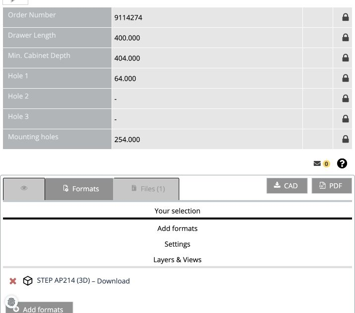
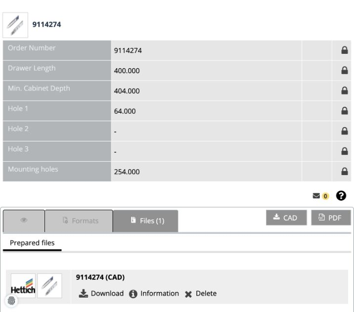

# Hettich KA 4532 Silent System, 400 mm

Use for sourcing exact article **9114274**, not as an installation approval.
The official product specifies a 400 mm drawer, at least 404 mm cabinet depth,
46 × 12.7 mm runner section and 35 kg load class. Check all other fit constraints
before selecting it. The 500 mm profile's fixing coordinates and 486 mm-long
13952 spacer must not be inherited without verifying their applicability.

## Official sources

- [Product and technical data](https://shop.hettich.com/us_EN/Runner-systems/Ball-bearing-runners/Side-installation/KA-4532-Silent-System-ball-bearing-runner,-side-installation,-dimensions-(H-x-W)-46-x-12-7-mm,-400/p/9114274)
- [Configured CAD page for 9114274](https://hettich-embedded.partcommunity.com/3d-cad-models/sso/?varset=%7BARTICLENO%3D9114274%7D&languageIso=en&info=hettich%2Fdrawer_runners%2Fball_bearing_slides%2Fmounted_on_sides%2Fka_4532_sisy%2Fka_4532_sisy_asmtab.prj)
- [Installation drawing MS 10547.00.000](https://web2.hettich.com/hbh/addon/montage/MS_10547_00_Montageanleitung_KA4532-SiSy.pdf)
- [Alternate public DWG/DXF archive](https://web2.hettich.com/hbh/addon/cad/9114274_3d.zip)
- [CAD download terms](https://www.cadenas.de/terms-of-use-3d-cad-models)

The alternate archive was downloaded and inspected: it contains three 2D DXFs,
one 3D DWG and one 3D DXF, **no STEP**. Use it as supplementary evidence, not as
input to the STEP importer. In the installation PDF, use the 400 mm row on page 2
and its datums; product-page hole spacings alone are not a complete fixing plan.

## Browser download, verified 2026-09-15

Use the active browser when available. Otherwise give the configured link and
these images to the user, one action at a time. The observed session required no
registration or agreement dialog; inspect each current session rather than
assuming either universal public access or mandatory registration.

1. Open the configured CAD page. Confirm **9114274**, **400.000** drawer length,
   and **404.000** minimum cabinet depth in its table.
2. Click **CAD**. If no format is selected, click **Add formats** and choose
   **STEP AP214 (3D)** with **Download**, not CAD Direct Integration.
   The resulting selection should look like this:

   

3. Click **CAD** again. In **Files**, wait for generation to finish, then click
   **Download** beside **9114274 (CAD)**:

   

4. Wait for the browser download to complete. Confirm `HETTICH_9114274.zip`
   exists on disk and contains `9114274.stp` plus the vendor notice. If the
   environment cannot save it, ask the user to download this prepared file and
   return the ZIP. Do not retry the temporary download URL indefinitely: in this
   trial direct HTTP retrieval returned 403 while the normal browser download
   succeeded. Keep the configured product URL as the reusable entry point.
5. Store with the general command, using manufacturer `Hettich`, family
   `KA 4532 Silent System`, item `9114274`. Preserve the ZIP, STEP and notice.
   Run the consuming skill's geometry and installation checks next.

## Observed source, not a registered installation profile

- STEP SHA-256:
  `a73d27173bd8ba2075ab36f42b60f4816c45a5b79b79220a7348f09db252812e`.
- Native import: four valid solids, paired corresponding sections at X≈0–12.5
  and X≈188.5–201 mm. Native Y bounds extend from −9.5 to 392.983917 mm.
- Keep those native coordinates. Nominal 400 mm length is not a reason to rescale
  or trim the file to a 400 mm bounding box.
- This verifies retrieval, identity and import only. Member classification,
  installation datums, fixings, material pilots, necessary spacers, chosen CNC
  faces and full travel remain construction work. Do not call this article an
  approved replacement until those checks pass.

Keep vendor CAD and installation downloads in the local project library; this
reference and the browser guidance screenshots contain no distributable CAD files.
