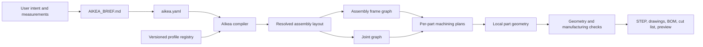

# AIkea Skill Research and Architecture Plan

## Read this first: compact handover

This section is the cold-start handover for the branch. The detailed workpackages
and numbered audit log below retain the evidence and history; this summary retains
the decisions that should govern the next run.

### Overall philosophy

AIkea should feel like an experienced carpenter taking responsibility for a
layperson's furniture project. The client supplies the measured space and the
visible choices that genuinely belong to them. AIkea turns those facts into a
coherent, adjustable, manufacturable design and leads continuously to the next
useful result.

The model is the orchestrator and design partner, not the source of manufacturing
geometry. Written project specifications, deterministic calculators, reusable
CadQuery builders, versioned construction profiles, and exact purchased-hardware
data are the construction authority. One saved definition must drive the part,
its machining, its assembly placement, its review model, and its later fabrication
output. The model may reason about intent and choose among supported solutions; it
must not redraw proven geometry from prose.

The skill should state strategic goals and the physical evidence required to
reach them. It should retain room to solve unfamiliar furniture intelligently.
Narrow prohibitions belong in the skill only after a recurring observed failure,
not as an ever-growing script of anticipated mistakes.

### Confirmed decision canon

#### Client experience

- Speak about the client's room and furniture: what is being decided or checked,
  why it matters physically, and what result or answer comes next.
- Keep repositories, branches, files, schemas, scripts, CAD mechanics, tests, and
  skill routing backstage unless the client asks for technical detail.
- Take the lead whenever the supplied facts are sufficient. Ask only for a real
  measurement or preference that can change the furniture.
- End every client-facing message with the next concrete action. Acknowledgement
  releases the next unfinished stage; it must not produce another passive pause.

#### Project truth and ownership

- `aikea.yaml` owns measured-space facts and shared visible choices. Chat is not a
  substitute for the written and validated specification.
- Each generated assembly owns its local specification, parts, builders, joints,
  child assemblies, and purchased-hardware placements.
- Every part and assembly has an explicit local origin, axes, and mapping into its
  parent and global frame. Position reports prove those mappings before review.
- Reusable construction belongs in the skill. Project measurements, generated
  furniture, downloaded vendor CAD, and client-specific choices stay in the
  active project.

#### Measurement and layout

- Establish units, the front-view outline, labelled physical edges, placement
  boundaries, and then only the measurements that reveal the actual fit.
- Preserve raw readings. Repeated readings compare the same trapped boundaries;
  open dimensions normally need one useful reading. Explicit client statements
  are valid design evidence.
- The built-in 2 mm fitting allowance applies only to a dimension enclosed at
  both ends. Cabinet-to-cabinet gaps are calculated tolerances, not a recurring
  client design question.
- Deterministic calculation resolves limiting measurements, clearances, assembly
  positions, cabinet widths, and heights. The model presents the useful result,
  not the formulas.
- Cabinet count and front division must be feasible for the selected door
  hardware before local cabinet generation. A wider opening can become paired
  doors; unsupported oversized single leaves must not be discovered at the end.

#### Construction and manufacture

- Build each sheet as a local manufacturable part, orient it correctly, then
  assemble it through explicit transforms. The preview may never bypass the
  project-owned builders.
- Shared joints generate matching work on both participants from one definition.
  Cabineos use at least two connectors per seam, no more than 300 mm between
  connectors, and no more than 200 mm from either seam end.
- Generated side panels own the System 32 datum: 5 mm holes on a 32 mm vertical
  pitch with 37 mm front and rear mounting lines. Shelves, hinge plates, runners,
  and later fittings reserve both their fixing nodes and their physical envelopes.
- Panels that exceed usable CNC travel are divided into assembly-ready modules.
  Machine capacity and cutter clearance belong to a manufacturing profile rather
  than to the client's wardrobe measurements.
- Visual realism supports inspection, but it is not geometric proof. Local/global
  position reports, contact and overlap checks, matched machining, movement checks,
  and focused code tests establish the physical claim.

#### Modular furniture capabilities

- Cabinet geometry must support arbitrary valid widths, heights, flat or sloped
  tops, and reusable arrangements rather than a catalogue of a few fixed shapes.
- Door length and plinth presentation are independent choices. Full-length or
  above-plinth doors and flush or recessed plinth fronts remain composable options.
- A fitted door includes its slab, selected relationship, matching cabinet and
  door machining, exact purchased hinge and plate, and checked closed/open states.
  The standard proposal for a single door is left-hinged; only an explicit client
  choice after visual review changes it.
- Drawers are independent repeatable child assemblies, not a special three-drawer
  stack. Every drawer may have its own height, depth, row, runner profile, and
  review extension. Front and back panels span the complete outside width with
  the sides captured between them.
- Exact runner selection follows the available cabinet depth and verified
  manufacturer CAD; hardware is never scaled to impersonate another product.
  Drawer-stack heights should use the available capacity deliberately while
  preserving clear movement and shared hardware reservations.
- Recessed lighting starts from the fewest practical purchased components. Its
  groove, purchased body, placement, inward illumination, and clearance from
  doors and hinges derive from the same saved part-local run.

#### Proof and repetition

- Build one complete representative assembly first. If it has doors, drawers,
  lighting, or bought hardware, those features must be physically present in the
  approval model rather than promised for a later stage.
- Show the same saved assembly in the views needed to judge fit and movement.
  Patrick's visual approval comes before repetition or the model eval for that
  feature; focused deterministic checks then lock the approved relationship.
- Only after the first complete assembly is approved should AIkea repeat the
  capability across the remaining furniture.

### Current resume point

- Project: `/Users/patrickolsen/Desktop/Projects/AIkea-skill`
- Branch: `main`
- Remote: none. This project is intentionally local and independent.
- From any Terminal window, enter the project with:

  ```bash
  cd "/Users/patrickolsen/Desktop/Projects/AIkea-skill" && direnv exec . git status -sb
  ```

  In Codex, start or open a task using this project folder when AIkea itself
  should be modified. Wardrobe projects consume the installed skills but do not
  own their source.
- Latest extracted construction checkpoint: `cd55226 fix: align drawers with cabinet opening`
- Active evaluation project:
  `/Users/patrickolsen/Documents/Codex/2026-08-30/aikea-fresh-wardrobe-clean-retry`
- Current drawer correction: the cabinet opening front is local `y = 0`; the
  earlier planner incorrectly used the 18 mm side-panel thickness as a setback.
  The corrected three drawer origins are at `y = 0` and the relationship is now
  protected by focused generator checks.
- The current 500 mm KA 5332 drawer has 530 mm complete outside depth inside a
  564 mm clear cabinet depth. The remaining 34 mm belongs behind the drawer.
- Regenerate and show the complete cabinet from a side-oblique angle that makes
  the drawer fronts and cabinet opening plane easy to compare. Patrick's visual
  approval remains required before the corrected relationship is repeated.
- The focused implementation and status record are:
  `aikea-build-drawers/scripts/hettich_ka_5332_cabinet_drawer_plan.py`
  and `docs/full-width-drawer-fronts.md`.

Resume the visual from the evaluation project with:

```bash
direnv exec . python work/generate_complete_cabinet_review.py . --opened --output outputs/cabinet-01-drawers-flush-to-opening.glb
```

### Fresh whole-skill test

Create a new empty project folder and start a fresh task with no earlier project
files or measurements. Paste only the client prompt below; keep this document and
the test observations out of that task's context.

```text
$aikea

This is a completely fresh project. Build a fitted wardrobe from these
measurements, viewed from the front:

- Units: centimetres
- Width: 300 at floor, middle, and ceiling
- Depth: 60; the front does not need to finish against a fixed depth line
- Ceiling: 240 high from the left edge to 120 across, then one straight slope
  down to 190 at the right edge
- Fitted between both side walls and between floor and ceiling
- Side clearance: 10 mm on each side
- Ceiling clearance: 10 mm
- Structural base height: 100 mm
- Plinth recess: 60 mm
- Doors stop above the plinth
- Visible door gaps: 2 mm
- Cabinet panels, doors, and structural backs: 18 mm

The wardrobe is equal-purpose tall storage. Choose the most sensible cabinet
count and door arrangement for standard concealed hinged doors.

The finished wardrobe should include adjustable shelving, three independently
configurable drawers in the lower part of every cabinet using the verified
Hettich runners, recessed inward-facing lighting that clears the door hardware,
and complete hinged doors using exact purchased hardware.

Take the lead through the AIkea workflow. First build one complete cabinet with
all of those features and open the finished model for my visual approval. Do not
repeat it across the rest of the wardrobe until I approve that first cabinet.
```

Tester-only observations—do not add these to the client prompt:

- The response remains carpenter-to-client throughout and does not narrate Git,
  project setup, skill routing, files, or code execution.
- It accepts the complete brief without repeating intake questions and advances
  to a feasible front division before generating cabinets.
- It does not ask the client to choose an inter-cabinet tolerance gap or hidden
  construction details.
- The first approval model is one actually composed cabinet containing its real
  panels, drawers and runners, shelves, lighting, door, hinges, paired machining,
  and reviewable closed/open movement.
- The response explains the physical value of the current work and finishes with
  the precise visual approval or design choice needed next.
- It stops before repeating the result across the remaining cabinets.

## Scope

Explore how to turn the reusable cabinet-design knowledge in this repository into a generic agent skill named **AIkea** that works with both Codex and Claude Code, using HyperFrames as the architectural reference.

This standalone project develops and versions the AIkea skill family without
owning any client's wardrobe project. The original wardrobe remains historical
implementation evidence; active project measurements and generated furniture
stay outside this repository.

### In scope for this research

- Global-to-local dimensional specifications.
- Cabinet-run and module derivation.
- Canonical part coordinate frames and assembly transforms.
- Cabineo source pockets and receiving geometry.
- True miter joins between planar panels.
- Structural base/plinth design and its cabinet interfaces.
- Deterministic CAD generation, validation, and manufacturing handoff.
- Drawer subassemblies, depth-matched runner profiles, purchased-hardware assets,
  and explicit drawer-to-cabinet placement.
- Slab-door construction, door-to-carcass relationships, purchased hinge profiles,
  paired door/carcass machining, and checked opening movement.
- Recessed linear furniture lighting, its part-owned CNC groove, purchased-light
  fit, and a Three.js review driven by the same saved local placement.
- Skill routing, progressive disclosure, CLI validation, reusable profiles, code tests, and eval sets.

### Explicitly out of scope

- Mains wiring design, electrical certification, and custom LED electronics.
- Implementing or modifying database architecture.
- Refactoring the current wardrobe before AIkea's contracts are approved.
- Machine-specific `.nc` post-processing in the first implementation slice.
- Containers, Docker Compose, or a hosted service for running model evals.
- An automated Claude/Codex eval runner until the skill works reliably in manual trials.

## Current state

- [x] Create a clean worktree at `/Users/patrickolsen/Desktop/Projects/Vilja værelse - AIkea skill`.
- [x] Create branch `AIkea-skill` from current `origin/main`.
- [x] Preserve the dirty original checkout without moving or deleting its artifacts.
- [x] Inventory the repository's global specs, part specs, builders, transforms, joints, base, exports, and tests.
- [x] Map the proven Cabinet 1-4 specs, builders, parts, placements, and joint responsibilities.
- [x] Inspect the Cabineo vendor installation PDF stored in the repository.
- [x] Review the relevant HyperFrames GitHub architecture.
- [x] Complete required responsibility reviews for relevant Python files above 150 lines.
- [x] Define a proposed AIkea architecture and implementation sequence.
- [x] Confirm the proposed product boundary with Patrick.
- [x] Confirm the skill layer and deterministic engine split with Patrick.
- [x] Add a compact cold-start handover with the governing philosophy, decision
  canon, current resume point, and a clean whole-skill test prompt.
- [x] Confirm that the working cabinet implementation must be preserved through incremental extraction and parity tests.
- [x] Create the root `AIkea-skill/` assembly folder.
- [x] Confirm that every AIkea capability requires code tests and that model decisions require an eval set.
- [x] Confirm the global-to-local-to-subpart ownership taxonomy and geometry-backed fit tests.
- [x] Use `assemblies/` as the generic parent for generated tall storage, bench, and other sheet-material assembly folders.
- [x] Split unit arrangement into the first narrow workflow skill, `aikea-arrange-units`, while `aikea` remains the entry point.
- [x] Add the first unit-arrangement eval set with exact answers for complete, missing, sloped, mixed-purpose, and revision cases.
- [x] Implement and validate the portable `aikea-arrange-units` skill and link the same source for Claude and Codex discovery.
- [x] Implement `aikea-build-units` as the automatic handoff from a checked arrangement to populated local unit folders.
- [x] Link the same `aikea-build-units` source for repository and global Claude and Codex discovery.
- [x] Implement `aikea-review-unit` as the automatic handoff from generated folders to one complete-looking CadQuery cabinet GLB.
- [x] Reuse the proven React/Three.js viewer as a portable prebuilt asset with a loopback-only Python server.
- [x] Require visual approval of the first cabinet before producing the remaining units.
- [ ] Prove in a fresh run that a configured hinged door is complete before the first-cabinet visual gate.
- [x] Package the approved `BlankSheetBuilder` inside the portable review skill while leaving the existing wardrobe builders unchanged.
- [x] Prove `BlankSheetBuilder` produces valid rectangular, sloped, stepped, concave, and reversed-order sheet solids from calculated outlines.
- [x] Inspect the earlier AIkea application and confirm its viewer contains a flat-colour override but no reusable wood-texture asset.
- [x] Visually approve the portable photograph-based plywood surface as the review default.
- [x] Light perspective reviews from a packaged photographic studio and provide a progressively refined photo view without changing the CadQuery assembly.
- [x] Build every part of the first assembly from its generated local specification and place those parts as one CadQuery cabinet.
- [x] Make every generated part builder return its real local CadQuery part and make the generated assembly builder collect those built parts.
- [x] Route visual review through the generated assembly builder so the viewer cannot bypass project-owned construction code.
- [x] Prove the first complete Cabineo relationship from the left side into the top panel using one shared cutter placement.
- [x] Derive vertical carcass boundaries from the top-panel underside so assembled blanks meet without overlapping material.
- [x] Add real geometry checks that reject through-cut receiver machining and overlapping joint participants.
- [x] Keep close inspection responsive as the camera approaches small joint features.
- [x] Keep rotation anchored to the cabinet center independently of close-detail zoom.
- [x] Keep the selected visible detail beneath the pointer during close zoom while preserving the cabinet-centered rotation point.
- [x] Keep a clean, stable image while zooming or rotating in Patrick's browser case.
- [x] Pan by moving only the camera across its viewing plane while keeping the furniture and its rotation center unchanged.
- [x] Select Cabinet 2 as the proven structural-carcass reference while keeping its legacy builders read-only.
- [x] Complete every square side/back, side/top, and top/back Cabineo relationship for the flat first unit.
- [x] Make the flat top span and bear on the side panels while preserving zero-overlap contact and the structural back.
- [x] Reject backs thinner than the selected connector profile before machining.
- [x] Distribute Cabineos with at most 300 mm between connectors, at most 200 mm to either edge, and at least two connectors per seam.
- [x] Apply one cabinet-owned System 32 hardware grid to every generated side panel.
- [x] Prove unequal-height side panels share aligned rows and preserve blind outside faces.
- [x] Record CNC travel and cutter clearance as a manufacturing profile rather than wardrobe measurements.
- [x] Add a general panel-segmentation planner that keeps every segment inside the usable CNC rectangle.
- [x] Generate a structural base assembly whose decks, rails, braces, and module seams derive from the resolved cabinet run.
- [x] Give every base brace paired Cabineo joints to its front and back rails and prove both participants receive blind matching machining.
- [x] Split the current 2978 mm base into two CNC-sized modules at a cabinet gap.
- [x] Build every generated base part as a valid local CadQuery solid.
- [x] Place the complete base without overlapping material and prove the rails, braces, and deck meet at their intended faces.
- [x] Prove the first cabinet sides bear exactly on the base deck.
- [x] Export and capture the complete base from perspective, top, and underside views, then show the first cabinet on its matching base module.
- [x] Define the global measured-space zero, every assembly and part local zero, every part's assembled axes, and the explicit mappings between them.
- [x] Require a generated assembly-position report to prove cabinet-to-base bounds, contact, depth, overlap, and module-break placement before visual review.
- [x] Exclude every neighbouring base-module part from the first-cabinet review and prove the exact exported node set.
- [x] Add a model eval case with exact local/global answers for diagnosing an apparent cabinet-to-base mismatch.
- [x] Make door length and plinth-front position independent shared design choices.
- [x] Prove all four door-and-plinth combinations in exact taxonomy and placed CadQuery geometry.
- [x] Keep a recessed plinth frame behind a full-depth structural deck.
- [x] Build the approved full wardrobe from every generated cabinet builder and the complete base builder.
- [x] Require a full-run position report before exporting the complete wardrobe GLB.
- [x] Present the verified full wardrobe with either closed or open doors without changing its physical design.
- [x] Present each full-wardrobe door independently as closed, open, or removed without changing its physical design.
- [x] Record the exact files from each successful taxonomy generation so revised overall inputs safely refresh untouched local results while preserving client edits.
- [x] Add an exact three-to-four-cabinet revision eval and prove all four generated cabinets plus the recalculated two-module base in real CadQuery geometry.
- [x] Cut changing-angle top seams with one shared equal-thickness miter plane and project the two complementary cuts back into each panel's local manufacturing frame.
- [x] Replace the four-cabinet review test with a 1200 mm flat top section sloping to a 1900 mm measured right height, and prove all six changing-angle seams close without gaps or overlapping material.
- [x] Limit review agents to code that is part of the AIkea skill.
- [x] Require every AIkea response to end with one concrete next action and advance automatically after a client acknowledgement.
- [x] Make the arrangement handoff goal-led and automatically generate the local unit taxonomy once the arrangement is complete.
- [x] Add first-pass guidance for progress updates to focus on the physical result and client value.
- [x] Centralize one carpenter-to-client conversation contract across every routed AIkea stage.
- [ ] Prove in a fresh end-to-end run that every visible update stays in physical furniture language rather than reporting project setup, files, code, or CAD execution.
- [x] Confirm one shared AIkea skill source must work with both Codex and Claude Code.
- [x] Start v1 as one portable `aikea` skill and split only when a real responsibility requires it.
- [x] Confirm `aikea.yaml` as the editable overall project format.
- [x] Confirm the written and validated `aikea.yaml` as the required gate before cabinet and construction design.
- [x] Confirm STEP, preview, BOM, and cut list as the initial output boundary.
- [x] Initialize the shared AIkea skill folder.
- [x] Link Claude Code's repository skill discovery to the shared folder without copying it.
- [x] Link Codex's repository skill discovery to the same shared folder without copying it.
- [x] Implement and validate the overall wardrobe input slice.
- [x] Implement the missing, contradictory, and complete information states required by the eval set.
- [x] Pass the complete deterministic input, calculation, taxonomy, CadQuery construction, viewer, runtime, command, and eval-answer test suites plus all standard skill validators.
- [x] Pass 110 portable Python checks; the 14 CadQuery construction checks directly affected by the consolidated four-cabinet miter slice pass in the discovered CadQuery runtime.
- [x] Replace the three-prompt draft with nine manual cases covering overall wardrobe measurements and settings.
- [x] Add a step-by-step case that starts with no measurements and asks about one topic per turn.
- [x] Add a client-facing site measurement sheet for clients who prefer to collect all measurements together.
- [x] Promote drawer construction into its own AIkea subskill while keeping `aikea` as the overall workflow.
- [x] Select the existing four-cabinet sloped wardrobe and its first generated cabinet as the drawer proof project.
- [x] Define explicit parent-to-child assembly placement and purchased-hardware contracts.
- [x] Build and geometry-check one five-panel wooden drawer box from the first cabinet's real clear opening.
- [x] Select the longest registered runner that fits the real cabinet depth without scaling another product's CAD.
- [x] Generate the first cabinet's local drawer folders and compose them through its existing builder.
- [x] Export and inspect the drawer in the first cabinet, then in the unchanged full four-cabinet assembly.
- [x] Add the `aikea-build-drawers` skill instructions and shared Codex/Claude discovery.
- [x] Add closed, open, and removed drawer review states; the removed state leaves the exact 500 mm runners fixed in the cabinet.
- [x] Export the verified left and right T51.7601 locking devices as a separate native-CAD inspection view without representing an unverified drawer mounting transform.
- [x] Register the exact downloaded 500 mm MOVENTO runner pair as separate verified left and inferred-right local assets without copying vendor STEP bytes into the skill.
- [x] Gate drawer generation on the exact depth-selected left/right runners and matching left/right locking devices before any project drawer file is written.
- [x] Resolve and save the exact handed runner and locking-device mounting frames from official fixing dimensions and native STEP datums.
- [x] Place the verified source CAD through those frames and write a hardware position report before visual approval.
- [x] Confirm the official static runner formats contain no articulated mechanism and keep them as the closed-position authority.
- [x] Add a separately named open-runner movement preview and prove the fixed path, drawer-side guide, and locking-device frames move correctly.
- [x] Register the exact paired 500 mm Hettich KA 5332 STEP assembly and its official installation datums without adding vendor CAD bytes to the skill.
- [x] Add a visual-only KA 5332 prototype that reuses the existing generated cabinet, `BlankSheetBuilder` drawer parts, and all six genuine telescoping members while preserving their source-CAD metal presentation in the viewer.
- [x] Add single-hand connection cutaways that expose the purchased runner against the drawer side when present and against the cabinet side after removal, while retaining a short front section to preserve placement context.
- [x] Obtain Patrick's visual approval of the KA 5332 closed, open, and drawer-removed states before running automated checks.
- [x] Create `aikea-source-hardware-cad` as the exact purchased-CAD discovery and local-storage subskill.
- [x] Keep downloaded hardware in one Git-ignored project library outside cabinet assemblies and keep only provenance metadata in the public skill.
- [x] Add a deterministic command that retains the original download, safely expands archives, and records every stored checksum.
- [x] Add a sourcing eval set for protected-download handoff, exact archive storage, and substitute rejection.
- [x] Validate the sourcing skill with the approved KA 5332 archive and install its shared Codex and Claude discovery links.
- [x] Pass the sourced KA 5332 hardware directory into drawer construction and let the manifest select the approved STEP file.
- [x] Save the approved KA 5332 drawer as a five-part cabinet child with one purchased runner pair and separate left/right source-member placements.
- [x] Make KA 5332 review rebuild the generated cabinet child and load its saved frames instead of accepting duplicate drawer-position inputs.
- [x] Let one cabinet own any number of independently identified drawer children without introducing a separate stack-specific construction path.
- [x] Let every drawer independently choose its height, depth, vertical position, and exact depth-matched runner profile.
- [x] Review arbitrary per-drawer extension distances while preserving the closed collection as the fit authority.
- [x] Build the four-cabinet proof with three drawers per cabinet, the first cabinet stepped open from top to bottom, and the remaining cabinets closed.
- [x] Align every KA 5332 runner center to one real front-column System 32 node and machine the official five cabinet-side and five drawer-side fixing positions on both hands.
- [x] Save one shared cabinet hardware map that checks both occupied nodes and physical fitting envelopes across runners, hinge plates, and shelf contacts.
- [ ] Obtain Patrick's visual approval of the repeated-drawer wardrobe before running its eval set.
- [ ] Add the drawer construction eval set after the approved KA 5332 source is integrated into the drawer builder.
- [x] Bring recessed furniture lighting into AIkea and require the fewest practical installed components.
- [x] Install the shared `aikea-add-lighting` source in Codex skill discovery so routed runs reuse it instead of improvising project-local lighting code.
- [x] Prove one straight purchased-light groove in a standalone sheet before changing a cabinet.
- [x] Drive one switched-off and switched-on Three.js review from that same saved lighting placement.
- [x] Obtain Patrick's visual approval before repeating or integrating the lighting run into a cabinet.
- [x] Prove the same saved run as a host-owned groove, purchased light, and illumination source in one generated cabinet.
- [ ] Obtain Patrick's visual approval of that cabinet before repeating lighting across the wardrobe.
- [x] Confirm `aikea-build-doors` as the AIkea subskill that owns complete door and hinge construction.
- [x] Confirm full-overlay, half-overlay, and inset doors as the visible frameless door relationships.
- [x] Confirm that the supported concealed-hinge cup sizes are 35 mm and 26 mm, not 25 mm.
- [x] Find exact open/closed purchased-hardware CAD candidates for both cup sizes without treating either candidate as approved construction yet.
- [x] Confirm that hinge quantity and placement derive from the selected manufacturer's method, door geometry, material, and weight rather than one height-only spacing rule.
- [x] Keep hinge selection, quantity, placement, matching machining, and collision avoidance automatic unless the client asks to choose hardware.
- [x] Create the first `aikea-build-doors` construction slice and shared Codex/Claude discovery paths.
- [x] Visually approve the first complete door-and-hinge assembly before repeating it across a wardrobe.
- [x] Lock the approved cup, door-fixing, and System 32 plate axes with focused deterministic geometry checks.
- [x] Make supported door-leaf geometry an input to cabinet arrangement rather than a late hinge warning.
- [ ] Add a deterministic front-layout planner that prefers five supported single-door cabinets for the current run while allowing an intentional wider paired-door bay.
- [x] Keep the standard left-hand proposal for flat and sloped single doors unless the client explicitly chooses another hand.
- [x] Preserve the individual left, right, and top room boundaries as installation facts without using them to infer door hands.
- [x] Save one project-wide left-hand proposal plus any explicit client exceptions for visual approval.
- [x] End the first loaded fitted-door visual with project-owned `Approve door openings` and `Change a door` actions before any later cabinet is built for review.
- [ ] Add the door-and-hinge eval set after its deterministic construction path is visually approved.
- [x] Establish and label the front-view shape before asking how it fits or requesting dimensions.
- [x] Ask one labelled-edge fit question instead of separate questions for each side.
- [x] Keep the labels as the measuring map and choose lines that reveal the actual fitting surfaces instead of following a rigid position checklist.
- [x] Record client-confirmed design decisions and their supporting statements in the global specification.
- [x] Treat a client-confirmed geometry property as evidence instead of demanding an unhelpful proving measurement.
- [x] Pair every client-facing edge letter with a plain name in parentheses.
- [x] Present requested readings and design choices as numbered lines that support short numbered replies.
- [x] Precede measurement lines with a Width, Height, or Depth headline and a compact numbered ASCII guide.
- [x] Phrase each reading as `measurement description: where to measure` without a fake value field.
- [x] Keep the wardrobe front open while separately deciding whether its finished face must meet a fixed flush line.
- [x] Require three site readings for dimensions fixed at both ends and one reading for dimensions with an open end.
- [x] Support millimetres, centimetres, and inches while normalizing calculations to millimetres.
- [x] Start new client conversations warmly before asking one clear question at a time.
- [x] Apply one built-in 2 mm fitting allowance only to dimensions fitted at both ends, without changing the raw readings.
- [x] Keep limiting-dimension policy inside deterministic calculation and give the model only the checked physical output.
- [x] Require client-facing carpenter language while keeping YAML, width shares, schemas, and checking mechanics private.
- [x] Keep later construction knowledge out of the overall measurements-and-choices stage entirely.
- [x] Confirm that v1 model evals will be run manually in fresh Claude and Codex chats.
- [x] Defer containers, Compose, and automated agent runners until manual repetition justifies them.
- [x] Give every case saved user turns, response criteria, an exact global-spec answer, and exact calculated dimensions.
- [x] Document the repeatable empty-folder setup and fresh Codex and Claude commands for manual eval runs.
- [ ] Manually run and score the overall wardrobe measurements-and-settings eval set.

## Executive finding

AIkea should not be a large prompt that teaches an agent to write a new CadQuery program for every cabinet. That would preserve the current failure mode: dimensions, frames, and invisible joinery logic would be re-derived in multiple places.

The recommended shape is a **portable skill in front of deterministic cabinet calculations**:

1. Skills capture intent, select policy, and operate the workflow.
2. A declarative project file records the design inputs.
3. A deterministic engine derives modules, parts, frames, joints, and manufacturing features.
4. A validator proves invisible construction contracts before export.
5. Producers emit review and manufacturing artifacts.

The core reusable idea is:

> Define each physical joint exactly once, then derive every participant's machining geometry through one authoritative frame graph.

That single rule covers Cabineo source/receiver alignment, miter pairs, cabinet-to-plinth interfaces, dowels, screws, and future hardware profiles.

## Non-negotiable implementation preservation contract

Status: **confirmed by Patrick on 2026-08-22**.

AIkea is not an instruction set for recreating this cabinet system. It must provide the working implementation: deterministic code, construction policies, hardware profiles, required assets, validators, fixtures, code tests, and eval sets. The skill layer selects and operates those capabilities; it does not ask an agent to reinvent their geometry from prose.

The existing wardrobe code represents proven engineering work and is the seed implementation for AIkea. The new generic package boundary must therefore be formed by careful extraction, not by a one-shot rewrite:

1. Capture the current Vilja result as a protected golden baseline before changing a capability.
2. Extract one coherent capability at a time behind an explicit contract.
3. Run old and extracted paths against the same fixture and compare resolved dimensions, frames, joint placement, manufactured geometry, and outputs.
4. Keep the working path authoritative until the extracted path passes its parity gate.
5. Retire duplication only after parity is demonstrated and recorded.

Genericity still matters: project names and measurements must become fixture data rather than defaults. Preservation means retaining proven behavior and geometry, not retaining accidental coupling or duplicated architecture.

## Repository research

### Reusable foundations already present

#### 1. Top-down specification flow

`wardrobe/core/global_spec.py` already moves toward a root specification that owns envelope and material facts. Cabinet specs derive local width, height, depth, and thickness from it.

Useful rule to retain:

`project inputs -> run plan -> module spec -> part spec`

#### 2. Local part builders

Cabinets 2-4 use package-per-part builders and local immutable specs. This is a useful manufacturing boundary: a part should be built in one canonical local frame and exported in that frame.

#### 3. Face-and-edge connector placement

`wardrobe/utils/cabineo_cutter.py` models orthogonal connector placement as:

- entry face;
- opening edge;
- slide-axis offset;
- panel thickness and local edge coordinate;
- hardware clearances.

This is significantly more reusable than per-panel rotation recipes.

#### 4. Source-derived receiving geometry

`mating_cutout()` preserves a cutter together with a source-to-target transform. The strong idea is to project the same authoritative joint volume into both mating parts instead of recreating receiver geometry.

#### 5. True miter geometry

`wardrobe/utils/miter_edge_mate.py` derives one bisecting plane from two outside-face planes and applies complementary trims. Its documented preconditions are important:

- planar outside faces;
- planar and parallel inside/outside faces;
- equal participant thickness for a gap-free inside edge.

#### 6. Plinth-to-cabinet projection

The base top plate attempts to derive receiving holes from the cabinet bottom joinery. This is the correct relationship direction even though the current transform ownership is duplicated.

#### 7. Manufacturing pipeline seed

The original checkout contains an uncommitted but production-intended CNC pipeline that:

- builds finished Cabinet 2-4 parts;
- normalizes inside faces upward;
- deterministically nests panels;
- validates sheet bounds and spacing;
- exports STEP cut sheets and manifests.

It is useful evidence for an eventual producer, but is hard-coded to this wardrobe and is not present on the clean AIkea branch.

### Problems AIkea must not inherit

#### 1. Project data and reusable logic are mixed

The current global spec combines reusable dataclasses, one ceiling-profile algorithm, Vilja's measured values, and fixed Cabinet 2-4 offset fields. It assumes equal-width bays and one flat-to-linear slope.

AIkea needs separate owners for:

- raw project inputs;
- assembly-layout planning;
- assembly placement;
- project presets.

#### 2. Assembly transforms are re-derived

Cabinet 2 transforms are independently reconstructed in panel builders, `Cabinet2AssemblyPlacer`, and `cabinet2_interface.py`. Some builders also rediscover named edges by searching transformed topology.

This makes local geometry, miter cuts, and receiving pockets vulnerable to silent drift.

#### 3. Joint participants calculate the same joint separately

The flat-top/sloped-top and sloped-top/right-side miter planes are calculated independently by both participants. Cabineo receiving features often re-call the source cutter API with duplicated parameters.

AIkea must make a joint a first-class object with both participants and one calculation.

#### 4. Cabineo has parallel implementations

`wardrobe/utils/cabineo.py` and `wardrobe/utils/cabineo_cutter.py` encode overlapping cutter behavior and different placement vocabularies. Production paths mainly use the newer face/edge implementation; older test paths still use the legacy helper.

#### 5. The standard cutter asset is not reproducible

Both current standard Cabineo helpers load:

`wardrobe/debug_exports/cabineo_preview/cabineo_with_perimeter_cap.step`

That file is ignored and absent from the clean worktree. The non-bottom variant asset is tracked, but that does not repair the standard bottom-joinery path.

A clean clone therefore cannot be the proof boundary for current Cabineo generation.

#### 6. Hardware choices are encoded as magic calibration

The Lamello installation sheet describes multiple machining options and seating modes. The current code instead has one mixture of hard-coded pocket depth, flange standoff, face inset, floor overshoot, and variant selection.

AIkea needs versioned hardware profiles, including supported material thickness, machining strategy, tool assumptions, seating mode, tolerances, and canonical geometry.

#### 7. The structural base is a project instance, not a generic plinth model

The current base mixes reusable schema with Vilja defaults. It assumes two modules and contains stale or unused electronics, spacing, and Cabineo fields. Its receiving holes enumerate Cabinets 1-4 explicitly.

AIkea needs a structural plinth grammar whose rails, braces, deck, module breaks, and cabinet interfaces derive from a cabinet run and manufacturing profile.

#### 8. Invisible geometry lacks focused tests

The repository has door geometry tests, but no focused production tests for:

- Cabineo source/receiver alignment;
- frame transform round-trips;
- miter seam gaps or interference;
- plinth receiving-feature alignment;
- global-to-local thickness propagation;
- assembly collision and intended contact.

#### 9. Prototype code should not be promoted wholesale

`wardrobe/utils/angular_joint.py` is a broad untested prototype with no active production consumer. AIkea should start from the smaller active `MiterEdgeMate` contract and only generalize when a second proven joint strategy requires it.

## HyperFrames research

HyperFrames separates agent knowledge, deterministic execution, validation, reusable primitives, and production output.

Relevant sources:

- [HyperFrames README and package map](https://github.com/heygen-com/hyperframes/blob/main/README.md)
- [Mandatory router skill](https://github.com/heygen-com/hyperframes/blob/main/skills/hyperframes/SKILL.md)
- [Core technical contract](https://github.com/heygen-com/hyperframes/blob/main/skills/hyperframes-core/SKILL.md)
- [CLI development loop](https://github.com/heygen-com/hyperframes/blob/main/skills/hyperframes-cli/SKILL.md)
- [Registry skill](https://github.com/heygen-com/hyperframes/blob/main/skills/hyperframes-registry/SKILL.md)
- [Skills architecture guide](https://github.com/heygen-com/hyperframes/blob/main/docs/guides/skills.mdx)
- [Producer package](https://github.com/heygen-com/hyperframes/blob/main/docs/packages/producer.mdx)

### HyperFrames patterns to copy

#### 1. One mandatory router

The `hyperframes` skill is a small entry point that detects project state, distinguishes fresh creation from a specific operation on an existing project, and routes once.

AIkea should do the same:

- fresh cabinet project;
- resume an existing AIkea project;
- inspect or diagnose only;
- modify an existing project;
- validate, preview, or export only.

#### 2. A core technical contract

HyperFrames keeps the non-negotiable composition rules in `hyperframes-core` and uses references for details. AIkea needs an `aikea-core` contract for project schemas, frame rules, part identity, joint ownership, deterministic builds, and validation.

#### 3. Domain skills do not own the end-to-end workflow

HyperFrames loads animation, media, CLI, and registry knowledge only when needed. AIkea should keep joinery and manufacturing knowledge atomic while the `aikea` router owns the cabinet workflow.

#### 4. A declarative source artifact

HyperFrames compositions are plain HTML and fresh intent is recorded in `BRIEF.md`. AIkea needs a human-readable project spec plus a resolved machine-readable plan, rather than relying on chat history or generated Python as the source of truth.

#### 5. Registry before bespoke authoring

HyperFrames searches its registry for a reusable primitive before hand-authoring. AIkea should resolve a cabinet topology, connector profile, hinge profile, plinth strategy, or manufacturing profile from a registry before inventing one.

#### 6. Fast lint plus final check

HyperFrames separates a fast structural lint from a browser-backed final check. AIkea should separate schema/policy lint from a geometry-backed check.

#### 7. Deterministic producer boundary

HyperFrames' producer turns a validated composition into final media and supports regression baselines. AIkea should keep STEP, drawings, BOM, cut list, and later CAM generation behind a producer boundary that consumes the resolved plan.

### HyperFrames patterns not to copy literally

- AIkea should not reproduce HyperFrames' number of skills on day one.
- Cabinet geometry should not be represented as freeform agent-authored code.
- A visual snapshot alone cannot prove hidden joint correctness.
- Manufacturing profiles require stronger versioning and tolerances than visual registry components.

## Proposed AIkea architecture

All items in this section are proposals pending Patrick's confirmation.

### Naming

- Human-facing name: `AIkea`.
- Skill and folder name: `aikea` because Codex skill names must use lowercase letters, digits, and hyphens.

### Architecture overview



### Layer 1: Agent skill

Keep `aikea` as the portable entry point. It determines the current project stage and routes to a narrow workflow skill when that stage has its own conversation, saved result, and completion boundary. Keep deterministic calculations and generated files in scripts; a workflow skill tells the model what decision to settle and which script to run, but does not ask the model to recreate the filesystem or geometry from prose.

The first responsibility-based split is `aikea-arrange-units`. It begins only after the measured space and shared starting choices are checked. It helps the client arrange tall storage, benches, open sections, and other supported units from left to right; records their purposes and width relationships in the global specification; and stops before local part or joint design. A later deterministic generator will use that saved arrangement to create the standard assembly folders.

`aikea-build-doors` owns the later step that turns each resolved cabinet opening
and visible door choice into complete door geometry, selected purchased hinges,
paired machining, placed source CAD, and checked opening movement. The client
chooses the visible result; the subskill resolves the hidden hardware work from
registered manufacturer information and the actual door construction.

AIkea must not have separate Codex and Claude copies of its cabinet knowledge. Both agents consume the same standards-compatible skill family, references, deterministic scripts, assets, code tests, and eval sets. Keep the shared frontmatter and instructions portable; do not depend on Claude-only command injection or Codex-only behavior for cabinet correctness.

```text
AIkea-skill/
  aikea/
    SKILL.md                  Shared Codex and Claude entry point
    agents/openai.yaml        Optional Codex display metadata
    references/               Entry-stage knowledge and instructions
    scripts/                  Entry-stage deterministic calculations
    assets/                   Entry-stage reusable templates
  aikea-arrange-units/
    SKILL.md                  Unit-arrangement conversation and workflow
    agents/openai.yaml        Optional Codex display metadata
    references/               Arrangement rules and saved-result contract
  aikea-build-units/
    SKILL.md                  Local unit-folder generation workflow
    scripts/                  Deterministic taxonomy generator
    references/               Generated ownership contract
  aikea-review-unit/
    SKILL.md                  First-cabinet visual approval workflow
    scripts/                  Mock-up GLB generator and local viewer server
    assets/                   Prebuilt viewer and maintainable viewer source
    references/               Visual artifact and approval contract
  aikea-build-doors/
    SKILL.md                  Complete door and hinge construction workflow
    scripts/                  Door, hinge, machining, and movement calculations
    references/               Door relationships and hardware-profile contract
```

During repository development, Claude and Codex discover or link each skill folder from this shared family. These are discovery paths only; none may become a second source of truth.

### Layer 2: Declarative project contract

Recommended project artifacts:

```text
AIKEA_BRIEF.md        Confirmed user intent and unresolved choices
aikea.yaml            Human-editable canonical design input
aikea.lock.json       Fully resolved dimensions, profiles, frames, and joints
build/                Generated and ignored output
```

`aikea.yaml` is the global specification. It should contain only authoritative inputs and selected policies. Derived dimensions belong in `aikea.lock.json` so they can be audited without becoming a second editable source of truth.

The model must complete and validate `aikea.yaml` before beginning cabinet layout, local part design, plinth construction, joints, or manufacturing design. Questions and chat summaries help complete the global specification but never replace the saved file.

The global project specification is the root authority for values that drive geometry across the cabinet run. It must preserve three kinds of information as distinct sections:

1. **Measured facts**: the physical envelope recorded from the site in the chosen unit.
2. **Chosen inputs**: how the run is enclosed, cabinet count, global width allocation, run-wide gaps, material thicknesses, base height, and other values that affect multiple local assemblies.
3. **Resolved values**: generated dimensions, boundary heights, placements, and other downstream calculations.

Only measured facts and chosen inputs are editable authority. Resolved values are regenerated. No downstream part, joint, plinth, or producer may keep a second independent copy of a value derived from the global project specification.

Do not place a parameter in the global specification merely because the build uses it. Cabineo machining dimensions belong to the Cabineo capability. Base rail spacing belongs to the base's local specification. Those values control their owning geometry, not the cabinet run. The global specification supplies the base envelope; the base specification derives its rail lengths, rail count, brace placement, and subparts.

### Layer 3: Deterministic engine

Recommended package boundaries:

```text
src/aikea/
  model/              Immutable project, part, frame, joint, and output values
  planning/           Run layout, module topology, plinth, construction policy
  frames/             Named local-to-parent transforms and frame graph
  joinery/            Joint compilers and hardware profile adapters
  geometry/           CadQuery blank and feature application
  validation/         Static, geometric, assembly, and manufacturing checks
  export/             STEP, drawings, BOM, cut-list, and preview producers
  cli/                Non-interactive and JSON command surface
```

One thin façade should coordinate the pipeline:

```text
AIkeaBuildService.build(ProjectSpec) -> BuildResult
```

The façade should delegate to one compiler pipeline rather than expose alternate ways to build the same cabinet.

### Ownership taxonomy

```text
GlobalProjectSpec
  -> LocalAssemblySpec (tall storage, bench, plinth, door)
       -> SubpartSpec (panel, rail, brace, deck)
            -> PartBuilder

JointSpec
  -> matching local machining features for every participant
```

- The global specification owns run-wide geometry drivers and defaults.
- A local assembly specification consumes its resolved global allocation and owns the calculations for all of its subparts.
- A subpart specification contains only the finished local dimensions and features required by its builder.
- A local override must remain an explicit calculation from its global input and must still satisfy the parent envelope.
- A shared interface is owned by one joint specification. Participants must not independently calculate matching holes, pockets, or miter planes.

Generated project folders use the same assembly boundary regardless of purpose:

```text
assemblies/
  <stable-assembly-id>/
    spec.py
    builder.py
    joints/
      spec.py
    parts/
      <stable-part-id>/
        spec.py
        builder.py
```

The assembly purpose is a design choice: for example, tall storage or a bench.
Its geometry is not selected from a small catalogue of cabinet shapes. The
compiler clips the project envelope to the assembly's allocated space, preserves
every local boundary segment, and derives the required parts from that boundary.
The assembly `builder.py` remains the stable entry point that builds and places
those parts; shared geometry and joint algorithms remain in the AIkea engine.

For example, the base owns a rail-spacing parameter. From the resolved base envelope it calculates rail length by subtracting the relevant front and back panel thicknesses, then calculates the required rail count and positions from rail spacing. Those calculations do not belong in the global specification.

### Layer 4: Versioned profile registry

Profiles should hold reusable construction knowledge, not project dimensions:

```text
profiles/
  joinery/
    cabineo-8-surface.yaml
    cabineo-8-flush.yaml
    miter-equal-sheet.yaml
  hardware/
    hinges/
      <manufacturer>-<family>-<article>.yaml
  plinth/
    rail-brace-deck.yaml
  manufacturing/
    sheet-goods-default.yaml
```

Every hardware profile should include:

- stable identity and version;
- manufacturer and source reference;
- supported material and thickness range;
- source and receiver machining strategies;
- canonical local cutter geometry or deterministic generator;
- tool diameter and access assumptions;
- seating mode, clearances, and tolerances;
- assembly direction and service constraints;
- validation rules;
- asset hash when an external model is required.

A concealed-hinge profile additionally owns its exact cup and fixing geometry,
matching mounting plate, supported door relationships and material range,
manufacturer sizing method, source-CAD identity, and the closed-to-open movement
envelope used for collision checks. Cup diameter alone never identifies a
complete hinge system.

Prefer deterministic parametric machining geometry as authority. Use packaged STEP assets as reviewed fixtures or previews, not as ignored debug dependencies.

## Core domain model

### Project and run

- `ProjectSpec`: authoritative global geometry drivers and run-wide defaults.
- `EnvelopeProfile`: piecewise-linear room or cabinet envelope.
- `CabinetRunPolicy`: bay count, widths, fillers, reveals, and topology rules.
- `CabinetRunPlan`: resolved bay boundaries and module placements.
- `LocalAssemblySpec`: one cabinet, base, or door allocation that owns its subpart calculations.
- `PlinthPlan`: local structural base plan derived from its global envelope and local construction parameters.

### Parts and frames

- `PartSpec`: manufacturable blank, material, thickness, named faces, edges, and datums.
- `PartPlacement`: one local-to-parent transform with an inverse.
- `AssemblyFrameGraph`: the only owner of frame composition.
- `MachiningPlan`: ordered local features applied to one part.

Builders may consume `PartSpec` and `MachiningPlan`. They must not read a global singleton, import sibling specs, or rediscover assembly placement from bounding boxes.

### First-class joints

Each `JointSpec` should own:

- stable joint ID;
- both participants;
- named faces, edges, or datums;
- joint strategy and profile version;
- assembly direction and tool access;
- source/receiver roles when asymmetric;
- tolerances and validation criteria.

The compiler derives local features from the joint and frame graph.

For a source part `S` and target part `T`:

```text
target_from_source = placement(T).inverse * placement(S)
```

The source cutter is created once. Its receiver geometry is the same occupied volume projected through `target_from_source`, unless the selected hardware profile explicitly defines a different receiver machining strategy.

### Miter contract

- Calculate the joint once in a shared assembly frame.
- Validate the planar-face and material-thickness preconditions.
- Produce complementary local trim features for both participants.
- Check coplanarity, seam gap, and interference after assembly.
- Never let each participant independently recalculate the bisector.

### Plinth contract

The plinth is a structural assembly, not a cosmetic box.

Its planner should derive:

- overall footprint and setback;
- module splits from stock and machine constraints;
- rails, braces, and deck panels;
- braces beneath vertical cabinet loads and module boundaries;
- cabinet-to-deck receiving joinery from the cabinet joint graph;
- wall/floor fixing policy where explicitly selected;
- service zones as optional non-structural features.

### Door and hinge contract

The door is a local child assembly of its cabinet. Its specification owns the
door blank, visible relationship to the carcass, gaps, opening hand, and every
hinge placement. For frameless AIkea cabinets, the visible relationships are
full overlay, half overlay at a shared divider, and inset. Face-frame cabinetry
remains a separate construction family.

The cabinet side owns one versioned System 32 hardware grid: 5 mm blind holes,
32 mm row pitch, and front and rear columns 37 mm from their panel edges. Shelves,
hinges, drawer runners, and later compatible fittings consume this one grid.
Their profiles declare which positions they require and own any preparation that
the grid does not provide.

The selected exact hinge profile supplies the 35 mm or 26 mm cup system,
mounting plate, grid interface, supported door construction, and manufacturer
sizing method. Hinge quantity must use door height, width, thickness, material
or density, calculated weight, and the selected profile's limits. Placement
then spreads that quantity across valid grid positions while preserving the
profile's end distances and avoiding other owned features.

One resolved placement must generate the door cup machining and name the exact
cabinet grid positions consumed by its mounting plate. The same placement also locates
the purchased CAD in closed and open review states. Geometry checks must prove
material containment, matching axes, intended gaps, and a collision-free door
sweep against the carcass, neighbouring doors, shelves, drawers, universal-hole
features, and recessed lighting.

## Proposed AIkea workflow

### Fresh creation

1. Inspect available measurements, drawings, and existing project artifacts.
2. Capture only decisions that cannot be safely derived in `AIKEA_BRIEF.md`.
3. Select topology, joinery, plinth, and manufacturing profiles.
4. Write `aikea.yaml`.
5. Run `aikea lint`.
6. Compile `aikea.lock.json` and local machining plans.
7. Run `aikea check --snapshots --json`.
8. Present the assembly, joint report, and unresolved manufacturing warnings.
9. Export deliverables after approval.

### Existing project

Apply the first matching state:

1. Specific inspection or diagnosis: perform only that operation.
2. Specific edit: update authoritative input or a selected profile; do not patch generated geometry.
3. Existing `aikea.yaml`: resume from it and the lock file.
4. Existing brief only: resolve remaining decisions, then compile.
5. No project state: use the fresh-creation workflow.

### CLI loop

Recommended initial commands:

```text
aikea init
aikea lint
aikea check [--snapshots] [--json]
aikea build [--json]
aikea export step|drawings|bom|cut-list
aikea inspect joints|frames|parts|plinth
aikea catalog [query]
```

All agent and CI paths should be non-interactive and support structured JSON. `check` should include `lint`; callers should not need to run both for the final gate.

## Code tests and eval sets

### Coverage rule

Every deterministic capability must be introduced with code tests. Every decision made by the model must be covered by an eval set. An informal forward check is useful while writing the skill, but it is not a test or an eval set.

The first eval set scores whether AIkea:

- asks about one missing measurement or design topic at a time instead of inventing a value;
- offers a simple site measurement sheet when the client wants to collect everything together;
- uses only active-project measurements;
- establishes the front-view shape and labels its edges before deciding which measurements are needed;
- asks once whether every labelled edge is fitted and, if not, which letters are open;
- asks separately whether the finished wardrobe front must align with a fixed line;
- names the measured boundaries and labelled location in every later measurement question;
- chooses repeated lines that compare the same surfaces and reveal lean, bow, taper, or out-of-square depth instead of blindly requesting standard positions;
- preserves every supplied reading, including optional extra readings for an open dimension;
- preserves flat and sloped ceiling descriptions;
- distinguishes measured facts from chosen settings;
- avoids asking for Cabineo dimensions or base rail spacing during measurement collection.

The first code tests verify that the calculator:

- preserves supplied measurements exactly after unit normalization;
- selects the smallest fitted width and subtracts the 2 mm fitting allowance only when both side edges are fitted;
- accepts one intended depth when its finished position is free;
- selects the smallest of three depth readings and applies fitting room when the finished front must align with a fixed line;
- leaves freely chosen dimensions unchanged and applies the allowance independently to width, depth, and height;
- represents both flat and piecewise-linear top envelopes;
- rejects impossible, incomplete, or contradictory inputs;
- regenerates every affected value when one authoritative input changes.

### Manual eval loop for v1

AIkea's first eval loop is deliberately manual. It does not require a container, a Compose environment, a hosted service, or code that starts Claude and Codex automatically.

Each eval case must provide:

- the wardrobe type and the capability being evaluated;
- a saved chat history, including the user's information turn by turn;
- the expected next questions or response;
- the expected `aikea.yaml` values at that checkpoint;
- a scoring checklist containing required and forbidden behavior.

Run a case as follows:

1. Start a fresh Claude or Codex chat with the same AIkea skill available.
2. Replay the saved chat history one turn at a time.
3. Save the model response and any generated `aikea.yaml`.
4. Compare them with the case's answer key and score each checklist item.
5. Record the model, result, and short failure notes without changing the answer key.

The eval set scores model behavior. The Python test suite continues to verify deterministic calculations, validation, geometry, fit, and matching machining. An automated model runner can be reconsidered only after AIkea succeeds manually and repeated execution becomes the actual bottleneck.

### Wardrobe case set

The eval set must not prove AIkea against one wardrobe repeated with different wording. Start with these distinct v1 designs:

1. A two-bay freestanding wardrobe with a flat top and equal-width bays.
2. A three-bay wall-to-wall wardrobe with a flat top and equal-width bays.
3. A mixed-width built-in wardrobe with one deliberately narrow bay.
4. A built-in wardrobe under one continuous ceiling slope.
5. A built-in wardrobe with a flat ceiling section followed by a slope.
6. A wardrobe under a multi-point piecewise-linear ceiling profile.
7. A long six-bay wall-to-wall wardrobe.

Add incomplete and contradictory measurement histories to these designs rather than treating them as additional wardrobe types. Reuse the same designs at later checkpoints—global specification, local cabinet calculations, joint choices, Cabineo placement, miter placement, plinth construction, and outputs—so the evals also expose information lost between stages.

### Layered geometry tests

Each construction capability must be tested at the lowest useful layer and again at the interfaces it participates in:

1. **Calculation tests** verify global-to-local propagation, local-to-subpart formulas, counts, spacing, and dimensional closure against the parent envelope.
2. **Local assembly tests** verify that subparts have the intended placements, contacts, clearances, and no unintended intersections.
3. **Joint tests** transform both participants into one frame and verify matching hole centers, axes, diameters, depths, pockets, and mating volumes.
4. **Full-run tests** verify cabinet-to-cabinet and cabinet-to-base placement, intended contact, miter closure, and absence of gaps or collisions.
5. **Regression tests** verify the same behavior for Vilja and the generic fixtures after every extraction.

A paired feature passes only when its participants match after their real assembly transforms. Equal numbers in two local files are not evidence of a valid joint.

### Static checks

- Project schema is complete and version-compatible.
- All dimensions are positive and within profile constraints.
- Every derived value has one source path.
- Frame graph is connected and acyclic.
- Every part has a stable local frame and named manufacturing face.
- Every physical interface is owned by one joint.
- Every selected profile and asset is present and versioned.

### Geometry checks

- Every part is a valid solid.
- Local-to-parent-to-local transform round-trips stay within tolerance.
- Cabineo source and receiver volumes align through their shared joint transform.
- Connector edge distances, spacing, panel thickness, and tool access satisfy the selected profile.
- Miter participant faces are coplanar after trimming.
- Miter seam gap and interference stay within tolerance.
- Intended contacts exist; unintended collisions do not.
- Part thickness matches the selected material everywhere.

### Plinth checks

- Every vertical load path has support under it according to policy.
- Rail/brace/deck connections have matching source and receiver features.
- Cabinet-to-deck joints align through the same frame graph.
- Module seams and stock lengths satisfy the manufacturing profile.
- Optional service zones do not remove required structure.

### Door and hinge checks

- The resolved door relationship produces the intended overlay or inset position and run-wide gaps.
- The selected exact hinge profile supports the door thickness, material, calculated weight, and visible relationship.
- Hinge quantity matches the selected manufacturer's sizing method rather than a generic height-only rule.
- Every cup and fixing feature remains inside its owning material with the required residual thickness.
- Every compatible mounting plate consumes the recorded adjacent pair from the cabinet-owned hardware grid.
- Every door-side hinge frame and cabinet-side mounting-plate frame agrees after the real assembly transforms.
- Purchased CAD occupies the saved frames without scaling, mirroring an unverified hand, or substituting invented hardware.
- Closed fit and the complete opening sweep avoid unintended contact with the carcass, neighbouring doors, shelves, drawers, the shared hardware grid, and lighting.

### Manufacturing checks

- All parts fit available stock or are reported as oversize.
- Manufacturing-face orientation is explicit.
- Tool diameter and approach are compatible with every feature.
- Cut-list quantities equal compiled part quantities.
- Generated artifacts are reproducible from the lock file.

### Required genericity fixtures

AIkea v1 should not be accepted using Vilja alone. Use at least:

1. Rectangular two-bay cabinet with no slope.
2. Mixed-width built-in run with a piecewise-linear sloped ceiling.
3. A run requiring a split plinth and cross-module receiving joinery.

Vilja should become a high-complexity regression fixture, not a source of defaults.

## Proposed v1 product boundary

Status: **confirmed by Patrick on 2026-08-22**.

Recommended v1:

- frameless built-in or freestanding sheet-good cabinet runs;
- arbitrary bay count and bay widths;
- flat or piecewise-linear top envelope;
- side, partition, back, top, shelf, and simple deck/plinth parts;
- Cabineo connectors and equal-thickness planar miters;
- slab doors in full-overlay, half-overlay, or inset relationships with exact
  35 mm and 26 mm concealed-hinge profiles;
- deterministic STEP, assembly preview, BOM, and cut list;
- geometry-backed validation;

Deferred from the original core proof; drawers and runners are now the active
next capability:

- face-frame cabinetry;
- curved/non-planar carcasses;
- broad hinge and lift-system catalogues;
- structural engineering certification;
- machine/postprocessor-specific `.nc` output;
- interactive CAD studio.

## Workpackages

### WP0 - Confirm architecture decisions

- [x] Confirm skill layer plus deterministic engine instead of one prompt-only skill.
- [x] Confirm incremental extraction with parity protection instead of a one-shot rewrite.
- [x] Confirm code tests for deterministic capabilities and eval sets for model decisions.
- [x] Confirm one portable v1 skill, with later splits driven by real responsibilities.
- [x] Confirm `aikea-arrange-units` as the first responsibility-based split while `aikea` remains the entry point.
- [x] Confirm the proposed v1 cabinet category.
- [x] Confirm YAML as the editable project input.
- [ ] Confirm the generated JSON lock-file shape.
- [ ] Confirm parametric/versioned joinery profiles.
- [x] Confirm repo-local incubation before global skill installation.
- [x] Confirm STEP, preview, BOM, and cut-list boundary for v1.

### WP1 - Overall measurements and global specification

- [x] Define the minimum measured space fields, units, orientation, and measured-versus-chosen sections.
- [x] Define the shared design settings that control multiple local assemblies.
- [x] Calculate cabinet widths, positions, boundary heights, and depths from one editable source.
- [x] Implement the skill flow that asks for every missing required input.
- [x] Ask about one measurement or design topic per response unless the client requests a site sheet.
- [x] Provide a client-facing site measurement sheet as a reusable asset.
- [x] Establish and label the front-view shape before requesting dimensions.
- [x] Ask one labelled-edge fit question instead of separate side questions.
- [x] Use labelled edges and junctions in every measurement request and adapt locations to the surfaces being checked.
- [x] Keep the physical edge letters while adding plain parenthesized names in every client-facing reference.
- [x] Format each measurement topic and design decision as numbered answer lines.
- [x] Give each measurement direction its own plain headline and compact ASCII guide.
- [x] Remove blank symbols from conversational measurement lines and state only the description and location.
- [x] Require three readings for dimensions fixed at both ends and one reading for dimensions with an open end.
- [x] Support millimetres, centimetres, and inches.
- [x] Preserve raw site readings and apply one built-in 2 mm fitting allowance only to fitted dimensions.
- [x] Store whether the top is flat or an explicit measured profile while leaving limiting-dimension calculation to deterministic code.
- [x] Derive width and height fit from labelled edges and depth fit from the separate flush-line answer.
- [x] Preserve supplied values, explicit zeros, units, relative width shares, and measured ceiling change points.
- [x] Preserve client-confirmed geometry interpretations, their design effects, and the statements that support them.
- [x] Ask only for missing or conflicting values and run the calculator without follow-up when inputs are complete.
- [x] Require a written and validated `aikea.yaml` before any later cabinet or construction design phase.
- [x] Separate the client conversation from the internal global-specification representation.
- [x] Keep unsupported local construction choices out of the global project file.
- [x] Add flat, sloped, missing-input, contradictory-input, unit-normalization, unequal-share, and one-source-change code tests.
- [x] Define eight overall-wardrobe cases across the agreed wardrobe types.
- [x] Confirm manual fresh-chat execution for the first eval sets.
- [x] Defer containers, Compose, and automated Claude/Codex runners.
- [x] Add saved user turns, response criteria, exact `aikea.yaml` answers, and exact calculator results.
- [x] Add code tests proving every final eval answer passes and matches the deterministic calculator.
- [ ] Manually run and score the overall wardrobe measurements-and-settings eval set in Claude and Codex.
- [x] Define the smallest complete `aikea.yaml` template for this slice.
- [ ] Capture the current Vilja resolved dimensions, frame transforms, part geometry fingerprints, joint locations, BOM, and cut list as the protected golden baseline.
- [ ] Define capability-level parity reports so old and extracted paths can be compared during migration.
- [ ] Encode Vilja as generic fixture data without making current cabinet builders a runtime dependency of the new core.
- [ ] Produce a resolved `aikea.lock.json` example.
- [ ] Validate that no project-specific cabinet names exist in the core schema.

### WP1.5 - Arrange units and create local project folders

- [x] Confirm that the model needs a dedicated skill for arranging units and operating the folder-creation step.
- [x] Confirm that the client describes purposes and relative widths naturally while internal representations remain private.
- [x] Confirm that the skill guides decisions and a deterministic script creates the exact folder structure.
- [x] Define the exact global-specification fields for ordered assemblies, stable IDs, purposes, and width relationships.
- [x] Add an eval set covering all-tall storage, tall-storage/bench/tall-storage, and a mixed arrangement under a slope.
- [x] Implement `aikea-arrange-units` from the eval-set answer contract and pass structural validation.
- [ ] Manually run and score the arrange-units eval set in fresh Claude and Codex tasks.
- [x] Add an eval case proving that a checked-results table and the acknowledgement `great` continue into the next unfinished action.
- [x] Ask only for choices that change the physical design or manufacturing result.
- [x] Route a completed arrangement directly into local unit taxonomy generation.
- [x] Define the required unit folder, local specification, builder, part, joint, and fit-check outputs.
- [x] Calculate each assembly's span and complete clipped local boundary without a fixed shape catalogue.
- [x] Generate each `assemblies/<stable-assembly-id>/` folder non-destructively from the checked arrangement.
- [x] Generate the local `spec.py`, `builder.py`, `joints/spec.py`, and per-part folders required by the assembly contract for full-height tall storage.
- [x] Preserve existing local specifications and report conflicts instead of overwriting client or designer choices.
- [x] Generate one complete-looking first-cabinet CadQuery assembly and GLB from the first local specification.
- [x] Bundle and automatically open a self-contained browser viewer without the AIkea application backend.
- [x] Keep close wheel zoom responsive at a detail scale derived from the cabinet being reviewed.
- [x] Replace the plastic-looking generated surface with a portable, photograph-based plywood material candidate.
- [x] Have Patrick approve the plywood appearance from a rendered CadQuery panel.
- [x] Replace the flat viewer illumination with photographic studio light, broad soft shadows, and a photo-quality perspective mode.
- [x] Keep the clean interactive render visible until the photographic render has enough samples to replace it without blocky static.
- [x] Stop for one visual decision before producing any later cabinet GLBs.
- [x] Extend the same generated-builder review path to the structural base without creating later cabinet GLBs.
- [x] Add fixed structure, top, and underside camera views and robust complete-assembly framing.
- [x] Add independent closed, open, and removed review states for every cabinet door.
- [ ] Apply an approved visible result to the remaining units in the later construction workflow.
- [ ] Add local design and construction taxonomies for benches, plinths, and later supported purposes.

### WP2 - Core model and frame compiler

- [ ] Implement immutable project, run, local assembly, subpart, frame, and joint values.
- [ ] Implement piecewise-linear envelope sampling.
- [ ] Implement arbitrary assembly boundaries and placements.
- [ ] Clip the project envelope into each assembly's complete local boundary.
- [ ] Implement the global-to-local-to-subpart calculation boundary.
- [ ] Implement one authoritative assembly frame graph.
- [ ] Add transform round-trip, dimensional-closure, and propagation tests.

### WP2.5 - Skill blank sheet construction

- [x] Package `BlankSheetBuilder` as the review skill's owner of an unmachined rectangular sheet in canonical local coordinates.
- [x] Teach the model to begin panel code with the calculated blank and continue construction from that workpiece.
- [x] Verify the skill class's dimensions, local origin, thickness direction, volume, and valid CadQuery geometry.
- [x] Leave the existing wardrobe implementation unchanged until a later, separately approved refactor.
- [x] Accept any calculated, closed straight-edged outline required by the supported flat sheet-panel designs.
- [x] Prove rectangular, sloped, flat-to-slope, stepped, concave, and reversed-order outlines produce valid solids with the expected area and thickness.

### WP2.6 - First assembly from calculated panel blanks

- [x] Confirm that assembled blank panels are the next proof after arbitrary blank-sheet construction and before machining.
- [x] Build every part owned by the first generated assembly from `BlankSheetBuilder` and its local part specification.
- [x] Preserve each panel's local manufacturing coordinates and place it through an explicit local-to-assembly transform.
- [x] Preserve the complete calculated top outline for shaped back and door panels.
- [x] Assemble and export all first-unit parts without creating later-unit GLBs.
- [x] Add geometry tests for local blanks, final placements, overall bounds, and shaped top segments.
- [x] Open the completed first assembly in the approved plywood viewer for Patrick's visual decision.
- [x] Present the first cabinet with its door open from the calculated hinge edge so the carcass is visible.
- [x] Add real adjustable shelf parts whose local positions derive from matching side-panel support rows.
- [x] Complete this shape gate before beginning the separate assembly, machining, and toolpath gates.

### WP2.7 - Executable generated builders

- [x] Move reusable blank-panel construction into the unit-building skill.
- [x] Make each generated `parts/<part-id>/builder.py` build and return its real local CadQuery part.
- [x] Make each generated assembly `builder.py` execute every owned part builder and return the resulting parts with its joint specification.
- [x] Make visual review load the generated assembly builder instead of rebuilding parts from specifications.
- [x] Prove the generated builder path with deterministic source checks and real CadQuery geometry tests.
- [x] Refresh the active first assembly through the supported generator path and reopen the same visual artifact.

### WP2.8 - Drawer subassembly proof

- [x] Keep drawer construction inside AIkea as a separately routed subskill.
- [x] Reuse the generated `tall_storage_01` inside the existing four-cabinet proof rather than create a detached cabinet fixture.
- [x] Define explicit local-to-parent frames for nested assemblies and purchased hardware.
- [x] Calculate and build the drawer box from the cabinet's clear opening through `BlankSheetBuilder`.
- [x] Register depth-specific MOVENTO planning profiles and keep vendor STEP files as user-supplied local assets.
- [x] Prove that the existing 564 mm inside depth selects the 500 mm runner when the inner front is included.
- [x] Generate `drawer-layout.yaml` and the owned `drawers/drawer_01/` specification and builder beneath `tall_storage_01`.
- [x] Check drawer-to-cabinet local and global positions, contacts, clearances, and material overlap before review.
- [x] Show one drawer closed and open in the first cabinet, then place the same composed cabinet back in the full four-cabinet assembly.
- [x] Record fixed runner identities on the cabinet and moving locking-device identities on the drawer.
- [x] Show the drawer removed with its exact source-CAD runners fixed to the cabinet sides.
- [x] Resolve the exact downloaded 500 mm runner CAD pair and map each generated fixed-runner identity to its handed local asset.
- [x] Require a local hardware directory, verify the complete selected source-CAD set, and record it as verified but unplaced before generating the drawer mock-up.
- [x] Save the cabinet-owned runner frames and drawer-owned locking-device frames without recentering or mirroring the source CAD.
- [x] Prove the placed source CAD against cabinet and drawer material and isolate the required rear-panel preparation.
- [x] Keep exact static CAD as the closed and removed review authority rather than invent internal runner stages.
- [x] Show an open review with one cabinet-fixed path and one drawer-following guide per hand.
- [x] Write deterministic movement evidence proving both guides and locks preserve the drawer relationship in local and parent coordinates.
- [x] Select Hettich KA 5332 article 9057405 as the simpler purchased side-mount prototype whose attachment can be verified directly.
- [x] Record its 12.7 mm side clearance, 2 mm front setback, 23 mm mounting centre, 504 mm minimum cabinet depth, and 550 mm recommended maximum drawer width from Hettich's product and installation documents.
- [x] Resolve each requested drawer height onto the nearest compatible shared System 32 row and retain both the requested and manufactured bottom heights.
- [x] Generate the exact handed KA 5332 cabinet and drawer mounting holes from the registered 500 mm profile.
- [x] Reject shared fixing nodes and real hardware-envelope intersections through one project-owned reservation map used by both drawer and hinge planning.
- [x] Preserve the official paired STEP as six unchanged solids and articulate only the identified cabinet, intermediate, and drawer members for review.
- [x] Export lightweight left-hand connection cutaways for closed, open, and drawer-removed review states.
- [x] Let Patrick approve the visible direct attachment and telescoping relationship before integrating KA 5332 into project generation.
- [x] Promote the approved KA 5332 calculations into the generated cabinet taxonomy and verify the composed CadQuery builder.
- [x] Keep the 550 mm width recommendation visible as evidence without blocking the first saved construction proof.
- [ ] Resolve the required rear-panel preparation before claiming manufacturing-ready placement.
- [ ] Resolve runner and locking-device mounting machining before claiming manufacturing-ready hardware placement.
- [ ] Add the manual model eval set after the deterministic drawer slice is visually approved.

### WP3 - Part and construction planning

- [ ] Compile each local assembly boundary into canonical local part specs.
- [ ] Make each local assembly specification the sole owner of its subpart dimensions, counts, and placements.
- [x] Define the versioned System 32 side-panel hardware-grid profile.
- [x] Apply the shared hardware grid deterministically to every eligible local panel.
- [x] Prove the shared rows align from the panel bottom and remain blind on both sides.
- [ ] Define named faces, edges, and datums without topology searches.
- [ ] Implement manufacturing plans independent of CadQuery mutation.
- [ ] Ensure builders consume local plans without global or sibling imports.

### WP4 - Cabineo joint profile

- [x] Transcribe the selected vendor machining profile into a versioned schema.
- [x] Build or package canonical cutter geometry with provenance.
- [x] Implement typed orthogonal face/edge placement.
- [x] Implement one `CabineoJoint` producing source and receiver features.
- [x] Validate thickness, maximum edge distance, maximum spacing, minimum connector count, and source/receiver alignment.
- [ ] Validate connector access for the assembled orientation.
- [ ] Cover bottom/non-bottom choices through policy rather than builder branches.
- [x] Use `left_side_to_top` as the first complete proof with two 18 mm participants.
- [x] Derive both participants' cuts from the same saved part placements.
- [x] Prove the shared cutter geometry has the same transform from both part frames into assembly space.
- [x] Apply the resulting machining through the generated part builders before the review assembly is displayed.
- [x] Require uncut joint participants to meet without occupying the same material.
- [x] Prove the transformed receiver feature stays within the intended material depth.
- [x] Extend paired Cabineo machining to all five square seams of a flat structural carcass.
- [x] Extend paired Cabineo machining to every structural-base brace-to-rail seam.
- [x] Reject sheet thickness below the selected connector profile's supported minimum.

### WP5 - Miter joints

- [x] Promote the active `MiterEdgeMate` math into the joint compiler.
- [x] Calculate each miter once in a shared frame.
- [x] Project complementary trims into participant local frames.
- [x] Validate equal-thickness preconditions, seam gap, and interference.
- [x] Add sloped and invalid unequal-thickness fixtures.
- [ ] Add a standalone 90-degree miter fixture.

### WP6 - Structural plinth

- [x] Separate structural plinth schema from project presets.
- [x] Derive the base envelope from the cabinet run, then calculate rail, brace, deck, and module-break subparts from local base parameters.
- [x] Prove cross-brace lengths close against front/back thicknesses and brace count/positions follow the local spacing parameter.
- [x] Machine every brace end and its matching rail from one Cabineo joint definition.
- [ ] Derive cabinet receiving joinery from the same joint graph.
- [ ] Validate support beneath vertical partitions and module boundaries.
- [x] Add a split-plinth regression fixture.

### WP7 - Builders and producers

- [ ] Implement one CadQuery part builder consuming a machining plan.
- [ ] Implement assembly production from the frame graph.
- [ ] Implement STEP, preview, BOM, and cut-list producers.
- [ ] Integrate the generic parts from the CNC nesting research.
- [ ] Keep generated outputs ignored and reproducible.

### WP8 - Validator and CLI

- [ ] Implement `init`, `lint`, `check`, `build`, `export`, and `inspect`.
- [ ] Support non-interactive JSON output.
- [ ] Add joint and frame inspection reports.
- [ ] Add deterministic geometry fingerprints and snapshot review artifacts.
- [ ] Make `check` the required pre-export gate.

### WP9 - Skill packaging

- [x] Initialize the shared `aikea` skill using the standard scaffold.
- [x] Keep `SKILL.md` and its bundled resources compatible with both Codex and Claude Code.
- [x] Start with a concise workflow and one directly linked measurement reference.
- [x] Generate matching `agents/openai.yaml` metadata.
- [x] Link the shared source into `.claude/skills/` without copying its contents.
- [x] Link the shared source into `.agents/skills/` without copying its contents.
- [x] Run the standard skill validator against the shared skill.
- [x] Package the first-cabinet review skill for the same repository and global Claude and Codex discovery paths.
- [ ] Confirm Claude discovers and invokes the same skill.
- [ ] Manually evaluate fresh creation, modification, and diagnosis separately with Codex and Claude.

### WP10 - Genericity and release gate

- [ ] Pass all three generic fixtures plus Vilja.
- [ ] Prove every extracted capability matches the protected Vilja baseline before its old path is retired.
- [ ] Prove one-input thickness changes propagate everywhere.
- [ ] Prove no missing or ignored runtime assets are required.
- [ ] Prove every joint can report source, receiver, frame path, and profile version.
- [ ] Prove repeated builds produce matching resolved plans and geometry fingerprints.
- [ ] Package for repo-local use, then decide whether to publish/install globally.

### WP11 - Recessed lighting capability

- [x] Research the existing LED experiments and separate the old pixel-door pattern from the new linear wardrobe-lighting goal.
- [x] Identify a complete recessed wardrobe-side luminaire as the minimum-parts first proof candidate.
- [x] Create the `aikea-add-lighting` subskill and its deterministic straight-run specification.
- [x] Cut and validate one hardware-sized groove in a standalone `BlankSheetBuilder` panel.
- [x] Place a removable purchased-light envelope in the same local frame as the groove.
- [x] Make the portable viewer show the same saved source switched off and switched on.
- [x] Check groove bounds, remaining sheet thickness, light-to-groove alignment, and emission direction.
- [x] Show the panel to Patrick and stop before cabinet integration until it is approved.
- [x] Install the approved run into one generated cabinet without duplicating its placement across review and manufacturing code.
- [ ] Show that cabinet with the light switched off and on, then stop for Patrick's approval.

### WP12 - Doors and hinges

- [x] Confirm `aikea-build-doors` as the owner of the complete fitted door result and its hidden hinge construction.
- [x] Define full overlay, half overlay, and inset as the frameless visible door relationships.
- [x] Confirm 35 mm as the standard concealed-hinge cup and 26 mm as the mini cup AIkea must support.
- [x] Locate exact source-CAD candidates for both cup sizes and preserve product identity separately from approval.
- [x] Create the `aikea-build-doors` skill, shared Codex/Claude discovery, and focused reference.
- [x] Define the first door-local installation record for door geometry, visible relationship, gaps, opening hand, and selected hinge profile.
- [x] Define the first exact purchased-hinge profile with its matching mounting plate, manufacturer sizing method, drilling, source CAD, and movement envelope.
- [x] Make the cabinet-owned System 32 grid the single mounting datum consumed by compatible hinge plates.
- [ ] Complete production hinge quantity approval from actual door geometry, material, weight, and the selected manufacturer's method; the first proof records weight and uses the published height band but lacks an approved weight-capacity result.
- [x] Distribute the resolved hinges across valid adjacent grid pairs while avoiding other owned features.
- [x] Generate the door cup preparation and record the existing cabinet grid pair consumed by every mounting plate.
- [x] Resolve every saved single door to the standard left hand or its explicit client-selected exception without executing later cabinet builders.
- [x] Persist each local opening proposal and one run-wide client review record.
- [x] Persist approval or change-request decisions from the local viewer and recheck any requested hand before presenting it again.
- [ ] Place unchanged purchased CAD in the saved closed and open frames and check the complete movement envelope.
- [ ] Prove one full-overlay door with the 35 mm profile and one constrained 26 mm application before adding half-overlay and inset fixtures.
- [ ] Show one complete door-and-hinge assembly to Patrick in closed and open states before repeating it across a wardrobe.
- [ ] Add code tests for calculations and geometry, then an eval set for the model-owned choices after visual approval.

### WP13 - Carpenter-to-client conversation

- [x] Define the package-wide client experience as an experienced carpenter leading a layperson through their specific furniture.
- [x] Require every routed AIkea stage to apply the same contract to questions, progress updates, results, and handoffs.
- [x] Keep internal implementation backstage while translating any real issue into its physical consequence and one clear client action.
- [ ] Run a fresh end-to-end wardrobe eval and score every visible message against that contract.

## Decision gates

| Decision | Recommendation | Why it matters |
| --- | --- | --- |
| One skill or skill family | Small `aikea` router plus core, joinery, and CLI domain skills | Preserves progressive disclosure and prevents a giant fragile prompt |
| Prompt-authored CAD or deterministic engine | Deterministic engine | Invisible construction cannot depend on repeated freeform reasoning |
| Canonical project input | YAML inputs plus generated JSON lock | Human-editable intent with auditable resolved state |
| Initial product category | Frameless sheet-good cabinet runs | Generic enough to prove the architecture without claiming all furniture |
| Joinery source | Versioned parametric profiles, packaged assets only where necessary | Eliminates ignored debug geometry and magic constants |
| Implementation strategy | New `aikea` package boundary created through incremental extraction and parity tests | Preserves proven work while separating generic engine contracts from project data and legacy coupling |
| Initial output boundary | STEP, preview, BOM, and cut list | Keeps machine-specific CAM risk outside v1 |
| Installation location | Incubate in this repository, install globally after tests and eval sets pass | Keeps skill and engine versioned together during design |
| Initial model-eval execution | Manual fresh Claude and Codex chats | Produces useful evidence without containers, Compose, or an agent-runner project |
| Eval-case format | Saved chat history, expected response and global spec, and scoring checklist | Makes every case repeatable and gives manual or later LLM judging a stable answer key |
| Door and hinge ownership | `aikea-build-doors` owns the complete door result; exact hinge profiles supply manufacturer facts | Keeps visible client choices separate from automatic hardware, machining, and movement calculations |
| Cabinet hardware datum | One cabinet-owned System 32 side-panel grid consumed by compatible fittings | Prevents shelves, hinges, and drawer hardware from inventing conflicting panel holes |

## Audit log

1. **2026-08-22 - User scope established.** Patrick named the skill AIkea, requested HyperFrames as the architecture reference, excluded LED grooves, required generic behavior, and identified invisible construction as the success criterion.
2. **2026-08-22 - Clean branch created.** The AIkea worktree was created from current `origin/main` without touching the dirty original checkout.
3. **2026-08-22 - CNC source preserved separately.** Patrick directed that the authored CNC generator be committed and future `.step` exports ignored. That work was committed on `cnc-cut-sheet-generation`, not mixed into `AIkea-skill`.
4. **2026-08-22 - Research boundary maintained.** No AIkea implementation or current wardrobe refactor was started before architecture decisions.
5. **2026-08-22 - Proposed architecture recorded.** The compiler, frame graph, first-class joint graph, skill family, profile registry, validator, and workpackages remain proposals awaiting Patrick's confirmation.
6. **2026-08-22 - AIkea v1 product boundary confirmed.** Patrick confirmed that v1 should master the construction family used by this wardrobe while remaining generic: flat sheet-material cabinets with arbitrary measurements and cabinet counts, flat or sloped tops, automatic Cabineos, automatic miters, a structural plinth, 3D models, and cut lists. Drawers, decorative face-frame cabinetry, and machine-specific `.nc` generation remain deferred.
7. **2026-08-22 - Deterministic engine and preservation contract confirmed.** Patrick confirmed that AIkea must provide the proven implementation, profiles, assets, and validation rather than instructions for recreating them. The working wardrobe must be protected by a golden baseline, extracted capability by capability, and kept authoritative until each replacement passes parity.
8. **2026-08-22 - Skill assembly root created.** Patrick designated the repository-root `AIkea-skill/` folder as the boundary where the skill and its bundled implementation resources will be assembled. The folder is tracked with a temporary placeholder until its real scaffold is approved.
9. **2026-08-22 - Coverage-first wardrobe measurement slice selected.** Patrick required coverage for every capability and selected wardrobe measurements as AIkea's first behavior. The eval set scores the questions AIkea asks; code tests verify that saved measurements recalculate every affected value without stale copies.
10. **2026-08-22 - Specification ownership taxonomy confirmed.** Patrick confirmed that the global specification owns geometry drivers that affect the run, while each local assembly controls and calculates its own subparts. Cabineo machining dimensions remain inside the Cabineo capability, and base rail spacing remains inside the base capability. Geometry tests must verify real transformed fit, placement, contacts, and matching holes or pockets rather than checking dimensions in isolation.
11. **2026-08-22 - Cross-agent skill requirement confirmed.** Patrick required AIkea to work with Claude as well as Codex. AIkea will therefore keep one portable `SKILL.md` source and one set of references, scripts, assets, code tests, and eval sets, with agent-specific discovery or display files kept as thin adapters only.
12. **2026-08-22 - Cabineo responsibility clarified.** Patrick confirmed that AIkea must understand the complete Cabineo construction and choose the correct part face and reference edge. The existing deterministic script calculates placement and all required opposite-side or mating machining; the agent must not supply pocket coordinates. This preserves the proven geometric logic while making construction choice explicit and testable.
13. **2026-08-22 - One portable skill selected for v1.** Patrick approved the shared Codex-and-Claude layout. AIkea starts as one skill with separately named references, scripts, assets, code tests, and eval sets; it will split only when a later responsibility has a distinct trigger and independent workflow. Claude Code discovers that same folder through `.claude/skills/aikea`; there is no second Claude copy. This keeps installation simple without mixing the underlying code responsibilities.
14. **2026-08-22 - Overall wardrobe input slice implemented.** Patrick approved implementation of the first covered slice. `aikea.yaml` now separates measured space from shared design settings, represents any supported flat or sloped ceiling as ordered points, and leaves every value blank until supplied or confirmed. Eight code tests verify validation, unit conversion, unequal width shares, ceiling sampling, and automatic recalculation from one changed source value. An informal fresh-agent check initially mistook legacy Vilja files for active measurements, so the skill now explicitly limits measurement sources to user-provided material and the active AIkea project.
15. **2026-08-22 - Code tests and eval sets separated.** Patrick clarified that tests verify deterministic code while an eval set scores model output. Python tests and their fixtures now live under `tests/`; the wardrobe-measurement eval set lives under `evals/`. The earlier fresh-agent exercise is recorded only as an informal forward check, not as a completed eval set.
16. **2026-08-23 - Eval-set name confirmed.** Patrick selected `eval set` as the precise name for a collection of model-output scoring cases. AIkea now uses that term consistently.
17. **2026-08-23 - Manual eval loop selected.** Patrick chose to get AIkea working and test it directly before investing in agent-runner infrastructure. The first eval sets will therefore contain saved chat histories, expected responses, expected global specifications, and scoring checklists that are replayed manually in fresh Claude and Codex chats. Containers, Compose, and automated model runners are deferred until manual execution becomes a demonstrated bottleneck.
18. **2026-08-23 - Varied wardrobe cases required.** Patrick required eval coverage across different wardrobe types. The first case set will cover flat and sloped envelopes, equal and mixed bay widths, freestanding and wall-to-wall runs, multi-point ceiling profiles, and a long run with a split structural plinth. The same designs will be reused across later conversation and construction stages so global-to-local continuity can be scored.
19. **2026-08-23 - Manual measurement-and-setting cases implemented.** The initial three-prompt draft was replaced by `overall-wardrobe-measurements-and-settings.yaml`, containing seven repeatable manual conversations with response requirements, forbidden behavior, exact global-spec answers, and exact calculated dimensions. Two additional code tests verify that every case has a complete final answer and that all seven answers match the deterministic calculator. All ten code tests pass; the model eval set has not yet been run.
20. **2026-08-23 - Measurement skill strengthened for manual evaluation.** The shared skill now distinguishes missing, contradictory, and complete information; preserves supplied project values; translates flat, sloped, piecewise-linear, and relative-width descriptions into the global schema; and requires the deterministic calculator before reporting success. Repository-local Claude and Codex discovery links both point to the same skill source. The standard skill validator and all ten code tests pass; model scoring remains manual and has not yet been performed.
21. **2026-08-23 - Plain measurement naming selected.** Patrick asked that the project avoid the earlier process label. The capability, reference, and eval set now use the literal name `overall wardrobe measurements and settings`, which states exactly what the step collects.
22. **2026-08-23 - Global specification gate confirmed.** Patrick confirmed that `aikea.yaml` is the global specification. AIkea must ask for missing or conflicting values until that file is complete, write and validate it, and only then begin cabinet layout, local parts, plinth construction, joints, or manufacturing design. A chat summary does not complete this phase.
23. **2026-08-23 - Missing-information conversation added.** The eval set now includes a three-turn case that begins with no project values, supplies measured space separately from shared settings, and requires AIkea to retain earlier answers, ask only for remaining values, and complete and validate `aikea.yaml` before stopping at the cabinet-design boundary.
24. **2026-08-23 - Carpenter conversation confirmed.** Patrick rejected a missing-information response that exposed `aikea.yaml`, data-entry language, width shares, and checking mechanics. AIkea must speak like a carpenter helping a client: measure the space first, discuss cabinet relationships in natural language, translate width relationships and other internal values privately, and return useful cabinet dimensions rather than implementation details.
25. **2026-08-23 - Fixed construction knowledge kept private.** Patrick confirmed that clients must never be asked for Cabineo cutter dimensions or related machining decisions. Those dimensions, offsets, face and edge choices, pocket placement, and matching receiver features are proven AIkea construction knowledge. AIkea determines them from the parts being joined and generates both participants from one joint definition.
26. **2026-08-23 - Stage knowledge separated.** Patrick clarified that the overall measurements-and-choices stage should not load or mention later construction knowledge at all. This stage now sees only the measured space, shared wardrobe choices, global project file, and overall calculator. Construction knowledge will be introduced by its own later stage.
27. **2026-08-23 - Manual eval environment documented.** Patrick requested the exact lightweight setup used for fresh eval conversations. Each run now starts in its own empty temporary folder, disables saved memory and unrelated project customizations, exposes only the installed AIkea skill and case messages, preserves one session across that case's turns, and keeps answer keys and saved responses outside the model's project folder. Codex uses the ChatGPT-bundled executable with memories disabled on this Mac; Claude uses bare mode and the supported long `--print` option.
28. **2026-08-23 - One-topic guidance and site sheet confirmed.** Patrick required AIkea to guide a client through one question at a time, while also supporting a reusable sheet for a client who wants to collect measurements during one site visit. This keeps the conversation easy to follow without forcing an impractically long exchange on site.
29. **2026-08-23 - Repeated site readings and fitting room confirmed.** Patrick required repeated depth and floor-to-ceiling readings so uneven walls and floors are represented. The measurement model now keeps three width readings, three depth readings, at least three height readings, and every height change. It preserves the raw readings, selects the limiting span, and subtracts one built-in 2 mm fitting allowance so the generated run is not designed exactly to the tightest measured boundary.
30. **2026-08-23 - Fitting room limited to enclosed dimensions.** Patrick clarified that the 2 mm subtraction applies only where the wardrobe is trapped at both ends of a dimension. Freestanding dimensions receive no subtraction; one side wall does not enclose width; floor-to-ceiling installation does enclose height; and an open front does not enclose depth. AIkea records width, depth, and height enclosure separately so mixed installations are calculated correctly.
31. **2026-08-23 - Enclosure-aware calculator boundary reviewed.** The overall calculator grew from 131 to 160 lines and triggered the responsibility review. It still owns one coherent job: derive and check overall geometry. The separate `enclosed_dimensions.py` owner resolves installation facts into per-dimension fitting allowances, so the calculator does not own the classification rules. Further extraction would split tightly coupled cabinet sizing, feasibility, and height sampling without creating a reusable owner; the boundary review therefore passed without another split.
32. **2026-08-23 - Installation arrangement now determines measurement count.** Patrick clarified that AIkea must understand whether each dimension is fixed at both ends before asking for measurements. A fixed-at-both-ends dimension needs three readings to catch uneven construction; a dimension with an open end needs one. The conversation therefore establishes units first, then how the wardrobe sits, and only then requests the readings required by that arrangement. This avoids burdening clients with measurements that cannot improve the fit calculation while retaining extra readings they volunteer.
33. **2026-08-23 - Service-minded opening and inches confirmed.** Patrick supplied the preferred opening style and required centimetres, millimetres, and inches as unit choices. AIkea now begins a new project with a warm acknowledgement and one simple unit question, then keeps technical project-file language private. Supporting inches at the input boundary lets clients measure naturally while preserving one millimetre-based calculation model.
34. **2026-08-23 - Labelled front-view shape precedes fit and dimensions.** Patrick clarified that AIkea should first understand the outline as viewed from the front, then label every edge `A`, `B`, `C`, and onward. The labels give the client and AIkea one shared picture for rectangles, slopes, flats, and steps. AIkea now asks one placement question against those labels before requesting dimensions, which is easier to answer and avoids separate abstract questions about each side.
35. **2026-08-23 - Wardrobe front fixed as open.** Patrick clarified that a wardrobe is not enclosed at the front. AIkea therefore never asks whether the front is fixed, omits depth from the fitted-dimensions setting, requires one intended depth, and always resolves the depth fitting allowance to zero. This removes a meaningless client decision and keeps the deterministic specification aligned with the physical wardrobe category.
36. **2026-08-23 - Open front separated from flush depth.** Patrick clarified that an open wardrobe front does not determine whether depth is freely chosen. Most wardrobes need one intended-depth reading with no fitting allowance. When the finished front must sit flush with a wall or another fixed line, AIkea needs left, centre, and right readings from the back to that line, selects the smallest, and applies the 2 mm fitting allowance. This supersedes the depth conclusion in decisions 30 and 35 while retaining the rule that AIkea never asks whether the front is enclosed.
37. **2026-08-23 - Labelled outline made the adaptive measuring map.** Patrick found that AIkea abandoned its edge labels and asked for generic bottom, middle, and top widths even where one line met the slope. The labels now locate every requested measurement, while the measurement plan remains objective-driven: repeated lines compare the same relevant surfaces, shape junctions are recorded explicitly, and inaccessible or uninformative standard positions are replaced with useful ones. A focused eval set scores width planning below a slope, repeated flush-depth locations, and top-boundary junction measurements.
38. **2026-08-23 - Client confirmation established as design evidence.** Patrick confirmed that a direct statement such as edge `C` being straight is sufficient evidence for that design property; AIkea must not demand another measurement merely to prove it. The global specification now owns a `design_decisions` list that preserves the subject, decision, permitted design effect, and supporting client statement. Measurements and ordinary shared settings remain in their dedicated fields. A focused eval case scores immediate acceptance and use of the measured endpoints.
39. **2026-08-23 - Eval-set tests separated by scoring contract.** The required 150-line responsibility review found that one test file had begun validating both the complete overall-wardrobe eval set and the independently changing labelled-measurement guidance eval set. The labelled-guidance checks now live in `test_labelled_measurement_guidance_eval_set.py`; the original file retains only overall-wardrobe answer completeness and calculator agreement.
40. **2026-08-24 - Numbered, named client prompts selected.** Patrick found that letter-only geometry and paragraph-style requests were difficult to retain while measuring. AIkea now preserves each letter as the unambiguous physical identifier while always adding a plain name in parentheses, such as `C (sloped top)`. Readings appear as numbered lines that accept replies such as `1: 250 cm`, and design questions use numbered choices or one numbered value line. This lowers the client's memory burden without weakening the geometry reference system or combining unrelated topics.
41. **2026-08-24 - Measurement direction and visual guide selected.** Patrick confirmed that every measurement request needs a plain Width, Height, or Depth headline plus a small ASCII guide. Solid lines represent only the physical sides needed for orientation; numbered dotted paths show where to measure. A junction shows both edges that form the point and the opposite reference boundary, while repeated readings of one direction may share a guide. The numbered copy now follows `measurement description: where to measure` and omits underscores or fake answer fields, because the client replies below the message rather than typing into it.
42. **2026-08-24 - Existing cabinet folder responsibilities mapped.** The read-only review of Cabinets 1-4 confirmed that the folder shape is reusable: one local spec, one assembly builder, one folder per manufactured part, and explicit joint ownership. Cabinets 3 and 4 use identical building logic with different local heights, while Cabinet 2 differs because one ceiling change point falls inside its width. The existing implementation remains Vilja-specific because builders and part specs repeatedly import global or sibling values and calculate the same transforms and joints independently.
43. **2026-08-24 - Generic parent renamed to assemblies.** Patrick confirmed that generated project folders must not assume every local structure is a cabinet. The generic parent is `assemblies/`, and each assembly may represent tall storage, a bench, a plinth, or another supported sheet-material structure. The client chooses the purpose, while AIkea derives the parts from the assembly's actual local boundary instead of selecting one of a few pre-defined cabinet shapes. The completed wardrobe measurement schema remains unchanged until the mixed-assembly layout fields are considered separately.
44. **2026-08-24 - Unit arrangement becomes the first narrow workflow skill.** Patrick confirmed the HyperFrames-style responsibility split: `aikea` remains the entry point, while `aikea-arrange-units` owns the conversation that settles unit purposes, order, and relative widths after the measured space is checked. The skill records those shared choices in the global specification and invokes deterministic generation; it does not hand-author the assembly folders or construction geometry. Local design and joinery remain later stages.
45. **2026-08-24 - Ordered assembly-run answer confirmed.** Patrick approved replacing the cabinet-specific run representation with an ordered `assembly_run`. Each physical unit has a stable generated ID, a purpose, and a positive width share; list order determines placement. Run-wide clearances and the gap remain shared inputs. The first eval set records exact answers for equal tall storage, a bench between matching tall units, a mixed arrangement under a slope, a missing width relationship, and a width revision that preserves stable IDs.
46. **2026-08-24 - Arrange-units skill implemented.** The narrow skill now asks only for unit purpose/order and width relationships, translates them privately into the approved `assembly_run`, preserves stable IDs during revisions, and stops before local design or folder generation. Repository discovery links expose the same skill source to Claude and Codex, while the entry `aikea` skill routes completed measurement projects to it. Both skill validators and all 35 deterministic tests pass; the manual model eval remains unscored.
47. **2026-08-24 - Actionable handoffs replace passive stage endings.** Patrick's manual run showed that the checked-results table stalled the workflow: after he replied `great`, AIkea answered that it was ready instead of leading. Every AIkea response must now end with one concrete question or reply action. Checked overall results immediately hand off to unit arrangement, supplied arrangement details are not re-asked, and an acknowledgement resumes the next unfinished action without another permission check. A completed arrangement leads with the first local-design question for the leftmost unit while keeping the actual local design in its later owner.
48. **2026-08-24 - Universal interior capability replaces the internal-use questionnaire.** Patrick confirmed that shelf-versus-hanger use does not change the cabinet plan because AIkea supplies hole patterns that support both. A completed arrangement therefore continues automatically into assembly generation and never asks what a unit stores or offers hanging, shelf, or mixed-use choices. The exact hole sizes, offsets, spacing, eligible faces, and hardware compatibility belong to a versioned construction profile applied by deterministic geometry, not to conversational invention. This supersedes decision 47's first local-design question while preserving its requirement that every response take the next concrete action.
49. **2026-08-25 - Progress language communicates client value, not skill mechanics.** Patrick clarified that automatic work should still receive meaningful conversational feedback: AIkea may say which physical design result it is working out and why that result helps the wardrobe project. It must not announce the skill or workflow, relay its instructions, or narrate saving, checking, validation, calculation, files, or routing. The skill defines this as an outcome principle rather than a sample sentence so each update is composed naturally from the active project instead of copied verbatim.
50. **2026-08-25 - Strategic goals replace failure-shaped instructions.** Patrick found that explicit interior and implementation guardrails were being repeated back to the client. The active arrangement skill now states what it must achieve: confirm each unit's place and proportion, then continue toward complete building specifications. The required result is concrete—each unit receives a local boundary, specification, builder, part specifications and builders, one joint specification, and geometry-backed fit checks—while the model retains freedom to communicate naturally. Interior configuration is not part of this stage's active instructions. This supersedes the failure-specific wording introduced in decisions 48 and 49 without changing the underlying construction requirements.
51. **2026-08-25 - Limiting readings keep the wardrobe core square and level.** Patrick confirmed that small differences between repeated width, depth, or height readings are installation variation, not evidence of designed taper or slope. The structure therefore uses the smallest fitted width as one run width, the smallest flush depth as one structural depth, and the smallest flat-ceiling height as one level top; trims or scribes cover the remaining variation. Only explicitly confirmed shaped geometry follows a measured profile. Schema version 8 records the top distinction as `measured_space.top_boundary`, with `flat` and `measured_profile` as the two calculation contracts. The exact 240/239.8/239.6 cm case now produces 228.4 cm at every unit edge rather than three subtly tilted units.
52. **2026-08-25 - Limiting-dimension math belongs only to deterministic calculation.** Patrick clarified that the model needs the confirmed shape, raw measurements, and the calculator's finished physical dimensions—not instructions explaining how the calculator chooses them. The model-facing skill now collects and records the facts, runs the deterministic calculation, and continues from its output. The exact limiting policy and its coverage remain in code and code tests; the eval set scores the resulting dimensions without rewarding an explanation of the arithmetic.
53. **2026-08-25 - Checked arrangements generate local unit taxonomies automatically.** Patrick confirmed that the completed global measurements and unit arrangement must create the agreed local folder ownership without another client instruction. The new `aikea-build-units` stage calculates each unit's complete local top boundary, including changes inside its span, then safely creates its authoritative `spec.py`, build-plan `builder.py`, part folders, and `joints/spec.py`. The first versioned construction taxonomy covers full-height tall storage and preserves differing local files instead of overwriting them. The legacy builders remain read-only references: their blank creation is reusable, while their global imports, embedded feature placement, joint duplication, and export wrappers are not copied into the generated project.
54. **2026-08-26 - One CadQuery cabinet becomes the visual approval gate.** Patrick confirmed that the generated folder taxonomy must immediately produce one visually complete cabinet and open it for inspection before the design is repeated. The new `aikea-review-unit` stage builds only the first ordered assembly as named CadQuery solids, exports its closed-door GLB through CadQuery, reuses the earlier React/Three.js viewing approach as a portable prebuilt asset, and opens it through a loopback-only Python server with no application backend, database, Docker, or Node runtime. The visual review settles the cabinet's visible form and proportions; standard hidden construction remains in its later deterministic owners and is not introduced into the client conversation. Remaining cabinets wait for the client's approval.
55. **2026-08-26 - CadQuery remains the geometry authority from the first mock-up.** Patrick rejected a temporary direct-GLB geometry encoder because the established cabinet system is built on CadQuery. The review generator now creates real CadQuery solids, uses a named CadQuery assembly, and delegates meshing and GLB export to CadQuery. A small runtime resolver locates the existing CadQuery environment automatically, so the client still receives the one-step viewer experience without the skill introducing a second geometry implementation.
56. **2026-08-26 - Blank sheet construction selected as the first code extraction.** Patrick selected the name `BlankSheetBuilder` for the class that creates one unmachined rectangular sheet from calculated face dimensions and material thickness. The class preserves the proven local CadQuery convention: the face begins at the local origin in XY and material thickness extends along positive Z. It does not own machining, shaping, assembly placement, or manufacturing placement. Existing active builders remain the authority until before-and-after geometry comparison proves the extracted result is unchanged.
57. **2026-08-26 - First blank sheet extraction passed parity.** `BlankSheetBuilder` now creates the canonical non-centred XY rectangle and extrudes it through positive Z. Solid subtraction proves that its result and the existing profile-panel result occupy exactly the same volume. Cabinet 3's active left and right side-panel builders now consume the class from their calculated local specifications; their machining, miters, placement, and finished-part methods remain unchanged. Three focused CadQuery tests and the 57 non-CadQuery skill tests pass.
58. **2026-08-26 - Blank sheet builder moved entirely into the skill.** Patrick clarified that `BlankSheetBuilder` fills a missing capability in AIkea; it is not a request to refactor the existing wardrobe code. All changes under `wardrobe/` were therefore removed. The portable review skill now contains the class and teaches the model to use the calculated blank as the first workpiece when it begins panel code. A later refactor of the established builders remains separate work requiring its own decision.
59. **2026-08-26 - Construction capability gates ordered.** Patrick set the next proof sequence: first show that AIkea can reliably build sheet panels from arbitrary calculated flat outlines; then prove those panels can be assembled; then add machining; and only after that generate toolpaths. The first shape contract covers closed straight-edged outlines, which represents the current flat, sloped, stepped, and concave sheet-panel family. Curved outline primitives can extend the same boundary when an approved design requires them.
60. **2026-08-26 - Arbitrary straight-edged sheet outlines passed.** The skill's `BlankSheetBuilder` now accepts an ordered local outline plus material thickness, while retaining a short rectangular constructor. Focused CadQuery tests cover rectangular, sloped, flat-to-slope, stepped, concave, and reversed-order outlines. Every case produces exactly one valid solid, preserves the calculated XY bounds, extends from zero through positive Z, and matches outline area multiplied by thickness. The 57 portable skill tests and standard skill validator also pass; the existing wardrobe remains unchanged.
61. **2026-08-26 - Photograph-based plywood surface approved.** Patrick rejected the generated grain because it still looked plastic, then approved the replacement render. The review viewer now packages Poly Haven's photographed plywood colour, normal, and roughness maps locally under CC0, projects them from each panel's own CAD coordinates, and leaves the CadQuery geometry unchanged.
62. **2026-08-26 - Calculated panel assembly selected as the next proof.** Patrick approved moving from individual blank-sheet shapes to every part of the first generated assembly. Each part will be created in its own canonical local frame from the generated local specification, then positioned with an explicit CadQuery assembly transform. This proves repeatable part ownership and placement while keeping machining and toolpaths in their later capability stages.
63. **2026-08-26 - First calculated panel assembly built.** The review generator now iterates every part owned by the first local assembly, creates each one through `BlankSheetBuilder`, and attaches an explicit CadQuery location instead of baking assembly coordinates into the part. The local taxonomy now preserves the inherited base height and the complete top outline for centered doors as well as backs. Real CadQuery checks cover all flat-unit parts, their individual placements, complete cabinet bounds, and a profile unit with multiple top panels. The saved `tall_storage_01` GLB was regenerated and opened in the approved plywood viewer; machining remains the next separate capability.
64. **2026-08-26 - First review cabinet opens its door.** Patrick asked to inspect the model with the door open. The review assembly now rotates the unchanged local door blank around its calculated left hinge edge, keeping the panel geometry and local manufacturing frame intact while exposing the carcass for visual approval.
65. **2026-08-26 - Generated builders become the construction entry points.** Patrick confirmed that generated part builders must call reusable AIkea construction code and return real local CadQuery parts. The generated assembly builder must execute those local builders and collect their results. Visual review may place and display that built assembly, but it must not bypass the generated project files by rebuilding parts from their specifications. This makes the generated project taxonomy executable and gives later machining one unambiguous path into each owned part.
66. **2026-08-26 - First paired Cabineo machining proved through generated builders.** Patrick confirmed that generated project builders call the reusable skill construction code. The first `left_side_to_top` relationship now owns one face, edge, and connector layout; one canonical cutter instance is placed twice on the side and transformed into the top panel's local frame for the matching receiver cuts. Real CadQuery tests prove both generated panel builders subtract their assigned features and that each cutter reaches the same assembly-space transform from both participants. Physical construction uses the closed assembly location, while the review skill alone opens the door for presentation. The active first cabinet GLB was regenerated through this path.
67. **2026-08-26 - Cabineo breakthrough traced to overlapping panel blanks.** The generated joint correctly reused and transformed the side-panel cutter, but the local taxonomy treated the finished outside top boundary as the vertical-panel height. Side and back blanks therefore overlapped the 18 mm top panel, allowing the otherwise correct receiver cutter to cross its full thickness. AIkea now derives the top-panel underside from the outside profile and material thickness, ends vertical parts at that boundary, and preserves the outside profile for the top and door. A failing-first CadQuery regression proves the uncut panels have zero overlap and the receiver feature remains blind. This expresses the physical outcome in the skill while keeping cutter placement deterministic.
68. **2026-08-26 - Close inspection follows the selected detail.** Patrick found that the centered orbit target prevented useful close-up inspection even though no explicit minimum distance was configured. The review viewer now moves toward the point under the cursor or pinch gesture, allowing joints and machining to fill the view while preserving the automatic starting frame.
69. **2026-08-26 - Cabinet 2 selected as the structural reference.** Patrick clarified that Cabinet 1 was an early attempt and Cabinet 2 is the better proven construction. AIkea therefore takes the physical behavior from Cabinet 2 without copying its mixed-responsibility builders: a load-bearing back closes the carcass, a flat top fits between full-height sides, and the base deck is the lower mating panel. Square seams use one Cabineo definition for both participants, while changing-angle equal-thickness seams remain miter relationships. The current 6 mm mock-up back is incompatible with this construction, so the structural profile uses carcass-thickness sheet and rejects unsupported thin receivers.
70. **2026-08-26 - Review-agent scope limited to skill code.** Patrick required that review agents not be run against the legacy wardrobe implementation. Existing wardrobe code remains a read-only source of proven geometric behavior; delegated code review or refactor analysis is permitted only for code used by the AIkea skill. The one completed legacy review was read-only and made no changes.
71. **2026-08-26 - Close inspection keeps useful travel near details.** Patrick found that pointer-directed zoom still became progressively ineffective near the selected feature. The viewer now preserves ordinary orbit behavior at cabinet scale, then increases only the inward wheel response enough to maintain a cabinet-relative inspection step. Zooming out remains unchanged, and focused tests prove the transition and close-range travel before the portable viewer is rebuilt.
72. **2026-08-26 - Pointer zoom no longer depends on the orbit target.** Patrick's immediate retest proved that increasing OrbitControls speed did not remove its built-in slowdown: every wheel movement still multiplied the remaining camera-to-target radius. The viewer now intercepts wheel zoom, finds the cabinet surface under the pointer, and translates the camera and rotation point together along that ray. Proportional travel remains comfortable from the full-cabinet view, a cabinet-scale minimum keeps close steps useful, and the camera stops only at its clipping clearance from the selected surface. This supersedes decision 71's speed adjustment.
73. **2026-08-26 - Rotation and close zoom have separate anchors.** Patrick's next retest showed that translating the rotation point with the camera made the cabinet orbit around an axis outside itself. Close zoom now moves only the camera along the selected ray, while the orbit target remains at the cabinet center and panning is disabled. Browser verification zoomed into the cabinet, then rotated it around its own center without restoring the earlier zoom slowdown. This corrects decision 72's shared camera-and-target translation.
74. **2026-08-27 - Close zoom and rotation share one cabinet-centred axis.** Patrick's next retest showed that moving the camera along an off-centre pointer ray still conflicted with OrbitControls: every frame turned the camera back toward the fixed cabinet centre, so close zoom appeared to veer instead of approach. Close inspection now moves the camera straight toward or away from that same cabinet-centred rotation point. The client rotates the desired detail into view before moving closer. This preserves a stable viewing direction, a cabinet-centred rotation axis, and useful close-range travel without making two control targets fight.
75. **2026-08-27 - Close zoom never crosses its rotation point.** Patrick's browser retest revealed heavy flickering while zooming. Frame capture reproduced a blank cabinet followed by a snap back. Runtime measurements showed an inward step with 86.7 mm left to the cabinet centre attempted 94.2 mm of travel; after crossing the centre, the direction reversed and a missing surface intersection triggered a 286.9 mm fallback jump. Zoom travel now uses the nearer of the visible surface and cabinet-centre distances, retaining one camera-near clearance before either boundary. A missing surface intersection uses the centre distance instead of the cabinet span, so repeated inward scrolling settles without reversing direction or flashing through the model.
76. **2026-08-27 - Remaining viewer flicker is deferred behind cabinet completion.** Patrick's hands-on retest showed that decision 75 did not resolve the visible close-zoom flicker, despite the focused calculation and automated browser checks passing. The viewer defect remains open and must be retested from Patrick's exact interaction after the cabinet construction pipeline is complete. It does not block the cabinet geometry, machining, or manufacturing work.
77. **2026-08-27 - Universal side-panel machining follows the proven cabinet pattern.** Patrick had already confirmed that the cabinet should support shelves and hanger hardware without asking the client to choose an interior arrangement. AIkea now extracts the existing bottom-aligned two-column pattern as `UniversalSidePanelHolePattern`. Every generated side panel receives it automatically in its own manufacturing frame before joint cuts are applied. Geometry checks prove that unequal-height sides share every overlapping row and that the 13 mm holes remain blind in 18 mm sheet material. The profile remains local construction knowledge rather than a global project setting.
78. **2026-08-27 - Cabineo counts follow explicit structural spacing limits.** Patrick identified that two quarter-point connectors leave tall seams under-connected and carried forward the lesson from base braces that a sheet can rotate around one fixing. Every Cabineo seam now uses at least two connectors, keeps adjacent connectors within 300 mm, and keeps both end connectors within 200 mm of their edge. `CabineoConnectorLayout` chooses the smallest count that satisfies all three limits and distributes it evenly between the end positions. New taxonomies name this `bounded_spacing`; existing generated `two_quarter_points` joints are interpreted through the same safe policy so active projects gain the correction without rewriting their local files. Real CadQuery checks prove the expanded source and receiver cuts remain paired and blind across the complete flat carcass.
79. **2026-08-27 - Flat tops bear directly on the side panels.** Patrick selected the strongest direct vertical load path for the default carcass, superseding decision 69's between-side placement. A flat top now spans the complete assembly width, while square-jointed side panels stop at its underside. The side panel owns each side/top Cabineo pocket from its inside face toward its top edge, and the shared cutter produces the matching blind receiver in the top underside. Angled end joints retain their full material for the existing equal-thickness miter. Geometry checks prove the uncut panels touch without overlap, both participants receive aligned machining, and the top keeps its calculated outside boundary.
80. **2026-08-27 - CNC travel becomes a manufacturing profile.** Patrick specified maximum machine travel of 2500 mm on one axis and 2000 mm on the other, with half the cutter width reserved on each axis. The existing authored CAM profile uses an 8 mm cutter, so the first reusable profile exposes a 2496 by 1996 mm usable rectangle and supports rotating a panel to fit. These values belong to manufacturing capability code rather than `aikea.yaml` because they do not change the client's room or furniture intent. `PanelSegmentPlanner` now divides an oversize span into the fewest fitting parts while preferring supplied structural boundaries.
81. **2026-08-27 - The cabinet run now produces its structural base taxonomy.** The resolved cabinet footprint automatically creates `assemblies/base_01` with its own specification, builder, joints, and local deck, front-rail, back-rail, and brace parts. Base height remains the overall chosen 100 mm; the 18 mm deck leaves an 82 mm support frame, and the 582 mm depth leaves 546 mm cross braces between 18 mm front and back rails. The current 2978 mm run splits into 992.333 mm and 1985.667 mm modules at the first cabinet gap, keeping every part inside the CNC profile. Each module has end braces and no more than 320 mm between brace centres. The module seam is explicit but its physical machining and the cabinet-to-base receiving joinery remain the next construction work.
82. **2026-08-27 - Structural base receives its own physical visual review.** Patrick requested mobile-readable views of the base alone, its top and underside, and the cabinet seated on it. The review skill now executes the generated base builder, places all nineteen local CadQuery parts, exports the complete base, and exports the approved first cabinet with its matching first base module. Geometry checks prove no base parts overlap, front and back rails close against the braces, braces bear the deck, and both cabinet sides start exactly on the 100 mm deck top. The portable viewer adds fixed structure, top, and underside views plus complete three-dimensional perspective framing. Four PNG review images are generated from the same GLBs; no later cabinet model is produced.
83. **2026-08-27 - Local and global positions become a required assembly gate.** Patrick identified that reliable assembly work depends on naming every local zero, the global measured-space zero, and the mapping between them before judging fit. The global origin is the front-left floor point, with X right, Y back, and Z up; each assembly keeps a local lower-front-left floor zero and maps it to its saved global position. Every manufactured part also reports its own local zero, its X/Y/Z directions after placement, its assembly zero, and its global zero. Base review now writes `assembly-position-check.json` from the actually placed CadQuery parts and refuses export when footprint coverage, depth, contact height, material separation, the selected module's part ownership, or the planned gap-centred module break fails. The calculation review separated two effects: the base module intentionally projects 1 mm into the 2 mm cabinet gap, while the visible 18 mm protrusion was an incorrectly included `brace_02_01` from the neighbouring module. The combined-view selector now names only module 1's deck, rails, and braces, and its regression check excludes every module 2 part. The current report proves the base occupies Z 0-100 mm and the carcass starts at Z 100 mm. A manual model eval set scores whether AIkea uses this evidence before reaching a verdict.
84. **2026-08-27 - Door length and plinth front become independent designs.** Patrick required reusable visible variants instead of one fixed cabinet lower front. The overall project now records whether doors run to the floor or end at the plinth, and separately whether the plinth front is flush or recessed. Local cabinet specifications inherit the resolved door lower line; the structural base specification positions its front rail and braces from the selected recess while retaining the full-depth deck. The current review design uses doors ending at the plinth and a 60 mm recessed front. Exact eval answers and real CadQuery checks cover all four combinations so one selection never implies the other.
85. **2026-08-27 - Cabinet/base position checker remains cohesive after scope review.** Adding the independent lower-front evidence brought `CabinetBasePositionChecker` to 155 lines and activated the required separation-of-concerns review. The review found one coherent responsibility: derive one shared coordinate frame, record its cabinet/base relationships, and score them. Door/plinth evidence is already extracted; a further split now would duplicate bounds or pass an anemic context object. A measurements object becomes the next justified seam only if more relationship families are added.
86. **2026-08-27 - Approved units assemble into one verified full wardrobe.** Patrick approved the first cabinet and recessed-plinth result, then requested the complete wardrobe. Full review now executes all three generated cabinet builders with closed doors and the complete base builder, gives every exported node its assembly and part identity, and maps each assembly-local zero into the shared project frame. The first full build exposed a nearly duplicated right-boundary vertex caused by floating-point arithmetic in Cabinet 3; the shared outline builder now treats sub-micron endpoint differences as the same geometric point while preserving real internal boundary changes. `full-wardrobe-position-check.json` must prove all cabinet spans, 2 mm gaps, deck contact, shared depth, door lower lines, and the 60 mm plinth recess before `full_wardrobe_review.glb` is exported.
87. **2026-08-27 - The complete wardrobe has a reusable open-door review.** Patrick requested the already-approved full wardrobe with its doors open. Full review now treats door pose as presentation state: the position report is always produced from the closed physical assembly, while the alternate GLB opens each unchanged door around its own calculated hinge edge after the cabinet has been placed. This preserves one fit and manufacturing authority while allowing the complete interior and neighbouring doors to be inspected.
88. **2026-08-27 - Adjustable shelves become generated local parts.** Patrick selected shelving as the next physical part family. Each tall-storage local specification now supplies three removable shelf panels spread across support rows that exist on both side panels. Every shelf has its own generated specification and builder, begins as a canonical local sheet blank, closes the clear width and depth without overlapping the carcass, and is placed through the same explicit local-to-assembly transform as every other part. The three-shelf arrangement is the first visible review set; Patrick's visual approval determines whether its count or spacing should change before it becomes the accepted local default.
89. **2026-08-27 - Universal hardware rows use fixed 37 mm edge setbacks.** Patrick chose the established near-edge layout after comparing it with the extracted quarter-depth placement. The front and rear columns now remain 37 mm from their respective panel edges at every cabinet depth, widening the shelf support footprint and keeping the front row on the System 32 reference used by compatible fittings. This prepares a shared datum for drawer hardware without claiming that two shelf-pin columns define a complete rail installation; each selected rail still requires its own local hardware profile and matching machining checks.
90. **2026-08-27 - Perspective reviews receive photographic studio lighting.** Patrick found that the first realism pass still looked plastic and correctly noted that its visible light source had barely changed. The portable viewer now packages a real studio environment, uses broad softbox illumination and physically rough photographed plywood, and progressively refines perspective views with path tracing. Fixed construction angles retain the immediate interactive renderer. This changes only presentation: every visible edge and opening still comes from the generated CadQuery GLB. The upgraded appearance remains a review candidate until Patrick approves it.
91. **2026-08-27 - Door presentation becomes independent per cabinet module.** Patrick approved the photographic review baseline and requested the complete wardrobe with only the furthest door open and the other two removed from view. Each cabinet now owns an independent review state: closed, open around its calculated hinge edge, or omitted from the GLB. The deterministic position report still checks every physical door in its closed manufacturing position before any presentation state is applied. Uniform closed and open artifacts remain stable, while mixed module states use a separate review artifact.
92. **2026-08-27 - Generated ownership makes unit-count revisions safe.** Patrick approved proving how easily the current design can become a four-cabinet wardrobe. `assemblies/generated-files.json` now records the exact content from the last successful taxonomy run. A changed overall project may refresh a file only while its current content still matches that record; a local edit stops the complete write before any new cabinet appears. The record is written last, so it describes only successful generations. The build-unit eval now contains an exact three-to-four revision: four 743 mm cabinets occupy 10-753, 755-1498, 1500-2243, and 2245-2988 mm, while the unchanged 2978 mm base resolves into two 1489 mm CNC-sized modules. A real CadQuery run built all four generated assembly builders and the complete base, and its full-run position report passed every cabinet span, three 2 mm gaps, deck contact, depth, door lower line, and plinth check. The active three-cabinet project remains unchanged; the four-cabinet proof lives in an isolated review project.
93. **2026-08-27 - Changing-angle seams receive physical paired miters.** Patrick selected an arbitrary one-cabinet proof with a 420 mm flat top section and an 1800 mm local right-side height. The earlier taxonomy named the angled end relationship but generated no cut, while the internal flat-to-slope seam remained unresolved. AIkea now extracts the proven `MiterEdgeMate` calculation into the skill, derives both participants' outside-face planes from their saved local-to-assembly transforms, calculates one shared bisecting plane, and returns complementary cutters to each part's local manufacturing frame. Real CadQuery checks prove both participants receive their cut, unequal material thickness is rejected, and both assembled seams have zero overlap and zero measured gap. The generated GLB was reviewed with its door open; the existing three- and four-cabinet projects remain unchanged.
94. **2026-08-27 - The miter proof moves onto the existing four-cabinet review.** Patrick clarified that the slope should replace the already-generated four-cabinet test rather than create a separate one-cabinet artifact. The four-unit fixture now keeps a 1200 mm flat measured top before sloping to a 1900 mm right height. Cabinet 1 remains flat, Cabinet 2 owns the transition, and Cabinets 2-4 contain six physical paired miters in total. The former one-cabinet fixture and test were removed; their gap, overlap, paired-cut, and unequal-thickness checks now run against the four-cabinet project. The existing mixed-door review path is overwritten in place with Cabinet 1 open and the other three doors removed, while the full position report validates all four cabinets and the complete base before export.
95. **2026-08-27 - Photo review keeps a clean image while samples gather.** Patrick's browser screenshot showed that the new photo mode exposed its dynamic low-resolution path-tracing buffer during camera movement. With the full four-cabinet assembly, the buffer rendered at one eighth of the canvas dimensions and appeared as severe blocky static rather than a usable preview. The viewer now rasterizes the same lit, textured CadQuery scene until the full-resolution path tracer has gathered its minimum sample count, then fades into the photographic result. A failing-first regression protects that handoff, the packaged viewer was rebuilt, and a fresh browser frame immediately showed the clean assembly instead of the low-resolution noise.
96. **2026-08-27 - Cursor zoom and model-center rotation become independent camera behaviors.** Patrick made close inspection the immediate priority: the pointed cabinet detail must remain beneath the mouse while rotation must continue around the physical middle of the complete model. The viewer now moves toward the selected GLB surface without changing the viewing direction, then applies later drag rotations to the complete camera pose around the unchanged measured model center. This supersedes decision 74's center-axis zoom compromise. Exact camera tests prove that the selected surface keeps its screen position, the model center never moves, and its camera distance and screen position remain unchanged by rotation. The packaged four-cabinet viewer was rebuilt and a browser pass confirmed clean off-center zoom followed by model-centered rotation.
97. **2026-08-27 - Panning moves the camera rather than the furniture.** Patrick selected Shift as the temporary modifier for panning. Shift with wheel or trackpad movement pans on the supplied screen axes, while Shift with drag provides free two-dimensional movement. The furniture geometry and measured rotation center remain fixed; only the camera translates across its own viewing plane, and a later drag still rotates around the same physical model center. The viewer explains these controls directly so inspection does not depend on separate instructions. A camera test proves that panning changes camera position without changing its orientation, the GLB transform, or the rotation center, and that rotation preserves the panned center's screen position.
98. **2026-08-27 - Base braces and rails receive paired Cabineo machining.** Patrick identified that the generated base review contained no Cabineos in its rails and confirmed this as the next construction step. Each brace now owns one front-end and one back-end Cabineo relationship, and each relationship produces two brace pockets and matching blind rail receivers from the same geometry. The base locator moved into the construction skill so machining and visual review use one coordinate authority. Real CadQuery checks prove all 26 current-run joints share exact assembly transforms, both participants remain blind in 18 mm stock, uncut parts meet without overlap, and all 17 braces and rails contain machining. Construction also rejects a base brace when the actual connector cutters cannot fit inside it, instead of emitting overlapping or out-of-bounds pockets. The structural-base eval set now records exact joint counts and connector positions for both current and six-metre runs. The four-cabinet GLB was regenerated, its complete position report passed, and an underside review showed the connector features. Deck connections and cabinet-to-base receiving joinery remain separate later decisions.
99. **2026-08-28 - Drawers become the next AIkea subassembly capability.** Patrick confirmed that drawer construction belongs inside the overall AIkea package as a separately routed subskill and that its first proof must reuse the existing four-cabinet sloped wardrobe. `tall_storage_01` is the close-inspection unit, but it remains the first cabinet of that same global assembly rather than a replacement fixture. The proof proceeds from a calculated wooden box, to cabinet placement and movement, to exact purchased hardware, matching machining, and toolpaths. Drawer choices remain local to their owning cabinet. The cabinet's real 564 mm inside depth selects the registered 500 mm MOVENTO profile when its 15 mm inner front is included; the downloaded 550 mm STEP remains an inspection-only different product and is neither shortened nor scaled. Vendor CAD stays outside the public skill and is resolved from a user's verified local download.
100. **2026-08-28 - The first drawer proof composes into the existing wardrobe.** The drawer generator now writes a project-owned child beneath `tall_storage_01`, while the composed parent continues to execute the original cabinet builder. The saved drawer frame is validated before geometry work, and the closed-position report proves local and global placement, clearances, and zero material overlap before the review pose opens the drawer. The same composed cabinet is exported first in close-up and then in the unchanged four-cabinet run. Purchased hardware remains explicit even when its CAD is unavailable: the cabinet owns the fixed 500 mm runner identities, the drawer owns its moving locking-device identities, and neither is represented by invented geometry. A drawer-local generated-file record permits later design revisions only while the affected files still match AIkea's last result, protecting client edits without claiming the parent taxonomy's ownership record.
101. **2026-08-28 - Exact depth-matched hardware becomes a drawer-generation gate.** Patrick rejected producing a drawer from catalogue values while its actual purchased hardware geometry was absent. The selected runner profile now owns one cohesive set containing its exact left and right runner identities and its matching left and right locking-device identities. Every generation requires an explicit local hardware directory, resolves either normalised or unchanged manufacturer filenames, verifies ready state, product identity, handedness, checksum, solid count, and native bounds for all four STEP files, and stops before writing project files when any proof is missing. A depth that selects the incomplete 550 mm profile is rejected rather than silently falling back to 500 mm. Passing the gate records `source_cad_verified_unplaced`; cabinet placement, drawer mating, and mounting machining remain separate unresolved construction work.
102. **2026-08-28 - MOVENTO mounting uses one saved manufacturer frame.** Patrick selected exact CAD mounting as the next drawer gate. Official 760H fixing geometry and the four verified STEP files agree on one rigid frame: native X remains cabinet X, native Y becomes project Z, and native Z becomes negative project Y. The manufacturer origin sits 37 mm behind the wooden drawer front and 9.575 mm above its lower edge. Native X zero belongs to the inside cabinet wall on each hand; the derived 6 mm drawer-side clearance therefore places the locking-device 21 mm face on the 15 mm drawer side's inside face. The first and rearmost 500 mm runner fixing axes land 256 mm apart at drawer depths 37 and 293 mm. These frames are now saved on the cabinet-owned runners and drawer-owned locks. They are a reviewable mounting plan, not a manufacturing claim: exact source geometry still needs a position report, and the official rear notch and hook preparation remain later machining work.
103. **2026-08-28 - Exact MOVENTO hardware is mounted and position-checked.** The review path now imports the four verified manufacturer solids and applies only the saved mounting frames: each runner remains fixed to its cabinet side while its matching locking device inherits the drawer's closed or open pose. A dedicated report checks cabinet contact, drawer-front contact, same-hand frame alignment, unrelated material overlap, and the lower rear preparation zone before either close-up or full-wardrobe GLB export. The exact 500 mm proof passes; the only wood intrusion is isolated to the required lower rear drawer-back preparation. The viewer preserves source-CAD materials so these components remain visually distinct from the plywood. Rear preparation and all fastening machining remain explicit later gates.
104. **2026-08-28 - Open runner review proves only the movement relationship the source supports.** Patrick approved proceeding after official download research found no articulated `760H5000S` assembly. The alternative Parasolid and Collada records contain the same two flattened product bodies as STEP and expose no kinematic joints or separately identified telescoping members. Exact source CAD therefore remains the closed and removed-position authority. The open view replaces that static runner with a clearly named review-only fixed path and drawer-side guide, while retaining the genuine T51 locking devices on the moving drawer. `drawer-runner-movement-check.json` proves both cabinet paths remain stationary, both drawer-side guides and locks travel exactly with the drawer along its declared local opening axis, and each guide-to-lock frame is unchanged between closed and open. These guides do not enter physical collision checks, manufacturing geometry, BOMs, machining, or toolpaths.
105. **2026-08-29 - The first drawer prototype switches to a directly verifiable purchased runner.** Patrick prioritised simple placement evidence over the hidden refinements of MOVENTO and approved trying Hettich KA 5332 article 9057405. It is a purchased 500 mm full-extension side runner with a visible screw interface and a release catch, so both cabinet and drawer attachment can be reviewed without inferring an unseen locking relationship. Hettich's official paired STEP contains separate left and right cabinet, intermediate, and drawer members; the visual proof therefore uses those six unchanged solids and moves only their ownership groups. The public skill stores identity, checksum, native bounds, and manufacturer dimensions but no vendor CAD bytes. MOVENTO remains documented evidence, not the default prototype. The KA 5332 path remains visual-only until Patrick approves closed, open, and drawer-removed views; no automated checks or manufacturing claims may advance before that gate.
106. **2026-08-29 - Purchased CAD sourcing becomes its own project-level responsibility.** Patrick approved the KA 5332 closed, open, and drawer-removed attachment proof and requested a reusable subskill for obtaining comparable manufacturer files. `aikea-source-hardware-cad` now owns exact official-product discovery, one clear user handoff when a protected portal requires personal access or agreement, and unchanged local storage beneath the active project's shared `hardware/` library. Hardware files do not belong to one cabinet because multiple assemblies may consume the same purchased item, and they do not belong in the public skill because vendor redistribution and portal terms must remain respected. A deterministic source record preserves URLs, original filenames, sizes, and SHA-256 checksums; geometry, placement, and fabrication approval remain with the consuming construction skill.
107. **2026-08-29 - Drawer construction consumes a sourced hardware directory, never a selected STEP path.** Patrick approved connecting the new sourcing subskill directly to the Hettich prototype. The sourcing result is now the one directory handed to construction; `HettichKa5332StepAssemblyLoader` owns selecting `9057405.stp` through its public manifest and proving the checksum, native bounds, and six-solid structure. Removing the `--step` interface prevents a model from bypassing product identity by pointing at a visually similar file, while preserving the vendor bytes and native frame exactly as downloaded.
108. **2026-08-29 - The approved KA 5332 prototype becomes the saved cabinet drawer.** Patrick prioritised completing the working construction path before tuning the manufacturer's width recommendation or other details. The Hettich generator now writes the five-part wooden box beneath `tall_storage_01`, records the drawer's cabinet-local zero, represents article 9057405 as one purchased pair, and saves separate native-side translations for its left and right member groups. The recommendation remains explicit evidence but does not block this first proof. The generated cabinet rebuilds with one drawer child and one purchased pair, and Hettich review now consumes that composed child and its saved frames instead of receiving duplicate drawer positions from the command line. Joinery, mounting machining, and toolpaths remain later gates.
109. **2026-08-29 - Drawers repeat as independent cabinet children, not as a special stack.** Patrick rejected a three-drawer-specific implementation and required the drawer capability itself to be repeatable any number of times inside one cabinet. Each drawer therefore keeps its own stable ID, height, depth, vertical position, runner profile, purchased-hardware placement, and review extension. A cabinet composes an arbitrary drawer collection; a three-drawer arrangement is only one call pattern. Different depths must select matching registered runner lengths and verified source CAD rather than scaling the approved 500 mm asset. The next proof repeats three drawers across all four existing cabinets, with only the first cabinet using staggered presentation travel.
110. **2026-08-29 - The repeated-drawer proof adapts each child to its owning cabinet.** The existing four-cabinet wardrobe now contains twelve independently generated drawer children and twelve separately identified purchased runner pairs. The first three cabinets fit 160 mm drawer boxes at their saved local heights; the lower first shelf in sloped Cabinet 4 correctly rejected that copied layout, so its own three children resolve to 140 mm boxes at adjusted local positions. The full review keeps every closed collection as the physical fit authority, removes only Cabinet 1's door, and applies three separate presentation extensions to its drawer children. The model is ready for Patrick's visual approval; the repeated-drawer eval set has not run.
111. **2026-08-29 - Drawer and door review poses remain independent.** Patrick selected a mixed full-run view with Cabinet 1's door open, Cabinets 2 and 3's doors removed, and Cabinet 4's door closed while retaining the stepped drawer presentation in Cabinet 1. The drawer-collection review now accepts the same per-cabinet closed, open, or removed door plan as the ordinary full-wardrobe review instead of hard-coding one reveal strategy. These presentation choices do not alter the checked closed drawer or door geometry.
112. **2026-08-29 - Recessed lighting starts with the fewest practical installed components.** Patrick brought lighting grooves into scope and required the construction to minimise parts. The first proof therefore evaluates a complete made-to-length recessed furniture luminaire before a loose strip, separate channel, diffuser, clips, and end caps. The physical groove and the Three.js light must inherit one saved part-local placement, and the proof stops at one standalone sheet for visual approval before any cabinet is changed.
113. **2026-08-30 - The standalone recessed-light panel is approved.** Patrick approved the switched-off and switched-on panel proof. The next gate installs that same saved light into one already-generated cabinet so its host-panel groove, purchased body, and actual interior illumination can be reviewed together. The lighting run does not repeat across the wardrobe until Patrick approves this cabinet view.
114. **2026-08-30 - Complete door and hinge construction becomes its own AIkea capability.** Patrick confirmed that doors cannot stop at visible slab geometry: AIkea must resolve whether each frameless door is full overlay, half overlay, or inset; select the matching exact hinge and plate; calculate hinge quantity and distribution; produce paired door and cabinet machining; and verify the closed fit and opening movement without exposing those hidden choices to the client. The subskill is named `aikea-build-doors` because it owns the complete fitted door result, while purchased hinge profiles provide supporting manufacturer facts. AIkea will support the standard 35 mm concealed-hinge cup and the 26 mm mini cup, correcting the recalled 25 mm size. Exact CAD candidates have been found for both sizes, but sourcing evidence is not construction approval. Hinge count must follow the selected manufacturer's method using the door's height, width, thickness, material or density, and calculated weight rather than one universal height interval. One complete closed/open assembly remains the visual gate before the result is repeated across a wardrobe.
115. **2026-08-30 - The first exact hinge proof exposes a real door-width incompatibility.** The first generated cabinet now consumes unchanged public STEP files for the Riex NC70 F000001 full-overlay soft-close hinge in closed and open states and its exact F000046 H0 plate. One saved installation record drives five shared vertical placements, the 35 mm cup preparation, the matching plate preparation, and both review states. The native CAD datums resolve the intended 23.5 mm cup center, 17 mm overlay, 37 mm plate line, 18 mm side mounting face, and 112.6 degree opening movement without visual guesswork. A frame-composition check caught and corrected an initially discarded plate offset before review. The current 741 mm slab exceeds the profile's published 600 mm door-width limit, so the proof remains deliberately not fabrication-ready. Its calculated 19.99 kg mass is recorded, but a manufacturer-supported weight-capacity result and final screw selection are still required for production quantity approval. Patrick's closed/open visual approval is required before the result is repeated or evaluated.
116. **2026-08-30 - System 32 becomes a cabinet construction primitive.** Patrick confirmed that the 37 mm mounting line and 32 mm pitch must be designed into the cabinet from the beginning rather than introduced by the hinge capability. The former reusable pattern drilled only every 64 mm, while the first screw-on plate independently introduced a 32 mm fixing pair; sharing the 37 mm line therefore did not create one coherent mounting system. Each generated side panel now owns a versioned 5 mm System 32 grid with 32 mm row pitch and 37 mm front and rear columns. Shelves and future compatible fittings consume that grid. The first hinge proof switches to the exact Riex F000049 H0 Euro-screw plate: every hinge records an adjacent grid pair, the plate uses those existing cabinet holes, and only the door receives hinge-specific machining. The revised open-door proof is awaiting Patrick's visual approval; no code tests or model evals have run after this architectural change.
117. **2026-08-30 - Door machining now derives from exact hinge feature axes.** Patrick's close inspection exposed two visibly separate door fixing holes and a cup that appeared inconsistent between raster and photo rendering. The manufacturer drawing and unchanged F000001 STEP agree that the two fixing holes sit 9.5 mm farther into the door than the cup center, not closer to the edge. The earlier profile reversed that relationship and also treated the STEP component's outer flange as the wooden door surface. The hinge therefore missed the 35 mm cup cut by 5.023634 mm and missed the fixing line by 13.976366 mm. The profile now names the actual native door surface, cup center, and fixing center and derives both machining and source-CAD placement from those same axes. The corrected proof must receive Patrick's visual approval before tests or repetition.
118. **2026-08-30 - The corrected Riex hinge relationship is visually approved and code-locked.** Patrick approved the corrected close inspection as physically convincing. A focused deterministic check now transforms the unchanged manufacturer cup axis, both door-wing fixing axes, and both mounting-plate screw axes into cabinet space and requires zero error against the generated cup, pilot holes, and adjacent System 32 pair. The new hinge check and the existing System 32 checks pass together: six code tests pass. No model eval set has run; that remains the next distinct proof layer.
119. **2026-08-30 - Door feasibility moves ahead of cabinet generation.** Patrick identified that a 741 mm by 2384 mm slab is not a sensible standard concealed-hinge leaf even though the approved hardware relationship is geometrically correct. For the current run, five narrower single-door cabinets are the preferred result; an intentionally wider opening may instead become one paired-door bay. AIkea must therefore resolve the complete front division from registered hardware support before generating local door parts. A shaped or sloped leaf has no universal opening hand: both candidate sweeps must be checked against the measured envelope and neighbouring construction, and only a collision-free result may proceed.
120. **2026-08-30 - A complete fitted door moves inside the first-cabinet gate.** The first independent whole-skill run produced a door-shaped panel but stopped for visual approval before invoking the established hinge capability. Patrick rejected that result because a cabinet configured with a hinged door cannot be approved without seeing its actual connection. Unit generation and review now define that first gate as the complete door relationship: machined door, matching cabinet-side work, exact purchased hinge and plate CAD, and checked closed and open positions. The plain cabinet mock-up remains valid only for intentionally doorless furniture. A second fresh run must prove this routing change before the checklist closes.
121. **2026-08-30 - Door hands become a measured, post-visual client decision.** Patrick confirmed that single doors ordinarily hinge on the left and that the model must not invent an exception merely because a wall exists somewhere in the project. The global specification now retains the individual left, right, and top room boundaries from the existing labelled-edge placement answer. Before the first complete door review, deterministic geometry loads only every generated cabinet specification, proves each leaf through 90 degrees, preserves the left hand when it clears, and selects the right only when the measured boundary proof requires it or the client explicitly requests it and the same proof passes. Doorless assemblies are ignored. Each cabinet owns its local opening plan while `reviews/door-openings.json` carries the labelled whole-run proposal. Once the first model has loaded, the viewer states the ordinary left-hand convention and ends with `Approve door openings` or `Change a door`; only approval releases repetition. Fifty-eight focused regressions, the live loopback approval check, twenty-two viewer checks, four exact CadQuery alignment checks, and all three affected skill validators pass.
122. **2026-08-30 - Carpenter-to-client conversation becomes package-wide.** A fresh end-to-end run took the design lead but narrated skill loading, Git setup, project files, code composition, and CAD execution to the client. Patrick confirmed that the carpenter-to-layperson experience was absent. Every AIkea stage now loads one shared outcome-led conversation contract: ground updates in the actual furniture, explain their physical value, keep implementation backstage, and finish with the next action. The contract deliberately avoids a fixed script so each message must be composed from the active project. The same investigation found that `aikea-add-lighting` was packaged but absent from Codex's global skill discovery, which caused the run to improvise project-local lighting code; the existing shared skill is now linked globally. A fresh behavioral run remains the proof gate.
123. **2026-08-30 - Drawer and hinge planning share real panel occupancy.** Patrick confirmed that collision planning must answer how many System 32 holes a fitting actually consumes while still accounting for hardware that overlaps without sharing a hole. Hettich's 500 mm KA 5332 installation defines one occupied front-column node per runner, four additional horizontal cabinet fixings, five drawer-member fixings, and a 46 mm installed band. The drawer planner now snaps the requested position to the nearest compatible row, machines both handed cabinet and drawer parts, and records the resolved result. Riex plates, drawer runners, and shelf contacts now emit one shared reservation contract containing fixing nodes plus exact depth and height intervals. This replaces the former parallel shelf-margin shortcut and prevents an adjacent hinge pair from passing merely because its node IDs differ from the runner's.
124. **2026-08-30 - Single doors use the standard left hand until the client changes one.** Patrick rejected the recurring automatic right-hand bias in fresh runs. The room-boundary checker knew only that a fitted side existed and treated it as an unbounded obstruction, so it repeatedly converted the first door despite lacking the wall projection needed to support that conclusion. This decision supersedes the automatic hand-selection portions of decisions 119 and 121: flat and sloped single doors now begin left-hinged, room boundaries do not select their hand, and only an explicit client choice after the first visual review creates a right-hand exception. The obsolete room-sweep selection code and its unsupported clearance claims are removed while the exact manufacturer open state remains part of the physical door review.
125. **2026-08-30 - The AIkea router now honours the approved door-hand policy.** A fresh whole-skill run exposed one stale parent instruction that still requested a room-boundary opening proof immediately before visual review, despite decision 124 and the door skill already removing that behavior. The parent router now delegates the opening proposal to `aikea-build-doors` without independently redefining how hands are selected. This is an implementation correction to the approved policy, not a new door rule.
126. **2026-08-31 - The branch document becomes the cold-start handover.** Patrick asked for the accumulated decisions, the overall skill philosophy, and a reusable fresh-test prompt to survive frequent context compaction. The top of this document now condenses the governing decisions without replacing the detailed audit history, records the exact current drawer-approval gate, the command for entering the existing worktree from `main`, and the safe resume command, and separates the client prompt from tester-only observations so a new run is not coached with its expected answer.
127. **2026-08-31 - Outstanding work receives coherent versioned checkpoints.** Patrick requested that every pending branch change be committed. The accumulated lighting and visual-approval workflow, System 32 eval correction, and drawer-front alignment are preserved as separate commits rather than one undifferentiated snapshot. The drawer alignment is code-checked and committed while its visual approval remains an explicit later gate.
128. **2026-08-31 - AIkea becomes an independent local project.** Patrick clarified that AIkea must not be pushed or merged back into the wardrobe repository. The complete `AIkea-skill` subtree was extracted with its skill-only Git history into `/Users/patrickolsen/Desktop/Projects/AIkea-skill`, renamed to the local `main` branch, and disconnected from every remote. The existing `/Users/patrickolsen/Desktop/Projects/AIkea` application remains untouched. The standalone repository owns reusable skills, deterministic builders, evals, tests, viewer assets, and architecture documents; client furniture remains project-local elsewhere.
