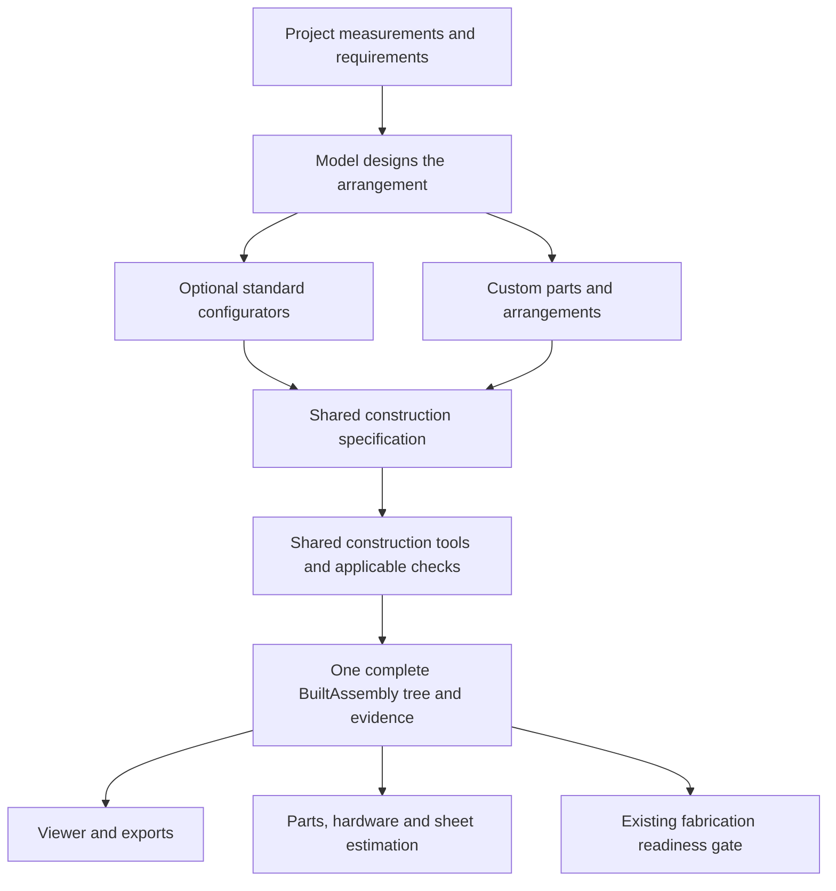

# Shared construction foundation and optional configurators

## Scope

Make standard configurators and model-authored furniture use one construction
foundation. Configurators make common work faster; their supported layouts must
not limit the furniture that can be designed. This document tracks the migration;
implementation progress and evidence are recorded per work package below.

Planning branch: `docs/shared-construction-foundation`.
Current implementation branch: `fix/geometry-review-eligibility`.
Baseline: `origin/main` at `52facbf73b5ea775975025bb6409ea02ef8560bd`, fetched on
2026-09-11. The finishing checkout stays at `fc78dfa`; its untracked `dist/`
artifacts and the other worktrees are preserved.

## Current state

- [x] WP1–WP4: shared inputs, construction, configured recipes and applicable checks.
- [x] WP5: cabinet/base, drawer, door, framed-front, adjustable-leg and lighting integration.
- [x] WP6: standard and custom skill routes use the common construction protocol.
- [x] Retire duplicate legacy panel algorithms; preserve narrow input adapters.
- [x] Run independent model-led standard and custom trials and trace the actual saved wardrobe.
- [ ] WP7: complete final regression, close findings and independently review the acceptance record.

Every completed work package and component slice has used the `review` skill;
findings were fixed and rechecked before its local checkpoint. The current WP7
run exposed a source-frame inconsistency in drawer proof after the native-shape
placement correction. It is under investigation; the complete suite is not yet
green. See [current acceptance evidence](shared-construction-acceptance.md).

| Work | Evidence |
| --- | --- |
| Shared input and construction | [Input audit](shared-construction-inputs.md), [configured parity](standard-configurator-construction.md) |
| Applicable checks and current evidence | [Operation results](common-construction-checks.md), [requirements](construction-requirement-evidence.md), [position](construction-position-evidence.md) |
| Component migration | [Base](base-configurator-construction.md), [drawer host](drawer-host-proof.md), [door host](door-host-interface.md), [framed front](assembly-door-component.md), [legs](korrekt-component-feature.md), [lighting](lighting-assembly-review.md) |
| Entry routes and compatibility | [Skill routing](shared-construction-routing.md), [legacy adapters](legacy-panel-route-retirement.md), [startup corrections](construction-startup-routes.md) |
| Geometry review corrections | [Native placement](review-native-placement.md), [uncertain CAD intersections](uncertain-cad-intersections.md) |

All work remains local in the reviewed branch stack. The finishing checkout and
original private wardrobe are preserved; no publication, push or merge occurred.

## Confirmed direction and evidence boundary

Patrick confirmed that the model should design the arrangement and invoke shared
construction tools. A seat, wardrobe, or bookcase describes use and requirements,
not a separate construction engine. Standard cabinet, drawer, and door
configurators are useful conveniences and must remain available.

The earlier 90-degree example is not the architecture or a universal connection
rule. Applicable material, hardware, orientation, load, and manufacturing
requirements determine which supported construction operation can be used.

The work packages below are implementation proposals for that confirmed direction.
Their exact API names and serialization details are not settled user decisions.
Refine them against the existing contracts before coding; record any change in
product scope or construction policy for Patrick's review. Routine reuse and
compatibility choices stay within this authorized planning scope.

## Architecture to implement

The shared specification is the missing common input, not a second assembly tree
or a new furniture language. Extend existing typed contracts only where the audit
shows a concrete gap. The existing `BuiltAssembly` remains the common output.

| Layer | Owns | Must not own |
| --- | --- | --- |
| Whole-design composition | Requirements, layout, selecting configurators or composing directly, root ownership and placements | Reimplementing known cutters or treating a furniture-purpose name as permission to build |
| Standard configurators | Reusable dimension calculations and recipes that emit explicit parts, connections, hardware and feature requirements | A separate machining engine, hidden role-triggered drilling, or an opaque assembly that cannot be adapted |
| Construction foundation | Frames, blanks, operation contracts, deterministic machining, connection participants, hardware traceability and applicable checks | Furniture-purpose catalogs, project-specific dimensions, or invented engineering ratings |

Candidate vocabulary to reconcile with current types: manufactured part,
purchased item, local frame/reference surface, connection, machining operation,
assembly, and requirement/check result. These are construction concerns, not a
mandatory class or module for every label. Non-sheet items such as a hanging rod
must retain physical identity without pretending to be a sheet panel.

The model may write project specifications and composition code. New operations
remain possible through a documented extension contract and focused validation.
Returning a plausible solid or a valid tree alone must not certify an extension.
This is a construction protocol; Python contracts are not a sandbox against an
arbitrary script. Authoritative review/export paths must run the shared checks.

## Initial code audit

Paths in this table are relative to the repository. Branch-only files are marked
with their source commit and may not exist in this planning checkout.

| Area and source | Observed behavior | Planned treatment |
| --- | --- | --- |
| `aikea-build-units/assets/project/assembly_composition.py`, `assembly_tree.py`, `assembly_placement.py` on main | A shared recursive tree already checks declared/built part, child and hardware alignment and carries placements. | Keep these contracts and consumers; extend only demonstrated missing inputs. |
| `aikea-build-units/scripts/assembly_taxonomy_resolver.py` on main | Standard construction requires a registered purpose and uses wardrobe calculations. | Retain calculations as configurator recipes; remove their role as a universal entry gate. |
| `aikea-build-units/scripts/part_blank_builder.py`, `sheet_part_builder.py` on main | Part roles select blank implementations; `side_panel` silently adds System 32 drilling. | Configurators emit explicit geometry and shelf-grid requests; common construction consumes those requests. Preserve existing intended output during migration. |
| `aikea-build-units/assets/project/panel_assembly.py` at `5b744f4` | Generic explicit panels and paired-cut checks; custom blank/joint builders and direct `BuiltAssembly` implementations are allowed. | Reuse useful implementation and tests, but apply the same validation obligations at the shared boundary. |
| `aikea-build-units/scripts/assembly_joint_machining_builder.py` | Main skips unsupported joint types. `5b744f4` adds optional strict mode and explicit local placements; only its generic panel builder defaults to strict. | Define explicit unsupported-operation behavior for both routes. Check migration of existing unresolved placeholders before tightening normal construction. |
| `aikea-build-units/scripts/cabineo_joint.py`, `cabineo_connector_layout.py` on main | Existing paired cutters, minimum thickness/source-bound checks and deterministic spacing are reusable. Spacing constants alone are not load evidence. | Reuse this operation; audit receiver/material/placement applicability and purchase ownership rather than rebuild it. |
| `aikea-build-units/assets/project/assembly_feature.py`, `scripts/complete_assembly_builder_renderer.py` on main | Ordered feature composition already exists for generated assemblies. | Preserve ownership and ordering; adapt feature host contracts where they assume a cabinet. |
| `aikea-review-unit/scripts/physical_item_counter.py`, `cabineo_item_counter.py`, `hardware_purchase_counter.py` on main | Inventory walks actual instances. Cabineos are counted from paired cuts; connector SKU and missing material can remain unresolved. | Keep consumer compatibility, connect exact purchase identity to construction, and prevent duplicate counts when connector geometry is also present. |
| `aikea-review-unit/scripts/fabrication_readiness_gate.py`, `fabrication_feature_scope_resolver.py` on main | A separate fabrication gate already checks tree/artifact evidence. | Reuse it; audit custom-operation coverage and evidence invalidation instead of introducing a competing ready flag. |
| `aikea-design-furniture/SKILL.md` and references at `5b744f4` | The skill encourages reuse, but its prototype used custom tongue/socket connections and the contract permits custom builders. | Test adherence to requested construction methods, not just successful geometry generation. Custom work is not itself a failure; unexplained bypass of an applicable tool is. |

Historical evidence: `docs/composable-furniture-design.md` at `5b744f4` records
27 focused tests plus 62 existing subtests passing, and an independent 12-panel
prototype with no invalid solids, envelope violations, or overlaps. Visual review
was pending. Those results show useful geometry checks, not the proposed unified
protocol. Do not reuse vanished temporary artifacts or old test counts as fresh
acceptance evidence.

## Work packages and tasks

### WP1 — Define the common input and audit one real build

- [x] Trace representative current wardrobe panels, joints, doors, drawers,
  supports, and purchased hardware from saved requirements to built-tree output.
- [x] Map each concern to an existing contract or a specific missing field;
  separate verified main behavior from saved-project runtime dependencies.
- [x] Define explicit part geometry, manufacturing frame, material/thickness,
  participant references, operation parameters and physical/purchase identity.
- [x] Define how required attachment/support or movement is declared and checked;
  allow intentional floor contact, loose/removable parts, and unresolved design
  work. Do not infer structural completeness merely from touching solids.
- [x] Specify what a configurator emits and how the model can adapt that output
  while preserving IDs, dependent connections and regeneration behavior.
- [x] Document the small extension interface and required evidence for operations
  the library does not yet support; use existing protocols where they suffice.

Acceptance: standard and custom descriptions of the same small assembly can
express the same geometry, connections and purchases. No universal cabinet
dimensions, furniture-purpose registration, or second tree format are required.
Every proposed field has an identified producer, consumer and example.

### WP2 — Build one shared panel and operation path

- [x] Extract/adapt the useful generic panel and placement work from `5b744f4`
  onto refreshed main, preserving newer purchase/inventory contracts.
- [x] Build blanks from explicit geometry; make System 32 and other local
  machining explicit requests instead of side effects of semantic role names.
- [x] Use the same operation dispatch, coordinate transforms, participant
  ownership and required-cut validation for configured and custom panels.
- [x] Distinguish an unsupported requested operation from an explicitly unfinished
  prototype: report the gap, and prevent a complete-construction claim.
- [x] Retain the existing Cabineo and miter operations as first consumers; choose
  detailed test cases from their actual supported interfaces, not an assumed
  universal 90-degree operation or a new seating skill.
- [x] Carry operation-to-cut and operation-to-hardware identity far enough for
  inventory to reconcile quantities without counting a modeled item twice.

Acceptance: equivalent configured/custom inputs produce equivalent machined
parts and installed quantities. An unknown joint, missing participant, misplaced
receiver, or duplicate physical ownership fails or remains explicitly unresolved
as appropriate. Renaming a panel's role does not change its geometry or drilling.

### WP3 — Convert one standard configurator into a recipe

- [x] Choose the smallest existing carcass configurator covering the WP2 path.
- [x] Preserve its useful dimension, clearance and standard-practice calculations.
- [x] Emit the common construction inputs and call the shared builder instead
  of maintaining a second panel/machining implementation.
- [x] Make its parts, placements and connections accessible for deliberate
  customization, including shared panels between neighboring components.
- [x] Define saved recipe parameters versus authored overrides. On regeneration,
  preserve local changes or report a conflict; never silently discard them.
- [x] Keep a narrow compatibility adapter for existing saved projects and record
  when it can be removed. New projects must use the common path.

Acceptance: a standard cabinet retains expected dimensions, cuts, hardware and
inventory. The model can adapt its output to a nonstandard outline or mixed
arrangement without copying cutters or adding a furniture-purpose registration.
Changed dimensions rebuild dependent operations and invalidate affected evidence.

### WP4 — Establish common check coverage and qualified extensions

- [x] Inventory existing geometric, feature, machining and fabrication checks;
  attach each to the contract it can actually verify.
- [x] Apply the same checks to configurator output, custom assemblies and custom
  operation results at the official build/review/export boundaries.
- [x] Report required-but-undeclared construction work, missing product/material
  evidence and declared operations that did not run. A validator cannot detect
  requirements that neither the project nor a recipe declares; make that limit explicit.
- [x] Distinguish expected mating/contact or motion from unintended collisions
  using bounded, traceable allowances; do not suppress whole hardware families.
- [x] Bind results to the current dimensions, operations, hardware and built
  artifacts using existing evidence mechanisms; reject stale approval after edits.
- [x] Demonstrate one extension that satisfies the protocol and one that returns
  plausible geometry but lacks required participation or evidence.

Acceptance: bypassing a standard builder cannot bypass applicable checks or
fabrication readiness. A valid preview may still have unresolved construction,
load, motion or manufacturing evidence. No automatic strength certification is implied.

### WP5 — Migrate useful components one at a time

- [x] Migrate remaining cabinet/base configurators as recipes using the same path.
- [x] Adapt a drawer configurator with its exact selected runners and both host
  and drawer machining; validate ownership and movement in the parent assembly.
  See the host/proof slices; unresolved screw/pilot authority remains explicit.
- [x] Adapt slab doors/hinges with exact selected mounting interfaces and both
  sides of the connection; preserve rectangular/sloped fronts and custom hosts.
- [x] Carry multi-part framed fronts from their separate branch through the same
  host/feature ownership when that construction is integrated; verify parent motion.
- [x] Integrate adjustable-foot mounting through the sourced mounting interface
  and existing Korrekt work; preserve unresolved physical-fit evidence separately.
- [x] Integrate lighting as a removable owned feature, retaining the agreed
  design default when that separate branch is brought in. Removal must remove
  its machining, purchases and evidence without damaging unrelated features.
- [x] For each component, document host faces, available space, supported inputs,
  effects on other parts, required evidence and a bounded extension route.

Acceptance: each migrated component works inside both a standard cabinet and a
custom parent that satisfies its host contract. A component with cabinet-specific
assumptions is not advertised as universal until those assumptions are resolved.
Each component is a separate mergeable slice; WP5 is not one large branch.

### WP6 — Route the skills through the common protocol

- [x] Update skill instructions to start from requirements, inspect available
  operations/configurators, select suitable components, and compose one full tree.
- [x] Keep the supported constructor/operation list discoverable with concrete
  input/output examples and links to implementations and checks.
- [x] Explain that standard configurators are optional; a missing recipe does
  not mean a missing construction capability.
- [x] Require inspection of relevant tools before adding an operation. Keep new
  implementation focused, tested and explicit about its evidence limits.
- [x] Route configured and custom build commands to the same construction and
  validation boundary. Update skill instructions in every preceding slice too,
  so implementation and its documented usage never diverge between merges.

Acceptance: a fresh model can create a standard design and a novel layout without
inventing furniture-specific skills or reimplementing existing machining. It can
still extend the system when a genuinely missing operation is demonstrated.

### WP7 — End-to-end evidence and retirement of duplicate paths

- [ ] Run the acceptance matrix below from fresh project folders on the candidate
  code, with runtime version/commit, commands, inputs and outputs recorded.
- [ ] Run a fresh model-led standard-configurator case and a custom-layout case;
  evaluate tool reuse and requirement coverage as well as final geometry.
- [ ] Run the seated wardrobe from its actual source with explicit dependency
  provenance. Resolve needed composition/Korrekt dependencies rather than silently
  using a frozen runtime as proof that current main works.
- [ ] Reconcile the resulting physical instances, connection purchases and sheet
  input. Keep actual geometry separate from proposed 16 mm or split-back scenarios.
- [ ] Capture overall, connection and applicable moving-state visual evidence;
  record remaining engineering/fabrication gaps separately from tooling defects.
- [ ] Remove each obsolete construction route after its callers, saved-project
  compatibility and regressions pass; remove the corresponding skill fallback.

Acceptance: ordinary and unusual furniture share the construction foundation;
configurators remain efficient shortcuts. Tests demonstrate common behavior and
common failures. Existing inventory/review consumers still read one complete tree.
Unfinished furniture details do not block an independently complete tooling slice.

## Acceptance matrix

These are planned checks, not results. Fixtures must declare their intended
construction requirements; equality of previews alone is insufficient.

| Case | Evidence required |
| --- | --- |
| Same assembly configured and authored directly | Equivalent part geometry/placements, operation identities, cuts, purchases and applicable check results; both call the common implementation. |
| Same supported connection in different orientations and parent assemblies | Participant cuts align in their local frames; expected physical count is unchanged; unsupported arrangements report why. |
| Standard cabinet adapted to a sloped outline or seated composition | Same underlying tools; explicit shared-part ownership; no furniture-purpose registration or copied standard cutter. |
| Dimensions, material or hardware changed | Dependent geometry and purchases recompute; stale evidence is rejected; unsupported combinations remain unresolved. |
| Requested connection omitted; unknown operation; receiver misses its host | Required-work coverage or machining check identifies the exact gap in either route. |
| Standard side panel renamed | Labels do not create or remove System 32 holes; only an explicit drilling request changes machining. |
| Door/drawer component in configured and custom parents | Host contracts, both mounting participants, exact hardware identity and applicable motion checks agree. |
| Optional component removed | Its parts, host modifications, purchases and evidence disappear coherently; unrelated geometry is preserved. |
| Custom builder/operation returns an attractive but incomplete model | Official checks expose missing declared work and evidence; it cannot claim readiness just by exporting GLB. |
| Saved wardrobe and a fresh project | No unexplained private/frozen-runtime import; parts and purchases reconcile once; sheet proposals remain marked as scenarios. |

## Small-branch execution and merge order

1. **Common input contract** — WP1 and only necessary typed-contract changes,
   contract tests and consuming documentation; preserve existing callers.
2. **Shared panel/operation execution** — WP2, its validation obligations and
   direct tests; keep compatibility contained and explicit.
3. **First configurator migration** — WP3 with configured-versus-authored proof
   and updated skill routing for the supported slice.
4. **Check/extension coverage** — remaining WP4 work and its negative cases;
   required checks for earlier slices ship with those slices, not deferred here.
5. **Component migrations** — one branch per remaining configurator/mechanism
   in WP5, each including its WP6 instructions and focused WP7 proof.
6. **Final route retirement** — remove remaining duplication after the full
   matrix and saved-project migration are verified.

Keep dependent unmerged work in a stack; merge each complete coherent increment
after its focused tests, relevant regressions, diff review and CI pass. Full CAD
regressions run at integration checkpoints, not after documentation-only changes.
Review each changed file over 150 lines for separation of concerns; for inherited
files, obtain the required independent refactor report before extending them.

Do not merge the old composition branch wholesale merely because its historical
tests passed. Reuse its relevant code/tests with traceability. Its parent runner
discovery commit `79bc448` and later orientation/CNC/hinge branches have their own
scopes; bring only actual dependencies into each slice. The separate finishing
stack supplies Korrekt and lighting work when those migrations are reached.

## Boundaries and open decisions

- Preserve the recently merged physical counting, purchase-unit and sheet-scenario
  contracts. This plan does not add a new pricing engine or supplier workflow.
- Do not invent connector ratings, pilot-hole standards, load policies or material
  compatibility. Use existing verified operations and explicit product evidence;
  unsupported needs become focused extensions or visible unresolved requirements.
- Set the detailed representation for authored overrides, cross-child connections
  and operation evidence in WP1 after tracing actual callers. Do not introduce a
  generic plugin platform, custom DSL or new serialization layer without need.
- Runtime packaging/versioning must let fresh builds use the declared shared
  implementation. Test the current copying/loading mechanism before proposing a
  package-system rewrite. Preserve existing locally modified generated files.
- Publication, hosted-chat storage/downloads, finishing emails, and the unfinished
  physical design decisions remain separate work. No such changes occur here.

## Audit log

1. 2026-09-11 — Patrick confirmed one shared construction foundation across designs.
   Rationale: the model should arrange furniture using consistent construction
   operations rather than invent separate construction scripts for each design.
2. 2026-09-11 — Patrick confirmed optional standard component configurators above
   that foundation. Rationale: reuse makes ordinary builds efficient without
   restricting custom arrangements. The 90-degree suggestion was explicitly an
   example, not a mandated primitive or universal engineering rule.
3. 2026-09-11 — Fresh source inspection found an existing common output tree but
   different construction inputs, implicit role-driven drilling, optional strict
   dispatch and custom-builder extension paths. These observations motivate the
   proposed migration; they do not establish that all prior designs are defective.
4. 2026-09-11 — Created this isolated documentation branch from refreshed main,
   preserving finishing work, private evaluation artifacts and other worktrees.
   Reuse of existing contracts, staged migration and bounded proof are proposals
   implementing Patrick's confirmed direction; exact API choices remain open.

5. 2026-09-11 — Patrick authorized implementation and review using the review
   skill after every work package. WP1 is implemented and reviewed; WP2 is next.

6. 2026-09-11 — WP2 review found incomplete per-occurrence receiver coverage,
   clipped local grid holes and a stale legacy test fixture. All three were fixed
   and independently rechecked before continuing to WP3.
7. 2026-09-11 — WP3 passed standard/custom parity and the broad regression. WP4a
   added independent output checks; WP4b added requirement coverage, current-input
   approval binding and registered extension/hardware evidence. Each slice was
   reviewed with the review skill and its findings fixed before checkpointing.

8. 2026-09-12 — WP5 component migrations now include separate-layer framed fronts,
   exact hinges and whole-child movement. Independent review closed the invalid-fit
   preflight finding. Common build-command hardware loading and final protocol
   instructions remain next before the complete WP7 evidence run.

9. 2026-09-12 — WP6 is implemented and reviewed. Standard and custom designs now
   share the composition entry and discoverable component/tool maps. Review found
   old wardrobe-only handoff instructions; the scoped routes, material handoff
   and minimal project-metadata requirement are corrected and independently proven.

10. 2026-09-12 — WP7 fresh-model trials exposed CLI startup/provenance gaps and
    a native CAD placement discrepancy in review reports. Separate reviewed fixes
    corrected those paths. Exact-source Boolean contradictions remain explicit
    uncertainty, rather than being hidden by relaxed tolerances or allowances.
11. 2026-09-12 — The candidate `c33b781` collected 802 Python tests. Its full
    regression exposed additional drawer proof/source-frame failures; completion
    remains open while those are diagnosed. Independent source/placement evidence
    and private design artifacts are preserved in ignored local evidence.
